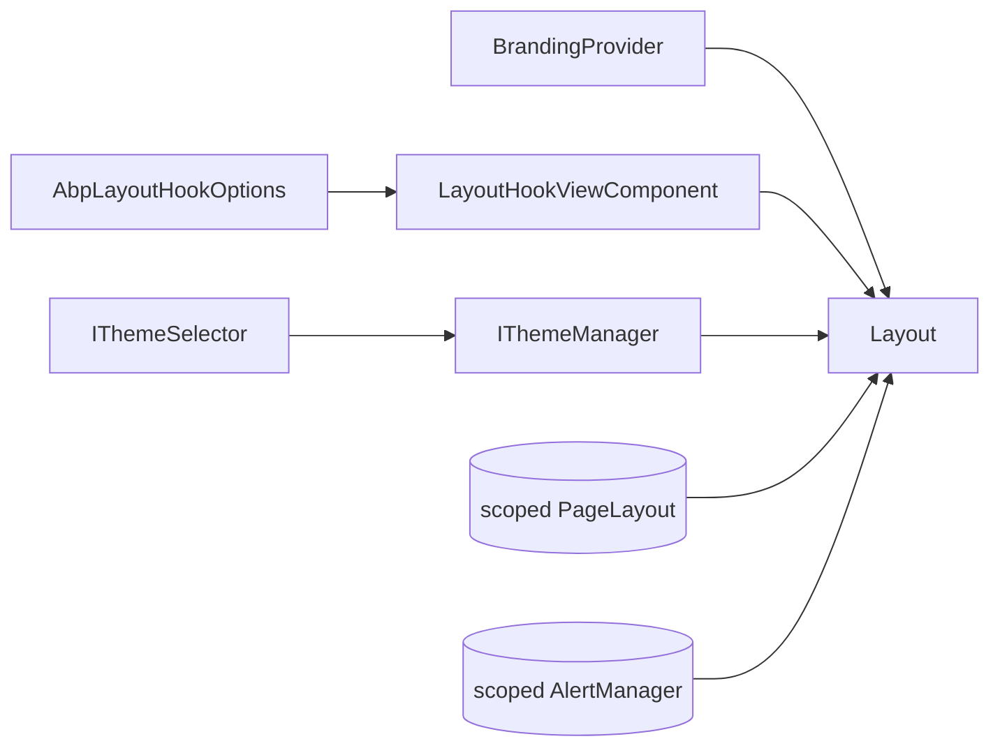

`Volo.Abp.AspNetCore.Mvc.UI` is the layer that bolts the UI-agnostic primitives from [`Volo.Abp.UI`](/framework/ui-mvc/ui) onto ASP.NET Core MVC + Razor Pages. It introduces five concerns:

| Concern | Key types |
| --- | --- |
| **Razor Pages base classes** | `AbpPage`, `AbpPageModel`, `ServiceBasedPageModelActivatorProvider` |
| **Alerts** | `IAlertManager`, `AlertList`, `AlertMessage`, `AlertType` |
| **Page layout** (breadcrumbs, title, current menu item) | `IPageLayout`, `PageLayout`, `ContentLayout`, `BreadCrumb` |
| **Theming indirection** | `IThemeManager`, `IThemeSelector`, `ITheme`, `ThemeNameAttribute`, `StandardLayouts` |
| **Layout hooks rendering** | `LayoutHookViewComponent`, `ViewComponentHelperLayoutHookExtensions` |

It is the assembly that every shared theme (`Volo.Abp.AspNetCore.Mvc.UI.Theme.Shared`, the MVC LeptonX themes, the Basic theme) depends on directly.

## Package layout

```text framework/src/Volo.Abp.AspNetCore.Mvc.UI/
Volo/Abp/AspNetCore/Mvc/UI/
  AbpAspNetCoreMvcUiModule.cs
  AbpMvcUiOptions.cs
  Alerts/
    AlertList.cs
    AlertManager.cs
    AlertMessage.cs
    AlertType.cs
    IAlertManager.cs
  Components/LayoutHook/
    LayoutHookViewComponent.cs
    Default.cshtml
    ViewComponentHelperLayoutHookExtensions.cs
  Layout/
    BreadCrumb.cs
    BreadCrumbItem.cs
    ContentLayout.cs
    IPageLayout.cs
    PageLayout.cs
  RazorPages/
    AbpPage.cs
    AbpPageModel.cs
    ServiceBasedPageModelActivatorProvider.cs
  Theming/
    AbpThemingOptions.cs
    DefaultThemeManager.cs
    DefaultThemeSelector.cs
    ITheme.cs
    IThemeManager.cs
    IThemeSelector.cs
    StandardLayouts.cs
    ThemeDictionary.cs
    ThemeExtensions.cs
    ThemeInfo.cs
    ThemeNameAttribute.cs
Volo/Abp/ObjectExtending/MvcUiObjectExtensionPropertyInfoExtensions.cs
```

## Module

```csharp framework/src/Volo.Abp.AspNetCore.Mvc.UI/Volo/Abp/AspNetCore/Mvc/UI/AbpAspNetCoreMvcUiModule.cs
[DependsOn(typeof(AbpAspNetCoreMvcModule))]
[DependsOn(typeof(AbpUiNavigationModule))]
public class AbpAspNetCoreMvcUiModule : AbpModule
{
    public override void PreConfigureServices(ServiceConfigurationContext context)
    {
        PreConfigure<IMvcBuilder>(mvcBuilder =>
        {
            mvcBuilder.AddApplicationPartIfNotExists(typeof(AbpAspNetCoreMvcUiModule).Assembly);
        });
    }

    public override void ConfigureServices(ServiceConfigurationContext context)
    {
        Configure<AbpVirtualFileSystemOptions>(options =>
        {
            options.FileSets.AddEmbedded<AbpAspNetCoreMvcUiModule>();
        });
    }
}
```

Notice the `PreConfigure<IMvcBuilder>` call — the module **registers itself as an MVC application part** so the view components it declares (e.g. `LayoutHookViewComponent`) become discoverable in user projects without any extra wiring.

```csharp framework/src/Volo.Abp.AspNetCore.Mvc.UI/Volo/Abp/AspNetCore/Mvc/UI/AbpMvcUiOptions.cs
public class AbpMvcUiOptions
{
    /// <summary>Default value: "/Account/Login".</summary>
    public string LoginUrl { get; set; } = "/Account/Login";

    /// <summary>Default value: "/Account/Logout".</summary>
    public string LogoutUrl { get; set; } = "/Account/Logout";
}
```

These two URLs are picked up by themes when rendering the "Login" / "Logout" links in the top toolbar; modules that ship a custom account UI override them.

## `AbpPageModel`

Every Razor page in an ABP module derives — directly or indirectly — from `AbpPageModel`. It is essentially a service-locator base class that exposes the most-used services through `IAbpLazyServiceProvider`, so each page only activates what it touches.

```csharp framework/src/Volo.Abp.AspNetCore.Mvc.UI/Volo/Abp/AspNetCore/Mvc/UI/RazorPages/AbpPageModel.cs
public abstract class AbpPageModel : PageModel
{
    public IAbpLazyServiceProvider LazyServiceProvider { get; set; } = default!;

    protected IClock              Clock              => LazyServiceProvider.LazyGetRequiredService<IClock>();
    protected AlertList           Alerts             => AlertManager.Alerts;
    protected IUnitOfWorkManager  UnitOfWorkManager  => LazyServiceProvider.LazyGetRequiredService<IUnitOfWorkManager>();
    protected IObjectMapper       ObjectMapper       => LazyServiceProvider.LazyGetService<IObjectMapper>(/* per-context */);
    protected IGuidGenerator      GuidGenerator      => LazyServiceProvider.LazyGetService<IGuidGenerator>(SimpleGuidGenerator.Instance);
    protected IStringLocalizer    L                  => _localizer ??= CreateLocalizer();
    protected ICurrentUser        CurrentUser        => LazyServiceProvider.LazyGetRequiredService<ICurrentUser>();
    protected ICurrentTenant      CurrentTenant      => LazyServiceProvider.LazyGetRequiredService<ICurrentTenant>();
    protected ISettingProvider    SettingProvider    => LazyServiceProvider.LazyGetRequiredService<ISettingProvider>();
    protected IModelStateValidator ModelValidator    => LazyServiceProvider.LazyGetRequiredService<IModelStateValidator>();
    protected IAuthorizationService AuthorizationService => LazyServiceProvider.LazyGetRequiredService<IAuthorizationService>();
    protected IAlertManager       AlertManager       => LazyServiceProvider.LazyGetRequiredService<IAlertManager>();
    protected IAppUrlProvider     AppUrlProvider     => LazyServiceProvider.LazyGetRequiredService<IAppUrlProvider>();

    protected Type? LocalizationResourceType { get; set; }

    protected virtual Task CheckPolicyAsync(string policyName)
        => AuthorizationService.CheckAsync(policyName);
}
```

Three patterns worth remembering:

- **Set `LocalizationResourceType`** in your derived page's constructor to bind `L` to your module's resource — the default is the root resource.
- **`Alerts.Info("Saved")` / `.Success(...)` / `.Danger(...)`** queue an alert that the theme renders above the page (this is how every framework page shows success banners).
- **`CheckPolicyAsync`** throws an `AbpAuthorizationException` when the policy fails — handler middleware turns that into a 403.

The matching base for view files is trivial:

```csharp framework/src/Volo.Abp.AspNetCore.Mvc.UI/Volo/Abp/AspNetCore/Mvc/UI/RazorPages/AbpPage.cs
public abstract class AbpPage : Page
{
    [RazorInject]
    public ICurrentUser CurrentUser { get; set; } = default!;
}
```

It just injects `ICurrentUser` so every razor view can do `@if (CurrentUser.IsAuthenticated)` without an `@inject` directive.

## Alerts

```csharp framework/src/Volo.Abp.AspNetCore.Mvc.UI/Volo/Abp/AspNetCore/Mvc/UI/Alerts/AlertType.cs
public enum AlertType
{
    Default, Primary, Secondary, Success, Danger, Warning, Info, Light, Dark
}
```

```csharp framework/src/Volo.Abp.AspNetCore.Mvc.UI/Volo/Abp/AspNetCore/Mvc/UI/Alerts/AlertList.cs
public class AlertList : List<AlertMessage>
{
    public void Add(AlertType type, string text, string? title = null, bool dismissible = true);
    public void Info   (string text, string? title = null, bool dismissible = true);
    public void Warning(string text, string? title = null, bool dismissible = true);
    public void Danger (string text, string? title = null, bool dismissible = true);
    public void Success(string text, string? title = null, bool dismissible = true);
}
```

`AlertManager` is scoped — one instance per HTTP request — so anything that runs during page processing (services, filters, view components) can call `Alerts.Add(...)`. The Theme.Shared `_Alerts.cshtml` then enumerates the list at render time.

```csharp framework/src/Volo.Abp.AspNetCore.Mvc.UI/Volo/Abp/AspNetCore/Mvc/UI/Alerts/AlertManager.cs
public class AlertManager : IAlertManager, IScopedDependency
{
    public AlertList Alerts { get; } = new AlertList();
}
```

```csharp framework/src/Volo.Abp.AspNetCore.Mvc.UI/Volo/Abp/AspNetCore/Mvc/UI/Alerts/AlertMessage.cs
public class AlertMessage
{
    public string  Text { get; set; }
    public AlertType Type { get; set; }
    public string? Title { get; set; }
    public bool    Dismissible { get; set; }
}
```

## Page layout

```csharp framework/src/Volo.Abp.AspNetCore.Mvc.UI/Volo/Abp/AspNetCore/Mvc/UI/Layout/IPageLayout.cs
public interface IPageLayout
{
    ContentLayout Content { get; }
}
```

```csharp framework/src/Volo.Abp.AspNetCore.Mvc.UI/Volo/Abp/AspNetCore/Mvc/UI/Layout/ContentLayout.cs
public class ContentLayout
{
    public string? Title { get; set; }
    public BreadCrumb BreadCrumb { get; }
    public string? MenuItemName { get; set; }

    public virtual bool ShouldShowBreadCrumb()
    {
        if (BreadCrumb.Items.Any()) return true;
        if (BreadCrumb.ShowCurrent && !Title.IsNullOrEmpty()) return true;
        return false;
    }
}
```

The intent is that a page can simply do:

```csharp
PageLayout.Content.Title = L["EditUser"].Value;
PageLayout.Content.MenuItemName = "Identity.Users";
PageLayout.Content.BreadCrumb.Add(L["Users"].Value, "/Identity/Users");
PageLayout.Content.BreadCrumb.Add(L["Edit"].Value);
```

…and the theme's `_PageLayout.cshtml` partial picks it up, automatically:

- rendering `<h1>Title</h1>`,
- emitting the breadcrumb (with optional "Home" + "Current" entries — see `BreadCrumb.ShowHome` / `ShowCurrent`),
- and marking the matching menu item as active.

```csharp framework/src/Volo.Abp.AspNetCore.Mvc.UI/Volo/Abp/AspNetCore/Mvc/UI/Layout/BreadCrumb.cs
public class BreadCrumb
{
    public bool ShowHome    { get; set; } = true;
    public bool ShowCurrent { get; set; } = true;
    public List<BreadCrumbItem> Items { get; }

    public void Add(string text, string? url = null, string? icon = null)
        => Items.Add(new BreadCrumbItem(text, url, icon));
}
```

`PageLayout` itself is scoped (`IScopedDependency`) so the model survives every partial that participates in rendering a single page.

## Theming

```csharp framework/src/Volo.Abp.AspNetCore.Mvc.UI/Volo/Abp/AspNetCore/Mvc/UI/Theming/ITheme.cs
public interface ITheme
{
    string GetLayout(string name, bool fallbackToDefault = true);
}
```

```csharp framework/src/Volo.Abp.AspNetCore.Mvc.UI/Volo/Abp/AspNetCore/Mvc/UI/Theming/StandardLayouts.cs
public static class StandardLayouts
{
    public const string Application = "Application";
    public const string Account     = "Account";
    public const string Public      = "Public";
    public const string Empty       = "Empty";
}
```

A "theme" is a class that knows how to map a layout name (`"Application"`, `"Account"`, …) to a virtual path of a `.cshtml` layout file. The convenience extensions:

```csharp framework/src/Volo.Abp.AspNetCore.Mvc.UI/Volo/Abp/AspNetCore/Mvc/UI/Theming/ThemeExtensions.cs
public static string GetApplicationLayout(this ITheme theme, bool fallbackToDefault = true)
    => theme.GetLayout(StandardLayouts.Application, fallbackToDefault);
public static string GetAccountLayout(this ITheme theme, bool fallbackToDefault = true)
    => theme.GetLayout(StandardLayouts.Account, fallbackToDefault);
public static string GetPublicLayout(this ITheme theme, bool fallbackToDefault = true)
    => theme.GetLayout(StandardLayouts.Public, fallbackToDefault);
public static string GetEmptyLayout(this ITheme theme, bool fallbackToDefault = true)
    => theme.GetLayout(StandardLayouts.Empty, fallbackToDefault);
```

### Selection

```csharp framework/src/Volo.Abp.AspNetCore.Mvc.UI/Volo/Abp/AspNetCore/Mvc/UI/Theming/AbpThemingOptions.cs
public class AbpThemingOptions
{
    public ThemeDictionary Themes { get; }
    public string? DefaultThemeName { get; set; }
}
```

A theme is registered via `Add<TTheme>()`:

```csharp framework/src/Volo.Abp.AspNetCore.Mvc.UI/Volo/Abp/AspNetCore/Mvc/UI/Theming/ThemeDictionary.cs
public class ThemeDictionary : Dictionary<Type, ThemeInfo>
{
    public ThemeInfo Add<TTheme>() where TTheme : ITheme => Add(typeof(TTheme));

    public ThemeInfo Add(Type themeType)
    {
        if (ContainsKey(themeType))
            throw new AbpException("This theme is already added before: …");
        return this[themeType] = new ThemeInfo(themeType);
    }
}
```

Each `ThemeInfo` is keyed by `ThemeNameAttribute` value (or the type name if the attribute is absent):

```csharp framework/src/Volo.Abp.AspNetCore.Mvc.UI/Volo/Abp/AspNetCore/Mvc/UI/Theming/ThemeInfo.cs
public class ThemeInfo
{
    public Type   ThemeType { get; }
    public string Name      { get; }   // from ThemeNameAttribute
}
```

```csharp framework/src/Volo.Abp.AspNetCore.Mvc.UI/Volo/Abp/AspNetCore/Mvc/UI/Theming/ThemeNameAttribute.cs
[AttributeUsage(AttributeTargets.Class)]
public class ThemeNameAttribute : Attribute
{
    public string Name { get; set; }
    public static string GetName(Type themeType) =>
        themeType.GetCustomAttributes(true).OfType<ThemeNameAttribute>().FirstOrDefault()?.Name
            ?? themeType.Name;
}
```

### Resolution at runtime

```csharp framework/src/Volo.Abp.AspNetCore.Mvc.UI/Volo/Abp/AspNetCore/Mvc/UI/Theming/DefaultThemeSelector.cs
public class DefaultThemeSelector : IThemeSelector, ITransientDependency
{
    public virtual ThemeInfo GetCurrentThemeInfo()
    {
        if (!Options.Themes.Any())
            throw new AbpException($"No theme registered! Use {nameof(AbpThemingOptions)}.");

        if (Options.DefaultThemeName == null)
            return Options.Themes.Values.First();

        var themeInfo = Options.Themes.Values
            .FirstOrDefault(t => t.Name == Options.DefaultThemeName);
        if (themeInfo == null)
            throw new AbpException("Default theme configured but not found: …");

        return themeInfo;
    }
}
```

The selector returns a `ThemeInfo` describing **which theme should serve this request**. Themes that switch per user/tenant (e.g. LeptonX with light/dark/system) replace the selector to look at cookies or settings.

The manager then materialises the chosen `ITheme` and caches it on `HttpContext.Items` so multiple partials don't re-create the instance:

```csharp framework/src/Volo.Abp.AspNetCore.Mvc.UI/Volo/Abp/AspNetCore/Mvc/UI/Theming/DefaultThemeManager.cs
public class DefaultThemeManager : IThemeManager, IScopedDependency, IServiceProviderAccessor
{
    private const string CurrentThemeHttpContextKey = "__AbpCurrentTheme";

    public ITheme CurrentTheme => GetCurrentTheme();

    protected virtual ITheme GetCurrentTheme()
    {
        var preSelected = HttpContextAccessor.HttpContext!
            .Items[CurrentThemeHttpContextKey] as ITheme;

        if (preSelected == null)
        {
            preSelected = (ITheme)ServiceProvider.GetRequiredService(
                ThemeSelector.GetCurrentThemeInfo().ThemeType);
            HttpContextAccessor.HttpContext.Items[CurrentThemeHttpContextKey] = preSelected;
        }

        return preSelected;
    }
}
```

Every layout in a module calls `Layout = ThemeManager.CurrentTheme.GetApplicationLayout()` — that one line decouples the page from any specific theme.

## Layout hook view component

The MVC realisation of the `LayoutHooks` registry declared in [`Volo.Abp.UI`](/framework/ui-mvc/ui):

```csharp framework/src/Volo.Abp.AspNetCore.Mvc.UI/Volo/Abp/AspNetCore/Mvc/UI/Components/LayoutHook/LayoutHookViewComponent.cs
public class LayoutHookViewComponent : AbpViewComponent
{
    protected AbpLayoutHookOptions Options { get; }

    public virtual IViewComponentResult Invoke(string name, string? layout)
    {
        var hooks = Options.Hooks.GetOrDefault(name)?
            .Where(x => IsViewComponent(x)
                     && (string.IsNullOrWhiteSpace(x.Layout) || x.Layout == layout))
            .ToArray() ?? Array.Empty<LayoutHookInfo>();

        return View(
            "~/Volo/Abp/AspNetCore/Mvc/UI/Components/LayoutHook/Default.cshtml",
            new LayoutHookViewModel(hooks, layout)
        );
    }

    protected virtual bool IsViewComponent(LayoutHookInfo layoutHook)
        => typeof(ViewComponent).IsAssignableFrom(layoutHook.ComponentType);
}
```

…with a small helper to invoke it from a Razor view:

```csharp framework/src/Volo.Abp.AspNetCore.Mvc.UI/Volo/Abp/AspNetCore/Mvc/UI/Components/LayoutHook/ViewComponentHelperLayoutHookExtensions.cs
public static Task<IHtmlContent> InvokeLayoutHookAsync(
    this IViewComponentHelper componentHelper,
    string name,
    string layout)
{
    return componentHelper.InvokeAsync(
        typeof(LayoutHookViewComponent),
        new { name = name, layout = layout }
    );
}
```

Theme layouts call this for every hook point:

```cshtml
@await Component.InvokeLayoutHookAsync(LayoutHooks.Head.First, ViewBag.Layout)
```

## How it composes



## Cross-references

- The shared theme that consumes `IThemeManager` and `IBrandingProvider` is [`mvc-ui-theme-shared`](/framework/ui-mvc/mvc-ui-theme-shared).
- For the navigation services that `PageLayout.MenuItemName` highlights, see [`ui-navigation`](/framework/ui-mvc/ui-navigation).
- For the Bootstrap tag helpers that render alerts/cards/buttons from Razor, see [`mvc-ui-bootstrap`](/framework/ui-mvc/mvc-ui-bootstrap).
- For the bundling pipeline that loads CSS/JS in those layouts, see [`mvc-ui-bundling`](/framework/ui-mvc/mvc-ui-bundling).
