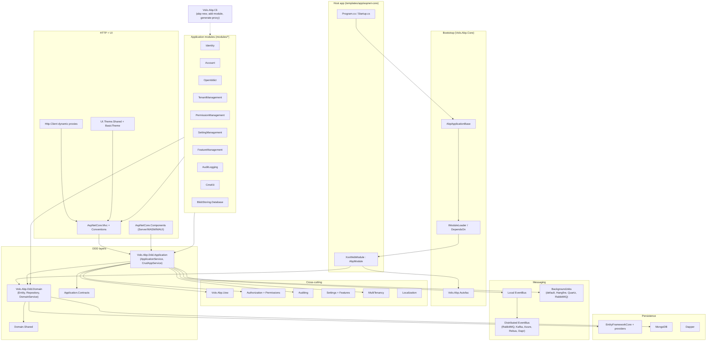

ABP Framework is a modular ASP.NET Core application framework built around DDD, multi-tenancy, conventional dependency injection, an event bus, background jobs, BLOB storing, and a large catalog of prebuilt application modules. This wiki is the **internal engineering reference** to the `abpframework/abp` monorepo at version **7.4.0** (see `common.props`). Pages are written for engineers and coding agents that need to navigate, modify, or extend the codebase — every page references real file paths under `framework/`, `modules/`, `templates/`, `npm/`, or `tools/`.

## Architecture at a glance

The orchestrator is `AbpApplicationBase` in `framework/src/Volo.Abp.Core/Volo/Abp/AbpApplicationBase.cs`. Every host app builds a single `AbpModule` graph that pulls in transitive modules via `[DependsOn]` and Autofac container wiring (`framework/src/Volo.Abp.Autofac/`).

## Repository map

| Top-level path | Contents | Wiki page |
| --- | --- | --- |
| `framework/src/` | 152 NuGet packages — framework core, DDD, UoW, EventBus, BackgroundJobs, ASP.NET Core, Blazor, CLI, BLOB, imaging, validation, localization | [Framework Core overview](/framework/core/volo-abp) |
| `framework/test/` | xUnit/Shouldly test projects for every framework package | [Test Infrastructure](/framework/testing/test-base) |
| `modules/` | 19 application modules (identity, account, openiddict, identityserver, tenant-management, permission-management, setting-management, feature-management, audit-logging, background-jobs, blob-storing-database, cms-kit, blogging, client-simulation, users, virtual-file-explorer, basic-theme) | [Application Modules](/modules/identity/overview) |
| `templates/` | Startup templates: `app`, `app-nolayers`, `console`, `module`, `maui`, `wpf` | [Templates overview](/templates/overview) |
| `templates/app/aspnet-core/` | The reference layered solution template (Domain, Application, EFCore, HttpApi, Web, Blazor, AuthServer, DbMigrator) | [ASP.NET Core App Layers](/templates/aspnetcore/domain) |
| `templates/app/angular/` | Angular SPA template using `@abp/ng.*` packages | [Angular template](/templates/app-angular) |
| `npm/ng-packs/` | Nx workspace for `@abp/ng.*` Angular libraries | [ng-packs overview](/ng/overview) |
| `npm/packs/` | NPM packages for MVC/Razor & Blazor theme assets (bootstrap, chart.js, datatables, signalr, etc.) | [MVC NPM packs](/npm/overview) |
| `tools/` | Auxiliary tools: `github-changelog-generator`, `localization-key-synchronizer`, `nuget` push helpers | [Tooling & CLI](/framework/tooling/cli) |
| `studio/source-codes/` & `source-code/` | Source-code variants of modules for "get-source" CLI command | [CLI commands](/framework/tooling/cli-commands) |
| `build/` | PowerShell build orchestration (`build-all.ps1`, `test-all.ps1`) | [Build scripts](/build/build-scripts) |
| `deploy/` | Release pipeline scripts (NuGet pack/push, NPM publish, GitHub release) | [Deploy pipeline](/build/deploy-pipeline) |
| `docs/` | Markdown documentation source (en, cs, es, pt-BR, zh-Hans) — **not** the public docs.abp.io site code; this wiki is generated from the source | – |
| `apiSpec/` | Hand-curated reference markdown (e.g. `AbpEndpointRouterOptions`) | – |
| `common.props`, `common.test.props`, `configureawait.props`, `Directory.Build.props` | Shared MSBuild props (`<Version>7.4.0</Version>`, NuGet metadata, source link) | [Versioning & targets](/overview/versioning-and-targets) |
| `global.json` | Pins .NET SDK 7.0.100 with `latestFeature` roll-forward | [Versioning & targets](/overview/versioning-and-targets) |

## Subsystem map

<CardGroup cols={2}>
  <Card title="Bootstrap & Modularity" icon="rocket" href="/framework/core/volo-abp-core">
    `AbpApplicationBase`, `AbpModule`, `DependsOn`, plug-in loaders, virtual file system. The kernel under `framework/src/Volo.Abp.Core`.
  </Card>
  <Card title="DDD Building Blocks" icon="cube" href="/framework/ddd/entities-and-aggregates">
    `Entity`, `AggregateRoot`, `IRepository`, `DomainService`, `ApplicationService`, `CrudAppService` in `Volo.Abp.Ddd.Domain` and `Volo.Abp.Ddd.Application`.
  </Card>
  <Card title="Unit of Work & Data" icon="database" href="/framework/data/uow">
    `IUnitOfWork`, `UnitOfWorkInterceptor`, extra-properties, GUID generators. `Volo.Abp.Uow`, `Volo.Abp.Data`.
  </Card>
  <Card title="Event Bus" icon="bolt" href="/framework/eventbus/abstractions">
    Local + distributed event bus with inbox/outbox, RabbitMQ, Kafka, Azure Service Bus, Rebus, Dapr providers.
  </Card>
  <Card title="Background Jobs & Workers" icon="clock" href="/framework/background/background-jobs">
    `IBackgroundJobManager`, Hangfire/Quartz/RabbitMQ providers, and `IBackgroundWorker` lifecycle.
  </Card>
  <Card title="Multi-Tenancy" icon="building" href="/framework/cross/multi-tenancy">
    `ICurrentTenant`, `ITenantResolver`, `MultiTenantConnectionStringResolver`, tenant data filters.
  </Card>
  <Card title="Authorization & Permissions" icon="lock" href="/framework/cross/authorization">
    Permission definitions, providers, checkers, `PermissionManagement` module storage.
  </Card>
  <Card title="Auditing" icon="clipboard" href="/framework/cross/auditing">
    `IAuditingManager`, audit interceptors, `AuditLogging` module persistence.
  </Card>
  <Card title="ASP.NET Core & MVC" icon="globe" href="/framework/aspnetcore/aspnetcore-mvc">
    `AbpController`, conventional routing, dynamic API exploration, Swashbuckle integration.
  </Card>
  <Card title="HTTP Client Proxies" icon="arrow-right-arrow-left" href="/framework/httpclient/http-client">
    `DynamicHttpProxyInterceptor`, `RemoteServiceConfigurationProvider`, IdentityModel client.
  </Card>
  <Card title="Blazor & UI" icon="palette" href="/framework/ui-blazor/components">
    `AspNetCore.Components` (Server, WASM, MAUI), `BasicTheme`, `BlazoriseUI`.
  </Card>
  <Card title="Entity Framework Core" icon="table" href="/framework/persistence/entity-framework-core">
    `AbpDbContext`, `EfCoreRepository`, providers for SqlServer, PostgreSQL, MySQL, Sqlite, Oracle.
  </Card>
  <Card title="MongoDB" icon="leaf" href="/framework/persistence/mongodb">
    `AbpMongoDbContext`, `MongoDbRepository`, `MongoDbContext` registration in `Volo.Abp.MongoDB`.
  </Card>
  <Card title="BLOB Storing" icon="folder-open" href="/framework/blob/blob-storing">
    `IBlobContainer`, providers: FileSystem, Azure, AWS, Aliyun, Minio, and Database module.
  </Card>
  <Card title="Identity & Users" icon="user" href="/modules/identity/overview">
    The Identity module — users, roles, claims, organization units, security logs.
  </Card>
  <Card title="OpenIddict" icon="key" href="/modules/openiddict/overview">
    OpenIddict-based auth server module: apps, scopes, tokens, authorizations.
  </Card>
  <Card title="Tenant Management" icon="layer-group" href="/modules/tenant-management/overview">
    Tenant CRUD with per-tenant connection strings and admin UI.
  </Card>
  <Card title="CMS Kit" icon="newspaper" href="/modules/cms-kit/overview">
    Pages, blogs, comments, ratings, reactions, tags, menus, polls, newsletter, global resources.
  </Card>
  <Card title="ABP CLI" icon="terminal" href="/framework/tooling/cli-commands">
    `abp new`, `add-module`, `add-package`, `bundle`, `generate-proxy`, `install-libs`, `update`.
  </Card>
  <Card title="Templates" icon="diagram-project" href="/templates/overview">
    Startup templates for layered apps, no-layers apps, modules, MAUI, WPF, console hosts.
  </Card>
  <Card title="Angular packages" icon="angular" href="/ng/overview">
    `@abp/ng.core`, `@abp/ng.components`, identity / account / theme libraries.
  </Card>
  <Card title="MVC NPM packs" icon="code" href="/npm/overview">
    Theme assets, vendor wrappers, `@abp/utils`, `@abp/core`, CMS Kit/Blogging packs.
  </Card>
</CardGroup>

## Where to start

If you are reading the source for the first time, follow this path:

<Steps>
  <Step title="Read the architecture overview">
    [Architecture](/overview/architecture) covers the layered DDD model, module dependency graph, and how Autofac wires modules together. It maps directly onto `framework/src/Volo.Abp.Core/Volo/Abp/AbpApplicationBase.cs`.
  </Step>
  <Step title="Walk the application startup flow">
    [Application startup flow](/flows/application-startup) traces a host from `Program.cs` → `AbpApplicationFactory.CreateAsync` → module pre-config → service registration → `InitializeAsync`. Useful before changing module load order or DI conventions.
  </Step>
  <Step title="Open a representative module">
    [Identity module overview](/modules/identity/overview) shows the canonical 11-project shape (Domain.Shared, Domain, Application.Contracts, Application, HttpApi, HttpApi.Client, Web, Blazor, EFCore, MongoDB, Installer). Other modules follow the same pattern.
  </Step>
  <Step title="Pick a cross-cutting concern">
    Use the Cross-Cutting Concerns group (`framework/cross/*`) when you need to change auditing, authorization, validation, multi-tenancy, or exception handling. Every page lists the interceptors and the order they run in.
  </Step>
</Steps>

<Note>
This wiki was generated from the source tree at the v7.4.0 tag. File paths are stable for that version. If you upgrade past 7.4.0, expect minor reorganization in `framework/src/Volo.Abp.AspNetCore.*` and the OpenIddict integration.
</Note>

## Key entry points

| Entry point | File | Why it matters |
| --- | --- | --- |
| `AbpApplicationBase` | `framework/src/Volo.Abp.Core/Volo/Abp/AbpApplicationBase.cs` | Top of the module load pipeline; owns `InitializeModulesAsync`, `ShutdownAsync`. |
| `AbpApplicationFactory` | `framework/src/Volo.Abp.Core/Volo/Abp/AbpApplicationFactory.cs` | Public factory used by `Program.cs` in every template. |
| `AbpModule` | `framework/src/Volo.Abp.Core/Volo/Abp/Modularity/AbpModule.cs` | Base class every module derives from. Lifecycle: `PreConfigureServices` → `ConfigureServices` → `PostConfigureServices` → `OnApplicationInitialization` → `OnApplicationShutdown`. |
| `[DependsOn]` | `framework/src/Volo.Abp.Core/Volo/Abp/Modularity/DependsOnAttribute.cs` | Declares the module graph; topologically sorted by `IModuleLoader`. |
| `IUnitOfWork` | `framework/src/Volo.Abp.Uow/Volo/Abp/Uow/IUnitOfWork.cs` | Ambient UoW model; `[UnitOfWork]` interceptor in `UnitOfWorkInterceptor`. |
| `IRepository<TEntity, TKey>` | `framework/src/Volo.Abp.Ddd.Domain/Volo/Abp/Domain/Repositories/IRepository.cs` | Generic repository; EF/Mongo implementations live in their own packages. |
| `ApplicationService` / `CrudAppService` | `framework/src/Volo.Abp.Ddd.Application/Volo/Abp/Application/Services/` | Base classes for app services exposed as dynamic controllers. |
| `IDistributedEventBus` | `framework/src/Volo.Abp.EventBus/Volo/Abp/EventBus/Distributed/IDistributedEventBus.cs` | Pluggable distributed event bus with inbox/outbox support. |
| `IBackgroundJobManager` | `framework/src/Volo.Abp.BackgroundJobs.Abstractions/Volo/Abp/BackgroundJobs/IBackgroundJobManager.cs` | Public API for enqueueing jobs across all providers. |
| `ICurrentTenant` | `framework/src/Volo.Abp.MultiTenancy/Volo/Abp/MultiTenancy/ICurrentTenant.cs` | Ambient tenant accessor; used by data filters and connection-string resolvers. |
| `Program.cs` (CLI) | `framework/src/Volo.Abp.Cli/Volo/Abp/Cli/Program.cs` | Entry point for the `abp` global tool; commands live in `Volo.Abp.Cli.Core/Volo/Abp/Cli/Commands/`. |
| `MyCompanyName.MyProjectName.Web` | `templates/app/aspnet-core/src/MyCompanyName.MyProjectName.Web/` | Reference for what a generated layered MVC host looks like. |

For the directory-by-directory annotated map, see the [repository layout](/overview/repository-layout) page.
