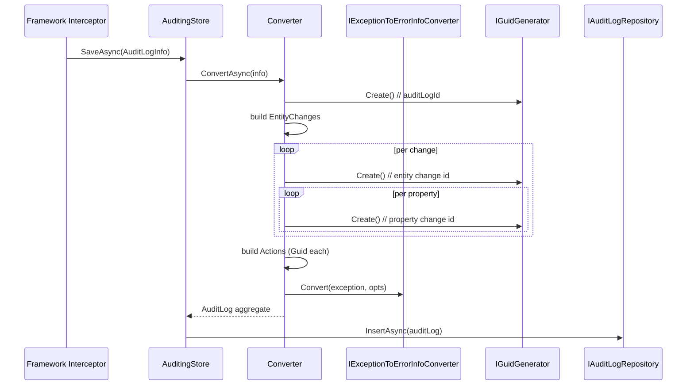

`Volo.Abp.AuditLogging.Domain` is a thin layer: four aggregates, one repository interface, one converter, and one `IAuditingStore` implementation. There are no managers, no domain events, and no per-tenant invariants — audit records are *append-only*, so the domain logic is essentially the constructors. This page documents every property, every truncation rule, and every collaborator the store touches.

## File inventory (`Volo/Abp/AuditLogging/`)

| File | Role |
| --- | --- |
| `AbpAuditLoggingDomainModule.cs` | Depends on `AbpAuditingModule`, `AbpDddDomainModule`, `AbpJsonModule`, `AbpExceptionHandlingModule`. `PostConfigureServices` pushes object-extension config onto the three extensible entities. |
| `AbpAuditLoggingDbProperties.cs` | `DbTablePrefix = "Abp"`, `DbSchema = null`, `ConnectionStringName = "AbpAuditLogging"`. |
| `AuditLog.cs` | The aggregate root — one row per request/method call. |
| `AuditLogAction.cs` | One row per audited service method invocation inside an `AuditLog`. |
| `EntityChange.cs` | One row per entity inserted/updated/deleted during the request. |
| `EntityPropertyChange.cs` | One row per modified property. |
| `EntityChangeWithUsername.cs` | DTO `{ EntityChange, UserName }` returned by `GetEntityChangesWithUsernameAsync`. |
| `IAuditLogRepository.cs` | The repository contract. |
| `AuditingStore.cs` | `IAuditingStore` implementation — what the framework calls. |
| `IAuditLogInfoToAuditLogConverter.cs`, `AuditLogInfoToAuditLogConverter.cs` | Maps the framework's `AuditLogInfo` DTO to the four aggregates. |

## `AuditLog`

```csharp
[DisableAuditing]
public class AuditLog : AggregateRoot<Guid>, IMultiTenant
{
    public virtual string ApplicationName { get; set; }
    public virtual Guid? UserId { get; protected set; }
    public virtual string UserName { get; protected set; }
    public virtual Guid? TenantId { get; protected set; }
    public virtual string TenantName { get; protected set; }
    public virtual Guid? ImpersonatorUserId { get; protected set; }
    public virtual string ImpersonatorUserName { get; protected set; }
    public virtual Guid? ImpersonatorTenantId { get; protected set; }
    public virtual string ImpersonatorTenantName { get; protected set; }
    public virtual DateTime ExecutionTime { get; protected set; }
    public virtual int ExecutionDuration { get; protected set; }
    public virtual string ClientIpAddress { get; protected set; }
    public virtual string ClientName { get; protected set; }
    public virtual string ClientId { get; set; }
    public virtual string CorrelationId { get; set; }
    public virtual string BrowserInfo { get; protected set; }
    public virtual string HttpMethod { get; protected set; }
    public virtual string Url { get; protected set; }
    public virtual string Exceptions { get; protected set; }
    public virtual string Comments { get; protected set; }
    public virtual int? HttpStatusCode { get; set; }
    public virtual ICollection<EntityChange> EntityChanges { get; protected set; }
    public virtual ICollection<AuditLogAction> Actions { get; protected set; }
}
```

### Property reference

| Property | Source | Notes |
| --- | --- | --- |
| `ApplicationName` | `AbpAuditingOptions.ApplicationName` (default = assembly name) | Useful when multiple services write to the same audit DB. |
| `UserId`, `UserName` | `ICurrentUser.Id` / `UserName` | `null` for anonymous calls. |
| `TenantId`, `TenantName` | `ICurrentTenant.Id` / `Name` | `null` for host requests. |
| `ImpersonatorUserId` / `ImpersonatorUserName` / `ImpersonatorTenantId` / `ImpersonatorTenantName` | Set by the framework when an impersonation token is present. | All four populated together. |
| `ExecutionTime` | `Clock.Now` at request start | UTC if `AbpClockOptions.Kind == Utc`. |
| `ExecutionDuration` | Stopwatch ms | Captured by the auditing interceptor. |
| `ClientIpAddress` | `IClientInfoProvider.ClientIpAddress` | Honours `X-Forwarded-For` if `ForwardedHeadersOptions` is configured. |
| `ClientName` | `IClientInfoProvider.ComputerName` | OS-level client name. |
| `ClientId` | OAuth client id when the call is OIDC-secured | `null` on cookie auth. |
| `CorrelationId` | `ICorrelationIdProvider` | Mirrors what the framework writes to response headers. |
| `BrowserInfo` | `HttpContext.Request.Headers["User-Agent"]` | |
| `HttpMethod`, `Url` | `HttpContext.Request.Method` and `GetEncodedUrl()` | Trimmed to `MaxUrlLength`. |
| `HttpStatusCode` | Final response status | `null` for non-HTTP audits. |
| `Exceptions` | JSON-serialized list of `RemoteServiceErrorInfo` | `null` when no exceptions were captured. |
| `Comments` | `IAuditingManager.Current.Log.Comments` joined with newline | Free-form annotations from your code. |
| `EntityChanges` | child collection — owned (EF) or embedded (Mongo) | See below. |
| `Actions` | child collection — owned (EF) or embedded (Mongo) | One per `[Audited]` service method call. |

The constructor calls `.Truncate(...)` for forward-truncated strings (URL, comments) and `.TruncateFromBeginning(...)` for type names — keeping the most-specific suffix is more useful for diagnosis.

## `AuditLogAction`

```csharp
[DisableAuditing]
public class AuditLogAction : Entity<Guid>, IMultiTenant, IHasExtraProperties
{
    public virtual Guid? TenantId { get; protected set; }
    public virtual Guid AuditLogId { get; protected set; }
    public virtual string ServiceName { get; protected set; }
    public virtual string MethodName { get; protected set; }
    public virtual string Parameters { get; protected set; }
    public virtual DateTime ExecutionTime { get; protected set; }
    public virtual int ExecutionDuration { get; protected set; }
    public virtual ExtraPropertyDictionary ExtraProperties { get; protected set; }
}
```

`Parameters` is JSON serialized at the framework layer. If the serialized form exceeds `AuditLogActionConsts.MaxParametersLength` (default 2000), the constructor **sets it to empty string**, not a truncated value:

```csharp
Parameters = actionInfo.Parameters.Length > AuditLogActionConsts.MaxParametersLength
    ? ""
    : actionInfo.Parameters;
```

This is deliberate: a partial JSON document would be unparseable. Raise `MaxParametersLength` (and run a migration to widen the column) if you depend on parameter capture for forensics.

## `EntityChange`

```csharp
[DisableAuditing]
public class EntityChange : Entity<Guid>, IMultiTenant, IHasExtraProperties
{
    public virtual Guid AuditLogId { get; protected set; }
    public virtual Guid? TenantId { get; protected set; }
    public virtual DateTime ChangeTime { get; protected set; }
    public virtual EntityChangeType ChangeType { get; protected set; }
    public virtual Guid? EntityTenantId { get; protected set; }
    public virtual string EntityId { get; protected set; }
    public virtual string EntityTypeFullName { get; protected set; }
    public virtual ICollection<EntityPropertyChange> PropertyChanges { get; protected set; }
    public virtual ExtraPropertyDictionary ExtraProperties { get; protected set; }
}
```

`ChangeType` is the `EntityChangeType` enum from `Volo.Abp.Auditing` — values `Created = 0`, `Updated = 1`, `Deleted = 2`. `EntityTenantId` is the tenant of the *audited entity*, which can differ from `TenantId` (the tenant doing the editing) during host-side admin operations against a tenant database.

`EntityId` is the entity's primary key serialized to string — composite keys are joined with `,`. The constructor truncates with `MaxEntityTypeFullNameLength` (128) — note the constant name, but the column constraint is independently `MaxEntityIdLength = 128`.

## `EntityPropertyChange`

```csharp
[DisableAuditing]
public class EntityPropertyChange : Entity<Guid>, IMultiTenant
{
    public virtual Guid? TenantId { get; protected set; }
    public virtual Guid EntityChangeId { get; protected set; }
    public virtual string NewValue { get; protected set; }
    public virtual string OriginalValue { get; protected set; }
    public virtual string PropertyName { get; protected set; }
    public virtual string PropertyTypeFullName { get; protected set; }
}
```

The framework only emits an `EntityPropertyChange` when `OriginalValue != NewValue` *and* the property is not flagged `[DisableAuditing]` / `[Audited(Disabled = true)]`. Both value columns are 512-char nvarchar by default; if you audit large JSON columns, bump `EntityPropertyChangeConsts.MaxNewValueLength` and `MaxOriginalValueLength` (the column lengths and the truncation limits are the same constants).

## `IAuditLogRepository`

```csharp
public interface IAuditLogRepository : IRepository<AuditLog, Guid>
{
    Task<List<AuditLog>> GetListAsync(
        string sorting = null, int maxResultCount = 50, int skipCount = 0,
        DateTime? startTime = null, DateTime? endTime = null,
        string httpMethod = null, string url = null,
        Guid? userId = null, string userName = null,
        string applicationName = null, string clientIpAddress = null,
        string correlationId = null,
        int? maxExecutionDuration = null, int? minExecutionDuration = null,
        bool? hasException = null, HttpStatusCode? httpStatusCode = null,
        bool includeDetails = false, CancellationToken cancellationToken = default);

    Task<long> GetCountAsync(/* same filter set as GetListAsync, minus paging */);

    Task<Dictionary<DateTime, double>> GetAverageExecutionDurationPerDayAsync(
        DateTime startDate, DateTime endDate, CancellationToken cancellationToken = default);

    Task<EntityChange> GetEntityChange(Guid entityChangeId, CancellationToken cancellationToken = default);

    Task<List<EntityChange>> GetEntityChangeListAsync(/* sorting, paging, filters by auditLogId / type / entityId */);
    Task<long> GetEntityChangeCountAsync(/* matching filters */);

    Task<EntityChangeWithUsername> GetEntityChangeWithUsernameAsync(Guid entityChangeId, CancellationToken cancellationToken = default);
    Task<List<EntityChangeWithUsername>> GetEntityChangesWithUsernameAsync(string entityId, string entityTypeFullName, CancellationToken cancellationToken = default);
}
```

The repository extends `IRepository<AuditLog, Guid>` (the full repository), so you get LINQ via `GetQueryableAsync()` for free. Note:

* **`includeDetails = false` by default.** Listing returns `AuditLog` heads only; `EntityChanges` and `Actions` are empty collections. Pass `true` only when you need them — they multiply row count.
* **Default sort is `ExecutionTime DESC`** when `sorting` is blank.
* **`GetEntityChangesWithUsernameAsync`** joins to the user table via a host/tenant repository call. The OSS implementation joins `AuditLog.UserId → AuditLog.UserName` (i.e. it does not hit the Identity tables) — it returns the username that was current *at change time*, which is the correct forensic answer.

## `AuditingStore`

```csharp
public class AuditingStore : IAuditingStore, ITransientDependency
{
    public virtual async Task SaveAsync(AuditLogInfo auditInfo)
    {
        if (!Options.HideErrors) { await SaveLogAsync(auditInfo); return; }
        try { await SaveLogAsync(auditInfo); }
        catch (Exception ex)
        {
            Logger.LogWarning("Could not save the audit log object: " + Environment.NewLine + auditInfo);
            Logger.LogException(ex, LogLevel.Error);
        }
    }

    protected virtual async Task SaveLogAsync(AuditLogInfo auditInfo)
    {
        using (var uow = UnitOfWorkManager.Begin(true))
        {
            await AuditLogRepository.InsertAsync(await Converter.ConvertAsync(auditInfo));
            await uow.CompleteAsync();
        }
    }
}
```

It is registered as `ITransientDependency` — `IAuditingStore` is resolved per call so its dependencies (notably `IUnitOfWorkManager` and `IAuditLogRepository`) are scoped correctly. The `Begin(true)` overload means `requiresNew: true`: the audit save is a sibling UoW that always commits independently of the outer business UoW.

## `AuditLogInfoToAuditLogConverter`

The converter is where the framework DTOs become aggregates. The flow:



```csharp
public virtual Task<AuditLog> ConvertAsync(AuditLogInfo auditLogInfo)
{
    var auditLogId = GuidGenerator.Create();
    // ... build EntityChanges & Actions ...
    var remoteServiceErrorInfos = auditLogInfo.Exceptions?.Select(exception =>
        ExceptionToErrorInfoConverter.Convert(exception, options =>
        {
            options.SendExceptionsDetailsToClients = ExceptionHandlingOptions.SendExceptionsDetailsToClients;
            options.SendStackTraceToClients = ExceptionHandlingOptions.SendStackTraceToClients;
        })) ?? new List<RemoteServiceErrorInfo>();

    var exceptions = remoteServiceErrorInfos.Any()
        ? JsonSerializer.Serialize(remoteServiceErrorInfos, indented: true)
        : null;

    var comments = auditLogInfo.Comments?.JoinAsString(Environment.NewLine);

    return Task.FromResult(new AuditLog(/* ...22 args... */));
}
```

The two collaborators worth highlighting:

* **`IExceptionToErrorInfoConverter`** comes from `Volo.Abp.ExceptionHandling`. It is the same converter that builds the body of `IResultFilter`-rendered 5xx responses, so the `Exceptions` JSON column matches the JSON your clients see — convenient for debugging.
* **`IJsonSerializer`** is ABP's wrapper around `System.Text.Json`; `indented: true` keeps `Exceptions` human-readable in the database.

## Object extensions

`AbpAuditLoggingDomainModule.PostConfigureServices` runs once:

```csharp
ModuleExtensionConfigurationHelper.ApplyEntityConfigurationToEntity(
    AuditLoggingModuleExtensionConsts.ModuleName,  // "AuditLogging"
    AuditLoggingModuleExtensionConsts.EntityNames.AuditLog,
    typeof(AuditLog));
// + AuditLogAction + EntityChange
```

Register custom extra properties early — typically in your DI-module's `PreConfigureServices` — so EF Core picks them up at first migration:

```csharp
ObjectExtensionManager.Instance.Modules()
    .ConfigureAuditLogging(audit =>
    {
        audit.ConfigureAuditLog(b =>
        {
            b.AddOrUpdateProperty<string>("Region",
                opt => opt.Attributes.Add(new RequiredAttribute()));
        });
    });
```

`AuditLogAction` does not implement `IHasExtraProperties` directly on its constructor signature — the `ExtraProperties` dictionary is initialized from `actionInfo.ExtraProperties`, so you can also write `auditInfo.Actions[i].ExtraProperties["X"] = …` inside an `IAuditLogContributor` (see [framework Auditing](/framework/cross/auditing#contributors)).

## Gotchas

* **Don't write through `IRepository<AuditLog>.UpdateAsync`.** The entity has `protected set` on almost every property — your code will compile, but the changes won't stick. Audit records are immutable by design; insert a corrective entry instead.
* **`AuditLog.ClientId` and `CorrelationId` have public setters** so a contributor can patch them after construction. The other identifier columns do not.
* **Comments are joined with `Environment.NewLine`.** On Windows your column ends up with `\r\n`; on Linux just `\n`. Don't write parsers that assume `\n`.
* **`Exceptions` is null when empty.** Test for `auditLog.Exceptions != null`, not `string.IsNullOrEmpty` — the column is also NULL when the request didn't throw, which is the common case.
* **`includeDetails: true` is N+1-prone on MongoDB.** EF Core uses `Include`/`ThenInclude`; MongoDB stores children embedded, so `includeDetails: true` is essentially free on Mongo. The opposite is *not* true — passing `false` does *not* save you a roundtrip on Mongo because the parent document already contains the embedded arrays.

## Cross-links

* [Audit Logging EF Core provider](/modules/audit-logging/efcore) — DbContext, indexes, query shapes.
* [Audit Logging MongoDB provider](/modules/audit-logging/mongodb) — single collection, embedded documents.
* [Framework / Auditing](/framework/cross/auditing) — capture side (interceptors, `[Audited]`, `IAuditingManager`).
* [Framework / Object extensions](/framework/ddd/entities-and-aggregates) — extending `AuditLog` without forking.
