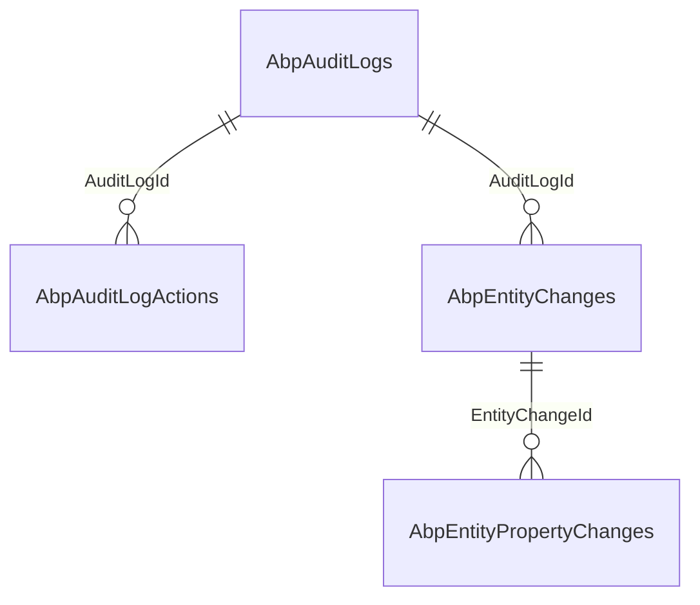
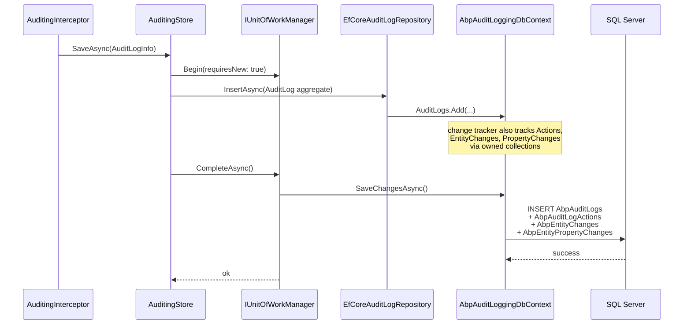

`Volo.Abp.AuditLogging.EntityFrameworkCore` maps the four audit aggregates onto four physical tables and implements `IAuditLogRepository` using LINQ-to-Entities. This page documents every column, index, and query so you can plan migrations, sizing, and read patterns without re-reading the source.

## File inventory (`Volo/Abp/AuditLogging/EntityFrameworkCore/`)

| File | Role |
| --- | --- |
| `AbpAuditLoggingEntityFrameworkCoreModule.cs` | Registers `AbpAuditLoggingDbContext` and the repository. |
| `IAuditLoggingDbContext.cs` | Marker interface — lets `EfCoreRepository<IAuditLoggingDbContext, …>` resolve against any concrete DbContext that implements it. |
| `AbpAuditLoggingDbContext.cs` | The default concrete DbContext (`DbSet<AuditLog>`). |
| `AbpAuditLoggingDbContextModelBuilderExtensions.cs` | The `ConfigureAuditLogging()` extension that maps all four entities. |
| `EfCoreAuditLogRepository.cs` | `IAuditLogRepository` implementation. |
| `Volo/Abp/AuditLogging/AbpAuditLoggingEfCoreQueryableExtensions.cs` | `IncludeDetails(bool)` for `AuditLog` and `EntityChange`. |

## Module wiring

```csharp
[DependsOn(typeof(AbpAuditLoggingDomainModule))]
[DependsOn(typeof(AbpEntityFrameworkCoreModule))]
public class AbpAuditLoggingEntityFrameworkCoreModule : AbpModule
{
    public override void ConfigureServices(ServiceConfigurationContext context)
    {
        context.Services.AddAbpDbContext<AbpAuditLoggingDbContext>(options =>
        {
            options.AddRepository<AuditLog, EfCoreAuditLogRepository>();
        });
    }
}
```

`AddAbpDbContext<AbpAuditLoggingDbContext>` registers the DbContext, `IAuditLoggingDbContext`, and a default `IRepository<AuditLog>`. The `AddRepository<>` line *replaces* that default with `EfCoreAuditLogRepository`, which adds the custom query methods declared on `IAuditLogRepository`. The same registration also exposes `IRepository<AuditLogAction>`, `IRepository<EntityChange>` and `IRepository<EntityPropertyChange>` — they're entities in the model but the module does not ship dedicated repositories for them.

## The DbContext

```csharp
[ConnectionStringName(AbpAuditLoggingDbProperties.ConnectionStringName)] // "AbpAuditLogging"
public class AbpAuditLoggingDbContext : AbpDbContext<AbpAuditLoggingDbContext>, IAuditLoggingDbContext
{
    public DbSet<AuditLog> AuditLogs { get; set; }

    protected override void OnModelCreating(ModelBuilder builder)
    {
        base.OnModelCreating(builder);
        builder.ConfigureAuditLogging();
    }
}
```

Only `AuditLogs` is exposed; the three child entities are reached through `auditLog.Actions` / `auditLog.EntityChanges` (and `entityChange.PropertyChanges`) using EF Core's owned collections semantics. If you need to query them flat, use `(await GetDbContextAsync()).Set<EntityChange>()` from a custom repository — that is exactly what `EfCoreAuditLogRepository.GetEntityChangeListAsync` does.

## Table schema



### `AbpAuditLogs`

| Column | Type | Notes |
| --- | --- | --- |
| `Id` | `uniqueidentifier` PK | `Guid` from `IGuidGenerator`. |
| `ApplicationName` | `nvarchar(96)` | |
| `TenantId` | `uniqueidentifier` NULL | |
| `TenantName` | `nvarchar(64)` | |
| `UserId` | `uniqueidentifier` NULL | |
| `UserName` | `nvarchar(256)` | |
| `ExecutionTime` | `datetime2` | |
| `ExecutionDuration` | `int` | Milliseconds. |
| `ClientIpAddress` | `nvarchar(64)` | |
| `ClientName` | `nvarchar(128)` | |
| `ClientId` | `nvarchar(64)` | |
| `CorrelationId` | `nvarchar(64)` | |
| `BrowserInfo` | `nvarchar(512)` | |
| `HttpMethod` | `nvarchar(16)` | |
| `Url` | `nvarchar(256)` | |
| `HttpStatusCode` | `int` NULL | |
| `Exceptions` | `nvarchar(MAX)` | JSON; null when no exceptions. |
| `Comments` | `nvarchar(256)` | |
| `ImpersonatorUserId` | `uniqueidentifier` NULL | |
| `ImpersonatorUserName` | `nvarchar(256)` | |
| `ImpersonatorTenantId` | `uniqueidentifier` NULL | |
| `ImpersonatorTenantName` | `nvarchar(64)` | |
| `ExtraProperties` | `nvarchar(MAX)` | `IHasExtraProperties` JSON. |
| `ConcurrencyStamp` | `nvarchar(40)` | From `IHasConcurrencyStamp`. |

Indexes (declared in `ConfigureAuditLogging`):

```csharp
b.HasIndex(x => new { x.TenantId, x.ExecutionTime });
b.HasIndex(x => new { x.TenantId, x.UserId, x.ExecutionTime });
```

Both are leading-`TenantId` so the multi-tenant data filter (when you use `IRepository<AuditLog>` rather than `IAuditLogRepository`) uses them too. **There is no index on `CorrelationId`, `Url`, or `HttpStatusCode`** — those filters in `GetListAsync` will scan unless you add one yourself.

### `AbpAuditLogActions`

| Column | Type | Notes |
| --- | --- | --- |
| `Id` | `uniqueidentifier` PK | |
| `AuditLogId` | `uniqueidentifier` FK | |
| `TenantId` | `uniqueidentifier` NULL | |
| `ServiceName` | `nvarchar(256)` | |
| `MethodName` | `nvarchar(128)` | |
| `Parameters` | `nvarchar(2000)` | Empty string when the JSON would overflow. |
| `ExecutionTime` | `datetime2` | |
| `ExecutionDuration` | `int` | |
| `ExtraProperties`, `ConcurrencyStamp` | | |

Indexes:

```csharp
b.HasIndex(x => new { x.AuditLogId });
b.HasIndex(x => new { x.TenantId, x.ServiceName, x.MethodName, x.ExecutionTime });
```

The second index supports "show me everything that called `MyService.Create` in the last 7 days" queries — useful for SLA dashboards.

### `AbpEntityChanges`

| Column | Type | Notes |
| --- | --- | --- |
| `Id` | `uniqueidentifier` PK | |
| `AuditLogId` | `uniqueidentifier` FK NOT NULL | |
| `TenantId` | `uniqueidentifier` NULL | The tenant that performed the change. |
| `EntityTenantId` | `uniqueidentifier` NULL | The tenant of the audited entity. |
| `ChangeTime` | `datetime2` NOT NULL | |
| `ChangeType` | `tinyint` NOT NULL | `0=Created, 1=Updated, 2=Deleted` |
| `EntityId` | `nvarchar(128)` NOT NULL | |
| `EntityTypeFullName` | `nvarchar(128)` NOT NULL | |
| `ExtraProperties`, `ConcurrencyStamp` | | |

Indexes:

```csharp
b.HasIndex(x => new { x.AuditLogId });
b.HasIndex(x => new { x.TenantId, x.EntityTypeFullName, x.EntityId });
```

The second is the index that powers `GetEntityChangesWithUsernameAsync(entityId, entityTypeFullName)` — i.e. "show all audit history for this entity". Filter by tenant when you use that endpoint or the index won't be picked.

### `AbpEntityPropertyChanges`

| Column | Type | Notes |
| --- | --- | --- |
| `Id` | `uniqueidentifier` PK | |
| `EntityChangeId` | `uniqueidentifier` FK | |
| `TenantId` | `uniqueidentifier` NULL | |
| `PropertyName` | `nvarchar(128)` NOT NULL | |
| `PropertyTypeFullName` | `nvarchar(64)` NOT NULL | |
| `NewValue` | `nvarchar(512)` NULL | |
| `OriginalValue` | `nvarchar(512)` NULL | |

```csharp
b.HasIndex(x => new { x.EntityChangeId });
```

This is the only `EntityPropertyChange` index. There is no index on `PropertyName` / `NewValue`; full-text search over audited values is *not* supported out of the box.

## `IncludeDetails`

```csharp
public static IQueryable<AuditLog> IncludeDetails(this IQueryable<AuditLog> queryable, bool include = true)
{
    if (!include) return queryable;
    return queryable
        .Include(x => x.Actions)
        .Include(x => x.EntityChanges).ThenInclude(ec => ec.PropertyChanges);
}
```

`IncludeDetails(true)` produces a SQL query that joins all four tables and *cartesian-explodes* — for a row with 5 actions, 10 entity changes and 50 property changes you'll fetch ~2500 raw rows that EF Core deduplicates client-side. Use it for the *details* page of a single audit log, not on lists.

EF Core's `AsSplitQuery()` helps but the repository does not set it — call it yourself if you need to:

```csharp
(await Repo.GetQueryableAsync()).IncludeDetails().AsSplitQuery();
```

## Repository query shapes

`GetListAsync` builds one `IQueryable<AuditLog>`:

```csharp
return (await GetDbSetAsync()).AsNoTracking()
    .IncludeDetails(includeDetails)
    .WhereIf(startTime.HasValue, a => a.ExecutionTime >= startTime)
    .WhereIf(endTime.HasValue,   a => a.ExecutionTime <= endTime)
    .WhereIf(hasException == true,  a => a.Exceptions != null && a.Exceptions != "")
    .WhereIf(hasException == false, a => a.Exceptions == null || a.Exceptions == "")
    .WhereIf(httpMethod != null,        a => a.HttpMethod == httpMethod)
    .WhereIf(url != null,               a => a.Url != null && a.Url.Contains(url))   // scan!
    .WhereIf(userId != null,            a => a.UserId == userId)
    .WhereIf(userName != null,          a => a.UserName == userName)
    .WhereIf(applicationName != null,   a => a.ApplicationName == applicationName)
    .WhereIf(clientIpAddress != null,   a => a.ClientIpAddress == clientIpAddress)
    .WhereIf(correlationId != null,     a => a.CorrelationId == correlationId)
    .WhereIf(httpStatusCode != null,    a => a.HttpStatusCode == nHttpStatusCode)
    .WhereIf(maxExecutionDuration > 0,  a => a.ExecutionDuration <= maxExecutionDuration)
    .WhereIf(minExecutionDuration > 0,  a => a.ExecutionDuration >= minExecutionDuration);
```

`AsNoTracking` is crucial — none of these reads are followed by writes, and tracking ~50 audit logs with details can dominate the request.

`GetAverageExecutionDurationPerDayAsync` groups in SQL and rounds dates client-side:

```csharp
.Where(a => a.ExecutionTime < endDate.AddDays(1) && a.ExecutionTime > startDate)
.GroupBy(t => new { t.ExecutionTime.Date })
.Select(g => new { Day = g.Min(t => t.ExecutionTime), avgExecutionTime = g.Average(t => t.ExecutionDuration) })
.ToListAsync()
.ToDictionary(e => e.Day.ClearTime(), e => e.avgExecutionTime);
```

`ClearTime()` is the ABP extension that zeroes `Hour/Minute/Second/Millisecond`. The use of `g.Min(t => t.ExecutionTime)` instead of `g.Key.Date` is a SQL Server portability trick — some providers project `.Date` poorly.

`GetEntityChangeWithUsernameAsync(entityChangeId)` does a single-row navigation:

```csharp
var auditLog = await (await GetDbSetAsync()).AsNoTracking().IncludeDetails()
    .Where(x => x.EntityChanges.Any(y => y.Id == entityChangeId))
    .FirstAsync(GetCancellationToken(cancellationToken));

return new EntityChangeWithUsername
{
    EntityChange = auditLog.EntityChanges.First(x => x.Id == entityChangeId),
    UserName = auditLog.UserName
};
```

This always fetches the *full* parent `AuditLog` (with all children) just to project two fields. If you only need the username, write a custom projection:

```csharp
var q = await (await Repo.GetDbContextAsync()).Set<EntityChange>().AsNoTracking()
    .Join(dbContext.AuditLogs, c => c.AuditLogId, a => a.Id,
        (c, a) => new { c, a.UserName })
    .Where(x => x.c.Id == id).FirstOrDefaultAsync();
```

`GetEntityChangesWithUsernameAsync(entityId, entityTypeFullName)` already does a tight join:

```csharp
return await (from e in dbContext.Set<EntityChange>().AsNoTracking().IncludeDetails()
              join a in dbContext.AuditLogs on e.AuditLogId equals a.Id
              where e.EntityId == entityId && e.EntityTypeFullName == entityTypeFullName
              select new EntityChangeWithUsername { EntityChange = e, UserName = a.UserName })
            .OrderByDescending(x => x.EntityChange.ChangeTime).ToListAsync();
```

This *is* the standard "history for entity X" endpoint and uses the `(TenantId, EntityTypeFullName, EntityId)` index — but only if the tenant filter is applied by the data filter. When you call it from the host context that filter is absent.

## Persistence sequence



Each `SaveAsync` produces 4 `INSERT` statements (one per table, batched). Under SQL Server's default isolation that's one round-trip per batch — EF Core batches up to 42 rows per command by default. For most requests the four batches are written in 1 round-trip total.

## Connection-string isolation

Pointing the audit DbContext at a separate database:

```json
{
  "ConnectionStrings": {
    "Default": "Server=primary;Database=MyApp;...",
    "AbpAuditLogging": "Server=audit;Database=MyApp_Audit;..."
  }
}
```

In a multi-DbContext setup you must also call `services.AddAbpDbContext<MyAuditLoggingDbContext>(...)` from a custom DbContext that implements `IAuditLoggingDbContext` — replacing the default — so `MyAuditLoggingDbContext` participates in *its* migrations rather than your application DbContext's.

## Gotchas

* **No cascade-delete on `AuditLog`.** EF Core's default for required FKs is cascade, but `b.HasMany(a => a.Actions).WithOne().HasForeignKey(x => x.AuditLogId).IsRequired();` uses the conventional cascade — **deleting an `AuditLog` deletes its children**. That's correct, but a `DELETE` purge on `AbpAuditLogs` will lock the three child tables too; use partitioning or set-based deletes by date range.
* **`Parameters` column is `nvarchar(2000)`** but the constructor *zeroes out* values longer than 2000. If you bump `AuditLogActionConsts.MaxParametersLength = 8000` at startup, you must also widen the column with a migration.
* **`IncludeDetails(true)` is a `Cartesian explosion`.** Use `AsSplitQuery()` (call it yourself) for any list of more than ~5 audit logs.
* **No tenant filter in `GetListAsync`.** The filters are all explicit; passing the current tenant requires either using `IRepository<AuditLog>` (the auto-applied data filter) or supplying `userId`/`userName` from the tenant context.
* **`Url` filter uses `Contains`.** That's a `LIKE '%…%'` scan in SQL Server — slow on tables with millions of rows. Consider full-text or computed-column indexes if URL search is a hot path.

## Cross-links

* [Domain layer](/modules/audit-logging/domain) — the aggregates and the converter.
* [MongoDB provider](/modules/audit-logging/mongodb) — same `IAuditLogRepository`, different physical shape.
* [Framework / Auditing](/framework/cross/auditing) — the capture pipeline.
* [Object extensions](/framework/ddd/entities-and-aggregates) — how `b.ApplyObjectExtensionMappings()` translates your extra properties to columns.
