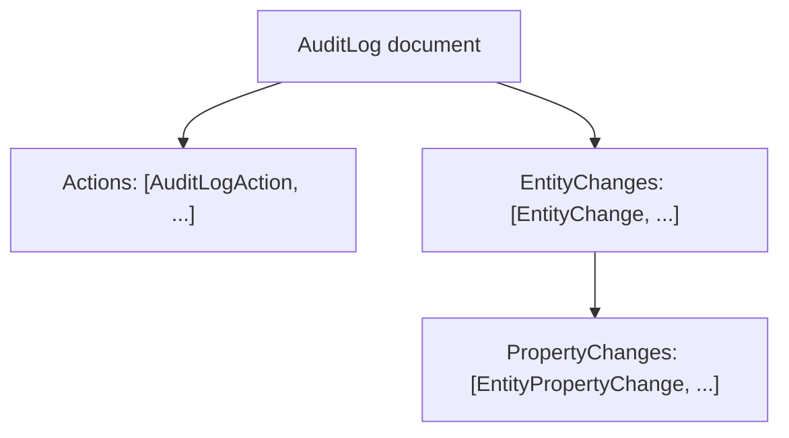
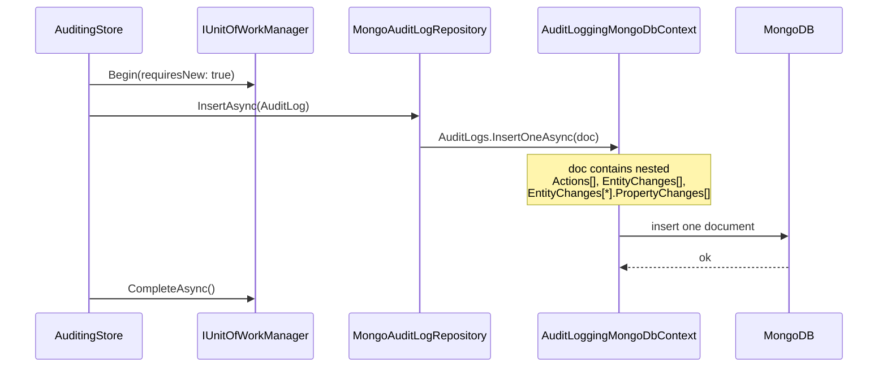

`Volo.Abp.AuditLogging.MongoDB` collapses the four relational tables into a *single* MongoDB collection (`AbpAuditLogs`) with embedded child documents. There is no separate collection for `AuditLogAction`, `EntityChange`, or `EntityPropertyChange` — they live inside their parent `AuditLog` document. This page documents the layout, the `MongoAuditLogRepository` implementation, and the differences between this provider and the EF Core one that matter for queries and indexing.

## File inventory (`Volo/Abp/AuditLogging/MongoDB/`)

| File | Role |
| --- | --- |
| `AbpAuditLoggingMongoDbModule.cs` | Registers `AuditLoggingMongoDbContext` and `MongoAuditLogRepository`. |
| `IAuditLoggingMongoDbContext.cs` | Marker interface — `IMongoCollection<AuditLog> AuditLogs`. |
| `AuditLoggingMongoDbContext.cs` | The default concrete context. |
| `AbpAuditLoggingMongoDbContextExtensions.cs` | The `ConfigureAuditLogging()` mapping extension. |
| `MongoAuditLogRepository.cs` | `IAuditLogRepository` implementation. |

## Module wiring

```csharp
[DependsOn(typeof(AbpAuditLoggingDomainModule))]
[DependsOn(typeof(AbpMongoDbModule))]
public class AbpAuditLoggingMongoDbModule : AbpModule
{
    public override void ConfigureServices(ServiceConfigurationContext context)
    {
        context.Services.AddMongoDbContext<AuditLoggingMongoDbContext>(options =>
        {
            options.AddRepository<AuditLog, MongoAuditLogRepository>();
        });
    }
}
```

Just like the EF Core variant, the only entity exposed to the DI repository system is `AuditLog`. `EntityChange`, `AuditLogAction` and `EntityPropertyChange` do *not* have collection-scoped repositories on MongoDB — they're projected via `SelectMany` from the parent collection.

## The DbContext and collection mapping

```csharp
[ConnectionStringName(AbpAuditLoggingDbProperties.ConnectionStringName)] // "AbpAuditLogging"
public class AuditLoggingMongoDbContext : AbpMongoDbContext, IAuditLoggingMongoDbContext
{
    public IMongoCollection<AuditLog> AuditLogs => Collection<AuditLog>();

    protected override void CreateModel(IMongoModelBuilder modelBuilder)
    {
        base.CreateModel(modelBuilder);
        modelBuilder.ConfigureAuditLogging();
    }
}

public static void ConfigureAuditLogging(this IMongoModelBuilder builder)
{
    builder.Entity<AuditLog>(b =>
    {
        b.CollectionName = AbpAuditLoggingDbProperties.DbTablePrefix + "AuditLogs"; // "AbpAuditLogs"
    });
}
```

Only `AuditLog` is registered with the model builder. `AuditLogAction`, `EntityChange`, and `EntityPropertyChange` are mapped by MongoDB's BSON serializer (`BsonClassMap`) as embedded sub-documents the first time they're serialized. The class-map registration is implicit and uses the public/protected getters declared on the C# entities — there is no fluent config equivalent to EF Core's `b.Property(...)`.

## Document shape



Concretely, a single document looks like:

```json
{
  "_id": "BSON UUID",
  "ApplicationName": "MyApp",
  "TenantId": null,
  "UserId": "...",
  "UserName": "admin",
  "ExecutionTime": ISODate("..."),
  "ExecutionDuration": 142,
  "ClientIpAddress": "10.0.0.5",
  "HttpMethod": "POST",
  "Url": "/api/app/order",
  "HttpStatusCode": 200,
  "Exceptions": null,
  "Comments": null,
  "Actions": [
    { "_id": "...", "AuditLogId": "...", "ServiceName": "OrderAppService",
      "MethodName": "CreateAsync", "Parameters": "{...}",
      "ExecutionTime": ISODate("..."), "ExecutionDuration": 80, "ExtraProperties": {} }
  ],
  "EntityChanges": [
    { "_id": "...", "AuditLogId": "...", "EntityTypeFullName": "MyApp.Orders.Order",
      "EntityId": "abc-123", "ChangeType": 0, "ChangeTime": ISODate("..."),
      "PropertyChanges": [
        { "_id": "...", "EntityChangeId": "...", "PropertyName": "TotalAmount",
          "PropertyTypeFullName": "System.Decimal", "OriginalValue": null, "NewValue": "49.99" }
      ], "ExtraProperties": {} }
  ],
  "ExtraProperties": {},
  "ConcurrencyStamp": "..."
}
```

Two practical consequences:

1. **There is no FK validation.** A child document with a `EntityChangeId` that doesn't match its parent's `_id` will not raise an error — the converter sets these correctly, but a manual `UpdateAsync` could desynchronize them.
2. **Document size matters.** MongoDB caps documents at 16 MB. A request that audits hundreds of entity changes — each with many property changes — can approach that limit. The framework's `AbpAuditingOptions.EntityHistorySelectors` is the right place to filter out chatty entities (e.g. session tables).

## Indexes — there are none

`ConfigureAuditLogging` only sets the collection name. **No indexes are created by the module.** Every query in `MongoAuditLogRepository` therefore depends on the default `_id` index plus whichever indexes *you* create. The EF Core provider declares five compound indexes; the MongoDB provider declares zero.

For production, create at minimum:

```javascript
db.AbpAuditLogs.createIndex({ TenantId: 1, ExecutionTime: -1 });
db.AbpAuditLogs.createIndex({ TenantId: 1, UserId: 1, ExecutionTime: -1 });
db.AbpAuditLogs.createIndex({ "EntityChanges.EntityTypeFullName": 1, "EntityChanges.EntityId": 1 });
db.AbpAuditLogs.createIndex({ ExecutionTime: 1 }, { expireAfterSeconds: 7776000 }); // 90-day TTL
```

The last one — a TTL index — is the simplest way to enforce retention without writing a background worker.

## Repository implementation

```csharp
public class MongoAuditLogRepository :
    MongoDbRepository<IAuditLoggingMongoDbContext, AuditLog, Guid>, IAuditLogRepository
```

`GetListAsync` looks very similar to the EF Core version but materializes through `IMongoQueryable`:

```csharp
return await query
    .OrderBy(sorting.IsNullOrWhiteSpace() ? (nameof(AuditLog.ExecutionTime) + " DESC") : sorting)
    .As<IMongoQueryable<AuditLog>>()
    .PageBy<AuditLog, IMongoQueryable<AuditLog>>(skipCount, maxResultCount)
    .ToListAsync(GetCancellationToken(cancellationToken));
```

Because child documents are embedded, the `includeDetails` flag has *no effect at query time* — the children come back regardless. The parameter is preserved on the interface only for API parity with the EF Core provider.

### Per-day duration aggregation

`GetAverageExecutionDurationPerDayAsync` groups on three integer components rather than `.Date` because the MongoDB LINQ provider can translate `Year / Month / Day` to `$year`/`$month`/`$dayOfMonth`:

```csharp
.GroupBy(t => new {
    t.ExecutionTime.Year,
    t.ExecutionTime.Month,
    t.ExecutionTime.Day
})
.Select(g => new { Day = g.Min(t => t.ExecutionTime), avgExecutionTime = g.Average(t => t.ExecutionDuration) })
```

The `result.ToDictionary(e => e.Day.ClearTime(), …)` call then zeros the time portion in C#.

### Reading children

The flattened-children methods reach in via LINQ:

```csharp
public virtual async Task<EntityChange> GetEntityChange(Guid entityChangeId, ...)
{
    var entityChange = (await (await GetMongoQueryableAsync(...))
        .Where(x => x.EntityChanges.Any(y => y.Id == entityChangeId))
        .OrderBy(x => x.Id)
        .FirstAsync(...))
        .EntityChanges.FirstOrDefault(x => x.Id == entityChangeId);
    ...
}
```

This loads the *entire parent document* (with all sibling entity changes and all their property changes) just to return one child. For high-volume audit data this is heavier than the EF Core equivalent. The Pro module typically lists entity changes by parent id, which is the access pattern this layout favours.

`GetEntityChangeListAsync` uses `SelectMany`:

```csharp
return (await GetMongoQueryableAsync(...))
    .SelectMany(x => x.EntityChanges)
    .WhereIf(auditLogId.HasValue, e => e.Id == auditLogId)  // ⚠ filters on EntityChange.Id, not AuditLogId
    .WhereIf(startTime.HasValue, e => e.ChangeTime >= startTime)
    ...
```

⚠ **Subtle bug worth noting:** the `auditLogId` filter compares against `e.Id` (the entity-change id) instead of `e.AuditLogId`. In the relational provider the same parameter filters by parent. If you call `GetEntityChangeListAsync(auditLogId: someAuditLogGuid)` on MongoDB you will get back the entity change whose own id is that GUID, not all changes belonging to that audit log. This is a known idiosyncrasy of the OSS provider — use `GetAsync(auditLogId).EntityChanges` instead.

### Entity history with username

```csharp
var auditLogs = await (await GetMongoQueryableAsync(...))
    .Where(x => x.EntityChanges.Any(y => y.EntityId == entityId && y.EntityTypeFullName == entityTypeFullName))
    .OrderByDescending(x => x.ExecutionTime)
    .ToListAsync(...);

var entityChanges = auditLogs.SelectMany(x => x.EntityChanges).ToList();
entityChanges.RemoveAll(x => x.EntityId != entityId || x.EntityTypeFullName != entityTypeFullName);

return entityChanges.Select(x => new EntityChangeWithUsername
{
    EntityChange = x,
    UserName = auditLogs.First(y => y.Id == x.AuditLogId).UserName
}).ToList();
```

It pulls *every audit log* that touched the entity, flattens, then post-filters in C#. The filter on `x.EntityChanges.Any(...)` is server-side, but the projection downloads the whole parent document for each match. For a popular entity this is expensive — index `EntityChanges.EntityId` + `EntityChanges.EntityTypeFullName` and watch document sizes.

## Persistence sequence



A single `insertOne` writes the whole audit record — one round-trip to MongoDB regardless of how many actions/changes/properties were captured.

## Multi-tenancy

```csharp
public class AuditLoggingMongoDbContext : AbpMongoDbContext, IAuditLoggingMongoDbContext
```

There is no `[IgnoreMultiTenancy]` attribute on the audit-logging context. The data filter for `IMultiTenant` is therefore applied to `AuditLog` reads. In contrast, the background-jobs MongoDB context *does* declare `[IgnoreMultiTenancy]` (see [Background Jobs MongoDB](/modules/background-jobs-module/mongodb)).

If you query through `IRepository<AuditLog>` from a tenant context, you only see rows where `TenantId == CurrentTenant.Id`; from the host, you see rows where `TenantId == null`. Pass `IDataFilter.Disable<IMultiTenant>()` to see everything for forensic queries.

## Gotchas

* **Document growth.** A `[Audited]` operation that touches a large graph (e.g. a complex domain root with 100+ owned entities) produces a fat document. Profile real production traces and disable property-history on chatty entities via `EntityHistorySelectors`.
* **`GetEntityChange(id)` is heavy.** Loads the parent and all its siblings. If you call it in a list-detail UI, batch reads by `AuditLogId` and access the in-memory collection.
* **`auditLogId` filter on `GetEntityChangeListAsync` matches the wrong column.** Use `GetAsync(auditLogId)` and project `.EntityChanges` instead — known OSS quirk; see source comment above.
* **No indexes are shipped.** Create the indexes listed above before going to production.
* **`includeDetails` is ignored.** It's the same on both reads — children are always there. The API parity with the EF Core provider is the only reason the parameter exists on the MongoDB side.
* **`Parameters` zero-out still applies.** The same constructor that empties oversized `Parameters` runs on MongoDB — the 16 MB document cap is *not* the truncation threshold.
* **No cascade cleanup needed.** Deleting an `AuditLog` document removes all embedded children atomically.

## Cross-links

* [Domain layer](/modules/audit-logging/domain) — the aggregates and the converter that builds the embedded tree.
* [EF Core provider](/modules/audit-logging/efcore) — the relational shape with proper indexes.
* [Framework / Auditing](/framework/cross/auditing) — capture, `EntityHistorySelectors`, `IAuditingContributor`.
* [Framework / MongoDB infrastructure](/framework/persistence/mongodb) — `IMongoDbContextProvider`, `MongoDbRepository`.
