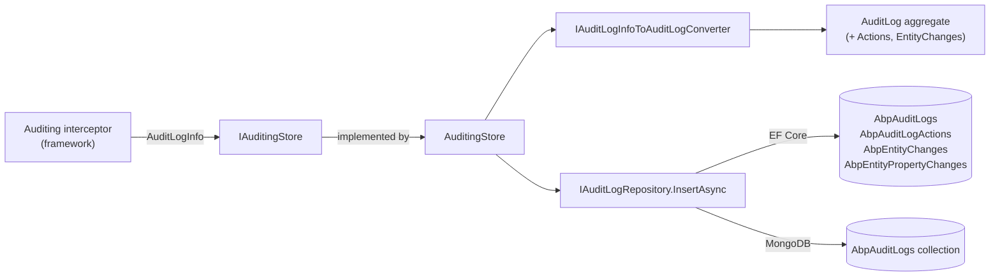
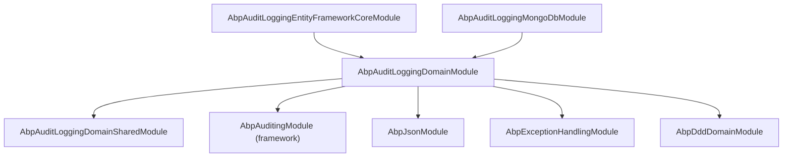

The `Volo.Abp.AuditLogging` module is the *storage half* of ABP's auditing system. The framework module `Volo.Abp.Auditing` produces `AuditLogInfo` objects from MVC/JS-RPC/method interceptors and hands them to an `IAuditingStore`. This module ships the implementation of that store: an `AuditingStore` that converts `AuditLogInfo` into an `AuditLog` aggregate (plus child `AuditLogAction` and `EntityChange` rows) and persists it through `IAuditLogRepository`.

If you only need *capture* (which controller methods are audited, what entity-property changes are tracked, where the data flows), see [Auditing](/framework/cross/auditing). This page and its siblings cover *persistence*: the four aggregates, the repository contract, and the EF Core and MongoDB providers.

## Package layout

| Package | Purpose |
| --- | --- |
| `Volo.Abp.AuditLogging.Domain.Shared` | Length constants (`AuditLogConsts`, `AuditLogActionConsts`, `EntityChangeConsts`, `EntityPropertyChangeConsts`), localization resource, object-extension constants. |
| `Volo.Abp.AuditLogging.Domain` | The four aggregates, `IAuditLogRepository`, `AuditingStore` (the `IAuditingStore` implementation), `AuditLogInfoToAuditLogConverter`. |
| `Volo.Abp.AuditLogging.EntityFrameworkCore` | `AbpAuditLoggingDbContext`, model-builder extension, `EfCoreAuditLogRepository`. |
| `Volo.Abp.AuditLogging.MongoDB` | `AuditLoggingMongoDbContext`, mapping extension, `MongoAuditLogRepository`. |
| `Volo.Abp.AuditLogging.Installer` | NuGet metapackage. |

There is **no Application, HTTP API, or UI layer**. Audit data is written by the framework and read either through `IAuditLogRepository` directly (custom dashboards) or by the *Audit Logging Pro* module that LeptonX ships separately. The OSS repository stops at the domain + persistence layers.

## How the pipeline plugs together



`AuditingStore` is the only `IAuditingStore` registered when this module is loaded. The framework's `AbpAuditingModule` registers `SimpleLogAuditingStore` as a fallback that writes to `ILogger`; including `AbpAuditLoggingDomainModule` replaces it.

## The four aggregates at a glance

| Aggregate / Entity | Role | Parent |
| --- | --- | --- |
| `AuditLog` | One row per audited HTTP request / method call. The aggregate root. | — |
| `AuditLogAction` | One row per audited service method invocation inside that request. | `AuditLog` |
| `EntityChange` | One row per entity that was inserted / updated / deleted during the request. | `AuditLog` |
| `EntityPropertyChange` | One row per modified property on that entity. | `EntityChange` |

All four are `[DisableAuditing]` themselves — without that attribute the auditing system would recursively log writes to its own tables.

```csharp
[DisableAuditing]
public class AuditLog : AggregateRoot<Guid>, IMultiTenant
{
    public virtual ICollection<EntityChange> EntityChanges { get; protected set; }
    public virtual ICollection<AuditLogAction> Actions { get; protected set; }
    // ...
}
```

`AuditLog` and `EntityChange` carry an `ExtraProperties` dictionary; both are registered for [object extensions](/framework/ddd/entities-and-aggregates) under module name `"AuditLogging"` (see `AuditLoggingModuleExtensionConsts`).

## Connection string & schema

```csharp
public static class AbpAuditLoggingDbProperties
{
    public static string DbTablePrefix { get; set; } = AbpCommonDbProperties.DbTablePrefix; // "Abp"
    public static string DbSchema { get; set; } = AbpCommonDbProperties.DbSchema;           // null
    public const string ConnectionStringName = "AbpAuditLogging";
}
```

Set a connection string named `AbpAuditLogging` in `appsettings.json` to point audit-log writes at a *separate* database. This is a common production setup because audit volume is high and tends to dominate I/O on the main OLTP database. The framework's `IConnectionStringResolver` falls back to `Default` if the name is not present.

## What `AuditingStore` actually does

```csharp
public class AuditingStore : IAuditingStore, ITransientDependency
{
    public virtual async Task SaveAsync(AuditLogInfo auditInfo)
    {
        if (!Options.HideErrors) { await SaveLogAsync(auditInfo); return; }
        try { await SaveLogAsync(auditInfo); }
        catch (Exception ex)
        {
            Logger.LogWarning("Could not save the audit log object: " + Environment.NewLine + auditInfo);
            Logger.LogException(ex, LogLevel.Error);
        }
    }

    protected virtual async Task SaveLogAsync(AuditLogInfo auditInfo)
    {
        using (var uow = UnitOfWorkManager.Begin(true))
        {
            await AuditLogRepository.InsertAsync(await Converter.ConvertAsync(auditInfo));
            await uow.CompleteAsync();
        }
    }
}
```

Three behaviours worth knowing:

1. **`AbpAuditingOptions.HideErrors`** (default `true`) — if persistence throws (e.g. SQL Server unreachable) the request still succeeds and the failure is `LogWarning`-ed. Set this to `false` in development to surface configuration mistakes.
2. **`UnitOfWorkManager.Begin(requiresNew: true)`** — audit save runs in its own UoW. If the outer business transaction rolled back, the audit record is still committed; conversely, if the audit save throws, the business transaction is *not* affected (because it has already completed by the time the interceptor pushes to the store).
3. **`Converter.ConvertAsync`** — `IAuditLogInfoToAuditLogConverter` materializes the in-memory `AuditLogInfo` (a serializable DTO produced by the framework) into the persistence aggregates, including `IGuidGenerator.Create()` for every `EntityChange` / `EntityPropertyChange` / `AuditLogAction` id and `IExceptionToErrorInfoConverter` for the JSON-serialized `Exceptions` column.

## Length constants you can tune

All four `*Consts` classes use mutable static properties so you can raise (or shrink) column lengths at startup *before* EF Core builds the model:

```csharp
public override void PreConfigureServices(ServiceConfigurationContext ctx)
{
    AuditLogConsts.MaxUrlLength            = 1024; // default 256
    EntityPropertyChangeConsts.MaxNewValueLength = 4000; // default 512
}
```

| Const | Default | Drives column |
| --- | --- | --- |
| `AuditLogConsts.MaxApplicationNameLength` | 96 | `AuditLog.ApplicationName` |
| `AuditLogConsts.MaxClientIpAddressLength` | 64 | `AuditLog.ClientIpAddress` |
| `AuditLogConsts.MaxClientNameLength` | 128 | `AuditLog.ClientName` |
| `AuditLogConsts.MaxClientIdLength` | 64 | `AuditLog.ClientId` |
| `AuditLogConsts.MaxCorrelationIdLength` | 64 | `AuditLog.CorrelationId` |
| `AuditLogConsts.MaxBrowserInfoLength` | 512 | `AuditLog.BrowserInfo` |
| `AuditLogConsts.MaxCommentsLength` | 256 | `AuditLog.Comments` |
| `AuditLogConsts.MaxUrlLength` | 256 | `AuditLog.Url` |
| `AuditLogConsts.MaxHttpMethodLength` | 16 | `AuditLog.HttpMethod` |
| `AuditLogConsts.MaxUserNameLength` | 256 | `AuditLog.UserName`, `ImpersonatorUserName` |
| `AuditLogConsts.MaxTenantNameLength` | 64 | `AuditLog.TenantName`, `ImpersonatorTenantName` |
| `AuditLogActionConsts.MaxServiceNameLength` | 256 | `AuditLogAction.ServiceName` |
| `AuditLogActionConsts.MaxMethodNameLength` | 128 | `AuditLogAction.MethodName` |
| `AuditLogActionConsts.MaxParametersLength` | 2000 | `AuditLogAction.Parameters` |
| `EntityChangeConsts.MaxEntityTypeFullNameLength` | 128 | `EntityChange.EntityTypeFullName`, `EntityChange.EntityId` |
| `EntityChangeConsts.MaxEntityIdLength` | 128 | `EntityChange.EntityId` (EF Core mapping) |
| `EntityPropertyChangeConsts.MaxNewValueLength` | 512 | `EntityPropertyChange.NewValue` |
| `EntityPropertyChangeConsts.MaxOriginalValueLength` | 512 | `EntityPropertyChange.OriginalValue` |
| `EntityPropertyChangeConsts.MaxPropertyNameLength` | 128 | `EntityPropertyChange.PropertyName` |
| `EntityPropertyChangeConsts.MaxPropertyTypeFullNameLength` | 64 | `EntityPropertyChange.PropertyTypeFullName` |

The aggregate constructors call `.Truncate(...)` / `.TruncateFromBeginning(...)`, so over-length values silently lose data — they do not throw. If you bump a length after the schema is in production you must also run an EF Core migration to widen the column.

## Module dependency graph



`AbpAuditLoggingDomainModule.PostConfigureServices` also wires `AuditLog`, `AuditLogAction` and `EntityChange` into `ModuleExtensionConfigurationHelper.ApplyEntityConfigurationToEntity(...)` so that any `ObjectExtensionManager.Instance.AddOrUpdateProperty<...>(...)` you registered for the `"AuditLogging"` module gets pushed onto the entities at startup.

## Picking a provider

```csharp
// Startup module — one of the two:
[DependsOn(typeof(AbpAuditLoggingEntityFrameworkCoreModule))]
public class MyAppModule : AbpModule { }

// — or —
[DependsOn(typeof(AbpAuditLoggingMongoDbModule))]
public class MyAppModule : AbpModule { }
```

Both providers implement `IAuditLogRepository` so `AuditingStore` works identically. They diverge on:

* **Joins.** EF Core fully populates `AuditLog.EntityChanges` and `AuditLog.Actions` through real FK relationships; MongoDB stores them as embedded documents inside the `AuditLog` document.
* **`GetEntityChangeListAsync`.** EF Core projects from `EntityChange` tables; the MongoDB implementation flattens nested arrays through `SelectMany`. See [MongoDB provider](/modules/audit-logging/mongodb).
* **`GetAverageExecutionDurationPerDayAsync`.** EF Core groups in SQL; MongoDB groups in C# after materialization.

## Gotchas

* **Don't query for entity-change details on a hot loop.** Each call to `IAuditLogRepository.GetEntityChange(...)` projects `PropertyChanges` eagerly. On MongoDB this loads the whole parent `AuditLog` document because property changes are nested.
* **`AuditLog.Exceptions` is JSON.** The converter calls `IExceptionToErrorInfoConverter` and serializes with `IJsonSerializer`. It honours `AbpExceptionHandlingOptions.SendStackTraceToClients` — set that to `false` in prod or your audit rows balloon with stack traces.
* **No automatic retention.** Audit volume grows without bound; ABP does not ship a purger. The framework's `AbpBackgroundWorker` is the standard place to run a nightly `DELETE FROM AbpAuditLogs WHERE ExecutionTime < @cutoff`.
* **HideErrors swallows index violations.** If you add a unique index by mistake (e.g. on `CorrelationId`) the warning fires *per request* — watch your log signal.
* **No multi-tenant filter is applied at query time.** `AuditLog` implements `IMultiTenant`, but `IAuditLogRepository.GetListAsync` does not filter by `CurrentTenant.Id`; you must pass the tenant filter explicitly. The framework's data-filter does apply when you use `Repository<AuditLog>` directly.

## Related reading

* [Framework / Auditing](/framework/cross/auditing) — the capture pipeline (`IAuditingManager`, `AuditLogInfo`, `[Audited]`, `[DisableAuditing]`).
* [Audit Logging domain layer](/modules/audit-logging/domain) — the four aggregates and the converter.
* [EF Core provider](/modules/audit-logging/efcore) — `AbpAuditLoggingDbContext`, model builder, repository implementation, indexes.
* [MongoDB provider](/modules/audit-logging/mongodb) — single collection, embedded documents, query flattening.
* [Object extensions](/framework/ddd/entities-and-aggregates) — how to add custom properties to `AuditLog` without forking the module.
