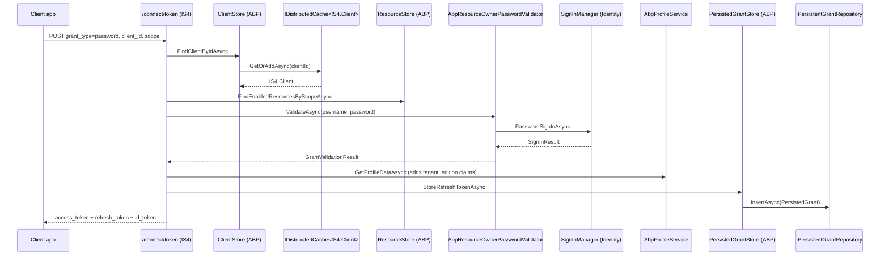

`Volo.Abp.IdentityServer.Domain` is where ABP turns the in-memory IdentityServer4 configuration model into a persisted, audited, repository-driven domain. The package declares six aggregate roots, the repository interfaces that retrieve them, ABP-flavoured implementations of the IS4 `IClientStore` / `IResourceStore` / `IPersistedGrantStore` / `IDeviceFlowStore` contracts, the ASP.NET-Identity-bridged `AbpProfileService` and `AbpResourceOwnerPasswordValidator`, the token cleanup background worker, and the `AbpIdentityServerDomainModule` that wires all of it into `services.AddIdentityServer(...)`.

This page walks each aggregate, the IS4 adapters, and the configuration knobs.

## File inventory

```
modules/identityserver/src/Volo.Abp.IdentityServer.Domain/Volo/Abp/IdentityServer/
├── AbpClaimsService.cs / AbpClaimsServiceOptions.cs   ← extends IS4 ClaimsService
├── AbpClientConfigurationValidator.cs
├── AbpCorsPolicyService.cs
├── AbpIdentityServerBuilderExtensions.cs              ← AddAbpIdentityServer()
├── AbpIdentityServerBuilderOptions.cs                 ← AddDeveloperSigningCredential, AddIdentityServerCookieAuth
├── AbpIdentityServerDbProperties.cs                   ← schema / prefix / connection-string name
├── AbpIdentityServerDomainModule.cs
├── AbpIdentityServerServiceCollectionExtensions.cs
├── AbpStrictRedirectUriValidator.cs                   ← wildcard subdomain support
├── AbpWildcardSubdomainCorsPolicyService.cs
├── AllowedCorsOriginsCacheItem*.cs                    ← cached origin list
├── AllowedSigningAlgorithmsConverter.cs
├── ApiResources/        ApiResource, ApiResourceClaim, …Property, …Scope, …Secret, IApiResourceRepository
├── ApiScopes/           ApiScope, ApiScopeClaim, ApiScopeProperty, IApiScopeRepository
├── AspNetIdentity/      AbpProfileService, AbpResourceOwnerPasswordValidator, AbpUserClaimsFactory, SignInResultExtensions
├── Clients/             Client, ClientClaim, ClientCorsOrigin, ClientGrantType, ClientIdPRestriction,
│                        ClientPostLogoutRedirectUri, ClientProperty, ClientRedirectUri,
│                        ClientScope, ClientSecret, ClientStore, IClientRepository
├── Devices/             DeviceFlowCodes, DeviceFlowStore, IDeviceFlowCodesRepository
├── Grants/              PersistedGrant, PersistedGrantStore, IPersistentGrantRepository
├── IdentityResources/   IdentityResource, IdentityResourceClaim, IdentityResourceProperty,
│                        IdentityResourceDataSeeder, IIdentityResourceDataSeeder, IIdentityResourceRepository
├── IdentityServerAutoMapperProfile.cs
├── IdentityServerBuilderExtensions.cs
├── IdentityServerCacheItemInvalidator.cs
├── Jwt/JwtTokenMiddleware.cs
├── ResourceStore.cs                                   ← combined IResourceStore
├── Secret.cs                                          ← shared base for ClientSecret / ApiResourceSecret
├── Temp/IdentityServerConfig.cs
├── Tokens/TokenCleanupBackgroundWorker.cs
├── Tokens/TokenCleanupOptions.cs
└── Tokens/TokenCleanupService.cs
```

## The six aggregates

All extend `FullAuditedAggregateRoot<Guid>` (except `PersistedGrant`, which is plain `AggregateRoot<Guid>`, and `DeviceFlowCodes`, which is `CreationAuditedAggregateRoot<Guid>`).

### Client

`Volo.Abp.IdentityServer.Clients.Client` is the heart of the module — a near 1-to-1 projection of IdentityServer4's `Client` model onto a persistable aggregate. It carries 40+ scalar properties and 9 child collections:

| Group | Properties |
| --- | --- |
| Identification | `ClientId`, `ClientName`, `Description`, `ClientUri`, `LogoUri`, `Enabled`, `ProtocolType` |
| Auth / consent | `RequireClientSecret`, `RequireConsent`, `AllowRememberConsent`, `AlwaysIncludeUserClaimsInIdToken`, `RequirePkce`, `AllowPlainTextPkce`, `RequireRequestObject`, `AllowAccessTokensViaBrowser`, `EnableLocalLogin` |
| Logout channels | `FrontChannelLogoutUri`, `FrontChannelLogoutSessionRequired`, `BackChannelLogoutUri`, `BackChannelLogoutSessionRequired` |
| Token lifetimes | `IdentityTokenLifetime` (300 s), `AccessTokenLifetime` (3 600 s), `AuthorizationCodeLifetime` (300 s), `AbsoluteRefreshTokenLifetime` (2 592 000 s), `SlidingRefreshTokenLifetime` (1 296 000 s), `ConsentLifetime`, `DeviceCodeLifetime` (300 s), `UserSsoLifetime` |
| Refresh-token | `RefreshTokenUsage`, `UpdateAccessTokenClaimsOnRefresh`, `RefreshTokenExpiration`, `AllowOfflineAccess` |
| Token shape | `AccessTokenType`, `IncludeJwtId`, `AllowedIdentityTokenSigningAlgorithms`, `ClientClaimsPrefix`, `AlwaysSendClientClaims`, `PairWiseSubjectSalt`, `UserCodeType` |
| Children | `AllowedScopes`, `ClientSecrets`, `AllowedGrantTypes`, `AllowedCorsOrigins`, `RedirectUris`, `PostLogoutRedirectUris`, `IdentityProviderRestrictions`, `Claims`, `Properties` |

The constructor seeds protocol-appropriate defaults:

```csharp
// Volo/Abp/IdentityServer/Clients/Client.cs
public Client(Guid id, [NotNull] string clientId) : base(id)
{
    Check.NotNull(clientId, nameof(clientId));
    ClientId = clientId;

    ProtocolType = IdentityServerConstants.ProtocolTypes.OpenIdConnect;
    RequireClientSecret = true;
    RequireConsent = false;
    AllowRememberConsent = true;
    RequirePkce = true;
    FrontChannelLogoutSessionRequired = true;
    BackChannelLogoutSessionRequired = true;
    IdentityTokenLifetime = 300;
    AccessTokenLifetime = 3600;
    AuthorizationCodeLifetime = 300;
    AbsoluteRefreshTokenLifetime = 2_592_000;
    SlidingRefreshTokenLifetime = 1_296_000;
    RefreshTokenUsage = (int)TokenUsage.OneTimeOnly;
    RefreshTokenExpiration = (int)TokenExpiration.Absolute;
    AccessTokenType = (int)IdentityServer4.Models.AccessTokenType.Jwt;
    EnableLocalLogin = true;
    ClientClaimsPrefix = "client_";

    AllowedScopes = new List<ClientScope>();
    ClientSecrets = new List<ClientSecret>();
    // …
}
```

The aggregate exposes mutation helpers — `AddGrantType`, `RemoveGrantType`, `FindGrantType`, `AddSecret`, `RemoveSecret`, `FindSecret`, `AddScope`, `AddCorsOrigin`, `AddRedirectUri`, `AddPostLogoutRedirectUri`, etc. — so callers do not have to touch the child collections directly. `AddSecret` defaults the secret type to `IdentityServerConstants.SecretTypes.SharedSecret`.

### ApiResource

Represents a resource server (group of related APIs). Scalars: `Name` (protected setter, required), `DisplayName`, `Description`, `Enabled`, `AllowedAccessTokenSigningAlgorithms`, `ShowInDiscoveryDocument`. Collections: `Secrets`, `Scopes`, `UserClaims`, `Properties`. The constructor auto-adds a scope of the same name as the resource — that's the IS4 convention for "resource defines its primary scope".

```csharp
public ApiResource(Guid id, [NotNull] string name, string displayName = null, string description = null)
    : base(id)
{
    Name = name;
    DisplayName = displayName;
    Description = description;
    Enabled = true;
    Secrets = new List<ApiResourceSecret>();
    Scopes = new List<ApiResourceScope>();
    UserClaims = new List<ApiResourceClaim>();
    Properties = new List<ApiResourceProperty>();
    Scopes.Add(new ApiResourceScope(id, name));   // ← auto-add scope
}
```

### ApiScope

A scope that a client can request (`read`, `write`, …). Scalars: `Name`, `DisplayName`, `Description`, `Enabled`, `Required`, `Emphasize`, `ShowInDiscoveryDocument`. Collections: `UserClaims`, `Properties`.

### IdentityResource

Identity scopes such as `openid`, `profile`, `email`, `phone`, `address`. Scalars match `ApiScope` plus `Required`. Has a copy-constructor from the IS4 `IdentityResource` model used by `IdentityResourceDataSeeder` to migrate default resources.

`IIdentityResourceDataSeeder` + `IdentityResourceDataSeeder` build the canonical OIDC identity scopes the first time the host runs.

### PersistedGrant

```csharp
public class PersistedGrant : AggregateRoot<Guid>
{
    public virtual string Key { get; set; }
    public virtual string Type { get; set; }
    public virtual string SubjectId { get; set; }
    public virtual string SessionId { get; set; }
    public virtual string ClientId { get; set; }
    public virtual string Description { get; set; }
    public virtual DateTime CreationTime { get; set; }
    public virtual DateTime? Expiration { get; set; }
    public virtual DateTime? ConsumedTime { get; set; }
    public virtual string Data { get; set; }
}
```

Stores refresh tokens, authorization codes, reference tokens, user consents — anything IS4 needs to remember between requests. The `Key` is the opaque IS4 lookup string, `Data` is the serialized payload.

### DeviceFlowCodes

```csharp
public class DeviceFlowCodes : CreationAuditedAggregateRoot<Guid>
{
    public virtual string DeviceCode { get; set; }
    public virtual string UserCode { get; set; }
    public virtual string SubjectId { get; set; }
    public virtual string SessionId { get; set; }
    public virtual string ClientId { get; set; }
    public virtual string Description { get; set; }
    public virtual DateTime? Expiration { get; set; }
    public virtual string Data { get; set; }
}
```

Backs the OAuth Device Authorization Grant. The `UserCode` is what the user types into a separate browser; `DeviceCode` is what the device polls with.

## Repository interfaces

Each aggregate has a `IXxxRepository : IBasicRepository<Xxx, Guid>` with lookup and paging helpers:

```csharp
public interface IClientRepository : IBasicRepository<Client, Guid>
{
    Task<Client> FindByClientIdAsync(string clientId, bool includeDetails = true, CancellationToken ct = default);
    Task<List<Client>> GetListAsync(string sorting, int skipCount, int maxResultCount,
        string filter = null, bool includeDetails = false, CancellationToken ct = default);
    Task<long> GetCountAsync(string filter = null, CancellationToken ct = default);
    Task<List<string>> GetAllDistinctAllowedCorsOriginsAsync(CancellationToken ct = default);
    Task<bool> CheckClientIdExistAsync(string clientId, Guid? expectedId = null, CancellationToken ct = default);
}
```

Sister interfaces follow the same pattern:

- `IApiResourceRepository` — `FindByNameAsync`, `FindByNamesAsync`, `GetListByScopesAsync`, paging
- `IApiScopeRepository` — `FindByNameAsync`, `GetListByNamesAsync`, paging
- `IIdentityResourceRepository` — `FindByNameAsync`, `GetListByScopeNameAsync`, paging, `CheckNameExistAsync`
- `IPersistentGrantRepository` — `FindByKeyAsync`, `GetListBySubjectIdAsync`, `RemoveByKeyAsync`, `DeleteExpirationAsync(DateTime)`
- `IDeviceFlowCodesRepository` — `FindByDeviceCodeAsync`, `FindByUserCodeAsync`, `DeleteExpirationAsync`

## ABP-flavoured IS4 stores

Each aggregate has a sibling **store** that implements an IS4 store interface and translates between the persisted aggregate and the in-memory IS4 model.

| ABP store | IS4 interface | Backing repo |
| --- | --- | --- |
| `ClientStore` | `IClientStore` | `IClientRepository` (mapped via AutoMapper, distributed-cached) |
| `ResourceStore` | `IResourceStore` | `IApiResourceRepository` + `IApiScopeRepository` + `IIdentityResourceRepository` |
| `PersistedGrantStore` | `IPersistedGrantStore` | `IPersistentGrantRepository` |
| `DeviceFlowStore` | `IDeviceFlowStore` | `IDeviceFlowCodesRepository` |

`ClientStore` adds a distributed cache layer, using `IdentityServerOptions.Caching.ClientStoreExpiration` as TTL:

```csharp
public class ClientStore : IClientStore
{
    protected IClientRepository ClientRepository { get; }
    protected IObjectMapper<AbpIdentityServerDomainModule> ObjectMapper { get; }
    protected IDistributedCache<IdentityServer4.Models.Client> Cache { get; }
    protected IdentityServerOptions Options { get; }

    public virtual async Task<IdentityServer4.Models.Client> FindClientByIdAsync(string clientId)
        => await GetCacheItemAsync(clientId);

    protected virtual async Task<IdentityServer4.Models.Client> GetCacheItemAsync(string clientId)
    {
        return await Cache.GetOrAddAsync(clientId, async () =>
        {
            var client = await ClientRepository.FindByClientIdAsync(clientId);
            return ObjectMapper.Map<Client, IdentityServer4.Models.Client>(client);
        },
        optionsFactory: () => new DistributedCacheEntryOptions
        {
            AbsoluteExpirationRelativeToNow = Options.Caching.ClientStoreExpiration
        },
        considerUow: true);
    }
}
```

`IdentityServerCacheItemInvalidator` subscribes to entity-changed events on `Client`, `ApiResource`, `ApiScope`, `IdentityResource` and removes the stale cache entries; `AllowedCorsOriginsCacheItemInvalidator` does the same for the CORS origins cache used by `AbpCorsPolicyService`.

## AspNetIdentity bridge

The `AspNetIdentity/` directory contains three glue services that let IS4 sign users in via `Volo.Abp.Identity.IdentityUser`:

- **`AbpProfileService`** — IS4 `IProfileService`. Adds ABP-specific claims (tenant ID, edition ID) on top of the user's stored claims.
- **`AbpResourceOwnerPasswordValidator`** — IS4 `IResourceOwnerPasswordValidator` for the password grant. Wraps `SignInManager.PasswordSignInAsync`, branches on the result, and writes a security log entry using `IdentityServerSecurityLogActionConsts.LoginSucceeded / LoginFailed / LoginLockedout / LoginNotAllowed / LoginRequiresTwoFactor / LoginInvalidUserName / LoginInvalidUserNameOrPassword`.
- **`AbpUserClaimsFactory`** — replaces the default identity user-claims factory to honour `AbpClaimsServiceOptions.RequestedClaims`.

`AbpClaimsServiceOptions.RequestedClaims` is configured in `AbpIdentityServerDomainModule.ConfigureServices` to always include `AbpClaimTypes.TenantId` and `AbpClaimTypes.EditionId`:

```csharp
Configure<AbpClaimsServiceOptions>(options =>
{
    options.RequestedClaims.AddRange(new[] {
        AbpClaimTypes.TenantId,
        AbpClaimTypes.EditionId
    });
});
```

## Wildcard-subdomain redirect & CORS

`AbpStrictRedirectUriValidator` and `AbpWildcardSubdomainCorsPolicyService` extend the IS4 defaults so a single `Client` row can authorise `https://*.example.com` patterns. The CORS service caches the distinct origin list with `AllowedCorsOriginsCacheItem` and invalidates it on `Client` write.

## Token-request flow



## Module wiring

`AbpIdentityServerDomainModule.ConfigureServices` calls `AddIdentityServer(...)` which performs the full IS4 builder pipeline:

```csharp
private static IIdentityServerBuilder AddIdentityServer(
    IServiceCollection services,
    AbpIdentityServerBuilderOptions opts)
{
    services.Configure<IdentityServerOptions>(o =>
    {
        o.Events.RaiseErrorEvents = true;
        o.Events.RaiseInformationEvents = true;
        o.Events.RaiseFailureEvents = true;
        o.Events.RaiseSuccessEvents = true;
    });

    var builder = services.AddIdentityServerBuilder()
        .AddRequiredPlatformServices()
        .AddCoreServices()
        .AddDefaultEndpoints()
        .AddPluggableServices()
        .AddValidators()
        .AddResponseGenerators()
        .AddDefaultSecretParsers()
        .AddDefaultSecretValidators();

    if (opts.AddIdentityServerCookieAuthentication)
        builder.AddCookieAuthentication();

    builder.AddInMemoryPersistedGrants();   // default — replaced by EF/Mongo store later
    return builder;
}
```

After that, `builder.AddAbpIdentityServer(builderOptions)` registers the ABP stores (`ClientStore`, `ResourceStore`, `DeviceFlowStore`, `PersistedGrantStore`) and the ASP.NET-Identity bridge. The chain ends with conditional fallbacks:

```csharp
if (!services.IsAdded<IPersistedGrantService>())
    services.TryAddSingleton<IPersistedGrantStore, InMemoryPersistedGrantStore>();

if (!services.IsAdded<IDeviceFlowStore>())
    services.TryAddSingleton<IDeviceFlowStore, InMemoryDeviceFlowStore>();

if (!services.IsAdded<IClientStore>())
    builder.AddInMemoryClients(configuration.GetSection("IdentityServer:Clients"));

if (!services.IsAdded<IResourceStore>())
{
    builder.AddInMemoryApiResources(configuration.GetSection("IdentityServer:ApiResources"));
    builder.AddInMemoryIdentityResources(configuration.GetSection("IdentityServer:IdentityResources"));
}
```

This means **if you don't include `Volo.Abp.IdentityServer.EntityFrameworkCore` or `…MongoDB`, you silently fall back to in-memory** — useful for tests, deadly in production.

## Builder options

```csharp
public class AbpIdentityServerBuilderOptions
{
    public bool AddDeveloperSigningCredential { get; set; } = true;
    public bool AddIdentityServerCookieAuthentication { get; set; } = true;
    public bool UpdateJwtSecurityTokenHandlerDefaultInboundClaimTypeMap { get; set; } = true;
}
```

Turn off `AddDeveloperSigningCredential` in production and supply a real signing certificate via `services.AddIdentityServer().AddSigningCredential(...)` in your host module.

## Token cleanup

```csharp
public class TokenCleanupService : ITransientDependency
{
    protected IPersistentGrantRepository PersistentGrantRepository { get; }
    protected IDeviceFlowCodesRepository DeviceFlowCodesRepository { get; }
    protected TokenCleanupOptions Options { get; }

    [UnitOfWork]
    public virtual async Task CleanAsync()
    {
        await RemoveGrantsAsync();
        await RemoveDeviceCodesAsync();
    }

    protected virtual async Task RemoveGrantsAsync()
        => await PersistentGrantRepository.DeleteExpirationAsync(DateTime.UtcNow);

    protected virtual async Task RemoveDeviceCodesAsync()
        => await DeviceFlowCodesRepository.DeleteExpirationAsync(DateTime.UtcNow);
}
```

`TokenCleanupBackgroundWorker` is an `AsyncPeriodicBackgroundWorkerBase` that runs every `TokenCleanupOptions.CleanupPeriod` (default 1 h). Registered by `OnApplicationInitializationAsync` when `IsCleanupEnabled` is true (default).

## AutoMapper profile

`IdentityServerAutoMapperProfile` declares the bidirectional maps between every persisted aggregate and its IS4 model counterpart. Look there if a field round-trips wrong — for example, `AllowedSigningAlgorithms` round-trips through `AllowedSigningAlgorithmsConverter` because IS4 wants `List<string>` and the persisted form is a single delimited string.

## Gotchas

- **In-memory fallback is the trap.** Without the EF Core or Mongo package included you'll silently get in-memory stores — refresh tokens will vanish on app restart.
- **`PersistedGrant` is `AggregateRoot<Guid>`, not `FullAuditedAggregateRoot`.** It has its own `CreationTime` instead of `CreationTime/CreatorId` audit pair, because IS4 already manages timestamps semantically.
- **`Client.RequirePkce = true` by default.** Public clients (SPA, mobile) get PKCE automatically; legacy confidential clients that don't speak PKCE must explicitly set it to `false`.
- **`AddSecret` stores plain text.** IS4 hashes during validation; the value you pass should be the plain (or pre-hashed-by-you) secret per IS4's `Secret.Value` contract.
- **Dev signing credential.** `AddDeveloperSigningCredential` writes `tempkey.jwk` to the project directory and reuses it — fine for dev, never use in production.

## Cross-links

- Persistence: [`identityserver-efcore`](/modules/authservers/identityserver-efcore), [`identityserver-mongodb`](/modules/authservers/identityserver-mongodb)
- Application surface that exposes these aggregates over HTTP (Pro): [`identityserver-application`](/modules/authservers/identityserver-application)
- Domain.Shared contracts these use: [`identityserver-domain-shared`](/modules/authservers/identityserver-domain-shared)
- Outbound JWT bearer validation in resource APIs: [`framework/auth/jwt-bearer`](/framework/auth/jwt-bearer)
- Identity store the bridge authenticates against: [`modules/identity/domain`](/modules/identity/domain)
