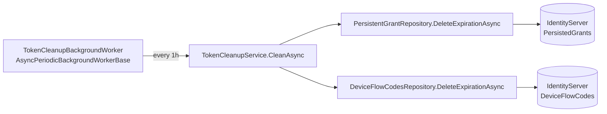

`Volo.Abp.IdentityServer.EntityFrameworkCore` is the SQL-side persistence pack for the IdentityServer4 module. It contributes a single `IdentityServerDbContext`, a model-creating extension that maps all sixteen tables, six repository implementations for `IClientRepository / IApiResourceRepository / IApiScopeRepository / IIdentityResourceRepository / IPersistentGrantRepository / IDeviceFlowCodesRepository`, and a small ABP module that wires `IIdentityServerBuilder.AddAbpStores()` and registers the repositories with conventional dependency injection.

This page walks the DbContext, the table topology, the per-provider quirks baked into `ConfigureIdentityServer()`, the repository patterns, and the typical hosting wire-up.

## File inventory

```
modules/identityserver/src/Volo.Abp.IdentityServer.EntityFrameworkCore/
└── Volo/Abp/IdentityServer/
    ├── AbpIdentityServerEfCoreQueryableExtensions.cs
    ├── ApiResources/ApiResourceRepository.cs
    ├── ApiScopes/ApiScopeRepository.cs
    ├── Clients/ClientRepository.cs
    ├── Devices/DeviceFlowCodesRepository.cs
    ├── EntityFrameworkCore/
    │   ├── AbpIdentityServerEntityFrameworkCoreModule.cs
    │   ├── IdentityServerDbContext.cs
    │   ├── IIdentityServerDbContext.cs
    │   └── IdentityServerDbContextModelCreatingExtensions.cs
    ├── Grants/PersistentGrantRepository.cs
    └── IdentityResources/IdentityResourceRepository.cs
```

## The DbContext

`IdentityServerDbContext` is marked `[IgnoreMultiTenancy]` and uses the connection-string name `AbpIdentityServer` (see `AbpIdentityServerDbProperties.ConnectionStringName`). The schema and the table prefix default to:

```csharp
public static class AbpIdentityServerDbProperties
{
    public static string DbTablePrefix { get; set; } = "IdentityServer";
    public static string DbSchema { get; set; } = AbpCommonDbProperties.DbSchema;   // null by default
    public const string ConnectionStringName = "AbpIdentityServer";
}
```

The context declares 16 `DbSet`s:

```csharp
[IgnoreMultiTenancy]
[ConnectionStringName(AbpIdentityServerDbProperties.ConnectionStringName)]
public class IdentityServerDbContext : AbpDbContext<IdentityServerDbContext>, IIdentityServerDbContext
{
    // ApiResource family
    public DbSet<ApiResource>         ApiResources         { get; set; }
    public DbSet<ApiResourceSecret>   ApiResourceSecrets   { get; set; }
    public DbSet<ApiResourceClaim>    ApiResourceClaims    { get; set; }
    public DbSet<ApiResourceScope>    ApiResourceScopes    { get; set; }
    public DbSet<ApiResourceProperty> ApiResourceProperties{ get; set; }

    // ApiScope family
    public DbSet<ApiScope>         ApiScopes        { get; set; }
    public DbSet<ApiScopeClaim>    ApiScopeClaims   { get; set; }
    public DbSet<ApiScopeProperty> ApiScopeProperties { get; set; }

    // IdentityResource family
    public DbSet<IdentityResource>         IdentityResources         { get; set; }
    public DbSet<IdentityResourceClaim>    IdentityClaims            { get; set; }
    public DbSet<IdentityResourceProperty> IdentityResourceProperties{ get; set; }

    // Client family
    public DbSet<Client>                     Clients                       { get; set; }
    public DbSet<ClientGrantType>            ClientGrantTypes              { get; set; }
    public DbSet<ClientRedirectUri>          ClientRedirectUris            { get; set; }
    public DbSet<ClientPostLogoutRedirectUri>ClientPostLogoutRedirectUris  { get; set; }
    public DbSet<ClientScope>                ClientScopes                  { get; set; }
    public DbSet<ClientSecret>               ClientSecrets                 { get; set; }
    public DbSet<ClientClaim>                ClientClaims                  { get; set; }
    public DbSet<ClientIdPRestriction>       ClientIdPRestrictions         { get; set; }
    public DbSet<ClientCorsOrigin>           ClientCorsOrigins             { get; set; }
    public DbSet<ClientProperty>             ClientProperties              { get; set; }

    public DbSet<PersistedGrant>   PersistedGrants  { get; set; }
    public DbSet<DeviceFlowCodes>  DeviceFlowCodes  { get; set; }

    protected override void OnModelCreating(ModelBuilder builder)
    {
        base.OnModelCreating(builder);
        builder.ConfigureIdentityServer();
    }
}
```

> **Why `[IgnoreMultiTenancy]`?** Auth-server tables hold tenant-cross-cutting configuration (the client registry serves *all* tenants in a multi-tenant deployment). Even with a tenant-only database strategy, the model-creating extension short-circuits via `if (builder.IsTenantOnlyDatabase()) return;`.

## Table topology

Every table is prefixed with `IdentityServer` (e.g. `IdentityServerClients`, `IdentityServerApiResources`). The mapping is:

| Aggregate | Parent table | Child tables |
| --- | --- | --- |
| `Client` | `IdentityServerClients` | `…ClientGrantTypes`, `…ClientRedirectUris`, `…ClientPostLogoutRedirectUris`, `…ClientScopes`, `…ClientSecrets`, `…ClientClaims`, `…ClientIdPRestrictions`, `…ClientCorsOrigins`, `…ClientProperties` |
| `ApiResource` | `IdentityServerApiResources` | `…ApiResourceSecrets`, `…ApiResourceClaims`, `…ApiResourceScopes`, `…ApiResourceProperties` |
| `ApiScope` | `IdentityServerApiScopes` | `…ApiScopeClaims`, `…ApiScopeProperties` |
| `IdentityResource` | `IdentityServerIdentityResources` | `…IdentityResourceClaims`, `…IdentityResourceProperties` |
| `PersistedGrant` | `IdentityServerPersistedGrants` | — |
| `DeviceFlowCodes` | `IdentityServerDeviceFlowCodes` | — |

Child tables use **composite keys** built from the parent FK plus the discriminating value — there is no surrogate `Id` on `ClientGrantType`, `ClientRedirectUri`, etc. For example:

```csharp
builder.Entity<ClientGrantType>(b =>
{
    b.HasKey(x => new { x.ClientId, x.GrantType });
    b.Property(x => x.GrantType).HasMaxLength(ClientGrantTypeConsts.GrantTypeMaxLength).IsRequired();
});

builder.Entity<ClientSecret>(b =>
{
    b.HasKey(x => new { x.ClientId, x.Type, x.Value });
});

builder.Entity<ClientScope>(b =>
{
    b.HasKey(x => new { x.ClientId, x.Scope });
});
```

## Provider-specific quirks

`ConfigureIdentityServer()` switches behaviour on `IsDatabaseProvider(...)` because column-length limits differ wildly between SQL dialects. From the actual source:

```csharp
if (IsDatabaseProvider(builder, EfCoreDatabaseProvider.MySql))
{
    ClientRedirectUriConsts.RedirectUriMaxLengthValue = 300;
}
b.Property(x => x.RedirectUri).HasMaxLength(ClientRedirectUriConsts.RedirectUriMaxLengthValue);

// …

if (IsDatabaseProvider(builder, EfCoreDatabaseProvider.MySql))
{
    ClientPostLogoutRedirectUriConsts.PostLogoutRedirectUriMaxLengthValue = 300;
}

// …

if (IsDatabaseProvider(builder, EfCoreDatabaseProvider.MySql, EfCoreDatabaseProvider.Oracle))
{
    ClientSecretConsts.ValueMaxLength = 300;
}

if (IsDatabaseProvider(builder, EfCoreDatabaseProvider.MySql))
{
    ClientPropertyConsts.ValueMaxLength = 300;
}

if (IsDatabaseProvider(builder, EfCoreDatabaseProvider.MySql, EfCoreDatabaseProvider.Oracle))
{
    IdentityResourcePropertyConsts.ValueMaxLength = 300;
}
```

The pattern: when a SQL Server column would naturally be 2 000 chars (because it's an indexed key on a composite PK), MySQL's 767-byte index limit forces a cap of 300 chars. Oracle similarly caps secret/property values. **These mutations happen during model creation** — so if you reuse the same column-length consts elsewhere, read them *after* `Configure...` has run.

## Object-extension mappings

Every entity ends its block with `b.ApplyObjectExtensionMappings()` — this is the seam that turns the `ExtraProperties` dictionary into a `nvarchar(max)` JSON column. It honours the registry under `IdentityServerModuleExtensionConsts.EntityNames.Client / ApiResource / ApiScope / IdentityResource` (see [`identityserver-domain-shared`](/modules/authservers/identityserver-domain-shared)).

## The module class

```csharp
[DependsOn(
    typeof(AbpIdentityServerDomainModule),
    typeof(AbpEntityFrameworkCoreModule)
)]
public class AbpIdentityServerEntityFrameworkCoreModule : AbpModule
{
    public override void PreConfigureServices(ServiceConfigurationContext context)
    {
        context.Services.PreConfigure<IIdentityServerBuilder>(builder =>
        {
            builder.AddAbpStores();
        });
    }

    public override void ConfigureServices(ServiceConfigurationContext context)
    {
        context.Services.AddAbpDbContext<IdentityServerDbContext>(options =>
        {
            options.AddDefaultRepositories<IIdentityServerDbContext>();

            options.AddRepository<Client,            ClientRepository>();
            options.AddRepository<ApiResource,       ApiResourceRepository>();
            options.AddRepository<ApiScope,          ApiScopeRepository>();
            options.AddRepository<IdentityResource,  IdentityResourceRepository>();
            options.AddRepository<PersistedGrant,    PersistentGrantRepository>();
            options.AddRepository<DeviceFlowCodes,   DeviceFlowCodesRepository>();
        });
    }
}
```

`PreConfigureServices` is the trick: it queues `builder.AddAbpStores()` on the `IIdentityServerBuilder` *before* the Domain module materialises the builder in its own `ConfigureServices`. That means the in-memory fallbacks documented in [`identityserver-domain`](/modules/authservers/identityserver-domain) won't engage when EF Core is present — the persisted stores win.

## Repository implementations

The six repositories inherit `EfCoreRepository<IIdentityServerDbContext, TEntity, Guid>`. `ClientRepository.FindByClientIdAsync` is the hot path:

```csharp
public virtual async Task<Client> FindByClientIdAsync(
    string clientId, bool includeDetails = true, CancellationToken ct = default)
{
    return await (await GetDbSetAsync())
        .IncludeDetails(includeDetails)
        .OrderBy(x => x.Id)
        .FirstOrDefaultAsync(x => x.ClientId == clientId, GetCancellationToken(ct));
}
```

`IncludeDetails` lives in `AbpIdentityServerEfCoreQueryableExtensions` and fans out all nine `Include(...)` calls for the child collections — `AllowedScopes`, `AllowedGrantTypes`, `RedirectUris`, `PostLogoutRedirectUris`, `IdentityProviderRestrictions`, `Claims`, `ClientSecrets`, `Properties`, `AllowedCorsOrigins`.

`PersistentGrantRepository` is special — it lacks a single natural key. Lookups by `(SubjectId, SessionId, ClientId, Type)` are a common pattern, so a `FilterAsync` helper builds the WHERE clause once:

```csharp
public virtual async Task<List<PersistedGrant>> GetListAsync(
    string subjectId, string sessionId, string clientId, string type,
    bool includeDetails = false, CancellationToken ct = default)
    => await (await FilterAsync(subjectId, sessionId, clientId, type))
        .ToListAsync(GetCancellationToken(ct));

public virtual async Task<PersistedGrant> FindByKeyAsync(string key, CancellationToken ct = default)
    => await (await GetDbSetAsync())
        .OrderBy(x => x.Id)
        .FirstOrDefaultAsync(x => x.Key == key, GetCancellationToken(ct));
```

Cleanup follows the same shape:

```csharp
public virtual async Task DeleteExpirationAsync(DateTime maxExpirationDate, CancellationToken ct = default)
{
    var dbSet = await GetDbSetAsync();
    var oldGrants = await dbSet.Where(x => x.Expiration < maxExpirationDate)
                               .ToListAsync(GetCancellationToken(ct));
    await DeleteManyAsync(oldGrants, autoSave: true, cancellationToken: ct);
}
```

`TokenCleanupBackgroundWorker` calls this on a 1-hour loop (`TokenCleanupOptions.CleanupPeriod = 3_600_000`).

## Host wire-up

A typical host module:

```csharp
[DependsOn(
    typeof(AbpIdentityServerEntityFrameworkCoreModule),
    // …
)]
public class MyAuthServerEntityFrameworkCoreModule : AbpModule
{
    public override void ConfigureServices(ServiceConfigurationContext context)
    {
        Configure<AbpDbContextOptions>(options =>
        {
            options.UseSqlServer();    // or UseMySQL / UseOracle / UsePostgreSql
        });
    }
}
```

Migrations: the host DbContext (commonly `*MigrationsDbContext`) declares the same `DbSet`s and calls `builder.ConfigureIdentityServer()` in `OnModelCreating`, so the generated migration includes all 16 IdentityServer tables alongside Identity and the rest of your model.

## Token cleanup integration



`AbpIdentityServerDomainModule.OnApplicationInitializationAsync` registers the worker only if `TokenCleanupOptions.IsCleanupEnabled` (default `true`). When the host disables `AbpBackgroundWorkerOptions.IsEnabled` globally, the worker is silently skipped.

## Connection string

`AbpDbContext` reads the connection string from `ConnectionStrings:AbpIdentityServer` in configuration; if absent, it falls back to `ConnectionStrings:Default`. To split IdentityServer4 tables into their own database, set:

```json
{
  "ConnectionStrings": {
    "Default":            "Server=…;Database=AppMain;…",
    "AbpIdentityServer":  "Server=…;Database=AppAuth;…"
  }
}
```

## Gotchas

- **Don't forget `builder.ConfigureIdentityServer()` in your migrations DbContext.** Missing it will compile and run, but `dotnet ef migrations add` will produce a migration with no IdentityServer tables.
- **MySQL key-length cap.** If you migrate from SQL Server to MySQL, the redirect-URI columns will silently truncate at 300 chars — verify no real registered URI exceeds 300 chars before flipping providers.
- **`ApplyObjectExtensionMappings()` is per-entity.** If you extend an aggregate via the registry but forget to run migrations, the `ExtraProperties` JSON column simply won't exist and EF will throw at write time.
- **Composite keys block tracking duplicates.** `ClientSecret` is keyed by `(ClientId, Type, Value)` — adding two secrets with the same value and type to the same client will throw on save. Pre-validate in the app service.
- **The DbContext is `[IgnoreMultiTenancy]`.** The data filter doesn't engage, so anyone with database read can see all clients — protect that connection string.

## Cross-links

- Aggregates being persisted: [`identityserver-domain`](/modules/authservers/identityserver-domain)
- Column-length consts the model uses: [`identityserver-domain-shared`](/modules/authservers/identityserver-domain-shared)
- The MongoDB alternative: [`identityserver-mongodb`](/modules/authservers/identityserver-mongodb)
- ABP EF Core conventions: [`framework/persistence`](/framework/persistence)
