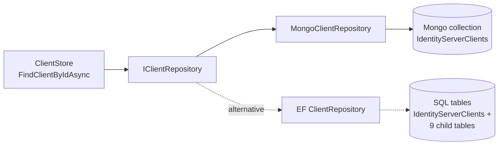

`Volo.Abp.IdentityServer.MongoDB` is the parallel persistence pack to [`Volo.Abp.IdentityServer.EntityFrameworkCore`](/modules/authservers/identityserver-efcore) — same six repository interfaces, same `IIdentityServerBuilder.AddAbpStores()` plumbing, but backed by Mongo collections instead of EF Core tables. Because Mongo stores aggregates as nested documents, the schema is dramatically simpler: six collections, no joins, no composite keys, no `Include` semantics.

This page walks the Mongo DbContext, the collection naming, the repository patterns including the typical paging-via-`IMongoQueryable` shape, and the wire-up.

## File inventory

```
modules/identityserver/src/Volo.Abp.IdentityServer.MongoDB/
└── Volo/Abp/IdentityServer/MongoDB/
    ├── AbpIdentityServerMongoDbContext.cs
    ├── AbpIdentityServerMongoDbContextExtensions.cs
    ├── AbpIdentityServerMongoDbModule.cs
    ├── IAbpIdentityServerMongoDbContext.cs
    ├── MongoApiResourceRepository.cs
    ├── MongoApiScopeRepository.cs
    ├── MongoClientRepository.cs
    ├── MongoDeviceFlowCodesRepository.cs
    ├── MongoIdentityResourceRepository.cs
    └── MongoPersistentGrantRepository.cs
```

## The Mongo DbContext

`AbpIdentityServerMongoDbContext` is marked `[IgnoreMultiTenancy]` and uses the same `AbpIdentityServer` connection-string name as the EF Core flavour:

```csharp
[IgnoreMultiTenancy]
[ConnectionStringName(AbpIdentityServerDbProperties.ConnectionStringName)]
public class AbpIdentityServerMongoDbContext : AbpMongoDbContext, IAbpIdentityServerMongoDbContext
{
    public IMongoCollection<ApiResource>      ApiResources      => Collection<ApiResource>();
    public IMongoCollection<ApiScope>         ApiScopes         => Collection<ApiScope>();
    public IMongoCollection<Client>           Clients           => Collection<Client>();
    public IMongoCollection<IdentityResource> IdentityResources => Collection<IdentityResource>();
    public IMongoCollection<PersistedGrant>   PersistedGrants   => Collection<PersistedGrant>();
    public IMongoCollection<DeviceFlowCodes>  DeviceFlowCodes   => Collection<DeviceFlowCodes>();

    protected override void CreateModel(IMongoModelBuilder modelBuilder)
    {
        base.CreateModel(modelBuilder);
        modelBuilder.ConfigureIdentityServer();
    }
}
```

Six collections — one per aggregate. The Mongo storage strategy is **document-per-aggregate**, so each `Client` document carries its `AllowedScopes`, `AllowedGrantTypes`, `ClientSecrets`, `RedirectUris`, etc. as embedded arrays. There are no foreign-key collections for `ClientGrantType`, `ClientRedirectUri`, … the way EF Core has — those C# types still exist as nested classes, but they live inside the parent document.

## Collection naming

`AbpIdentityServerMongoDbContextExtensions.ConfigureIdentityServer` assigns the collection names:

```csharp
public static void ConfigureIdentityServer(this IMongoModelBuilder builder)
{
    builder.Entity<ApiResource>(b      => b.CollectionName = "IdentityServerApiResources");
    builder.Entity<ApiScope>(b         => b.CollectionName = "IdentityServerApiScopes");
    builder.Entity<IdentityResource>(b => b.CollectionName = "IdentityServerIdentityResources");
    builder.Entity<Client>(b           => b.CollectionName = "IdentityServerClients");
    builder.Entity<PersistedGrant>(b   => b.CollectionName = "IdentityServerPersistedGrants");
    builder.Entity<DeviceFlowCodes>(b  => b.CollectionName = "IdentityServerDeviceFlowCodes");
}
```

The `IdentityServer` prefix is taken from `AbpIdentityServerDbProperties.DbTablePrefix` — the same value the EF Core mapping uses for SQL table names, so collection names line up across the two persistence stacks.

## The module class

```csharp
[DependsOn(
    typeof(AbpIdentityServerDomainModule),
    typeof(AbpMongoDbModule)
)]
public class AbpIdentityServerMongoDbModule : AbpModule
{
    public override void PreConfigureServices(ServiceConfigurationContext context)
    {
        context.Services.PreConfigure<IIdentityServerBuilder>(builder =>
        {
            builder.AddAbpStores();
        });
    }

    public override void ConfigureServices(ServiceConfigurationContext context)
    {
        context.Services.AddMongoDbContext<AbpIdentityServerMongoDbContext>(options =>
        {
            options.AddRepository<ApiResource,       MongoApiResourceRepository>();
            options.AddRepository<ApiScope,          MongoApiScopeRepository>();
            options.AddRepository<IdentityResource,  MongoIdentityResourceRepository>();
            options.AddRepository<Client,            MongoClientRepository>();
            options.AddRepository<PersistedGrant,    MongoPersistentGrantRepository>();
            options.AddRepository<DeviceFlowCodes,   MongoDeviceFlowCodesRepository>();
        });
    }
}
```

The shape mirrors the EF Core module exactly: `PreConfigureServices` queues `AddAbpStores()` on the `IIdentityServerBuilder` so the in-memory fallbacks documented in [`identityserver-domain`](/modules/authservers/identityserver-domain) don't engage; `ConfigureServices` registers the Mongo context plus the six custom repositories.

## Repository pattern

All repositories inherit `MongoDbRepository<IAbpIdentityServerMongoDbContext, TEntity, Guid>` and use `IMongoQueryable<T>` for paging-and-filter queries.

```csharp
public class MongoClientRepository
    : MongoDbRepository<IAbpIdentityServerMongoDbContext, Client, Guid>, IClientRepository
{
    public virtual async Task<Client> FindByClientIdAsync(
        string clientId, bool includeDetails = true, CancellationToken ct = default)
    {
        return await (await GetMongoQueryableAsync(ct))
            .OrderBy(x => x.Id)
            .FirstOrDefaultAsync(x => x.ClientId == clientId, GetCancellationToken(ct));
    }

    public virtual async Task<List<Client>> GetListAsync(
        string sorting, int skipCount, int maxResultCount,
        string filter = null, bool includeDetails = false, CancellationToken ct = default)
    {
        return await (await GetMongoQueryableAsync(ct))
            .WhereIf(!filter.IsNullOrWhiteSpace(), x => x.ClientId.Contains(filter))
            .OrderBy(sorting.IsNullOrWhiteSpace() ? nameof(Client.ClientName) : sorting)
            .As<IMongoQueryable<Client>>()
            .PageBy<Client, IMongoQueryable<Client>>(skipCount, maxResultCount)
            .ToListAsync(GetCancellationToken(ct));
    }

    public virtual async Task<long> GetCountAsync(string filter = null, CancellationToken ct = default)
    {
        return await (await GetMongoQueryableAsync(ct))
            .WhereIf<Client, IMongoQueryable<Client>>(!filter.IsNullOrWhiteSpace(),
                x => x.ClientId.Contains(filter))
            .LongCountAsync(GetCancellationToken(ct));
    }

    public virtual async Task<List<string>> GetAllDistinctAllowedCorsOriginsAsync(
        CancellationToken ct = default)
    {
        return await (await GetMongoQueryableAsync(ct))
            .SelectMany(x => x.AllowedCorsOrigins)
            .Select(y => y.Origin)
            .Distinct()
            .ToListAsync(GetCancellationToken(ct));
    }

    public virtual async Task<bool> CheckClientIdExistAsync(
        string clientId, Guid? expectedId = null, CancellationToken ct = default)
    {
        return await (await GetMongoQueryableAsync(ct))
            .AnyAsync(c => c.Id != expectedId && c.ClientId == clientId,
                      GetCancellationToken(ct));
    }
}
```

Three things to notice:

1. **`includeDetails` is a no-op.** In EF Core it controls eager loading; in Mongo the embedded document is already in the result, so the flag is honoured but doesn't change behaviour.
2. **`SelectMany` flattens embedded arrays.** `GetAllDistinctAllowedCorsOriginsAsync` works because `AllowedCorsOrigins` is a nested document array on the parent — the equivalent EF Core query joins a separate table.
3. **`IMongoQueryable.PageBy<TEntity, TQuery>(skip, max)`** is the ABP extension that translates to `$skip` + `$limit` BSON stages.

`MongoPersistentGrantRepository` follows the same shape for cleanup:

```csharp
public virtual async Task DeleteExpirationAsync(DateTime maxExpirationDate, CancellationToken ct = default)
{
    await DeleteDirectAsync(
        x => x.Expiration != null && x.Expiration < maxExpirationDate,
        cancellationToken: ct);
}
```

`DeleteDirectAsync` issues a `DeleteMany` BSON operation rather than loading each grant — important for the token-cleanup background worker, which can prune thousands of expired tokens per cycle.

## Token-request flow vs EF Core

The protocol-side flow is identical between the two persistence stacks; the only difference is which concrete repository is bound:



The aggregate root `Client` is identical in both worlds — same scalar properties, same child collections. Mongo just persists those child collections as embedded documents inside the parent.

## Host wire-up

```csharp
[DependsOn(
    typeof(AbpIdentityServerMongoDbModule),
    // …
)]
public class MyAuthServerMongoDbModule : AbpModule
{
    public override void ConfigureServices(ServiceConfigurationContext context)
    {
        Configure<AbpMongoDbContextOptions>(options =>
        {
            options.Configure<AbpIdentityServerMongoDbContext>(opt =>
            {
                opt.CollectionPrefix = "Auth_";  // optional — prefixes IdentityServer* collection names
            });
        });
    }
}
```

Connection string under `ConnectionStrings:AbpIdentityServer` (falls back to `Default`):

```json
{
  "ConnectionStrings": {
    "Default":            "mongodb://localhost:27017/AppMain",
    "AbpIdentityServer":  "mongodb://localhost:27017/AppAuth"
  }
}
```

## Token cleanup

`TokenCleanupBackgroundWorker` calls `TokenCleanupService.CleanAsync()` which invokes the two repository `DeleteExpirationAsync` methods on a 1-hour loop. Mongo's `DeleteDirectAsync` shape is more efficient than EF Core's load-then-delete loop, but the contract is the same.

## Gotchas

- **No composite keys.** A Mongo document with two `ClientSecret` sub-documents that have the same `(Type, Value)` will silently persist both. The EF Core layer would have thrown on the composite PK; you must enforce uniqueness in the app service or via a Mongo unique-index on the nested path if you care.
- **`includeDetails` is misleading.** Don't write callers that hinge on the flag — Mongo always returns the whole document.
- **No `Migrations` DbContext.** Mongo is schemaless, so there is no parallel to the EF migrations DbContext. The first write creates the collection; the model-creating extension only assigns names and (optionally) indexes.
- **Collection-prefix collision.** If you set `CollectionPrefix = "Auth_"`, the collection name becomes `Auth_IdentityServerClients`, not `Auth_Clients`. The `IdentityServer` prefix lives inside `DbTablePrefix` and is independent.
- **`IMongoQueryable` chain order matters.** `WhereIf → OrderBy → As<IMongoQueryable<T>> → PageBy` is the canonical order. Calling `PageBy` before `OrderBy` produces nondeterministic pages.

## Cross-links

- The aggregates persisted here: [`identityserver-domain`](/modules/authservers/identityserver-domain)
- The SQL alternative: [`identityserver-efcore`](/modules/authservers/identityserver-efcore)
- ABP MongoDB conventions: [`framework/persistence`](/framework/persistence)
- Distributed-cache invalidation via ETOs: [`identityserver-domain-shared`](/modules/authservers/identityserver-domain-shared)
