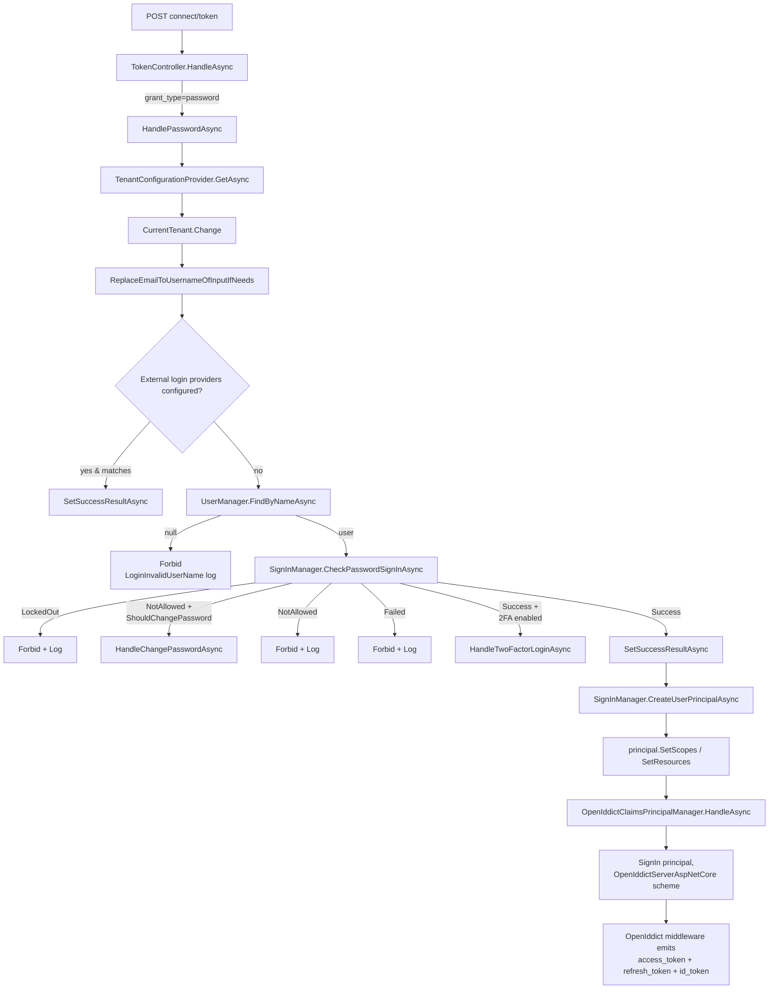

`Volo.Abp.OpenIddict.AspNetCore` is the package that turns the [OpenIddict Domain](/modules/authservers/openiddict-domain) into a working OAuth 2.0 / OpenID Connect server. It contributes four MVC controllers (`AuthorizeController`, `TokenController`, `LogoutController`, `UserInfoController`), the claims-principal pipeline (`AbpOpenIddictClaimsPrincipalManager` + `IAbpOpenIddictClaimsPrincipalHandler`), the extension-grant registry, wildcard-domain validators, and the `AddOpenIddict().AddServer(...)` configuration block.

This page walks the module wiring, each endpoint, the claims-principal flow, and the customisation points.

## File inventory

```
modules/openiddict/src/Volo.Abp.OpenIddict.AspNetCore/
└── Volo/Abp/OpenIddict/
    ├── AbpOpenIddictAspNetCoreModule.cs        ← AddOpenIddict().AddServer(...) pipeline
    ├── AbpOpenIddictHttpContextExtensions.cs
    ├── AbpOpenIddictOptions.cs                 ← UpdateAbpClaimTypes, AddDevelopmentEncryptionAndSigningCertificate
    ├── AbpOpenIddictRequestHelper.cs
    ├── AbpSignInResultExtensions.cs            ← maps SignInResult → security-log action
    ├── Claims/
    │   ├── AbpDefaultOpenIddictClaimsPrincipalHandler.cs
    │   ├── AbpOpenIddictClaimsPrincipalHandlerContext.cs
    │   ├── AbpOpenIddictClaimsPrincipalManager.cs
    │   ├── AbpOpenIddictClaimsPrincipalOptions.cs
    │   └── IAbpOpenIddictClaimsPrincipalHandler.cs
    ├── Controllers/
    │   ├── AbpOpenIdDictControllerBase.cs
    │   ├── AuthorizeController.cs              ← /connect/authorize
    │   ├── LogoutController.cs                 ← /connect/logout
    │   ├── TokenController.cs                  ← /connect/token (dispatcher)
    │   ├── TokenController.AuthorizationCode.cs
    │   ├── TokenController.ClientCredentials.cs
    │   ├── TokenController.DeviceCode.cs
    │   ├── TokenController.Password.cs
    │   ├── TokenController.RefreshToken.cs
    │   └── UserInfoController.cs               ← /connect/userinfo
    ├── ExtensionGrantTypes/
    │   ├── AbpOpenIddictExtensionGrantsOptions.cs
    │   ├── ExtensionGrantContext.cs
    │   ├── IExtensionGrant.cs
    │   └── ITokenExtensionGrant.cs
    ├── OpenIddictClaimsPrincipalContributor.cs
    ├── RemoveClaimsFromClientCredentialsGrantType.cs
    ├── Scopes/AttachScopes.cs
    ├── ViewModels/Authorize/AuthorizeViewModel.cs
    └── WildcardDomains/                        ← AbpValidate{ClientRedirectUri,RedirectUriParameter,…}
```

`Microsoft/AspNetCore/Builder/ApplicationBuilderAbpOpenIddictMiddlewareExtension.cs` adds an `app.UseAbpOpenIddictValidation()` helper that hosts call from `OnApplicationInitialization`.

## Module wiring — the `AddServer` block

`AbpOpenIddictAspNetCoreModule.AddOpenIddictServer` is the single most consequential method in the package:

```csharp
private void AddOpenIddictServer(IServiceCollection services)
{
    var builderOptions = services.ExecutePreConfiguredActions<AbpOpenIddictAspNetCoreOptions>();

    if (builderOptions.UpdateAbpClaimTypes)
    {
        AbpClaimTypes.UserId             = OpenIddictConstants.Claims.Subject;
        AbpClaimTypes.Role               = OpenIddictConstants.Claims.Role;
        AbpClaimTypes.UserName           = OpenIddictConstants.Claims.PreferredUsername;
        AbpClaimTypes.Name               = OpenIddictConstants.Claims.GivenName;
        AbpClaimTypes.SurName            = OpenIddictConstants.Claims.FamilyName;
        AbpClaimTypes.PhoneNumber        = OpenIddictConstants.Claims.PhoneNumber;
        AbpClaimTypes.PhoneNumberVerified= OpenIddictConstants.Claims.PhoneNumberVerified;
        AbpClaimTypes.Email              = OpenIddictConstants.Claims.Email;
        AbpClaimTypes.EmailVerified      = OpenIddictConstants.Claims.EmailVerified;
        AbpClaimTypes.ClientId           = OpenIddictConstants.Claims.ClientId;
    }

    var openIddictBuilder = services.AddOpenIddict()
        .AddServer(builder =>
        {
            builder
                .SetAuthorizationEndpointUris("connect/authorize", "connect/authorize/callback")
                .SetDeviceEndpointUris("device")
                .SetIntrospectionEndpointUris("connect/introspect")
                .SetLogoutEndpointUris("connect/logout")
                .SetRevocationEndpointUris("connect/revocat")
                .SetTokenEndpointUris("connect/token")
                .SetUserinfoEndpointUris("connect/userinfo")
                .SetVerificationEndpointUris("connect/verify");

            builder
                .AllowAuthorizationCodeFlow()
                .AllowHybridFlow()
                .AllowImplicitFlow()
                .AllowPasswordFlow()
                .AllowClientCredentialsFlow()
                .AllowRefreshTokenFlow()
                .AllowDeviceCodeFlow()
                .AllowNoneFlow();

            builder.RegisterScopes(
                OpenIddictConstants.Scopes.OpenId,
                OpenIddictConstants.Scopes.Email,
                OpenIddictConstants.Scopes.Profile,
                OpenIddictConstants.Scopes.Phone,
                OpenIddictConstants.Scopes.Roles,
                OpenIddictConstants.Scopes.Address,
                OpenIddictConstants.Scopes.OfflineAccess);

            builder.UseAspNetCore()
                   .EnableAuthorizationEndpointPassthrough()
                   .EnableTokenEndpointPassthrough()
                   .EnableUserinfoEndpointPassthrough()
                   .EnableLogoutEndpointPassthrough()
                   .EnableVerificationEndpointPassthrough()
                   .EnableStatusCodePagesIntegration();

            if (builderOptions.AddDevelopmentEncryptionAndSigningCertificate)
            {
                builder.AddDevelopmentEncryptionCertificate()
                       .AddDevelopmentSigningCertificate();
            }

            builder.DisableAccessTokenEncryption();        // ← tokens are signed, not encrypted

            // Wildcard-domain support (optional)
            if (wildcardDomainsOptions.EnableWildcardDomainSupport) { /* see below */ }

            builder.AddEventHandler(RemoveClaimsFromClientCredentialsGrantType.Descriptor);
            builder.AddEventHandler(AttachScopes.Descriptor);
        });
}
```

> **What's intentional:** `DisableAccessTokenEncryption()` is called explicitly because resource APIs validate the JWT signature, not decrypt a JWE; encryption would break self-contained validation.

### Endpoint URI table

| Constant | URI |
| --- | --- |
| Authorization | `connect/authorize`, `connect/authorize/callback` |
| Token | `connect/token` |
| Introspection | `connect/introspect` |
| Userinfo | `connect/userinfo` |
| Logout | `connect/logout` |
| Revocation | `connect/revocat` ← *yes, typo in source — keep your code in sync* |
| Device | `device` |
| Verification | `connect/verify` |

Pass-through is enabled on **authorize / token / userinfo / logout / verification** — that means the MVC controllers in this package handle the request body, then OpenIddict middleware finalises the response. The introspection and revocation endpoints are handled by stock OpenIddict middleware (no controller).

## The TokenController dispatcher

```csharp
[Route("connect/token")]
[IgnoreAntiforgeryToken]
[ApiExplorerSettings(IgnoreApi = true)]
public partial class TokenController : AbpOpenIdDictControllerBase
{
    [HttpGet, HttpPost, Produces("application/json")]
    public virtual async Task<IActionResult> HandleAsync()
    {
        var request = await GetOpenIddictServerRequestAsync(HttpContext);

        if (request.IsPasswordGrantType())          return await HandlePasswordAsync(request);
        if (request.IsAuthorizationCodeGrantType()) return await HandleAuthorizationCodeAsync(request);
        if (request.IsRefreshTokenGrantType())      return await HandleRefreshTokenAsync(request);
        if (request.IsDeviceCodeGrantType())        return await HandleDeviceCodeAsync(request);
        if (request.IsClientCredentialsGrantType()) return await HandleClientCredentialsAsync(request);

        var extOpts = HttpContext.RequestServices.GetRequiredService<IOptions<AbpOpenIddictExtensionGrantsOptions>>();
        var extGrant = extOpts.Value.Find<ITokenExtensionGrant>(request.GrantType);
        if (extGrant != null) return await extGrant.HandleAsync(new ExtensionGrantContext(HttpContext, request));

        throw new AbpException(string.Format(L["TheSpecifiedGrantTypeIsNotImplemented"], request.GrantType));
    }
}
```

The `partial` class lives in five files — one per grant type, plus the dispatcher. The password grant is the deepest:



Note three ABP-specific branches in the password flow:

1. **Email-as-username** — `ReplaceEmailToUsernameOfInputIfNeeds` lets users sign in with their email even though OAuth's `username` parameter nominally means username.
2. **Should-change-password** — `HandleShouldChangePasswordOnNextLoginAsync` returns a structured `Forbid` carrying a `changePasswordToken` so the client can call back with the new password without going through the password-reset email flow.
3. **External login providers** — `AbpIdentityOptions.ExternalLoginProviders` can carry LDAP, social, or custom validators that authenticate users without a local password. These are tried before `UserManager.FindByNameAsync`.

Every failure path writes a security-log entry via `IdentitySecurityLogManager` using `OpenIddictSecurityLogIdentityConsts.OpenIddict` as the `Identity` and the matching action constant (`LoginInvalidUserName`, `LoginLockedout`, `LoginFailed`, `LoginRequiresTwoFactor`).

## The AuthorizeController

`AuthorizeController.HandleAsync` implements the OIDC authorize endpoint:

```csharp
[HttpGet, HttpPost]
[IgnoreAntiforgeryToken]
[IgnoreAbpSecurityHeader]
public virtual async Task<IActionResult> HandleAsync()
{
    var request = await GetOpenIddictServerRequestAsync(HttpContext);

    // prompt=login → re-challenge cookie
    if (request.HasPrompt(OpenIddictConstants.Prompts.Login)) { /* redirect to login */ }

    // Validate cookie age vs max_age
    var result = await HttpContext.AuthenticateAsync(IdentityConstants.ApplicationScheme);
    if (!result.Succeeded || /* cookie too old */ )
    {
        if (request.HasPrompt(OpenIddictConstants.Prompts.None))
            return Forbid(OpenIddictServerAspNetCoreDefaults.AuthenticationScheme,
                          /* error=login_required */);
        return Challenge(IdentityConstants.ApplicationScheme, /* redirect back */ );
    }

    var user = await UserManager.GetUserAsync(result.Principal);
    var application = await ApplicationManager.FindByClientIdAsync(request.ClientId);

    var authorizations = await AuthorizationManager.FindAsync(
        subject: await UserManager.GetUserIdAsync(user),
        client:  await ApplicationManager.GetIdAsync(application),
        status:  OpenIddictConstants.Statuses.Valid,
        type:    OpenIddictConstants.AuthorizationTypes.Permanent,
        scopes:  request.GetScopes()).ToListAsync();

    switch (await ApplicationManager.GetConsentTypeAsync(application))
    {
        case ConsentTypes.External when !authorizations.Any():        return ConsentRequired();
        case ConsentTypes.Implicit:
        case ConsentTypes.External when authorizations.Any():
        case ConsentTypes.Explicit when authorizations.Any() && !prompt=consent:
            return SignInWithExistingConsent(user, request);
        case ConsentTypes.Explicit when !authorizations.Any() || prompt=consent:
            return RedirectToConsentPage(/* AuthorizeViewModel */);
    }
}
```

Four `ConsentType` paths — `External`, `Implicit`, `Explicit`, plus the prompt-driven re-consent. `AuthorizeViewModel` carries the application metadata to the consent Razor view rendered from `/Volo/Abp/OpenIddict/Views/Authorize/Index.cshtml`.

## The claims-principal pipeline

OpenIddict tokens get the claims that the `ClaimsPrincipal` carries at sign-in time — but only if each claim is assigned a *destination* (`AccessToken` and/or `IdentityToken`). ABP injects an extensibility seam:

```csharp
public interface IAbpOpenIddictClaimsPrincipalHandler
{
    Task HandleAsync(AbpOpenIddictClaimsPrincipalHandlerContext context);
}

public class AbpOpenIddictClaimsPrincipalManager : ISingletonDependency
{
    public virtual async Task HandleAsync(OpenIddictRequest req, ClaimsPrincipal principal)
    {
        using var scope = ServiceScopeFactory.CreateScope();
        foreach (var providerType in Options.Value.ClaimsPrincipalHandlers)
        {
            var provider = (IAbpOpenIddictClaimsPrincipalHandler)scope.ServiceProvider
                .GetRequiredService(providerType);
            await provider.HandleAsync(
                new AbpOpenIddictClaimsPrincipalHandlerContext(scope.ServiceProvider, req, principal));
        }
    }
}
```

`AbpOpenIddictAspNetCoreModule.ConfigureServices` registers `AbpDefaultOpenIddictClaimsPrincipalHandler` as the first handler. Custom handlers are registered through `AbpOpenIddictClaimsPrincipalOptions.ClaimsPrincipalHandlers.Add<MyHandler>()`.

`AbpDefaultOpenIddictClaimsPrincipalHandler` is where the **claim → destination** matrix lives:

```csharp
foreach (var claim in context.Principal.Claims)
{
    if (claim.Type == AbpClaimTypes.TenantId)
    {
        claim.SetDestinations(Destinations.AccessToken, Destinations.IdentityToken);
        continue;
    }

    switch (claim.Type)
    {
        case Claims.PreferredUsername:
            claim.SetDestinations(Destinations.AccessToken);
            if (principal.HasScope(Scopes.Profile))
                claim.SetDestinations(Destinations.AccessToken, Destinations.IdentityToken);
            break;
        case Claims.Email:
            claim.SetDestinations(Destinations.AccessToken);
            if (principal.HasScope(Scopes.Email))
                claim.SetDestinations(Destinations.AccessToken, Destinations.IdentityToken);
            break;
        case Claims.Role:
            claim.SetDestinations(Destinations.AccessToken);
            if (principal.HasScope(Scopes.Roles))
                claim.SetDestinations(Destinations.AccessToken, Destinations.IdentityToken);
            break;
        default:
            if (claim.Type != securityStampClaimType)   // never leak the security stamp
                claim.SetDestinations(Destinations.AccessToken);
            break;
    }
}
```

Three rules to remember:

1. **TenantId always goes everywhere** — both access_token and id_token. Multi-tenancy filters downstream depend on it.
2. **Profile / email / role scope** is what promotes the matching claim into the id_token. Without the scope the claim only lives on the access_token.
3. **Security stamp is never emitted.** ASP.NET Identity refresh-cookie semantics use it, but it's secret and would leak.

To add a custom claim:

```csharp
public class MyTenantPlanClaimHandler : IAbpOpenIddictClaimsPrincipalHandler, ITransientDependency
{
    public Task HandleAsync(AbpOpenIddictClaimsPrincipalHandlerContext context)
    {
        var planId = /* … look up by tenant … */;
        var claim = new Claim("tenant_plan", planId.ToString());
        claim.SetDestinations(OpenIddictConstants.Destinations.AccessToken);
        context.Principal.Identities.First().AddClaim(claim);
        return Task.CompletedTask;
    }
}

// Register
Configure<AbpOpenIddictClaimsPrincipalOptions>(options =>
{
    options.ClaimsPrincipalHandlers.Add<MyTenantPlanClaimHandler>();
});
```

## Extension grants

Any custom grant type is just an `IExtensionGrant` (or `ITokenExtensionGrant` for token-endpoint grants):

```csharp
public interface IExtensionGrant
{
    string Name { get; }
    Task<IActionResult> HandleAsync(ExtensionGrantContext context);
}

public interface ITokenExtensionGrant : IExtensionGrant { }

public class ExtensionGrantContext
{
    public HttpContext HttpContext { get; }
    public OpenIddictRequest Request { get; }
}
```

Register:

```csharp
public class LinkAccountTokenExtensionGrant : ITokenExtensionGrant
{
    public string Name => "LinkAccount";
    public async Task<IActionResult> HandleAsync(ExtensionGrantContext ctx)
    {
        // … validate ctx.Request.GetParameter("LinkUserId") etc. …
        // … build a ClaimsPrincipal …
        // … return new SignInResult(principal, OpenIddictServerAspNetCoreDefaults.AuthenticationScheme);
    }
}

Configure<AbpOpenIddictExtensionGrantsOptions>(options =>
{
    options.Grants[LinkAccountTokenExtensionGrant.Name] = new LinkAccountTokenExtensionGrant();
});
```

`TokenController.HandleAsync` looks the grant up by `request.GrantType` and calls `HandleAsync` — that's the entire wiring.

## Wildcard-domain support

Real-world tenant-per-subdomain SaaS deployments need to register a single client whose redirect URIs work for every tenant's subdomain. ABP supplies five replacement event handlers behind a feature flag:

```csharp
PreConfigure<AbpOpenIddictWildcardDomainOptions>(options =>
{
    options.EnableWildcardDomainSupport = true;
    options.WildcardDomainsFormat.Add("https://{0}.myapp.com");
    options.WildcardDomainsFormat.Add("https://{0}.myapp.com/callback");
});
```

When the option flips, the AspNetCore module:

```csharp
builder.RemoveEventHandler(OpenIddictServerHandlers.Authentication.ValidateClientRedirectUri.Descriptor);
builder.AddEventHandler(AbpValidateClientRedirectUri.Descriptor);

builder.RemoveEventHandler(OpenIddictServerHandlers.Authentication.ValidateRedirectUriParameter.Descriptor);
builder.AddEventHandler(AbpValidateRedirectUriParameter.Descriptor);

builder.RemoveEventHandler(OpenIddictServerHandlers.Session.ValidateClientPostLogoutRedirectUri.Descriptor);
builder.AddEventHandler(AbpValidateClientPostLogoutRedirectUri.Descriptor);

builder.RemoveEventHandler(OpenIddictServerHandlers.Session.ValidatePostLogoutRedirectUriParameter.Descriptor);
builder.AddEventHandler(AbpValidatePostLogoutRedirectUriParameter.Descriptor);

builder.RemoveEventHandler(OpenIddictServerHandlers.Session.ValidateAuthorizedParty.Descriptor);
builder.AddEventHandler(AbpValidateAuthorizedParty.Descriptor);
```

The replacement handlers match the inbound redirect URI against each `{0}`-templated entry, treating `{0}` as a free-form subdomain segment.

## UserInfoController and LogoutController

`UserInfoController` is a thin endpoint that materialises a JSON payload from the access-token's claims, gated on the access token having the matching scope (`openid` is mandatory, `profile` / `email` / `phone` / `address` gate the corresponding claim sets).

`LogoutController` handles single-sign-out by signing the cookie out and then forwarding the `post_logout_redirect_uri` back to the client per OIDC RP-initiated logout.

## Options surface

| Option | Default | Effect |
| --- | --- | --- |
| `AbpOpenIddictAspNetCoreOptions.UpdateAbpClaimTypes` | `true` | Remaps `AbpClaimTypes.{UserId,Role,Email,…}` onto OpenIddict's claim names so downstream ABP code sees consistent types. |
| `AbpOpenIddictAspNetCoreOptions.AddDevelopmentEncryptionAndSigningCertificate` | `true` | Suppress to provide your own certs in production. |
| `AbpOpenIddictWildcardDomainOptions.EnableWildcardDomainSupport` | `false` | Activates the five replacement event handlers. |
| `AbpOpenIddictClaimsPrincipalOptions.ClaimsPrincipalHandlers` | `[AbpDefaultOpenIddictClaimsPrincipalHandler]` | Add custom handlers here. |
| `AbpOpenIddictExtensionGrantsOptions.Grants` | empty | Register extension grants. |

## Gotchas

- **`connect/revocat` is the actual revocation URI.** It's a typo in the source that's now load-bearing — your reverse proxy / well-known config must use it as-is. Fixing it would break existing tokens / SDK configurations.
- **`DisableAccessTokenEncryption()` is intentional.** Resource APIs validate the JWT signature with `JwtBearer`. Don't undo it unless you also enable JWE validation downstream.
- **Wildcard domain handlers replace five OpenIddict defaults.** If you later override another handler in the same descriptor namespace you must keep the ABP replacement in place or `EnableWildcardDomainSupport` will silently stop working.
- **`UpdateAbpClaimTypes = true` is a process-global mutation.** All ABP code in the host reads claims via `AbpClaimTypes.UserId` etc.; the module flips those to OpenIddict's claim names. A second host module that flips them again last-wins.
- **The password grant always opens a child `ServiceScope` and `CurrentTenant.Change(tenant?.Id)`.** Tenant resolution runs against the request, then *manually* applied — `ICurrentTenant` is forced before any user lookup happens.
- **Authorize endpoint expects cookie auth.** `IdentityConstants.ApplicationScheme` must be present — i.e. the Account UI must be on the same host.

## Cross-links

- Domain layer this module wires: [`openiddict-domain`](/modules/authservers/openiddict-domain)
- Persistence: [`openiddict-efcore-mongodb`](/modules/authservers/openiddict-efcore-mongodb)
- Pro UI on top: [`openiddict-pro-modules`](/modules/authservers/openiddict-pro-modules)
- Resource API JWT validation: [`framework/auth/jwt-bearer`](/framework/auth/jwt-bearer)
- Account UI that hosts login/consent pages: [`modules/account/web`](/modules/account/web)
- Multi-tenancy resolution: [`framework/cross/authorization`](/framework/cross/authorization)
