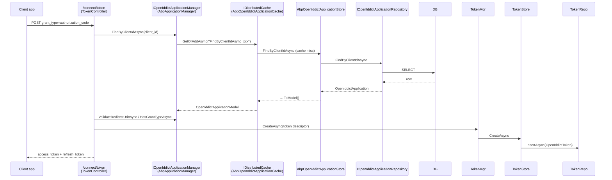

`Volo.Abp.OpenIddict.Domain` is the heart of the modern ABP authentication-server family. It declares four aggregates — `OpenIddictApplication`, `OpenIddictAuthorization`, `OpenIddictScope`, `OpenIddictToken` — and the ABP-flavoured `IOpenIddictXxxStore<TModel>` / `OpenIddictXxxManager<TModel>` adapters that let OpenIddict 4.x talk to ABP-style repositories. Unlike the IdentityServer4 Domain layer, this module is **HTTP-free**: it only calls `services.AddOpenIddict().AddCore(...)`. The protocol pipeline (`AddServer`) lives in [`Volo.Abp.OpenIddict.AspNetCore`](/modules/authservers/openiddict-asp-net-core).

This page walks each aggregate, the persistence models, the store/manager pattern, the distributed-cache layer, and the cleanup worker.

## File inventory

```
modules/openiddict/src/Volo.Abp.OpenIddict.Domain/Volo/Abp/OpenIddict/
├── AbpOpenIddictCacheBase.cs
├── AbpOpenIddictDbProperties.cs                  ← DbTablePrefix="OpenIddict", schema, conn-string
├── AbpOpenIddictDomainModule.cs                  ← AddCore, ReplaceManagers, EtoMappings, ext-prop registry
├── AbpOpenIddictIdentifierConverter.cs           ← Guid ↔ "D"-format string
├── AbpOpenIddictStoreBase.cs                     ← shared concurrency/JSON helpers
├── Applications/
│   ├── AbpApplicationDescriptor.cs               ← ClientUri / LogoUri extension
│   ├── AbpApplicationManager.cs                  ← override Update/Populate to round-trip the two ABP fields
│   ├── AbpOpenIddictApplicationCache.cs
│   ├── AbpOpenIddictApplicationStore.cs
│   ├── IAbpApplicationManager.cs
│   ├── IAbpOpenIdApplicationStore.cs
│   ├── IOpenIddictApplicationRepository.cs
│   ├── OpenIddictApplication.cs
│   ├── OpenIddictApplicationExtensions.cs         ← ToEntity / ToModel
│   └── OpenIddictApplicationModel.cs
├── Authorizations/                                ← Manager / Cache / Store / Repository / Entity / Model
├── IOpenIddictDbConcurrencyExceptionHandler.cs
├── Scopes/                                        ← Manager / Cache / Store / Repository / Entity / Model
└── Tokens/
    ├── AbpOpenIddictTokenCache.cs
    ├── AbpOpenIddictTokenStore.cs
    ├── AbpTokenManager.cs
    ├── IOpenIddictTokenRepository.cs
    ├── OpenIddictToken.cs / OpenIddictTokenExtensions.cs / OpenIddictTokenModel.cs
    ├── TokenCleanupBackgroundWorker.cs
    ├── TokenCleanupOptions.cs
    └── TokenCleanupService.cs
```

## The four aggregates

All extend `FullAuditedAggregateRoot<Guid>`. Storage strategy: **JSON-encoded columns** for everything OpenIddict wants as JSON arrays/objects (`Permissions`, `RedirectUris`, `PostLogoutRedirectUris`, `Scopes`, `Requirements`, `Properties`, `DisplayNames`, `Descriptions`). That's why the column lengths in the EF/Mongo layers are mostly unbounded `nvarchar(max)` — the data is JSON, not searchable.

### OpenIddictApplication (≈ IdentityServer's `Client`)

```csharp
public class OpenIddictApplication : FullAuditedAggregateRoot<Guid>
{
    public virtual string ClientId { get; set; }
    public virtual string ClientSecret { get; set; }   // hashed or plaintext per the manager
    public virtual string ConsentType { get; set; }
    public virtual string DisplayName { get; set; }
    public virtual string DisplayNames { get; set; }            // JSON object
    public virtual string Permissions { get; set; }             // JSON array (scopes/endpoints/grant types)
    public virtual string PostLogoutRedirectUris { get; set; }  // JSON array
    public virtual string Properties { get; set; }              // JSON object
    public virtual string RedirectUris { get; set; }            // JSON array
    public virtual string Requirements { get; set; }            // JSON array (e.g. PKCE)
    public virtual string Type { get; set; }                    // "public" | "confidential"
    public string ClientUri { get; set; }                       // ABP extension
    public string LogoUri { get; set; }                         // ABP extension
}
```

The `ClientUri` and `LogoUri` properties are **not part of stock OpenIddict** — they're additions that ABP layers on top via `IAbpOpenIdApplicationStore` (the interface declares `GetClientUriAsync` / `GetLogoUriAsync` on top of the standard `IOpenIddictApplicationStore<TApplication>`).

### OpenIddictAuthorization (a long-lived user-consent record)

```csharp
public class OpenIddictAuthorization : FullAuditedAggregateRoot<Guid>
{
    public virtual Guid? ApplicationId { get; set; }
    public virtual DateTime? CreationDate { get; set; }
    public virtual string Properties { get; set; }   // JSON
    public virtual string Scopes { get; set; }       // JSON array
    public virtual string Status { get; set; }       // "valid"|"revoked"
    public virtual string Subject { get; set; }      // user id
    public virtual string Type { get; set; }         // "permanent" | "ad-hoc"
}
```

Authorizations let OpenIddict skip the consent screen on repeated logins (`permanent`) or hold one-shot consent records for the duration of an authorization-code exchange (`ad-hoc`). The cleanup worker prunes `ad-hoc` rows that no longer have tokens.

### OpenIddictScope

```csharp
public class OpenIddictScope : FullAuditedAggregateRoot<Guid>
{
    public virtual string Description { get; set; }
    public virtual string Descriptions { get; set; }   // JSON object (localised)
    public virtual string DisplayName { get; set; }
    public virtual string DisplayNames { get; set; }   // JSON object (localised)
    public virtual string Name { get; set; }
    public virtual string Properties { get; set; }     // JSON
    public virtual string Resources { get; set; }      // JSON array of audience names
}
```

### OpenIddictToken

```csharp
public class OpenIddictToken : FullAuditedAggregateRoot<Guid>
{
    public virtual Guid? ApplicationId { get; set; }
    public virtual Guid? AuthorizationId { get; set; }
    public virtual DateTime? CreationDate { get; set; }
    public virtual DateTime? ExpirationDate { get; set; }
    public virtual string Payload { get; set; }       // for reference tokens
    public virtual string Properties { get; set; }    // JSON
    public virtual DateTime? RedemptionDate { get; set; }
    public virtual string ReferenceId { get; set; }   // for reference tokens
    public virtual string Status { get; set; }        // "valid"|"redeemed"|"revoked"|"inactive"
    public virtual string Subject { get; set; }
    public virtual string Type { get; set; }          // "access_token"|"refresh_token"|"authorization_code"|"device_code"|"user_code"|"id_token"
}
```

The optional `ReferenceId` is the opaque token a confidential client receives when reference-token mode is enabled; `Payload` is the encrypted blob OpenIddict serialises into the database.

## Persistence models (`OpenIddictApplicationModel` et al.)

OpenIddict's design separates the **entity** (what's persisted) from the **model** (what stores hand back to managers). The Domain layer registers four models:

| Entity | Model |
| --- | --- |
| `OpenIddictApplication` | `OpenIddictApplicationModel : ExtensibleObject` |
| `OpenIddictAuthorization` | `OpenIddictAuthorizationModel : ExtensibleObject` |
| `OpenIddictScope` | `OpenIddictScopeModel : ExtensibleObject` |
| `OpenIddictToken` | `OpenIddictTokenModel : ExtensibleObject` |

They are 1-to-1 mirrors of the entity scalar surface, decorated with `[Serializable, IgnoreMultiTenancy]` so they can be distributed-cached. `OpenIddictApplicationExtensions.ToEntity()` and `.ToModel()` round-trip between the two — the store layer always returns models.

## Module wiring

```csharp
[DependsOn(
    typeof(AbpDddDomainModule),
    typeof(AbpIdentityDomainModule),
    typeof(AbpOpenIddictDomainSharedModule),
    typeof(AbpDistributedLockingAbstractionsModule),
    typeof(AbpCachingModule),
    typeof(AbpGuidsModule)
)]
public class AbpOpenIddictDomainModule : AbpModule
{
    public override void ConfigureServices(ServiceConfigurationContext context)
        => AddOpenIddictCore(context.Services);

    private void AddOpenIddictCore(IServiceCollection services)
    {
        services.AddOpenIddict()
            .AddCore(builder =>
            {
                builder
                    .SetDefaultApplicationEntity<OpenIddictApplicationModel>()
                    .SetDefaultAuthorizationEntity<OpenIddictAuthorizationModel>()
                    .SetDefaultScopeEntity<OpenIddictScopeModel>()
                    .SetDefaultTokenEntity<OpenIddictTokenModel>();

                builder
                    .AddApplicationStore<AbpOpenIddictApplicationStore>()
                    .AddAuthorizationStore<AbpOpenIddictAuthorizationStore>()
                    .AddScopeStore<AbpOpenIddictScopeStore>()
                    .AddTokenStore<AbpOpenIddictTokenStore>();

                builder.ReplaceApplicationManager(typeof(AbpApplicationManager));
                builder.ReplaceAuthorizationManager(typeof(AbpAuthorizationManager));
                builder.ReplaceScopeManager(typeof(AbpScopeManager));
                builder.ReplaceTokenManager(typeof(AbpTokenManager));

                builder.Services.TryAddScoped(p =>
                    (IAbpApplicationManager)p.GetRequiredService<IOpenIddictApplicationManager>());
            });
    }
}
```

> **The ABP overlay in one sentence:** set our models as defaults, swap in our four stores, replace the four managers with ABP versions (which add `ClientUri`/`LogoUri` round-tripping), and expose `IAbpApplicationManager` as a scoped alias of the stock manager so consumers can call the ABP-extra methods without casting.

`OnApplicationInitializationAsync` registers `TokenCleanupBackgroundWorker` when `TokenCleanupOptions.IsCleanupEnabled` (default `true`).

`PostConfigureServices` calls `ModuleExtensionConfigurationHelper.ApplyEntityConfigurationToEntity` for **both** the entity and its model (e.g. `OpenIddictApplication` and `OpenIddictApplicationModel`) under `OpenIddictModuleExtensionConsts.EntityNames.Application / Authorization / Scope / Token`. That's why extension properties round-trip through the protocol pipeline — the cached model also carries them.

## The store pattern

Each `AbpOpenIddictXxxStore` implements the full `IOpenIddictXxxStore<TModel>` contract from OpenIddict 4.x and adds ABP plumbing — concurrency handling, unit-of-work, identifier conversion. Common base:

```csharp
public abstract class AbpOpenIddictStoreBase<TRepository> where TRepository : IRepository
{
    protected TRepository Repository { get; }
    protected IUnitOfWorkManager UnitOfWorkManager { get; }
    protected IGuidGenerator GuidGenerator { get; }
    protected AbpOpenIddictIdentifierConverter IdentifierConverter { get; }
    protected IOpenIddictDbConcurrencyExceptionHandler ConcurrencyExceptionHandler { get; }

    protected virtual Guid ConvertIdentifierFromString(string identifier)
        => IdentifierConverter.FromString(identifier);
    protected virtual string ConvertIdentifierToString(Guid identifier)
        => IdentifierConverter.ToString(identifier);
}
```

`AbpOpenIddictIdentifierConverter` is the shim between OpenIddict's `string` identifier API and ABP's `Guid` keys:

```csharp
public class AbpOpenIddictIdentifierConverter : ITransientDependency
{
    public virtual Guid FromString(string identifier)
        => string.IsNullOrEmpty(identifier) ? default : Guid.Parse(identifier);
    public virtual string ToString(Guid identifier) => identifier.ToString("D");
}
```

The application store demonstrates the typical pattern — read via repository, return model:

```csharp
public class AbpOpenIddictApplicationStore : AbpOpenIddictStoreBase<IOpenIddictApplicationRepository>,
    IAbpOpenIdApplicationStore
{
    protected IOpenIddictTokenRepository TokenRepository { get; }

    public async ValueTask CreateAsync(OpenIddictApplicationModel application, CancellationToken ct)
    {
        await Repository.InsertAsync(application.ToEntity(), autoSave: true, cancellationToken: ct);
        application = (await Repository.FindAsync(application.Id, cancellationToken: ct)).ToModel();
    }

    public async ValueTask DeleteAsync(OpenIddictApplicationModel application, CancellationToken ct)
    {
        try
        {
            using var uow = UnitOfWorkManager.Begin(
                requiresNew: true, isTransactional: true, isolationLevel: IsolationLevel.RepeatableRead);
            await TokenRepository.DeleteManyByApplicationIdAsync(application.Id, cancellationToken: ct);
            await Repository.DeleteAsync(application.Id, cancellationToken: ct);
            await uow.CompleteAsync(ct);
        }
        catch (AbpDbConcurrencyException e)
        {
            await ConcurrencyExceptionHandler.HandleAsync(e);
            throw new OpenIddictExceptions.ConcurrencyException(e.Message, e.InnerException);
        }
    }

    public async ValueTask<OpenIddictApplicationModel> FindByClientIdAsync(string identifier, CancellationToken ct)
        => (await Repository.FindByClientIdAsync(identifier, cancellationToken: ct)).ToModel();
}
```

Note the **cascade-delete pattern**: removing an application also wipes its tokens in the same `RepeatableRead` transaction.

## The manager overrides

ABP replaces the four stock OpenIddict managers because they need to surface the `ClientUri`/`LogoUri` properties and clear the distributed cache before update:

```csharp
public class AbpApplicationManager
    : OpenIddictApplicationManager<OpenIddictApplicationModel>, IAbpApplicationManager
{
    public async override ValueTask UpdateAsync(OpenIddictApplicationModel application, CancellationToken ct)
    {
        if (!Options.CurrentValue.DisableEntityCaching)
        {
            var entity = await Store.FindByIdAsync(IdentifierConverter.ToString(application.Id), ct);
            if (entity != null)
                await Cache.RemoveAsync(entity, ct);
        }
        await base.UpdateAsync(application, ct);
    }

    public async override ValueTask PopulateAsync(
        OpenIddictApplicationDescriptor descriptor,
        OpenIddictApplicationModel application,
        CancellationToken ct)
    {
        await base.PopulateAsync(descriptor, application, ct);
        if (descriptor is AbpApplicationDescriptor model)
        {
            model.ClientUri = application.ClientUri;
            model.LogoUri = application.LogoUri;
        }
    }

    public virtual async ValueTask<string> GetClientUriAsync(object application, CancellationToken ct)
    {
        Check.AssignableTo<IAbpOpenIdApplicationStore>(application.GetType(), nameof(application));
        return await Store.As<IAbpOpenIdApplicationStore>()
                          .GetClientUriAsync(application.As<OpenIddictApplicationModel>(), ct);
    }
}
```

`AbpApplicationDescriptor` adds `ClientUri` and `LogoUri` to OpenIddict's `OpenIddictApplicationDescriptor`.

## The distributed cache layer

Each aggregate has an `AbpOpenIddictXxxCache : AbpOpenIddictCacheBase<TEntity, TModel, TStore>` implementation of `IOpenIddictXxxCache<TModel>`. Cache keys use the lookup method name:

```csharp
// AbpOpenIddictApplicationCache.AddAsync
await Cache.SetManyAsync(new List<KeyValuePair<string, OpenIddictApplicationModel>>
{
    new($"{nameof(FindByClientIdAsync)}_{await Store.GetClientIdAsync(app, ct)}", app),
    new($"{nameof(FindByIdAsync)}_{await Store.GetIdAsync(app, ct)}",             app)
}, token: ct);
```

The `IDistributedCache<OpenIddictApplicationModel>` is the standard ABP distributed cache — Redis in production, in-memory in tests. Cache misses fall through to the store, which falls through to the repository.

## Token-request flow



## Token cleanup

```csharp
public class TokenCleanupService : ITransientDependency
{
    protected IOpenIddictTokenManager TokenManager { get; }
    protected IOpenIddictAuthorizationManager AuthorizationManager { get; }
    protected TokenCleanupOptions CleanupOptions { get; }

    public virtual async Task CleanAsync()
    {
        if (!CleanupOptions.DisableTokenPruning)
        {
            var threshold = DateTimeOffset.UtcNow - CleanupOptions.MinimumTokenLifespan;
            await TokenManager.PruneAsync(threshold);
        }
        if (!CleanupOptions.DisableAuthorizationPruning)
        {
            var threshold = DateTimeOffset.UtcNow - CleanupOptions.MinimumAuthorizationLifespan;
            await AuthorizationManager.PruneAsync(threshold);
        }
    }
}
```

> **Important note from the source:** the comment in `TokenCleanupService` reads *"tokens MUST be deleted before removing the ad-hoc authorizations that no longer have any token"* — that's why the service prunes tokens first, then authorizations.

`TokenCleanupBackgroundWorker` runs the periodic loop; period is controlled by `TokenCleanupOptions`.

## Repository interfaces

The four `IOpenIddictXxxRepository` interfaces extend `IBasicRepository<TEntity, Guid>` with the lookup methods OpenIddict's stores need:

```csharp
public interface IOpenIddictApplicationRepository : IBasicRepository<OpenIddictApplication, Guid>
{
    Task<List<OpenIddictApplication>> GetListAsync(string sorting, int skipCount, int maxResultCount,
        string filter = null, CancellationToken ct = default);
    Task<long> GetCountAsync(string filter = null, CancellationToken ct = default);
    Task<OpenIddictApplication> FindByClientIdAsync(string clientId, CancellationToken ct = default);
    Task<List<OpenIddictApplication>> FindByPostLogoutRedirectUriAsync(string address, CancellationToken ct = default);
    Task<List<OpenIddictApplication>> FindByRedirectUriAsync(string address, CancellationToken ct = default);
    Task<List<OpenIddictApplication>> ListAsync(int? count, int? offset, CancellationToken ct = default);
}

public interface IOpenIddictTokenRepository : IBasicRepository<OpenIddictToken, Guid>
{
    Task DeleteManyByApplicationIdAsync(Guid applicationId, bool autoSave = false, CancellationToken ct = default);
    Task DeleteManyByAuthorizationIdAsync(Guid authorizationId, bool autoSave = false, CancellationToken ct = default);
    Task DeleteManyByAuthorizationIdsAsync(Guid[] authorizationIds, bool autoSave = false, CancellationToken ct = default);
    Task<List<OpenIddictToken>> FindAsync(string subject, Guid client, CancellationToken ct = default);
    Task<List<OpenIddictToken>> FindAsync(string subject, Guid client, string status, CancellationToken ct = default);
    Task<List<OpenIddictToken>> FindAsync(string subject, Guid client, string status, string type, CancellationToken ct = default);
    Task<List<OpenIddictToken>> FindByApplicationIdAsync(Guid applicationId, CancellationToken ct = default);
    Task<List<OpenIddictToken>> FindByAuthorizationIdAsync(Guid authorizationId, CancellationToken ct = default);
    Task<OpenIddictToken> FindByReferenceIdAsync(string referenceId, CancellationToken ct = default);
    Task<List<OpenIddictToken>> FindBySubjectAsync(string subject, CancellationToken ct = default);
    Task<List<OpenIddictToken>> ListAsync(int? count, int? offset, CancellationToken ct = default);
    Task PruneAsync(DateTime date, CancellationToken ct = default);
}
```

## Concurrency handling

`IOpenIddictDbConcurrencyExceptionHandler` is the seam that translates an `AbpDbConcurrencyException` into an `OpenIddictExceptions.ConcurrencyException`. The EF Core flavour (`EfCoreOpenIddictDbConcurrencyExceptionHandler`) discards the tracked entity so the next read isn't poisoned; the Mongo flavour is a no-op.

## Gotchas

- **JSON columns aren't searchable in SQL.** Queries like "find all applications that have permission X" require deserializing the `Permissions` JSON in code, not in SQL. The repository methods that do scoped lookups (`FindByRedirectUriAsync`) use full-text contains on the raw JSON — fine for moderate fleets, get a Redis cache for larger.
- **`OpenIddictApplication.ClientSecret` may be hashed.** The default `OpenIddictApplicationManager` hashes secrets when applications are created through the management API; if you insert directly via the repository you skip the hashing and validation will fail.
- **Identifier converter assumes `Guid`.** If you reuse the store with a non-Guid key (you can't, without rewriting), `FromString` will throw `FormatException` on every lookup.
- **`PruneAsync` deletes whole rows.** Don't put audit-relevant data in `OpenIddictToken.Properties` expecting it to live forever — the cleanup worker erases expired tokens after `MinimumTokenLifespan`.
- **Application deletion cascades tokens.** The store opens its own `RepeatableRead` transaction; if you wrap a delete in your own UoW with a weaker isolation level you'll lose the guarantee.

## Cross-links

- HTTP endpoints and grant types: [`openiddict-asp-net-core`](/modules/authservers/openiddict-asp-net-core)
- Pro management surface: [`openiddict-pro-modules`](/modules/authservers/openiddict-pro-modules)
- Persistence: [`openiddict-efcore-mongodb`](/modules/authservers/openiddict-efcore-mongodb)
- Bearer-token validation in resource APIs: [`framework/auth/jwt-bearer`](/framework/auth/jwt-bearer)
- IdentityServer4 alternative stack: [`identityserver-domain`](/modules/authservers/identityserver-domain)
