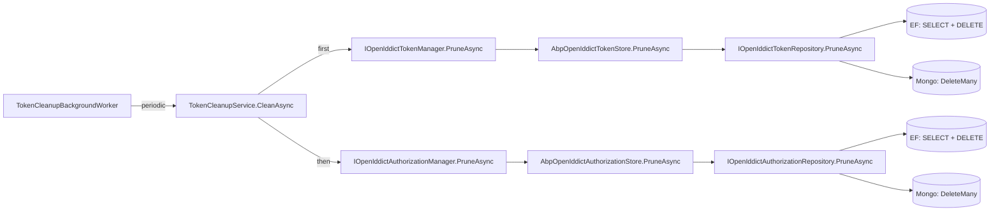

The OpenIddict module ships two parallel persistence packs — `Volo.Abp.OpenIddict.EntityFrameworkCore` for SQL providers and `Volo.Abp.OpenIddict.MongoDB` for MongoDB. Unlike the IdentityServer4 stack which has nine child tables per `Client`, OpenIddict's design is **document-centric** — every aggregate flattens its child collections into JSON columns, so each persistence pack only has four tables / four collections, one per aggregate.

This page walks both packs together to highlight where they overlap and where they diverge.

## File inventory

```
modules/openiddict/src/Volo.Abp.OpenIddict.EntityFrameworkCore/
└── Volo/Abp/OpenIddict/
    ├── Applications/EfCoreOpenIddictApplicationRepository.cs
    ├── Authorizations/EfCoreOpenIddictAuthorizationRepository.cs
    ├── EfCoreOpenIddictDbConcurrencyExceptionHandler.cs
    ├── EntityFrameworkCore/
    │   ├── AbpOpenIddictEntityFrameworkCoreModule.cs
    │   ├── IOpenIddictDbContext.cs
    │   ├── OpenIddictDbContext.cs
    │   └── OpenIddictDbContextModelCreatingExtensions.cs
    ├── Scopes/EfCoreOpenIddictScopeRepository.cs
    └── Tokens/EfCoreOpenIddictTokenRepository.cs

modules/openiddict/src/Volo.Abp.OpenIddict.MongoDB/
└── Volo/Abp/OpenIddict/
    ├── Applications/MongoOpenIddictApplicationRepository.cs
    ├── Authorizations/MongoOpenIddictAuthorizationRepository.cs
    ├── MongoDB/
    │   ├── AbpOpenIddictMongoDbModule.cs
    │   ├── IOpenIddictMongoDbContext.cs
    │   ├── OpenIddictMongoDbContext.cs
    │   └── OpenIddictMongoDbContextExtensions.cs
    ├── MongoOpenIddictDbConcurrencyExceptionHandler.cs
    ├── Scopes/MongoOpenIddictScopeRepository.cs
    └── Tokens/MongoOpenIddictTokenRepository.cs
```

## Shared DB properties

```csharp
public static class AbpOpenIddictDbProperties
{
    public static string DbTablePrefix { get; set; } = "OpenIddict";
    public static string DbSchema { get; set; } = AbpCommonDbProperties.DbSchema;   // null by default
    public const string ConnectionStringName = "AbpOpenIddict";
}
```

Both packs use the same table / collection prefix (`OpenIddict`), the same schema (`AbpCommonDbProperties.DbSchema` — typically `null` so the DBMS default applies), and the same connection-string name (`AbpOpenIddict`).

## EF Core: the DbContext

```csharp
[IgnoreMultiTenancy]
[ConnectionStringName(AbpOpenIddictDbProperties.ConnectionStringName)]
public class OpenIddictDbContext : AbpDbContext<OpenIddictDbContext>, IOpenIddictDbContext
{
    public DbSet<OpenIddictApplication>   Applications   { get; set; }
    public DbSet<OpenIddictAuthorization> Authorizations { get; set; }
    public DbSet<OpenIddictScope>         Scopes         { get; set; }
    public DbSet<OpenIddictToken>         Tokens         { get; set; }

    protected override void OnModelCreating(ModelBuilder builder)
    {
        base.OnModelCreating(builder);
        builder.ConfigureOpenIddict();
    }
}
```

Four `DbSet`s, four tables — `OpenIddictApplications`, `OpenIddictAuthorizations`, `OpenIddictScopes`, `OpenIddictTokens`. `[IgnoreMultiTenancy]` because the auth-server tables hold cross-tenant configuration.

## EF Core: the model-creating extension

`ConfigureOpenIddict()` walks the four entities. The interesting parts are the indexes:

```csharp
public static void ConfigureOpenIddict(this ModelBuilder builder)
{
    if (builder.IsTenantOnlyDatabase()) return;

    builder.Entity<OpenIddictApplication>(b =>
    {
        b.ToTable("OpenIddictApplications");
        b.ConfigureByConvention();
        b.HasIndex(x => x.ClientId);                              // for FindByClientIdAsync
        b.Property(x => x.ClientId).HasMaxLength(100);
        b.Property(x => x.ConsentType).HasMaxLength(50);
        b.Property(x => x.Type).HasMaxLength(50);
        b.ApplyObjectExtensionMappings();
    });

    builder.Entity<OpenIddictAuthorization>(b =>
    {
        b.ToTable("OpenIddictAuthorizations");
        b.ConfigureByConvention();
        b.HasIndex(x => new { x.ApplicationId, x.Status, x.Subject, x.Type });   // ← hot path
        b.Property(x => x.Status).HasMaxLength(50);
        b.Property(x => x.Subject).HasMaxLength(400);
        b.Property(x => x.Type).HasMaxLength(50);
        b.HasOne<OpenIddictApplication>().WithMany().HasForeignKey(x => x.ApplicationId).IsRequired(false);
        b.ApplyObjectExtensionMappings();
    });

    builder.Entity<OpenIddictScope>(b =>
    {
        b.ToTable("OpenIddictScopes");
        b.ConfigureByConvention();
        b.HasIndex(x => x.Name);
        b.Property(x => x.Name).HasMaxLength(200);
        b.ApplyObjectExtensionMappings();
    });

    builder.Entity<OpenIddictToken>(b =>
    {
        b.ToTable("OpenIddictTokens");
        b.ConfigureByConvention();
        b.HasIndex(x => x.ReferenceId);
        b.HasIndex(x => new { x.ApplicationId, x.Status, x.Subject, x.Type });   // ← hot path
        b.Property(x => x.ReferenceId).HasMaxLength(100);
        b.Property(x => x.Status).HasMaxLength(50);
        b.Property(x => x.Subject).HasMaxLength(400);
        b.Property(x => x.Type).HasMaxLength(50);
        b.HasOne<OpenIddictApplication>().WithMany()
         .HasForeignKey(x => x.ApplicationId).IsRequired(false);
        b.HasOne<OpenIddictAuthorization>().WithMany()
         .HasForeignKey(x => x.AuthorizationId).IsRequired(false);
        b.ApplyObjectExtensionMappings();
    });
}
```

Three things to call out:

1. **`(ApplicationId, Status, Subject, Type)` composite indexes** — these match the `IOpenIddictTokenRepository.FindAsync(subject, client, status, type)` and the equivalent on authorizations exactly. Avoid scans by always passing all four parameters in production code.
2. **Nullable foreign keys.** `Token.ApplicationId` and `Token.AuthorizationId` are both `Guid?` with `IsRequired(false)` because not every token type is tied to both — e.g. a client-credentials access token has no authorization, and a one-off authorisation code may exist before being exchanged.
3. **`HasIndex(...).IsUnique()` is commented out** — the source explicitly leaves `ClientId`, `ReferenceId`, and `Scope.Name` as non-unique indexes so seeding twice doesn't crash. Enforce uniqueness in your app service if you care.

JSON-encoded columns (`Permissions`, `RedirectUris`, `PostLogoutRedirectUris`, `Requirements`, `Properties`, `DisplayNames`, `Descriptions`, `Resources`, `Scopes`, `Payload`) get no `HasMaxLength` constraint — they're `nvarchar(max)` (or the dialect's equivalent).

## EF Core: the module

```csharp
[DependsOn(
    typeof(AbpOpenIddictDomainModule),
    typeof(AbpEntityFrameworkCoreModule)
)]
public class AbpOpenIddictEntityFrameworkCoreModule : AbpModule
{
    public override void ConfigureServices(ServiceConfigurationContext context)
    {
        context.Services.AddAbpDbContext<OpenIddictDbContext>(options =>
        {
            options.AddDefaultRepositories<IOpenIddictDbContext>();
            options.AddRepository<OpenIddictApplication,   EfCoreOpenIddictApplicationRepository>();
            options.AddRepository<OpenIddictAuthorization, EfCoreOpenIddictAuthorizationRepository>();
            options.AddRepository<OpenIddictScope,         EfCoreOpenIddictScopeRepository>();
            options.AddRepository<OpenIddictToken,         EfCoreOpenIddictTokenRepository>();
        });
    }
}
```

Unlike the IdentityServer4 EF Core module, **no `PreConfigure<IIdentityServerBuilder>` step is needed** — OpenIddict's store registration happens in `AbpOpenIddictDomainModule.AddCore` and binds to interface (`IOpenIddictApplicationStore<TModel>`), so registering the EF Core repositories is enough.

## EF Core: the repositories

`EfCoreOpenIddictTokenRepository` is the busiest — it implements every `Find...` overload OpenIddict needs:

```csharp
public class EfCoreOpenIddictTokenRepository
    : EfCoreRepository<IOpenIddictDbContext, OpenIddictToken, Guid>, IOpenIddictTokenRepository
{
    public virtual async Task DeleteManyByApplicationIdAsync(Guid applicationId, bool autoSave = false, CancellationToken ct = default)
    {
        var tokens = await (await GetDbSetAsync())
            .Where(x => x.ApplicationId == applicationId)
            .ToListAsync(GetCancellationToken(ct));
        await DeleteManyAsync(tokens, autoSave, ct);
    }

    public virtual async Task<List<OpenIddictToken>> FindAsync(
        string subject, Guid client, string status, string type, CancellationToken ct = default)
    {
        return await (await GetQueryableAsync())
            .Where(x => x.Subject == subject &&
                        x.ApplicationId == client &&
                        x.Status == status &&
                        x.Type == type)
            .ToListAsync(GetCancellationToken(ct));
    }

    public virtual async Task<OpenIddictToken> FindByReferenceIdAsync(string referenceId, CancellationToken ct = default)
        => await (await GetQueryableAsync())
            .FirstOrDefaultAsync(x => x.ReferenceId == referenceId, GetCancellationToken(ct));

    public virtual async Task PruneAsync(DateTime date, CancellationToken ct = default)
    {
        // Removes tokens whose expiration ≤ date AND (status != "valid" or authorization status != "valid")
        // — exact filter lives in source; check the file for the canonical implementation.
    }
}
```

`PruneAsync` is what `TokenCleanupService.CleanAsync` calls via `IOpenIddictTokenManager.PruneAsync` — it filters on **expired** and **redeemed/revoked/inactive** state plus orphaned authorizations. The Mongo equivalent (`MongoOpenIddictTokenRepository.PruneAsync`) does the same filter in `IMongoQueryable`.

## MongoDB: the DbContext

```csharp
[IgnoreMultiTenancy]
[ConnectionStringName(AbpOpenIddictDbProperties.ConnectionStringName)]
public class OpenIddictMongoDbContext : AbpMongoDbContext, IOpenIddictMongoDbContext
{
    public IMongoCollection<OpenIddictApplication>   Applications   => Collection<OpenIddictApplication>();
    public IMongoCollection<OpenIddictAuthorization> Authorizations => Collection<OpenIddictAuthorization>();
    public IMongoCollection<OpenIddictScope>         Scopes         => Collection<OpenIddictScope>();
    public IMongoCollection<OpenIddictToken>         Tokens         => Collection<OpenIddictToken>();

    protected override void CreateModel(IMongoModelBuilder modelBuilder)
    {
        base.CreateModel(modelBuilder);
        modelBuilder.ConfigureOpenIddict();
    }
}
```

Collection names follow the same prefix:

```csharp
public static void ConfigureOpenIddict(this IMongoModelBuilder builder)
{
    builder.Entity<OpenIddictApplication>(b   => b.CollectionName = "OpenIddictApplications");
    builder.Entity<OpenIddictAuthorization>(b => b.CollectionName = "OpenIddictAuthorizations");
    builder.Entity<OpenIddictScope>(b         => b.CollectionName = "OpenIddictScopes");
    builder.Entity<OpenIddictToken>(b         => b.CollectionName = "OpenIddictTokens");
}
```

**No indexes are declared in the source** — you must add Mongo indexes yourself for the hot paths above (`ClientId` on Applications, `ReferenceId` on Tokens, the four-field composite on Authorizations and Tokens). A typical `OnApplicationInitialization` snippet:

```csharp
public override async Task OnApplicationInitializationAsync(ApplicationInitializationContext context)
{
    var db = await context.ServiceProvider.GetRequiredService<IOpenIddictMongoDbContext>()
                          .ToAsyncEnumerable().FirstAsync();
    await db.Applications.Indexes.CreateOneAsync(
        new CreateIndexModel<OpenIddictApplication>(Builders<OpenIddictApplication>.IndexKeys.Ascending(x => x.ClientId)));
    await db.Tokens.Indexes.CreateOneAsync(
        new CreateIndexModel<OpenIddictToken>(Builders<OpenIddictToken>.IndexKeys
            .Ascending(x => x.ApplicationId).Ascending(x => x.Status).Ascending(x => x.Subject).Ascending(x => x.Type)));
}
```

## MongoDB: the module

```csharp
[DependsOn(
    typeof(AbpOpenIddictDomainModule),
    typeof(AbpMongoDbModule)
)]
public class AbpOpenIddictMongoDbModule : AbpModule
{
    public override void ConfigureServices(ServiceConfigurationContext context)
    {
        context.Services.AddMongoDbContext<OpenIddictMongoDbContext>(options =>
        {
            options.AddDefaultRepositories<IOpenIddictMongoDbContext>();
            options.AddRepository<OpenIddictApplication,   MongoOpenIddictApplicationRepository>();
            options.AddRepository<OpenIddictAuthorization, MongoOpenIddictAuthorizationRepository>();
            options.AddRepository<OpenIddictScope,         MongoOpenIddictScopeRepository>();
            options.AddRepository<OpenIddictToken,         MongoOpenIddictTokenRepository>();
        });
    }
}
```

Same shape as the EF Core module — four repositories.

## Concurrency-exception handlers

The OSS Domain layer's `IOpenIddictDbConcurrencyExceptionHandler` is the seam that translates an `AbpDbConcurrencyException` (which an ABP repository raises on optimistic-concurrency failure) into the protocol-side `OpenIddictExceptions.ConcurrencyException` the stores re-throw.

### EF Core: detach the conflicting entries

```csharp
public class EfCoreOpenIddictDbConcurrencyExceptionHandler
    : IOpenIddictDbConcurrencyExceptionHandler, ITransientDependency
{
    public virtual Task HandleAsync(AbpDbConcurrencyException exception)
    {
        if (exception?.InnerException is DbUpdateConcurrencyException updateConcurrencyException)
        {
            foreach (var entry in updateConcurrencyException.Entries)
            {
                // Reset the state of the entity to prevent future SaveChangesAsync() calls from failing.
                entry.State = EntityState.Unchanged;
            }
        }
        return Task.CompletedTask;
    }
}
```

Why it matters: without resetting the entry state, the EF change tracker keeps the conflict-marked entry around, and the *next* `SaveChangesAsync()` in the same `DbContext` instance (still alive inside the OpenIddict request scope) would throw again on an unrelated write.

### MongoDB: no-op

```csharp
public class MongoOpenIddictDbConcurrencyExceptionHandler
    : IOpenIddictDbConcurrencyExceptionHandler, ITransientDependency
{
    public virtual Task HandleAsync(AbpDbConcurrencyException exception) => Task.CompletedTask;
}
```

Mongo writes are single-document atomic; there's no change-tracker state to reset.

## Wire-up

EF Core:

```csharp
[DependsOn(typeof(AbpOpenIddictEntityFrameworkCoreModule))]
public class MyOpenIddictHostEfCoreModule : AbpModule
{
    public override void ConfigureServices(ServiceConfigurationContext context)
        => Configure<AbpDbContextOptions>(o => o.UseSqlServer());
}
```

MongoDB:

```csharp
[DependsOn(typeof(AbpOpenIddictMongoDbModule))]
public class MyOpenIddictHostMongoDbModule : AbpModule { /* nothing more required */ }
```

Connection strings:

```json
{
  "ConnectionStrings": {
    "Default":       "Server=…;Database=AppMain;…",
    "AbpOpenIddict": "Server=…;Database=AppAuth;…"
  }
}
```

## Token-cleanup flow



The two-step **tokens first, then authorizations** order is mandatory (see the comment in `TokenCleanupService`): an ad-hoc authorization is only safe to delete *after* every token referencing it has been removed; otherwise the FK constraint in EF Core would refuse, and the Mongo write would leave orphan tokens with a dead `AuthorizationId`.

## Gotchas

- **No unique indexes.** `ClientId` (Applications), `Name` (Scopes), and `ReferenceId` (Tokens) are non-unique. Pro app services check uniqueness at the application layer; if you bypass them you can insert duplicates.
- **Mongo has no indexes out of the box.** Production performance requires you to create them yourself — the four-field composite on Tokens / Authorizations especially.
- **JSON columns aren't searchable in SQL.** If you ever need "find every application that has scope X" you must deserialize the `Permissions` JSON in-memory or use a full-text contains on the raw string (`Permissions LIKE '%"scp:X"%'`). Don't put that on the hot path.
- **EF concurrency handler depends on the inner exception type.** A `AbpDbConcurrencyException` whose inner exception isn't `DbUpdateConcurrencyException` (e.g. someone wrapped it) silently does nothing — the next save will still throw.
- **Cascade-delete must be done by the store.** EF's `OnDelete(DeleteBehavior.…)` is not configured here; the store layer (`AbpOpenIddictApplicationStore.DeleteAsync`) explicitly opens a `RepeatableRead` transaction and calls `TokenRepository.DeleteManyByApplicationIdAsync` before deleting the application. Direct repository deletes bypass that and leave orphan tokens.
- **`[IgnoreMultiTenancy]` on both DbContexts.** Auth-server data is host-only. Even in multi-tenant deployments, all tokens / applications live in the host DB.
- **`OpenIddictAuthorizationConsts.SubjectMaxLength = 400`** is wide enough for ABP `Guid` user-ids; if you switch the subject claim to anything longer (e.g. a JWE-encrypted token) you'll truncate silently in EF Core.

## Cross-links

- The aggregates being persisted: [`openiddict-domain`](/modules/authservers/openiddict-domain)
- The HTTP pipeline that reads/writes them: [`openiddict-asp-net-core`](/modules/authservers/openiddict-asp-net-core)
- Pro / DIY management surface: [`openiddict-pro-modules`](/modules/authservers/openiddict-pro-modules)
- ABP EF Core conventions: [`framework/persistence`](/framework/persistence)
- IdentityServer4 equivalent persistence: [`identityserver-efcore`](/modules/authservers/identityserver-efcore), [`identityserver-mongodb`](/modules/authservers/identityserver-mongodb)
