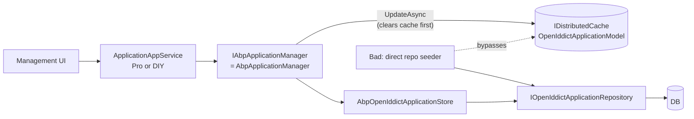

The ABP Commercial / Pro packages for OpenIddict (`Volo.Abp.OpenIddict.Pro.Domain`, `…Application.Contracts`, `…Application`, `…HttpApi`, `…Web`, `…Blazor`) are **not in the OSS monorepo at v7.4.0**. What *is* in OSS are the seams those Pro modules build on. This page documents:

1. The five OSS extension points the Pro management layer hooks into.
2. The shape Pro modules take on top of those seams.
3. How to write a Pro-equivalent management surface yourself when you don't license Pro.

If you ever wondered "where does the Pro UI manage `OpenIddictApplication` rows from?" — the answer is: a thin app-service over `IOpenIddictApplicationRepository`, using `IAbpApplicationManager` for cache-aware writes, that's it.

## The five OSS seams

| Seam | Interface | Lives in | What it gives you |
| --- | --- | --- | --- |
| Application store | `IAbpOpenIdApplicationStore` extends `IOpenIddictApplicationStore<OpenIddictApplicationModel>` | `Volo.Abp.OpenIddict.Domain` | Stock OpenIddict store contract plus `GetClientUriAsync` / `GetLogoUriAsync` so Pro UIs can show ABP's extra metadata. |
| Authorization store | `AbpOpenIddictAuthorizationStore : IOpenIddictAuthorizationStore<OpenIddictAuthorizationModel>` | `Volo.Abp.OpenIddict.Domain` | Implementation Pro overrides need to wrap (e.g. to record consent in an audit table). |
| Scope store | `AbpOpenIddictScopeStore : IOpenIddictScopeStore<OpenIddictScopeModel>` | `Volo.Abp.OpenIddict.Domain` | Same — Pro can decorate to attach extra-property storage. |
| Token store | `AbpOpenIddictTokenStore : IOpenIddictTokenStore<OpenIddictTokenModel>` | `Volo.Abp.OpenIddict.Domain` | Same. |
| Application manager | `IAbpApplicationManager` extends `IOpenIddictApplicationManager` | `Volo.Abp.OpenIddict.Domain` | Adds `GetClientUriAsync` / `GetLogoUriAsync`; resolves to `AbpApplicationManager` which clears the distributed cache before update. |

### `IAbpOpenIdApplicationStore`

```csharp
public interface IAbpOpenIdApplicationStore
    : IOpenIddictApplicationStore<OpenIddictApplicationModel>
{
    ValueTask<string> GetClientUriAsync(OpenIddictApplicationModel application, CancellationToken ct = default);
    ValueTask<string> GetLogoUriAsync(OpenIddictApplicationModel application, CancellationToken ct = default);
}
```

`AbpOpenIddictApplicationStore` is the concrete OSS implementation; if a Pro module wants to layer behaviour (a soft-delete table for applications, an audit log of every secret-rotation, …) it derives from `AbpOpenIddictApplicationStore` and overrides the targeted methods. The store is registered through OpenIddict's `builder.AddApplicationStore<…>()` call — the Domain module's `AddCore` lambda registers the OSS one (see [`openiddict-domain`](/modules/authservers/openiddict-domain)). A Pro `AbpModule.PreConfigureServices` can `PreConfigure<IOpenIddictBuilder>(b => b.AddApplicationStore<MyProOpenIddictApplicationStore>())` to swap the binding.

### `IAbpApplicationManager`

```csharp
public interface IAbpApplicationManager : IOpenIddictApplicationManager
{
    ValueTask<string> GetClientUriAsync(object application, CancellationToken ct = default);
    ValueTask<string> GetLogoUriAsync(object application, CancellationToken ct = default);
}
```

The OSS `AbpApplicationManager : OpenIddictApplicationManager<OpenIddictApplicationModel>, IAbpApplicationManager`:

- Overrides `UpdateAsync` to remove the `IDistributedCache<OpenIddictApplicationModel>` entry **before** updating, so other host instances see the change immediately.
- Overrides `PopulateAsync(descriptor, model)` and `PopulateAsync(model, descriptor)` to copy `ClientUri` and `LogoUri` between the descriptor and the model.
- Casts through `AbpApplicationDescriptor` — Pro descriptors that want even more fields would extend `AbpApplicationDescriptor` further and override the two `PopulateAsync` shapes.

The Domain module registers `IAbpApplicationManager` as a scoped alias of `IOpenIddictApplicationManager`:

```csharp
builder.Services.TryAddScoped(p =>
    (IAbpApplicationManager)p.GetRequiredService<IOpenIddictApplicationManager>());
```

So injecting `IAbpApplicationManager` is the canonical way to get the manager when you want the ABP extras; injecting the stock `IOpenIddictApplicationManager` works too — the same object is returned.

### Authorization / Scope / Token stores

`AbpOpenIddictAuthorizationStore`, `AbpOpenIddictScopeStore`, `AbpOpenIddictTokenStore` implement the full `IOpenIddictXxxStore<TModel>` contracts of OpenIddict 4.x:

- CRUD (`CreateAsync`, `UpdateAsync`, `DeleteAsync`, `FindByIdAsync`)
- Lookup by indexed columns (`FindByClientIdAsync`, `FindByAuthorizationIdAsync`, `FindByReferenceIdAsync`, `FindBySubjectAsync`, …)
- Property accessors per JSON-encoded column (`GetPermissionsAsync` deserializes `Permissions`, `GetRedirectUrisAsync` deserializes `RedirectUris`, etc.)
- `ListAsync(int? count, int? offset, ...)` paging
- `PruneAsync(DateTimeOffset)` for the cleanup worker

Pro modules typically override only the **write** half and the cache integration. Read methods route through the cache (`AbpOpenIddictApplicationCache` et al.) which itself routes through the store.

## What a Pro module typically adds

```
Volo.Abp.OpenIddict.Pro.Domain/                 ← entity overrides (rare), audit hooks
Volo.Abp.OpenIddict.Pro.Application.Contracts/  ← IApplicationAppService, IScopeAppService, DTOs, permissions
Volo.Abp.OpenIddict.Pro.Application/            ← AppService implementations
Volo.Abp.OpenIddict.Pro.HttpApi/                ← Controllers projecting the contracts
Volo.Abp.OpenIddict.Pro.Web/                    ← Razor Pages management UI
Volo.Abp.OpenIddict.Pro.Blazor/                 ← Blazor management UI
```

A Pro `IApplicationAppService` looks like:

```csharp
// Conceptual — Pro package
public interface IApplicationAppService
    : ICrudAppService<ApplicationDto, Guid, GetApplicationListInput, CreateApplicationDto, UpdateApplicationDto>
{
    Task<List<string>> GetAllRedirectUrisAsync();
    Task<ApplicationDto> CloneAsync(CloneApplicationDto input);
}

public class ApplicationDto : ExtensibleAuditedEntityDto<Guid>
{
    public string ClientId { get; set; }
    public string ClientSecret { get; set; }       // write-only on update
    public string ConsentType { get; set; }
    public string DisplayName { get; set; }
    public string Type { get; set; }               // "public" | "confidential"
    public string ClientUri { get; set; }          // pulled via IAbpApplicationManager.GetClientUriAsync
    public string LogoUri { get; set; }
    public List<string> Permissions { get; set; }
    public List<string> RedirectUris { get; set; }
    public List<string> PostLogoutRedirectUris { get; set; }
    public List<string> Requirements { get; set; } // e.g. "ft:pkce"
    public Dictionary<string, string> DisplayNames { get; set; }
}
```

The implementation is a thin wrapper:

```csharp
[Authorize(OpenIddictProPermissions.Applications.Default)]
public class ApplicationAppService : ApplicationService, IApplicationAppService
{
    private readonly IOpenIddictApplicationRepository _repo;
    private readonly IAbpApplicationManager _manager;

    public ApplicationAppService(IOpenIddictApplicationRepository repo, IAbpApplicationManager manager)
        => (_repo, _manager) = (repo, manager);

    public async Task<ApplicationDto> CreateAsync(CreateApplicationDto input)
    {
        var descriptor = new AbpApplicationDescriptor
        {
            ClientId = input.ClientId,
            ClientSecret = input.ClientSecret,
            ConsentType = input.ConsentType,
            DisplayName = input.DisplayName,
            Type = input.Type,
            ClientUri = input.ClientUri,
            LogoUri = input.LogoUri,
        };
        foreach (var p in input.Permissions) descriptor.Permissions.Add(p);
        foreach (var r in input.RedirectUris) descriptor.RedirectUris.Add(new Uri(r));
        // …
        var model = await _manager.CreateAsync(descriptor) as OpenIddictApplicationModel;
        return ObjectMapper.Map<OpenIddictApplicationModel, ApplicationDto>(model);
    }
}
```

The same pattern applies to authorizations, scopes, and tokens — each gets a `CrudAppService` over its repository and a sister manager.

## Writing your own Pro-equivalent (OSS-only path)

If you don't license Pro you can stand up exactly the same management surface in your solution:

1. **Reference `Volo.Abp.OpenIddict.Domain`** for the four repositories and `IAbpApplicationManager`.
2. **Define your own `IApplicationAppService`** in your `*.Application.Contracts` project, mirroring the shape shown above.
3. **Register your own permission group** — never reuse `AbpOpenIddict` because a future Pro install would duplicate-register it.
4. **Build descriptors via `OpenIddictApplicationDescriptor` (or `AbpApplicationDescriptor` for `ClientUri`/`LogoUri`)** rather than mutating the entity directly. This routes through the manager, which routes through the store, which routes through the cache invalidator — write-through-everything for free.
5. **Use `IOpenIddictScopeManager`, `IOpenIddictAuthorizationManager`, `IOpenIddictTokenManager`** the same way for the other three aggregates.

Permission tree (yours to name):

```csharp
public static class MyOpenIddictPermissions
{
    public const string GroupName = "MyAuth.OpenIddict";
    public static class Applications
    {
        public const string Default = GroupName + ".Applications";
        public const string Create  = Default + ".Create";
        public const string Update  = Default + ".Update";
        public const string Delete  = Default + ".Delete";
        public const string ManagePermissions = Default + ".ManagePermissions";
    }
    public static class Scopes        { /* CRUD */ }
    public static class Authorizations{ /* List / Revoke / Delete */ }
    public static class Tokens        { /* List / Revoke / Delete */ }
}
```

## Cache-coherence in a Pro / DIY surface

Because every aggregate has an `AbpOpenIddictXxxCache` between the manager and the store, **any direct repository write bypasses the cache**. Two consequences:

- A repository-only seeder must call `manager.UpdateAsync` (or restart all host instances) for the change to be visible.
- The Pro app service routes everything through `IAbpApplicationManager`, so cache invalidation is automatic.



## Pro-only features by inference

The Pro UI typically delivers features that have no OSS skeleton — they are pure UX on top of the OSS data model:

- "Clone application" — copies an `OpenIddictApplication` row to a new `ClientId`.
- "Bulk rotate secrets" — iterates applications, calls `manager.UpdateAsync` with a freshly-hashed secret.
- "Revoke all sessions for user" — uses `IOpenIddictTokenManager` to find tokens by `Subject` and call `TryRevokeAsync`.
- "Browse active tokens" — paged view over `OpenIddictTokens` filtered by `Status = "valid"`.
- "Manage extra properties via UI" — round-trips through the `ObjectExtensionManager` registry at `OpenIddictModuleExtensionConsts.EntityNames.{Application,Authorization,Scope,Token}`.

All five of the above can be reproduced verbatim in DIY code — no Pro-only seam is required.

## Gotchas

- **The `IAbpApplicationManager` scoped alias is a `TryAddScoped`.** If you replace the manager via `builder.ReplaceApplicationManager(typeof(MyProApplicationManager))`, that registration becomes a `Scoped IOpenIddictApplicationManager`; the alias keeps working because it resolves the registered manager.
- **Don't write Pro-style decorators around the store without preserving `OpenIddictExceptions.ConcurrencyException`.** The OSS `AbpOpenIddictApplicationStore.DeleteAsync` catches `AbpDbConcurrencyException` and rethrows the OpenIddict-typed one — OpenIddict's retry logic depends on it.
- **`AbpApplicationDescriptor` is the only descriptor type that carries `ClientUri` / `LogoUri`.** If your app service builds a stock `OpenIddictApplicationDescriptor`, those two fields will be silently dropped.
- **Pro and OSS extension-property registry collide.** Don't add a property named `ClientUri` or `LogoUri` via `ObjectExtensionManager` — those names are already in use by the ABP overlay.

## Cross-links

- The OSS Domain layer Pro builds on: [`openiddict-domain`](/modules/authservers/openiddict-domain)
- HTTP endpoints and grant pipeline: [`openiddict-asp-net-core`](/modules/authservers/openiddict-asp-net-core)
- Persistence: [`openiddict-efcore-mongodb`](/modules/authservers/openiddict-efcore-mongodb)
- Object Extending: [`framework/ddd`](/framework/ddd)
- Authorization framework: [`framework/cross/authorization`](/framework/cross/authorization)
