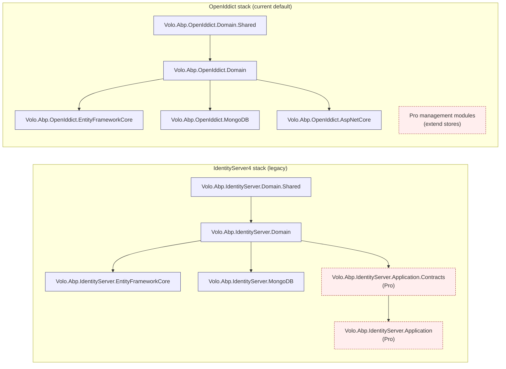
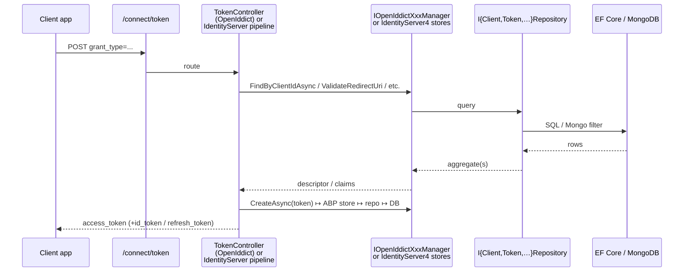

ABP v7.4.0 ships **two parallel families of authentication-server modules**: the older `Volo.Abp.IdentityServer.*` packs built around Duende's pre-v5 fork of IdentityServer4, and the newer `Volo.Abp.OpenIddict.*` packs that wrap the OpenIddict 4.x stack from Kévin Chalet. Both expose the same OAuth 2.0 / OpenID Connect surface (authorize / token / introspect / userinfo / device / revoke / logout), but they store, manage, and extend client/scope/grant data in very different ways. The templates from 7.0 onward default to OpenIddict; older solutions you maintain are very likely still on IdentityServer4. This page is the map for the eleven module pages under `modules/authservers/`.

## Why two stacks?

In **7.0+ the templates flipped** from IdentityServer4 to OpenIddict because Duende re-licensed IdentityServer under a commercial licence in late 2022; OpenIddict is MIT and actively developed by its single-author maintainer. The IdentityServer modules remain shipped in the monorepo at v7.4.0 — `modules/identityserver/src/Volo.Abp.IdentityServer.Domain` still targets `IdentityServer4 4.1.2` — so existing solutions keep working, but no new features land on that side.

## File inventory (top level)

| Path under `modules/` | What it contains |
| --- | --- |
| `identityserver/src/Volo.Abp.IdentityServer.Domain.Shared/` | Enums, consts (max-lengths), localization resources, ETOs for distributed events, extension-property registry |
| `identityserver/src/Volo.Abp.IdentityServer.Domain/` | Aggregates (`Client`, `ApiResource`, `ApiScope`, `IdentityResource`, `PersistedGrant`, `DeviceFlowCodes`), repository interfaces, ABP-flavoured IS4 stores, profile/CORS/secret-validator services, AutoMapper profile, `AbpIdentityServerDomainModule` |
| `identityserver/src/Volo.Abp.IdentityServer.EntityFrameworkCore/` | `IdentityServerDbContext`, `ConfigureIdentityServer()` model-creating extension, EF Core repositories |
| `identityserver/src/Volo.Abp.IdentityServer.MongoDB/` | `AbpIdentityServerMongoDbContext`, Mongo repositories |
| `identityserver/src/Volo.Abp.PermissionManagement.Domain.IdentityServer/` | Client-based `ApplicationPermissionManagementProvider` (out of scope for these pages) |
| `openiddict/src/Volo.Abp.OpenIddict.Domain.Shared/` | OpenIddict consts (column lengths), security log action codes, error codes, extension-property registry |
| `openiddict/src/Volo.Abp.OpenIddict.Domain/` | Aggregates (`OpenIddictApplication`, `OpenIddictAuthorization`, `OpenIddictScope`, `OpenIddictToken`), repository interfaces, ABP-flavoured stores/managers, models, caches, token-cleanup background worker |
| `openiddict/src/Volo.Abp.OpenIddict.AspNetCore/` | Authorize/Token/Logout/Userinfo controllers, claims-principal handlers, extension grants, wildcard-domain validators, `AbpOpenIddictAspNetCoreModule` |
| `openiddict/src/Volo.Abp.OpenIddict.EntityFrameworkCore/` | `OpenIddictDbContext`, EF Core repositories |
| `openiddict/src/Volo.Abp.OpenIddict.MongoDB/` | `OpenIddictMongoDbContext`, Mongo repositories |
| `openiddict/src/Volo.Abp.PermissionManagement.Domain.OpenIddict/` | Client-based permission provider (out of scope) |

## Page map

<CardGroup cols={2}>
  <Card title="IdentityServer Domain.Shared" href="/modules/authservers/identityserver-domain-shared">
    Consts, ETOs, localization, extension-property registry.
  </Card>
  <Card title="IdentityServer Domain" href="/modules/authservers/identityserver-domain">
    `Client`, `ApiResource`, `ApiScope`, `IdentityResource`, `PersistedGrant`, `DeviceFlowCodes`; IS4 store adapters.
  </Card>
  <Card title="IdentityServer Application.Contracts" href="/modules/authservers/identityserver-application-contracts">
    Pro-only DTOs and `IXxxAppService` interfaces — extension points and shape.
  </Card>
  <Card title="IdentityServer Application" href="/modules/authservers/identityserver-application">
    Pro management app services, ETO publishing, authorization policies.
  </Card>
  <Card title="IdentityServer EF Core" href="/modules/authservers/identityserver-efcore">
    `IdentityServerDbContext`, `ConfigureIdentityServer()`, EF repos.
  </Card>
  <Card title="IdentityServer MongoDB" href="/modules/authservers/identityserver-mongodb">
    `AbpIdentityServerMongoDbContext`, Mongo repos, ad-hoc queryable patterns.
  </Card>
  <Card title="OpenIddict Domain" href="/modules/authservers/openiddict-domain">
    `OpenIddictApplication/Authorization/Scope/Token`, ABP stores & managers, models, caches, cleanup.
  </Card>
  <Card title="OpenIddict Pro modules" href="/modules/authservers/openiddict-pro-modules">
    OSS extension points (`IAbpOpenIddict*Store`, `IAbpApplicationManager`) and how Pro modules build on them.
  </Card>
  <Card title="OpenIddict AspNetCore" href="/modules/authservers/openiddict-asp-net-core">
    `AbpOpenIddictAspNetCoreModule`, `TokenController`, claims-principal pipeline, extension grants, wildcard domains.
  </Card>
  <Card title="OpenIddict EF Core & MongoDB" href="/modules/authservers/openiddict-efcore-mongodb">
    `OpenIddictDbContext`, Mongo context, repositories, concurrency handlers.
  </Card>
</CardGroup>

## Shared architectural pattern

Both stacks follow the same DDD layering ABP uses elsewhere:

1. **Domain.Shared** — enums, constants (column lengths, action codes), localization resources, distributed event ETOs, extension-property registries.
2. **Domain** — aggregates extending `FullAuditedAggregateRoot<Guid>`, repository interfaces (`I…Repository`), and the *integration layer* that adapts the aggregates to the underlying OAuth library's contracts (`IdentityServer4`'s `IClientStore` / `IResourceStore` etc., or OpenIddict's `IOpenIddictApplicationStore<TApplication>` etc.).
3. **EF Core / MongoDB** — `DbContext` / `MongoDbContext` plus repository implementations.

The single biggest difference is **where the OAuth library lives in the dependency graph**:

- For **IdentityServer4**, the call to `services.AddIdentityServer(...)` happens *inside* `AbpIdentityServerDomainModule` (see `AbpIdentityServerDomainModule.AddIdentityServer`). The Domain layer itself wires the protocol pipeline.
- For **OpenIddict**, `AbpOpenIddictDomainModule` only wires the **core** (stores, managers, cache, models), and the **server** and HTTP endpoints come from `AbpOpenIddictAspNetCoreModule` via `services.AddOpenIddict().AddServer(...)`. This is cleaner — the Domain layer is HTTP-free.

Both modules implement a `TokenCleanupService` plus a `TokenCleanupBackgroundWorker` that prunes expired tokens/grants on a periodic loop. Both register an `[IgnoreMultiTenancy]` DbContext (auth-server tables live in the host DB even in multi-tenant setups). Both ignore tenant-only databases in their `OnModelCreating`.

## Token-request flow at a glance

## Which stack to document, which to use

- **Greenfield work** → OpenIddict pages: [Domain](/modules/authservers/openiddict-domain) → [AspNetCore](/modules/authservers/openiddict-asp-net-core) → [EF Core / MongoDB](/modules/authservers/openiddict-efcore-mongodb).
- **Existing 6.x or 7.0 solution still on IdentityServer4** → IdentityServer pages: [Domain](/modules/authservers/identityserver-domain) → [EF Core](/modules/authservers/identityserver-efcore).
- **Pro/management UI** → the Pro packages are not in the OSS repo; see [IdentityServer Application](/modules/authservers/identityserver-application) and [OpenIddict Pro modules](/modules/authservers/openiddict-pro-modules) for the OSS seams those Pro modules build on.

## Cross-links

- Bearer-token validation on resource APIs: [`framework/auth/jwt-bearer`](/framework/auth/jwt-bearer)
- Outbound OAuth & OIDC client integration: [`framework/auth/oauth`](/framework/auth/oauth), [`framework/auth/openid-connect`](/framework/auth/openid-connect)
- Identity store the auth servers authenticate against: [`modules/identity/domain`](/modules/identity/domain)
- Account UI that hosts login/consent against these servers: [`modules/account/web`](/modules/account/web)
