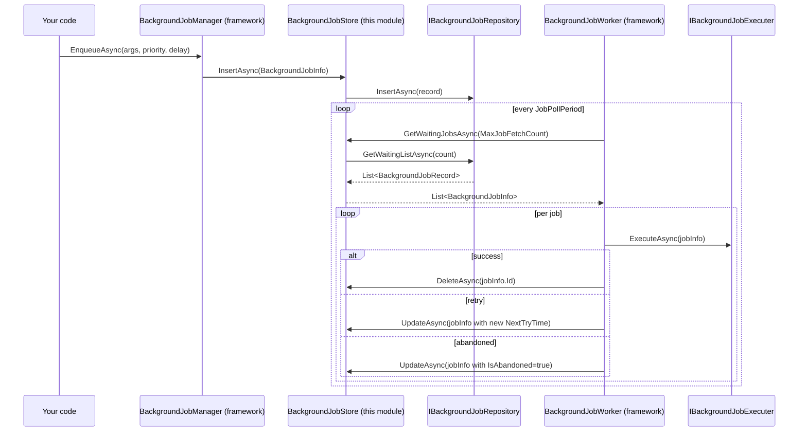

`Volo.Abp.BackgroundJobs.Domain` is a deliberately small layer: one aggregate, one repository interface, one AutoMapper profile, and one `IBackgroundJobStore` implementation that the framework's worker calls. There are no managers because the *behaviour* (priority math, retry math, abandonment threshold) lives in the framework — this module is the durable persistence contract for it.

## File inventory (`Volo/Abp/BackgroundJobs/`)

| File | Role |
| --- | --- |
| `AbpBackgroundJobsDomainModule.cs` | Depends on `AbpBackgroundJobsDomainSharedModule`, `AbpBackgroundJobsModule` (framework), `AbpAutoMapperModule`. Registers the AutoMapper profile and the AutoMapper object-mapper for `AbpBackgroundJobsDomainModule`. |
| `AbpBackgroundJobsDbProperties.cs` | `DbTablePrefix = "Abp"`, `DbSchema = null`, `ConnectionStringName = "AbpBackgroundJobs"`. |
| `BackgroundJobRecord.cs` | The persistent aggregate root. |
| `IBackgroundJobRepository.cs` | Repository contract — `IBasicRepository<BackgroundJobRecord, Guid>` + `GetWaitingListAsync`. |
| `BackgroundJobStore.cs` | `IBackgroundJobStore` implementation — adapter to the repository. |
| `BackgroundJobsDomainAutoMapperProfile.cs` | Maps `BackgroundJobInfo ⇄ BackgroundJobRecord`. |

## The aggregate

```csharp
public class BackgroundJobRecord : AggregateRoot<Guid>, IHasCreationTime
{
    public virtual string JobName { get; set; }
    public virtual string JobArgs { get; set; }
    public virtual short TryCount { get; set; }
    public virtual DateTime CreationTime { get; set; }
    public virtual DateTime NextTryTime { get; set; }
    public virtual DateTime? LastTryTime { get; set; }
    public virtual bool IsAbandoned { get; set; }
    public virtual BackgroundJobPriority Priority { get; set; }

    protected BackgroundJobRecord() { }
    public BackgroundJobRecord(Guid id) : base(id) { }
}
```

### Property reference

| Property | Source | Notes |
| --- | --- | --- |
| `JobName` | `BackgroundJobNameAttribute` on the job class, else `Type.AssemblyQualifiedName` | The framework resolves the type from this string at execution time. Always set `[BackgroundJobName]` for production. |
| `JobArgs` | `IJsonSerializer.Serialize(args)` | The framework's `BackgroundJobSerializer` is the default — overridable. |
| `TryCount` | 0 on insert; incremented by the framework when execution throws | Compared against `AbpBackgroundJobOptions.DefaultRetryCount` (job-level overrides allowed). |
| `CreationTime` | `Clock.Now` at `EnqueueAsync` | Used for `Newest` priority tie-breakers in monitoring tools. |
| `NextTryTime` | `Clock.Now + delay` (delay = 0 by default; framework applies back-off after failure) | The worker's `WHERE NextTryTime <= Clock.Now` filter. |
| `LastTryTime` | Set by the framework on each attempt | Null until first execution. |
| `IsAbandoned` | `true` after `TryCount` exceeds the retry count | Abandoned rows are skipped forever — purge them on a schedule. |
| `Priority` | `BackgroundJobPriority.Normal` if not specified | `short` underneath; the worker `OrderByDescending(Priority)`. |

The aggregate root inherits `IHasConcurrencyStamp` (from `AggregateRoot<Guid>`). `BackgroundJobStore.UpdateAsync` honours that stamp — if a row has been modified between `FindAsync` and `UpdateAsync`, the EF Core / MongoDB provider will throw `AbpDbConcurrencyException`. The store *swallows nothing*; the framework's worker treats that as a failed update and re-tries.

### Why `set;` on every property

Unlike most ABP aggregates this one has public setters. The reason is the AutoMapper profile's reverse map:

```csharp
CreateMap<BackgroundJobInfo, BackgroundJobRecord>()
    .ConstructUsing(x => new BackgroundJobRecord(x.Id))
    .Ignore(record => record.ConcurrencyStamp)
    .Ignore(record => record.ExtraProperties);
```

AutoMapper needs writable setters to copy every property in a single call. The framework's `BackgroundJobInfo` mutates `TryCount`, `NextTryTime`, `LastTryTime`, `IsAbandoned` between execution attempts, and the store calls `ObjectMapper.Map(jobInfo, record)` in `UpdateAsync` — closed properties would prevent the update.

## `IBackgroundJobRepository`

```csharp
public interface IBackgroundJobRepository : IBasicRepository<BackgroundJobRecord, Guid>
{
    Task<List<BackgroundJobRecord>> GetWaitingListAsync(int maxResultCount, CancellationToken cancellationToken = default);
}
```

It extends `IBasicRepository<>` (not `IRepository<>`) — only insert / update / delete / find-by-id, *no* `GetQueryableAsync`. If you need to query for monitoring (e.g. "how many jobs are abandoned"), inject `IRepository<BackgroundJobRecord, Guid>` separately.

`GetWaitingListAsync` is the worker's only read method. It must return rows in `(Priority desc, TryCount asc, NextTryTime asc)` order so the worker dispatches high-priority and fresh jobs first.

## `BackgroundJobStore`

The store is the `IBackgroundJobStore` implementation. The framework's `BackgroundJobManager.EnqueueAsync` calls `IBackgroundJobStore.InsertAsync(BackgroundJobInfo)`; the worker calls `GetWaitingJobsAsync`, then `UpdateAsync` or `DeleteAsync` per result:



The implementation:

```csharp
public class BackgroundJobStore : IBackgroundJobStore, ITransientDependency
{
    protected IBackgroundJobRepository BackgroundJobRepository { get; }
    protected IObjectMapper<AbpBackgroundJobsDomainModule> ObjectMapper { get; }

    public virtual async Task<BackgroundJobInfo> FindAsync(Guid jobId)
        => ObjectMapper.Map<BackgroundJobRecord, BackgroundJobInfo>(
            await BackgroundJobRepository.FindAsync(jobId));

    public virtual async Task InsertAsync(BackgroundJobInfo jobInfo)
        => await BackgroundJobRepository.InsertAsync(
            ObjectMapper.Map<BackgroundJobInfo, BackgroundJobRecord>(jobInfo));

    public virtual async Task<List<BackgroundJobInfo>> GetWaitingJobsAsync(int maxResultCount)
        => ObjectMapper.Map<List<BackgroundJobRecord>, List<BackgroundJobInfo>>(
            await BackgroundJobRepository.GetWaitingListAsync(maxResultCount));

    public virtual async Task DeleteAsync(Guid jobId)
        => await BackgroundJobRepository.DeleteAsync(jobId);

    public virtual async Task UpdateAsync(BackgroundJobInfo jobInfo)
    {
        var record = await BackgroundJobRepository.FindAsync(jobInfo.Id);
        if (record == null) return;  // already deleted by a peer worker
        ObjectMapper.Map(jobInfo, record);
        await BackgroundJobRepository.UpdateAsync(record);
    }
}
```

`UpdateAsync` is the only non-trivial method:

1. It reloads the record. This refreshes the `ConcurrencyStamp`. Without the reload, the framework's in-memory `BackgroundJobInfo` carries the *original* stamp and updates would fail under contention.
2. It silently returns if the row is gone. Two workers can have the same job in flight; if the first one succeeds and deletes the row, the second one's update is a no-op rather than an exception.

The trade-off: step 1 means each retry costs two roundtrips (SELECT then UPDATE). At high job volume this becomes visible — the Hangfire / RabbitMQ providers are pushed and avoid the SELECT.

## AutoMapper profile

```csharp
public class BackgroundJobsDomainAutoMapperProfile : Profile
{
    public BackgroundJobsDomainAutoMapperProfile()
    {
        CreateMap<BackgroundJobInfo, BackgroundJobRecord>()
            .ConstructUsing(x => new BackgroundJobRecord(x.Id))
            .Ignore(record => record.ConcurrencyStamp)
            .Ignore(record => record.ExtraProperties);

        CreateMap<BackgroundJobRecord, BackgroundJobInfo>();
    }
}
```

* `.ConstructUsing(x => new BackgroundJobRecord(x.Id))` uses the public constructor so AutoMapper does not need to call `protected BackgroundJobRecord()`.
* `Ignore(ConcurrencyStamp)` lets EF Core handle it.
* `Ignore(ExtraProperties)` prevents AutoMapper from clearing your custom metadata on update — useful when you've added `[BackgroundJobName]` plus custom flags via `IHasExtraProperties` (object extensions or direct dictionary writes).

The forward map (`BackgroundJobRecord → BackgroundJobInfo`) is uncustomized — the framework's DTO copies *all* properties including `ExtraProperties` and `ConcurrencyStamp`.

The profile is registered with `validate: true`:

```csharp
Configure<AbpAutoMapperOptions>(options =>
{
    options.AddProfile<BackgroundJobsDomainAutoMapperProfile>(validate: true);
});
```

So if you extend `BackgroundJobRecord` with a new property and forget to update `BackgroundJobInfo`, the app fails fast at startup.

## Length constants

```csharp
public static class BackgroundJobRecordConsts
{
    public static int MaxJobNameLength { get; set; } = 128;
    public static int MaxJobArgsLength { get; set; } = 1024 * 1024;   // 1 MB
}
```

Both are mutable statics, so:

```csharp
public override void PreConfigureServices(ServiceConfigurationContext ctx)
{
    BackgroundJobRecordConsts.MaxJobArgsLength = 4 * 1024 * 1024; // 4 MB
}
```

…will widen the column constraint on EF Core (column type stays `nvarchar(MAX)`, the `HasMaxLength` validator changes). MongoDB ignores `HasMaxLength` — the 16 MB document cap is the only ceiling there.

## Object extensions

`BackgroundJobRecord` implements `IHasExtraProperties` via `AggregateRoot<Guid>`. The module does **not** register it for `ObjectExtensionManager` configuration — i.e. there's no `BackgroundJobsModuleExtensionConsts`. If you want strongly-typed extra properties, register them yourself:

```csharp
ObjectExtensionManager.Instance
    .AddOrUpdateProperty<string, BackgroundJobRecord>("Source",
        opt => opt.Attributes.Add(new RequiredAttribute()));
```

The EF Core configurator calls `b.ApplyObjectExtensionMappings()` so the column appears in your next migration.

## Module configuration

```csharp
[DependsOn(
    typeof(AbpBackgroundJobsDomainSharedModule),
    typeof(AbpBackgroundJobsModule),
    typeof(AbpAutoMapperModule))]
public class AbpBackgroundJobsDomainModule : AbpModule
{
    public override void ConfigureServices(ServiceConfigurationContext context)
    {
        context.Services.AddAutoMapperObjectMapper<AbpBackgroundJobsDomainModule>();
        Configure<AbpAutoMapperOptions>(options =>
        {
            options.AddProfile<BackgroundJobsDomainAutoMapperProfile>(validate: true);
        });
    }
}
```

`AddAutoMapperObjectMapper<AbpBackgroundJobsDomainModule>` registers an `IObjectMapper<AbpBackgroundJobsDomainModule>` — that's the typed wrapper `BackgroundJobStore` injects. Using a *typed* mapper prevents profile clashes if your application has multiple modules that both map a `BackgroundJobInfo`-shaped DTO.

## Gotchas

* **No domain events.** Enqueuing a job is not an aggregate event; the framework does not emit anything to the local event bus. If you need "job enqueued" hooks, wrap `IBackgroundJobManager` with a decorator.
* **Public setters allow external mutation.** Code that injects `IRepository<BackgroundJobRecord>` directly can change `IsAbandoned` or `TryCount` on a live row. This is by design (so monitoring UIs can reset abandoned jobs) but means *don't* extend this aggregate with invariants — there's no constructor protection.
* **`UpdateAsync` reloads the row.** Every framework retry is `SELECT … FROM AbpBackgroundJobs WHERE Id = @id` + `UPDATE …`. At >1000 jobs/sec the read is the bottleneck.
* **`ExtraProperties` is preserved across updates.** Useful, but means you cannot rely on the dictionary being empty when a new `BackgroundJobInfo` is mapped onto an existing record — the dictionary on disk wins.
* **Profile is validated at startup.** Adding a property to the entity without updating the DTO fails the app, not the migration. Run `dotnet test` against your module in CI.

## Cross-links

* [Overview](/modules/background-jobs-module/overview) — the big picture and pipeline.
* [EF Core provider](/modules/background-jobs-module/efcore) — column types, indexes, EF query shape.
* [MongoDB provider](/modules/background-jobs-module/mongodb) — collection shape and indexing recommendations.
* [Framework / Background Jobs](/framework/background/background-jobs) — `IBackgroundJobManager`, `BackgroundJobWorker`, retry / abandonment semantics.
* [Object extensions](/framework/ddd/entities-and-aggregates) — adding columns without forking.
