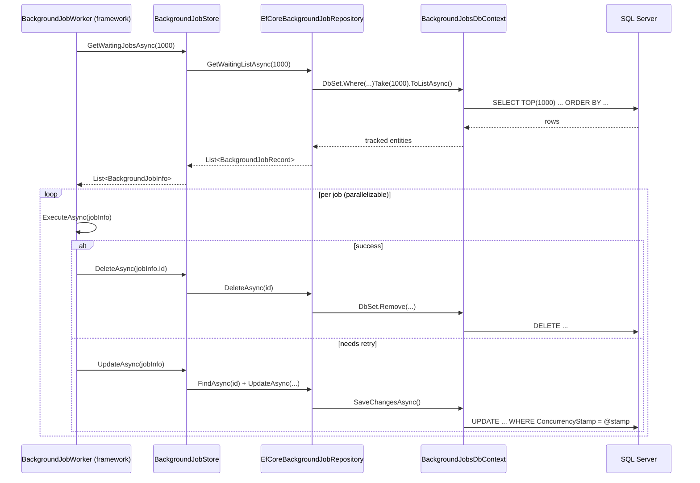

`Volo.Abp.BackgroundJobs.EntityFrameworkCore` is the smallest persistence module ABP ships: one DbContext, one table, one index, one repository, four methods. This page documents the schema and the *polling query plan* — the single LINQ expression the framework's worker executes every five seconds.

## File inventory (`Volo/Abp/BackgroundJobs/EntityFrameworkCore/`)

| File | Role |
| --- | --- |
| `AbpBackgroundJobsEntityFrameworkCoreModule.cs` | Registers `BackgroundJobsDbContext` and the repository. |
| `IBackgroundJobsDbContext.cs` | Marker interface — `DbSet<BackgroundJobRecord>`. Carries `[IgnoreMultiTenancy]` and `[ConnectionStringName("AbpBackgroundJobs")]`. |
| `BackgroundJobsDbContext.cs` | The concrete DbContext. |
| `BackgroundJobsDbContextModelCreatingExtensions.cs` | `ConfigureBackgroundJobs()` — the model mapping. |
| `EfCoreBackgroundJobRepository.cs` | `IBackgroundJobRepository`; LINQ query against the table. |

## Module wiring

```csharp
[DependsOn(typeof(AbpBackgroundJobsDomainModule), typeof(AbpEntityFrameworkCoreModule))]
public class AbpBackgroundJobsEntityFrameworkCoreModule : AbpModule
{
    public override void ConfigureServices(ServiceConfigurationContext context)
    {
        context.Services.AddAbpDbContext<BackgroundJobsDbContext>(options =>
        {
            options.AddRepository<BackgroundJobRecord, EfCoreBackgroundJobRepository>();
        });
    }
}
```

`AddRepository<BackgroundJobRecord, EfCoreBackgroundJobRepository>` replaces the default `IRepository<BackgroundJobRecord, Guid>` with the custom repository, so DI resolves `IBackgroundJobRepository` to it.

## DbContext

```csharp
[IgnoreMultiTenancy]
[ConnectionStringName(AbpBackgroundJobsDbProperties.ConnectionStringName)] // "AbpBackgroundJobs"
public class BackgroundJobsDbContext : AbpDbContext<BackgroundJobsDbContext>, IBackgroundJobsDbContext
{
    public DbSet<BackgroundJobRecord> BackgroundJobs { get; set; }

    protected override void OnModelCreating(ModelBuilder builder)
    {
        base.OnModelCreating(builder);
        builder.ConfigureBackgroundJobs();
    }
}
```

`[IgnoreMultiTenancy]` instructs ABP's data filter not to apply `IMultiTenant` predicates to this DbContext. The aggregate doesn't implement `IMultiTenant` anyway, but the attribute also prevents per-tenant DbContext routing when the framework's `[MultiTenancySides]` logic kicks in — jobs always go to the *host* database.

## Model mapping

```csharp
public static void ConfigureBackgroundJobs(this ModelBuilder builder)
{
    if (builder.IsTenantOnlyDatabase()) return;        // skip in tenant DBs

    builder.Entity<BackgroundJobRecord>(b =>
    {
        b.ToTable(AbpBackgroundJobsDbProperties.DbTablePrefix + "BackgroundJobs",
                  AbpBackgroundJobsDbProperties.DbSchema);

        b.ConfigureByConvention();

        b.Property(x => x.JobName).IsRequired().HasMaxLength(BackgroundJobRecordConsts.MaxJobNameLength);
        b.Property(x => x.JobArgs).IsRequired().HasMaxLength(BackgroundJobRecordConsts.MaxJobArgsLength);
        b.Property(x => x.TryCount).HasDefaultValue(0);
        b.Property(x => x.NextTryTime);
        b.Property(x => x.LastTryTime);
        b.Property(x => x.IsAbandoned).HasDefaultValue(false);
        b.Property(x => x.Priority).HasDefaultValue(BackgroundJobPriority.Normal);

        b.HasIndex(x => new { x.IsAbandoned, x.NextTryTime });

        b.ApplyObjectExtensionMappings();
    });

    builder.TryConfigureObjectExtensions<BackgroundJobsDbContext>();
}
```

Two non-obvious bits:

1. **`builder.IsTenantOnlyDatabase()`** is an ABP helper that returns `true` when the current DbContext is a per-tenant database. The job table is *skipped* in those — it lives only in the host (or in a "shared" DB). This is why `[IgnoreMultiTenancy]` is paired with this check; without both, a tenant migration would create a phantom jobs table per tenant.
2. **`HasDefaultValue` on `Priority`** uses the enum's underlying value (`15` for `Normal`). New rows that don't set priority explicitly default to `Normal`.

## Schema

### `AbpBackgroundJobs`

| Column | Type | Notes |
| --- | --- | --- |
| `Id` | `uniqueidentifier` PK | From `IGuidGenerator`. |
| `JobName` | `nvarchar(128)` NOT NULL | `Type.AssemblyQualifiedName` or `[BackgroundJobName]`. |
| `JobArgs` | `nvarchar(MAX)` NOT NULL | JSON; bounded by `MaxJobArgsLength` at the validation layer (1 MB). |
| `TryCount` | `smallint` NOT NULL DEFAULT 0 | |
| `CreationTime` | `datetime2` | |
| `NextTryTime` | `datetime2` | The worker filter. |
| `LastTryTime` | `datetime2` NULL | |
| `IsAbandoned` | `bit` NOT NULL DEFAULT 0 | |
| `Priority` | `int` NOT NULL DEFAULT 15 (Normal) | |
| `ExtraProperties` | `nvarchar(MAX)` | `IHasExtraProperties` JSON. |
| `ConcurrencyStamp` | `nvarchar(40)` | From `AggregateRoot`. |

The single index:

```csharp
b.HasIndex(x => new { x.IsAbandoned, x.NextTryTime });
```

This index supports the worker's filter `WHERE IsAbandoned = 0 AND NextTryTime <= @now`. It is *not* a covering index for the order-by clause (`Priority DESC, TryCount, NextTryTime`), so the query plan will sort after seek — fine at moderate row counts; consider widening the index to `(IsAbandoned, NextTryTime, Priority, TryCount)` if your jobs table exceeds ~100k waiting rows.

## The polling query

```csharp
public class EfCoreBackgroundJobRepository
    : EfCoreRepository<IBackgroundJobsDbContext, BackgroundJobRecord, Guid>, IBackgroundJobRepository
{
    protected IClock Clock { get; }

    public EfCoreBackgroundJobRepository(IDbContextProvider<IBackgroundJobsDbContext> dbContextProvider, IClock clock)
        : base(dbContextProvider) { Clock = clock; }

    public virtual async Task<List<BackgroundJobRecord>> GetWaitingListAsync(
        int maxResultCount, CancellationToken cancellationToken = default)
    {
        return await (await GetWaitingListQueryAsync(maxResultCount)).ToListAsync(GetCancellationToken(cancellationToken));
    }

    protected virtual async Task<IQueryable<BackgroundJobRecord>> GetWaitingListQueryAsync(int maxResultCount)
    {
        var now = Clock.Now;
        return (await GetDbSetAsync())
            .Where(t => !t.IsAbandoned && t.NextTryTime <= now)
            .OrderByDescending(t => t.Priority)
            .ThenBy(t => t.TryCount)
            .ThenBy(t => t.NextTryTime)
            .Take(maxResultCount);
    }
}
```

Generated SQL (SQL Server provider):

```sql
SELECT TOP(@__p_1) *
FROM [AbpBackgroundJobs] AS [b]
WHERE [b].[IsAbandoned] = CAST(0 AS bit)
  AND [b].[NextTryTime] <= @__now_0
ORDER BY [b].[Priority] DESC, [b].[TryCount], [b].[NextTryTime];
```

Note:

* **No `AsNoTracking()`.** The framework calls `UpdateAsync` on these records, so tracking is necessary. The change tracker carries each row until the worker's UoW completes; for `MaxJobFetchCount = 1000` that's 1000 tracked entities per poll — still small.
* **`Clock.Now` is materialized at the C# level**, then passed as a SQL parameter. If your `IClock` is `Utc`, the comparison is UTC-vs-UTC; mixing kinds across providers (e.g. UTC clock against `datetime2` stored as local) silently misses rows.
* **`Take(maxResultCount)` is required** for the index seek to be efficient. The default `MaxJobFetchCount` is 1000; raising it past several thousand can pin the worker for too long.

## Execution flow



Each UPDATE is gated by the `ConcurrencyStamp`. If two worker processes pulled the same row, the second UPDATE affects zero rows; EF Core throws `DbUpdateConcurrencyException`, ABP translates that to `AbpDbConcurrencyException`, and the framework's worker logs and moves on — the row is *already* being retried by the first worker.

## Migrations

The module ships no migrations of its own. You add `BackgroundJobsDbContext` to your application's migration DbContext:

```csharp
public class MyAppMigrationsDbContext : AbpDbContext<MyAppMigrationsDbContext>
{
    protected override void OnModelCreating(ModelBuilder builder)
    {
        base.OnModelCreating(builder);

        builder.ConfigureBackgroundJobs();
        // ... other modules ...
    }
}
```

Then `dotnet ef migrations add InitialBackgroundJobs --context MyAppMigrationsDbContext` produces:

```csharp
migrationBuilder.CreateTable(
    name: "AbpBackgroundJobs",
    columns: table => new
    {
        Id = table.Column<Guid>(nullable: false),
        ExtraProperties = table.Column<string>(nullable: true),
        ConcurrencyStamp = table.Column<string>(maxLength: 40, nullable: true),
        JobName = table.Column<string>(maxLength: 128, nullable: false),
        JobArgs = table.Column<string>(maxLength: 1048576, nullable: false),
        TryCount = table.Column<short>(nullable: false, defaultValue: (short)0),
        CreationTime = table.Column<DateTime>(nullable: false),
        NextTryTime = table.Column<DateTime>(nullable: false),
        LastTryTime = table.Column<DateTime>(nullable: true),
        IsAbandoned = table.Column<bool>(nullable: false, defaultValue: false),
        Priority = table.Column<int>(nullable: false, defaultValue: 15),
    },
    constraints: table => table.PrimaryKey("PK_AbpBackgroundJobs", x => x.Id));

migrationBuilder.CreateIndex(
    name: "IX_AbpBackgroundJobs_IsAbandoned_NextTryTime",
    table: "AbpBackgroundJobs",
    columns: new[] { "IsAbandoned", "NextTryTime" });
```

## Tuning at scale

* **Widen the index.** Replace `(IsAbandoned, NextTryTime)` with `(IsAbandoned, NextTryTime, Priority, TryCount)` — covers the ORDER BY.
* **Partition by `CreationTime`** if you retain abandoned rows for audit. The base index becomes monotone-increasing, which is friendly to B-tree maintenance.
* **Raise `BackgroundJobRecordConsts.MaxJobArgsLength`** before the first migration if you expect large payloads — the column is `nvarchar(MAX)` so storage is fine, but EF Core's validation throws on insert past the configured length.
* **Run the worker in a dedicated process.** The framework's `BackgroundJobWorker` is registered as a hosted service in every host that depends on `AbpBackgroundJobsModule`. Web apps + workers all poll the same table by default — disable the worker in web hosts with `Configure<AbpBackgroundJobOptions>(o => o.IsJobExecutionEnabled = false);`.

## Gotchas

* **No row-locks.** The query is `SELECT TOP(N) … ORDER BY …` without `WITH (UPDLOCK, READPAST)`. Multiple workers will read the same rows. ABP relies on `ConcurrencyStamp` to detect collisions, but that wastes execution: both workers run the job, only one wins the update. If duplicate execution is unacceptable, use Hangfire (per-job locks) or RabbitMQ (single-consumer queues).
* **`ConcurrencyStamp` can swallow updates silently.** When a worker can't update due to a stamp mismatch, ABP logs but does not block the dispatch loop — the job is "lost" to that worker but kept alive by the winner.
* **No partial-index by default.** A growing graveyard of `IsAbandoned = true` rows still consumes the index. Either purge regularly or change the index to a filtered one: `CREATE INDEX … WHERE [IsAbandoned] = 0`.
* **`Take(maxResultCount)` on SQL Server is `TOP`, not `OFFSET FETCH`.** That means pagination of the waiting-list query isn't supported — it's "take the top N." For monitoring queries inject `IRepository<BackgroundJobRecord, Guid>` separately.
* **Tenant-only databases skip the table.** Confirm with `IsTenantOnlyDatabase` that your host migration DbContext (not a tenant one) actually owns the jobs table. Misconfiguration is silent — the table simply isn't there and `BackgroundJobsDbContext` will throw on first read.

## Cross-links

* [Domain layer](./domain) — aggregate, repository contract, store.
* [MongoDB provider](./mongodb) — document layout, indexing gaps.
* [Framework / Background Jobs](/framework/background/background-jobs) — `BackgroundJobManager`, `BackgroundJobWorker`, options.
* [Background Jobs (Hangfire)](/framework/background/background-jobs-hangfire) — alternative store with row-level locking.
