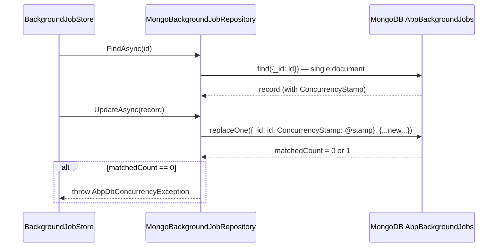
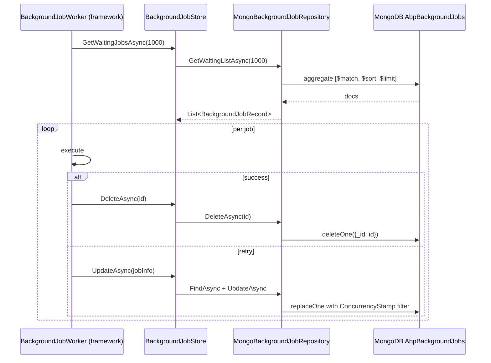

`Volo.Abp.BackgroundJobs.MongoDB` stores the single `BackgroundJobRecord` aggregate in a single collection. There are no nested documents — the schema is identical to the EF Core variant, just expressed as BSON. The only meaningful differences are *missing indexes* (you must create them yourself) and the LINQ provider that turns `OrderByDescending(Priority).ThenBy(TryCount)…` into an aggregation pipeline.

## File inventory (`Volo/Abp/BackgroundJobs/MongoDB/`)

| File | Role |
| --- | --- |
| `AbpBackgroundJobsMongoDbModule.cs` | Registers `BackgroundJobsMongoDbContext` and the repository. |
| `IBackgroundJobsMongoDbContext.cs` | Marker interface — `IMongoCollection<BackgroundJobRecord> BackgroundJobs`. Carries `[IgnoreMultiTenancy]` and `[ConnectionStringName("AbpBackgroundJobs")]`. |
| `BackgroundJobsMongoDbContext.cs` | The default concrete context. |
| `BackgroundJobsMongoDbContextExtensions.cs` | The `ConfigureBackgroundJobs()` mapping extension. |
| `MongoBackgroundJobRepository.cs` | `IBackgroundJobRepository` implementation. |

## Module wiring

```csharp
[DependsOn(typeof(AbpBackgroundJobsDomainModule), typeof(AbpMongoDbModule))]
public class AbpBackgroundJobsMongoDbModule : AbpModule
{
    public override void ConfigureServices(ServiceConfigurationContext context)
    {
        context.Services.AddMongoDbContext<BackgroundJobsMongoDbContext>(options =>
        {
            options.AddRepository<BackgroundJobRecord, MongoBackgroundJobRepository>();
        });
    }
}
```

## DbContext

```csharp
[IgnoreMultiTenancy]
[ConnectionStringName(AbpBackgroundJobsDbProperties.ConnectionStringName)] // "AbpBackgroundJobs"
public class BackgroundJobsMongoDbContext : AbpMongoDbContext, IBackgroundJobsMongoDbContext
{
    public IMongoCollection<BackgroundJobRecord> BackgroundJobs { get; set; }

    protected override void CreateModel(IMongoModelBuilder modelBuilder)
    {
        base.CreateModel(modelBuilder);
        modelBuilder.ConfigureBackgroundJobs();
    }
}

public static void ConfigureBackgroundJobs(this IMongoModelBuilder builder)
{
    builder.Entity<BackgroundJobRecord>(b =>
    {
        b.CollectionName = AbpBackgroundJobsDbProperties.DbTablePrefix + "BackgroundJobs"; // "AbpBackgroundJobs"
    });
}
```

Like every ABP MongoDB context, the only fluent config is the collection name. Property mapping is delegated to BSON's `BsonClassMap` — which picks up public/protected setters and serializes the underlying `short`/`bool`/`DateTime`/`int` values directly. The `BackgroundJobPriority` enum lands as its underlying `int` (15 for `Normal`).

## Document shape

```json
{
  "_id": "BSON UUID",
  "JobName": "Volo.Abp.BackgroundJobs.Sample.EmailSendingJob, MyApp.Application",
  "JobArgs": "{\"To\":\"user@example.com\",\"Subject\":\"Hi\"}",
  "TryCount": 0,
  "CreationTime": ISODate("2024-01-01T00:00:00Z"),
  "NextTryTime": ISODate("2024-01-01T00:00:00Z"),
  "LastTryTime": null,
  "IsAbandoned": false,
  "Priority": 15,
  "ExtraProperties": {},
  "ConcurrencyStamp": "..."
}
```

The document is small — even with a large `JobArgs` payload it's bounded by the framework's serializer choice. MongoDB's 16 MB document cap is the practical ceiling for `JobArgs`; this is *much* higher than the EF Core column's `BackgroundJobRecordConsts.MaxJobArgsLength = 1024 * 1024` (1 MB) constraint.

## Indexes — none ship with the module

`ConfigureBackgroundJobs` does nothing except set the collection name. **The module does not create indexes**, so the polling query starts as a collection scan. Add at minimum:

```javascript
db.AbpBackgroundJobs.createIndex(
  { IsAbandoned: 1, NextTryTime: 1, Priority: -1, TryCount: 1 },
  { name: "ix_waiting" }
);

// Optional: TTL purge of abandoned jobs after 30 days
db.AbpBackgroundJobs.createIndex(
  { LastTryTime: 1 },
  { name: "ix_ttl_abandoned",
    expireAfterSeconds: 2592000,
    partialFilterExpression: { IsAbandoned: true } }
);
```

The compound index above covers both the `WHERE` and the `ORDER BY` so the polling query becomes an indexed range scan instead of a sort. Without that, every poll loads the entire collection, sorts in memory, and takes the top N — fine at 1k rows, painful at 1M.

You can apply indexes from your app at startup:

```csharp
public override async Task OnApplicationInitializationAsync(ApplicationInitializationContext context)
{
    var ctx = context.ServiceProvider.GetRequiredService<IBackgroundJobsMongoDbContext>();
    await ctx.BackgroundJobs.Indexes.CreateOneAsync(new CreateIndexModel<BackgroundJobRecord>(
        Builders<BackgroundJobRecord>.IndexKeys
            .Ascending(x => x.IsAbandoned)
            .Ascending(x => x.NextTryTime)
            .Descending(x => x.Priority)
            .Ascending(x => x.TryCount)));
}
```

## Repository implementation

```csharp
public class MongoBackgroundJobRepository
    : MongoDbRepository<IBackgroundJobsMongoDbContext, BackgroundJobRecord, Guid>, IBackgroundJobRepository
{
    protected IClock Clock { get; }

    public MongoBackgroundJobRepository(
        IMongoDbContextProvider<IBackgroundJobsMongoDbContext> dbContextProvider,
        IClock clock) : base(dbContextProvider)
    {
        Clock = clock;
    }

    public virtual async Task<List<BackgroundJobRecord>> GetWaitingListAsync(
        int maxResultCount, CancellationToken cancellationToken = default)
    {
        return await (await GetWaitingListQuery(maxResultCount)).ToListAsync(GetCancellationToken(cancellationToken));
    }

    protected virtual async Task<IMongoQueryable<BackgroundJobRecord>> GetWaitingListQuery(
        int maxResultCount, CancellationToken cancellationToken = default)
    {
        var now = Clock.Now;
        return (await GetMongoQueryableAsync(cancellationToken))
            .Where(t => !t.IsAbandoned && t.NextTryTime <= now)
            .OrderByDescending(t => t.Priority)
            .ThenBy(t => t.TryCount)
            .ThenBy(t => t.NextTryTime)
            .Take(maxResultCount);
    }
}
```

LINQ-to-Mongo translates that to a single aggregation pipeline:

```javascript
[
  { $match: { IsAbandoned: false, NextTryTime: { $lte: ISODate("…") } } },
  { $sort: { Priority: -1, TryCount: 1, NextTryTime: 1 } },
  { $limit: 1000 }
]
```

With the compound index above, `$match` and `$sort` both use the index — confirm with `explain()`. Without it, MongoDB performs `COLLSCAN` + in-memory sort, which is gated by the 100 MB sort-memory limit (you can raise this with `allowDiskUse` but the LINQ helper doesn't).

## Concurrency on update

`BackgroundJobStore.UpdateAsync` reloads the record before updating, so on MongoDB the sequence is:



ABP's `MongoDbRepository` automatically appends `ConcurrencyStamp` to the filter on update. When two workers race, the slow one gets `matchedCount == 0` and the repository throws — same semantics as EF Core, different mechanism.

## Multi-tenancy

`[IgnoreMultiTenancy]` is on both the interface and the concrete context. This:

* disables the `IMultiTenant` data filter for reads (no `TenantId` predicate is appended);
* disables tenant-database routing (`ITenantStore` is not consulted for the connection string).

`BackgroundJobRecord` does not implement `IMultiTenant`, but the attribute also prevents misconfiguration if a custom subclass *did* try to implement it — the framework would silently ignore the filter, which is the correct behaviour for a shared worker pool.

## Polling sequence



## Connection-string isolation

A `connectionString` named `AbpBackgroundJobs` is honoured the same way as the EF Core provider. Typical layout:

```json
{
  "ConnectionStrings": {
    "Default": "mongodb://primary/myapp",
    "AbpBackgroundJobs": "mongodb://jobs/myapp_jobs"
  }
}
```

When the connection string name is absent, `IMongoDbConnections` falls back to `Default`. Storing jobs in a separate database is the recommended posture because the polling loop is read-heavy and benefits from a dedicated index hot set.

## Gotchas

* **No indexes ship.** This is the single biggest production gotcha — performance is fine in dev with 50 jobs and abysmal at 50k. See the create-index script above.
* **No filtered indexes.** Even after you add the compound index, `IsAbandoned = true` rows still consume B-tree space. Use a TTL or a partial index that excludes them.
* **`Take(maxResultCount)` is the only paging.** The waiting-list endpoint is "first N." For monitoring UIs, inject `IRepository<BackgroundJobRecord, Guid>` and use `GetMongoQueryableAsync` directly.
* **`JobArgs` size is 16 MB.** Bigger than the EF Core 1 MB cap but still bounded — and you almost certainly don't want multi-megabyte job arguments anyway.
* **`Priority` is stored as `int`.** Custom enum values must fit in `int`; the framework's enum runs to 25 (`High`).
* **Concurrency races silently swap losers.** Two workers picking the same job both execute it; the loser's `UPDATE` throws and is logged. Jobs must be idempotent or you must run a single worker.
* **No `[IgnoreMultiTenancy]` opt-out path.** If you fork `BackgroundJobRecord` to add `IMultiTenant`, you must remove the attribute from your *custom* context — copying `BackgroundJobsMongoDbContext` as-is will silently drop tenant filters.

## Cross-links

* [Domain layer](/modules/background-jobs-module/domain) — aggregate properties and `BackgroundJobStore`.
* [EF Core provider](/modules/background-jobs-module/efcore) — relational equivalent with shipped indexes.
* [Framework / Background Jobs](/framework/background/background-jobs) — manager, worker, retry semantics.
* [Framework / MongoDB infrastructure](/framework/persistence/mongodb) — `IMongoDbContextProvider`, repository base classes.
