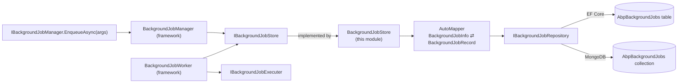
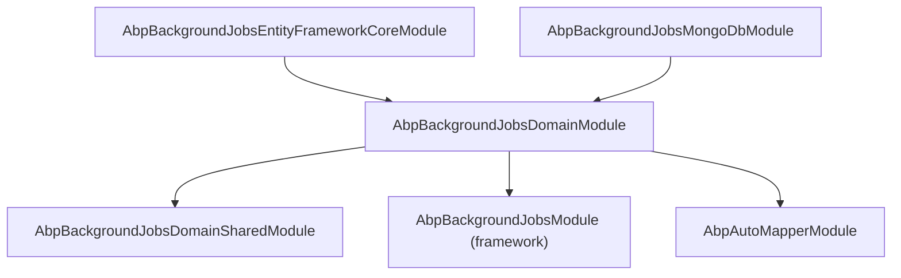

`Volo.Abp.BackgroundJobs` is the *persistence and store* half of ABP's built-in background-jobs system. The framework module `Volo.Abp.BackgroundJobs` (in `framework/src`) defines `IBackgroundJobManager`, `IBackgroundJobExecuter`, `IBackgroundJobStore`, the worker, and the priority / retry semantics. This application module ships:

* a single aggregate (`BackgroundJobRecord`),
* one repository (`IBackgroundJobRepository`) with EF Core and MongoDB implementations,
* an `IBackgroundJobStore` implementation (`BackgroundJobStore`) that maps the framework's `BackgroundJobInfo` DTO to/from the persistent record.

For *what jobs are*, how to write a `BackgroundJob<TArgs>`, when the worker polls, retry semantics, and Hangfire / Quartz / RabbitMQ alternatives, see [Background Jobs](/framework/background/background-jobs). This page and its siblings document the database-backed default store only.

## Package layout

| Package | Purpose |
| --- | --- |
| `Volo.Abp.BackgroundJobs.Domain.Shared` | `BackgroundJobRecordConsts` (column length defaults). |
| `Volo.Abp.BackgroundJobs.Domain` | `BackgroundJobRecord`, `IBackgroundJobRepository`, `BackgroundJobStore` (an `IBackgroundJobStore` implementation), AutoMapper profile. |
| `Volo.Abp.BackgroundJobs.EntityFrameworkCore` | `BackgroundJobsDbContext`, model-builder extension, `EfCoreBackgroundJobRepository`. |
| `Volo.Abp.BackgroundJobs.MongoDB` | `BackgroundJobsMongoDbContext`, mapping extension, `MongoBackgroundJobRepository`. |
| `Volo.Abp.BackgroundJobs.Installer` | NuGet metapackage. |

No Application, HTTP API or UI layer ships in OSS — the OSS package gives you durable enqueue + polling. If you need a UI to inspect / re-queue jobs, the ABP Commercial *Background Jobs Pro* module ships those.

## How it slots into the framework



* `IBackgroundJobManager.EnqueueAsync` serializes args, creates a `BackgroundJobInfo`, and calls `IBackgroundJobStore.InsertAsync`.
* The framework's `BackgroundJobWorker` (a `PeriodicBackgroundWorkerBase`) ticks every `AbpBackgroundJobWorkerOptions.JobPollPeriod` (default 5 s), calls `GetWaitingJobsAsync`, dispatches each one to `IBackgroundJobExecuter`, then `UpdateAsync` (on transient failure) or `DeleteAsync` (on success / permanent abandonment).
* `BackgroundJobStore` (this module) is the `IBackgroundJobStore` that bridges those calls to a relational or document repository.

When `BackgroundJobStore` is not registered (because you removed the persistence module), the framework falls back to an `InMemoryBackgroundJobStore` — jobs are lost on process restart. The whole point of this module is durable enqueue.

## The aggregate

```csharp
public class BackgroundJobRecord : AggregateRoot<Guid>, IHasCreationTime
{
    public virtual string JobName { get; set; }     // AssemblyQualifiedName of the job class
    public virtual string JobArgs { get; set; }     // JSON-serialized arguments
    public virtual short TryCount { get; set; }     // incremented on each failure
    public virtual DateTime CreationTime { get; set; }
    public virtual DateTime NextTryTime { get; set; }
    public virtual DateTime? LastTryTime { get; set; }
    public virtual bool IsAbandoned { get; set; }
    public virtual BackgroundJobPriority Priority { get; set; }
}
```

That's the entire data model. `BackgroundJobPriority` is the framework enum — `Low = 5, BelowNormal = 10, Normal = 15, AboveNormal = 20, High = 25` — sortable as `short`.

The job *itself* — the `IBackgroundJob<TArgs>` implementation — is not persisted; only its assembly-qualified type name (`JobName`) and the serialized args. The framework resolves the type via `Type.GetType(record.JobName)` at execution time, so renaming/moving job classes breaks pending jobs. Use [JobName attribute](/framework/background/background-jobs) (`[BackgroundJobName("invoice-email")]`) to decouple the persisted key from the C# type name.

## Connection-string isolation

```csharp
public static class AbpBackgroundJobsDbProperties
{
    public static string DbTablePrefix { get; set; } = AbpCommonDbProperties.DbTablePrefix; // "Abp"
    public static string DbSchema { get; set; } = AbpCommonDbProperties.DbSchema;           // null
    public const string ConnectionStringName = "AbpBackgroundJobs";
}
```

If you set a connection string named `AbpBackgroundJobs`, the jobs table lives in a separate database. In a microservices setup each service usually owns its own job database so one service's worker can't grab another's jobs.

## `BackgroundJobStore`

```csharp
public class BackgroundJobStore : IBackgroundJobStore, ITransientDependency
{
    public virtual async Task<BackgroundJobInfo> FindAsync(Guid jobId)
        => ObjectMapper.Map<BackgroundJobRecord, BackgroundJobInfo>(await BackgroundJobRepository.FindAsync(jobId));

    public virtual async Task InsertAsync(BackgroundJobInfo jobInfo)
        => await BackgroundJobRepository.InsertAsync(ObjectMapper.Map<BackgroundJobInfo, BackgroundJobRecord>(jobInfo));

    public virtual async Task<List<BackgroundJobInfo>> GetWaitingJobsAsync(int maxResultCount)
        => ObjectMapper.Map<List<BackgroundJobRecord>, List<BackgroundJobInfo>>(
            await BackgroundJobRepository.GetWaitingListAsync(maxResultCount));

    public virtual async Task DeleteAsync(Guid jobId)
        => await BackgroundJobRepository.DeleteAsync(jobId);

    public virtual async Task UpdateAsync(BackgroundJobInfo jobInfo)
    {
        var record = await BackgroundJobRepository.FindAsync(jobInfo.Id);
        if (record == null) return;            // job was already deleted by another worker
        ObjectMapper.Map(jobInfo, record);
        await BackgroundJobRepository.UpdateAsync(record);
    }
}
```

The mapper is `BackgroundJobsDomainAutoMapperProfile`:

```csharp
CreateMap<BackgroundJobInfo, BackgroundJobRecord>()
    .ConstructUsing(x => new BackgroundJobRecord(x.Id))
    .Ignore(record => record.ConcurrencyStamp)
    .Ignore(record => record.ExtraProperties);

CreateMap<BackgroundJobRecord, BackgroundJobInfo>();
```

`ConcurrencyStamp` is left to EF Core / Mongo — overwriting it from the mapper would defeat optimistic concurrency. `ExtraProperties` is intentionally untouched so you can attach metadata via `IHasExtraProperties` without losing it on update.

## Waiting-jobs query

The "give me the next batch of jobs to run" query is identical between EF Core and MongoDB:

```csharp
return (await GetDbSetAsync())   // or GetMongoQueryableAsync()
    .Where(t => !t.IsAbandoned && t.NextTryTime <= now)
    .OrderByDescending(t => t.Priority)
    .ThenBy(t => t.TryCount)
    .ThenBy(t => t.NextTryTime)
    .Take(maxResultCount);
```

The ordering keeps high-priority jobs ahead of low-priority ones, then favours the *least-retried* (fresh) jobs, then breaks ties by earliest `NextTryTime`. `maxResultCount` is `AbpBackgroundJobWorkerOptions.MaxJobFetchCount` (default 1000) — the framework's worker pulls a whole batch per poll then executes them in parallel.

## Module dependency graph



`AbpBackgroundJobsDomainModule` depends on the framework's `AbpBackgroundJobsModule` because it implements `IBackgroundJobStore` from that assembly. The framework module already runs in your app the moment you depend on `Volo.Abp.BackgroundJobs.Abstractions` — the domain module just supplies the persistence implementation.

## Multi-tenancy

```csharp
[IgnoreMultiTenancy]
[ConnectionStringName(AbpBackgroundJobsDbProperties.ConnectionStringName)]
public class BackgroundJobsDbContext : AbpDbContext<BackgroundJobsDbContext>, IBackgroundJobsDbContext
```

Both `BackgroundJobsDbContext` and `BackgroundJobsMongoDbContext` carry `[IgnoreMultiTenancy]`. Jobs live in the host database regardless of which tenant enqueued them — this is mandatory because the worker resolves jobs without a tenant context.

If you need *tenant-scoped* execution, set `jobInfo.TenantId` (via the `[UnitOfWork]` ambient context) at enqueue time; the framework's `BackgroundJobExecuter` opens the tenant scope when it runs your job. The persisted record itself is host-owned; the tenant id flows in `JobArgs` (the framework's `BackgroundJobInfo` carries `TenantId` as part of the JSON envelope, not as a column on this record).

## Picking a provider

```csharp
[DependsOn(typeof(AbpBackgroundJobsEntityFrameworkCoreModule))]
public class MyAppModule : AbpModule { }

// — or —
[DependsOn(typeof(AbpBackgroundJobsMongoDbModule))]
public class MyAppModule : AbpModule { }
```

The choice does not affect *behaviour* — only physical layout. Both implementations:

* serve `IBackgroundJobRepository.GetWaitingListAsync` with the same ordering;
* let the worker `Take(maxResultCount)` per poll;
* use `IClock.Now` to compute `NextTryTime <= now`.

Differences:

* EF Core declares an index on `(IsAbandoned, NextTryTime)` — the MongoDB provider declares no indexes (see [MongoDB provider](./mongodb)).
* EF Core stores `JobArgs` as `nvarchar(MAX)` capped at `BackgroundJobRecordConsts.MaxJobArgsLength` (1 MB); MongoDB stores it as a string field with the 16 MB document limit as the practical cap.
* EF Core delete-by-id is a parameterized `DELETE`; MongoDB delete-by-id is a `_id` filter.

## Gotchas

* **Polling latency, not pushed.** The default poll period is 5 seconds — enqueues are not "instant." If you need sub-second latency, see [Background Jobs (RabbitMQ)](/framework/background/background-jobs-rabbitmq) or [Hangfire](/framework/background/background-jobs-hangfire).
* **No clustering coordination.** Multiple worker processes will all poll the same table. The framework's `BackgroundJobWorker` does *not* lock rows; it reads, executes, then deletes/updates. Two workers can race on the same job. ABP's default mitigations are "jobs should be idempotent" and "the loser deletes a row that's already gone." If you cannot make jobs idempotent, run one worker, use Hangfire (which has per-job locks), or implement a leader election in front of `BackgroundJobWorker`.
* **`JobName` is `AssemblyQualifiedName` by default.** Renaming a job class strands pending jobs. Use `[BackgroundJobName("stable-key")]` from day one.
* **`JobArgs` is a JSON string column.** It honours `MaxJobArgsLength = 1024 * 1024` on EF Core; very large payloads should reference an external blob (e.g. by id) rather than embed.
* **`IsAbandoned = true` rows never get re-tried automatically.** The default abandonment threshold is `AbpBackgroundJobWorkerOptions.JobMaxRetryCount = 3`. Abandoned rows pile up — schedule a purge job or a Pro-module UI to inspect them.

## Cross-links

* [Framework / Background Jobs](/framework/background/background-jobs) — manager, worker, retry semantics, abstractions.
* [Background Jobs (Hangfire)](/framework/background/background-jobs-hangfire) — alternative store/worker.
* [Background Jobs (RabbitMQ)](/framework/background/background-jobs-rabbitmq) — pushed delivery.
* [Domain layer](./domain) — entity properties, store mapping, AutoMapper profile.
* [EF Core provider](./efcore) — schema, indexes, query plan.
* [MongoDB provider](./mongodb) — collection, document shape, indexing recommendations.
