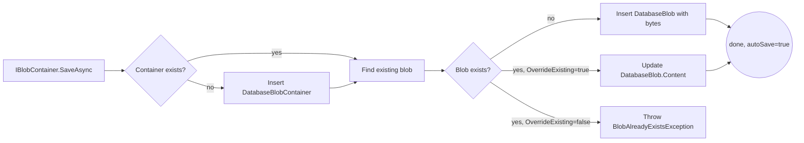

`Volo.Abp.BlobStoring.Database.Domain` is the only layer of this module that contains business code. It defines two aggregate roots, two repository contracts, one `BlobProviderBase` implementation, and a one-line opt-in extension method. The EF Core and MongoDB packages just implement the repositories.

## File inventory

```
Volo.Abp.BlobStoring.Database.Domain/Volo/Abp/BlobStoring/Database/
├── AbpBlobStoringDatabaseDbProperties.cs
├── BlobStoringDatabaseDomainModule.cs
├── DatabaseBlob.cs
├── DatabaseBlobContainer.cs
├── DatabaseBlobContainerConfigurationExtensions.cs
├── DatabaseBlobProvider.cs
├── IDatabaseBlobContainerRepository.cs
└── IDatabaseBlobRepository.cs
```

The `Domain.Shared` sibling supplies length constants (`DatabaseBlobConsts`, `DatabaseContainerConsts`) and the localization resource — see [overview](/modules/blob-storing-database/overview#constants--limits).

## `DatabaseBlobContainer`

A *named scope* per tenant. One row per (tenant, name) tuple is created lazily the first time something is stored in it.

```csharp
public class DatabaseBlobContainer : AggregateRoot<Guid>, IMultiTenant
{
    public virtual Guid? TenantId { get; protected set; }

    public virtual string Name { get; protected set; }

    protected DatabaseBlobContainer() { }

    public DatabaseBlobContainer(Guid id, [NotNull] string name, Guid? tenantId = null)
        : base(id)
    {
        Name = Check.NotNullOrWhiteSpace(name, nameof(name),
            DatabaseContainerConsts.MaxNameLength);
        TenantId = tenantId;
    }
}
```

Key points:

* **Only two columns of state** — name + tenant id. Everything else is the inherited `AggregateRoot<Guid>` plumbing.
* The constructor is `public`, but `DatabaseBlobProvider` is the only thing in the module that actually calls it.
* `Name` is validated via `Check.NotNullOrWhiteSpace` with the `MaxNameLength = 128` cap, mirrored by `HasMaxLength(128)` in the EF Core mapping. Going above that throws `AbpException` long before EF round-trips to the database.

## `DatabaseBlob`

A single binary item inside a container.

```csharp
public class DatabaseBlob : AggregateRoot<Guid>, IMultiTenant
{
    public virtual Guid ContainerId { get; protected set; }

    public virtual Guid? TenantId { get; protected set; }

    public virtual string Name { get; protected set; }

    [DisableAuditing]
    public virtual byte[] Content { get; protected set; }

    protected DatabaseBlob() { }

    public DatabaseBlob(Guid id, Guid containerId, [NotNull] string name,
        [NotNull] byte[] content, Guid? tenantId = null) : base(id)
    {
        Name = Check.NotNullOrWhiteSpace(name, nameof(name),
            DatabaseBlobConsts.MaxNameLength);
        ContainerId = containerId;
        Content = CheckContentLength(content);
        TenantId = tenantId;
    }

    public virtual void SetContent(byte[] content) =>
        Content = CheckContentLength(content);

    protected virtual byte[] CheckContentLength(byte[] content)
    {
        Check.NotNull(content, nameof(content));

        if (content.Length >= DatabaseBlobConsts.MaxContentLength)
        {
            throw new AbpException(
                $"Blob content size cannot be more than " +
                $"{DatabaseBlobConsts.MaxContentLength} Bytes.");
        }

        return content;
    }
}
```

Highlights:

* The `[DisableAuditing]` attribute on `Content` is critical. Without it the audit-log serializer would try to serialise gigabytes of bytes to the change log every time you saved.
* `CheckContentLength` is `protected virtual`, so a derived class can lift or replace the limit. Default ceiling is `int.MaxValue` (2 GB), but practical limits are much lower — see gotchas.
* `IMultiTenant` lets the standard EF Core data filter keep tenants from reading each other's blobs.

The reciprocal relationship is enforced in the model builder, not on the entity itself: `DatabaseBlob.ContainerId` has an FK to `DatabaseBlobContainer.Id`, but there is no navigation property in either direction — keeping the aggregates independently loadable.

## Repository contracts

Both interfaces inherit `IBasicRepository<TEntity, Guid>` so they expose only the operations the provider needs.

```csharp
public interface IDatabaseBlobContainerRepository
    : IBasicRepository<DatabaseBlobContainer, Guid>
{
    Task<DatabaseBlobContainer> FindAsync([NotNull] string name,
        CancellationToken cancellationToken = default);
}

public interface IDatabaseBlobRepository : IBasicRepository<DatabaseBlob, Guid>
{
    Task<DatabaseBlob> FindAsync(Guid containerId, [NotNull] string name,
        CancellationToken cancellationToken = default);

    Task<bool> ExistsAsync(Guid containerId, [NotNull] string name,
        CancellationToken cancellationToken = default);

    Task<bool> DeleteAsync(Guid containerId, [NotNull] string name,
        bool autoSave = false, CancellationToken cancellationToken = default);
}
```

EF Core and Mongo implement these in the obvious way — see [EF Core](/modules/blob-storing-database/efcore) and [MongoDB](/modules/blob-storing-database/mongodb).

## `DatabaseBlobProvider`

The class that bridges `IBlobContainer` to the two repositories. It extends `BlobProviderBase`, registers as `ITransientDependency`, and implements all four async operations.

### Save

```csharp
public async override Task SaveAsync(BlobProviderSaveArgs args)
{
    var container = await GetOrCreateContainerAsync(
        args.ContainerName, args.CancellationToken);

    var blob = await DatabaseBlobRepository.FindAsync(
        container.Id, args.BlobName, args.CancellationToken);

    var content = await args.BlobStream.GetAllBytesAsync(args.CancellationToken);

    if (blob != null)
    {
        if (!args.OverrideExisting)
        {
            throw new BlobAlreadyExistsException(
                $"Saving BLOB '{args.BlobName}' does already exists in the " +
                $"container '{args.ContainerName}'! Set " +
                $"{nameof(args.OverrideExisting)} if it should be overwritten.");
        }

        blob.SetContent(content);
        await DatabaseBlobRepository.UpdateAsync(blob, autoSave: true);
    }
    else
    {
        blob = new DatabaseBlob(GuidGenerator.Create(), container.Id,
            args.BlobName, content, CurrentTenant.Id);
        await DatabaseBlobRepository.InsertAsync(blob, autoSave: true);
    }
}
```

Walk-through:

1. **Container resolution** uses `GetOrCreateContainerAsync`, a small `protected virtual` helper that calls `FindAsync(name)` then `InsertAsync(new …)` when missing — no `Insert-or-Update` atomic upsert.
2. **Stream → byte[]** via the framework's `Stream.GetAllBytesAsync` extension. The provider materialises the entire stream in memory before saving. There is no chunked upload path.
3. **Overwrite check** matches the framework convention: if the blob already exists and the caller did not opt-in via `BlobProviderSaveArgs.OverrideExisting`, `BlobAlreadyExistsException` is thrown.
4. **`autoSave: true`** on the insert/update bypasses the ambient unit of work for the blob entity. The blob row is flushed even if the caller never commits its UoW. This matches what other providers (Azure, S3, …) do — once the provider call returns, the bytes are *durable*.

### Delete / Exists / Get

All three follow the same shape: look up the container by name, return `false`/`null` if it isn't there, otherwise delegate to the blob repository.

```csharp
public async override Task<Stream> GetOrNullAsync(BlobProviderGetArgs args)
{
    var container = await DatabaseBlobContainerRepository.FindAsync(
        args.ContainerName, args.CancellationToken);

    if (container == null) return null;

    var blob = await DatabaseBlobRepository.FindAsync(
        container.Id, args.BlobName, args.CancellationToken);

    return blob == null ? null : new MemoryStream(blob.Content);
}
```

Note that `GetOrNullAsync` always returns a `MemoryStream` over a fresh byte array. There is no streaming path — the caller will hold the full payload in memory before forwarding it.

### Container creation race

`GetOrCreateContainerAsync` is *not* protected against two requests racing to create the same container name:

```csharp
protected virtual async Task<DatabaseBlobContainer> GetOrCreateContainerAsync(
    string name, CancellationToken cancellationToken = default)
{
    var container = await DatabaseBlobContainerRepository.FindAsync(name, cancellationToken);
    if (container != null) return container;

    container = new DatabaseBlobContainer(GuidGenerator.Create(), name, CurrentTenant.Id);
    await DatabaseBlobContainerRepository.InsertAsync(container,
        cancellationToken: cancellationToken);

    return container;
}
```

If two concurrent uploads target a brand-new container, both can land in the "not exists, insert" branch. Real-world this almost never happens — container names are typed and known at startup — but the EF Core mapping does **not** put a unique index on `(TenantId, Name)`, so the duplicate insert succeeds and you end up with two containers of the same name. The second upload will then resolve to a (slightly random) container depending on row order. See [gotchas](#gotchas).

## `UseDatabase()` opt-in

The fluent extension is one line of code:

```csharp
public static class DatabaseBlobContainerConfigurationExtensions
{
    public static BlobContainerConfiguration UseDatabase(
        this BlobContainerConfiguration containerConfiguration)
    {
        containerConfiguration.ProviderType = typeof(DatabaseBlobProvider);
        return containerConfiguration;
    }
}
```

Usage in any depending module:

```csharp
Configure<AbpBlobStoringOptions>(options =>
{
    options.Containers.Configure<AvatarContainer>(c => c.UseDatabase());
});
```

## Module wiring

`BlobStoringDatabaseDomainModule` does two things:

```csharp
[DependsOn(
    typeof(AbpDddDomainModule),
    typeof(AbpBlobStoringModule),
    typeof(BlobStoringDatabaseDomainSharedModule)
)]
public class BlobStoringDatabaseDomainModule : AbpModule
{
    public override void ConfigureServices(ServiceConfigurationContext context)
    {
        Configure<AbpBlobStoringOptions>(options =>
        {
            options.Containers.ConfigureDefault(container =>
            {
                if (container.ProviderType == null)
                {
                    container.UseDatabase();
                }
            });
        });
    }
}
```

It declares the framework dependency on `Volo.Abp.BlobStoring`, depends on its own `Domain.Shared`, and registers a default-container hook that *only* applies when the application did not already pick a provider. This means simply referencing the package promotes the database provider to "fallback default".

## `AbpBlobStoringDatabaseDbProperties`

```csharp
public static class AbpBlobStoringDatabaseDbProperties
{
    public static string DbTablePrefix { get; set; } = AbpCommonDbProperties.DbTablePrefix;
    public static string DbSchema { get; set; } = AbpCommonDbProperties.DbSchema;
    public const string ConnectionStringName = "AbpBlobStoring";
}
```

Three knobs:

* `DbTablePrefix` — prepended to `Blobs` / `BlobContainers`. Default: `"Abp"`.
* `DbSchema` — SQL schema, or `null` to use the default.
* `ConnectionStringName` — the [Volo.Abp.Data](/framework/data/intro) connection-string selector. Setting `"ConnectionStrings": { "AbpBlobStoring": "…" }` in your `appsettings.json` routes the BLOB DbContext to a different physical database. **Recommended for production**: blobs grow fast.

## Flow recap



## Gotchas

* **Container creation race.** The repository contract has no `InsertOrFind` upsert and the model has no unique index. If two requests create the same brand-new container concurrently you can get duplicate rows. Workaround: pre-create your containers in a data seeder, or add a unique constraint via your own migration.
* **Whole-blob materialisation.** Both save and get buffer the entire payload in memory (`Stream.GetAllBytesAsync` and `new MemoryStream(blob.Content)`). Avoid this provider for very large files — even at 100 MB the GC churn is noticeable.
* **2 GB hard limit.** `DatabaseBlobConsts.MaxContentLength` defaults to `int.MaxValue`. The byte array allocation will fail well before that on most runtimes; in practice keep below ~64 MB.
* **`autoSave: true` semantics.** `SaveAsync` flushes the blob row *outside* the ambient UoW. If a later step in the same UoW throws, the blob still ends up persisted. Modules that need transactional bytes (e.g. wire to a database row) must compensate — typically by recording the upload in a domain event handler that runs *after* the UoW completes.
* **Audit logger.** `[DisableAuditing]` on `Content` prevents the audit log from copying the payload, but the `Name`/`ContainerId` of every change is still logged.
* **Default capture.** Because `ConfigureDefault` only sets `UseDatabase()` when `ProviderType == null`, the order of `DependsOn` matters. If another module sets a different default *before* this module's `ConfigureServices` runs, this module is a no-op. Modules are configured in dependency order, so this is normally what you want.

## Cross-links

* [Overview & package map](/modules/blob-storing-database/overview)
* [EF Core layer](/modules/blob-storing-database/efcore) — repository implementations and table layout.
* [MongoDB layer](/modules/blob-storing-database/mongodb) — collection layout.
* [Framework BLOB Storing intro](/framework/blob-storing/intro) — `IBlobContainer`, `BlobProviderBase`, `BlobProviderSaveArgs`.
* [CMS Kit Media Descriptors](/modules/cms-kit/domain) — the canonical consumer.
