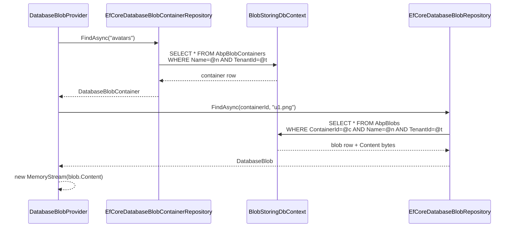

The EF Core layer turns the [domain](/modules/blob-storing-database/domain) contracts into a working `DbContext` and two `EfCoreRepository<…>` classes. Because the BLOB tables can grow much faster than the rest of an application's data, the package picks a dedicated `ConnectionStringName` (`AbpBlobStoring`) so deployments can route them to a separate database.

## File inventory

```
Volo.Abp.BlobStoring.Database.EntityFrameworkCore/Volo/Abp/BlobStoring/Database/EntityFrameworkCore/
├── BlobStoringDatabaseEntityFrameworkCoreModule.cs
├── BlobStoringDbContext.cs
├── BlobStoringDbContextModelCreatingExtensions.cs
├── EfCoreDatabaseBlobContainerRepository.cs
├── EfCoreDatabaseBlobRepository.cs
└── IBlobStoringDbContext.cs
```

## `IBlobStoringDbContext` & `BlobStoringDbContext`

```csharp
[ConnectionStringName(AbpBlobStoringDatabaseDbProperties.ConnectionStringName)]
public interface IBlobStoringDbContext : IEfCoreDbContext
{
    DbSet<DatabaseBlobContainer> BlobContainers { get; }
    DbSet<DatabaseBlob> Blobs { get; }
}

[ConnectionStringName(AbpBlobStoringDatabaseDbProperties.ConnectionStringName)]
public class BlobStoringDbContext : AbpDbContext<BlobStoringDbContext>, IBlobStoringDbContext
{
    public DbSet<DatabaseBlobContainer> BlobContainers { get; set; }
    public DbSet<DatabaseBlob> Blobs { get; set; }

    public BlobStoringDbContext(DbContextOptions<BlobStoringDbContext> options)
        : base(options) { }

    protected override void OnModelCreating(ModelBuilder builder)
    {
        base.OnModelCreating(builder);
        builder.ConfigureBlobStoring();
    }
}
```

The `[ConnectionStringName]` attribute is read by `Volo.Abp.Data` to look up `ConnectionStrings:AbpBlobStoring`. If that key is missing, it falls back to `Default`. The interface carries the same attribute because repositories are typed against the interface — the connection-string lookup happens against the closed generic, and the framework needs the attribute on whatever type it resolves.

### Sharing vs. separating the DbContext

A typical ABP application has one *physical* `DbContext` (e.g. `AppDbContext`) that implements many interfaces — `IIdentityDbContext`, `IBlobStoringDbContext`, … — so all migrations live in one assembly. This is exactly the pattern used by the ABP solution templates: replace `BlobStoringDbContext` with an `IBlobStoringDbContext`-implementing `AppDbContext` and add `builder.ConfigureBlobStoring()` to its `OnModelCreating`. Set the framework option to swap registrations:

```csharp
context.Services.AddAbpDbContext<AppDbContext>(options =>
{
    options.ReplaceDbContext<IBlobStoringDbContext>();
});
```

That makes `IDatabaseBlobRepository` resolve against `AppDbContext` while keeping `BlobStoringDbContext` available for tooling.

## Model configuration

`ConfigureBlobStoring()` is the single source of truth for the BLOB tables:

```csharp
public static void ConfigureBlobStoring(this ModelBuilder builder)
{
    Check.NotNull(builder, nameof(builder));

    builder.Entity<DatabaseBlobContainer>(b =>
    {
        b.ToTable(AbpBlobStoringDatabaseDbProperties.DbTablePrefix + "BlobContainers",
            AbpBlobStoringDatabaseDbProperties.DbSchema);
        b.ConfigureByConvention();
        b.Property(p => p.Name).IsRequired().HasMaxLength(DatabaseContainerConsts.MaxNameLength);
        b.HasMany<DatabaseBlob>().WithOne().HasForeignKey(p => p.ContainerId);
        b.HasIndex(x => new { x.TenantId, x.Name });
        b.ApplyObjectExtensionMappings();
    });

    builder.Entity<DatabaseBlob>(b =>
    {
        b.ToTable(AbpBlobStoringDatabaseDbProperties.DbTablePrefix + "Blobs",
            AbpBlobStoringDatabaseDbProperties.DbSchema);
        b.ConfigureByConvention();
        b.Property(p => p.ContainerId).IsRequired();
        b.Property(p => p.Name).IsRequired().HasMaxLength(DatabaseBlobConsts.MaxNameLength);
        b.Property(p => p.Content).HasMaxLength(DatabaseBlobConsts.MaxContentLength);
        b.HasOne<DatabaseBlobContainer>().WithMany().HasForeignKey(p => p.ContainerId);
        b.HasIndex(x => new { x.TenantId, x.ContainerId, x.Name });
        b.ApplyObjectExtensionMappings();
    });

    builder.TryConfigureObjectExtensions<BlobStoringDbContext>();
}
```

Notable:

* `ConfigureByConvention()` configures multi-tenancy, soft-delete (not applicable here — neither aggregate is `ISoftDelete`), concurrency stamps and ABP audit columns on the inherited base.
* The FK from `DatabaseBlob.ContainerId` is declared *twice* — once via `HasMany<DatabaseBlob>().WithOne().HasForeignKey(...)` on the container side, once via `HasOne<DatabaseBlobContainer>().WithMany().HasForeignKey(...)` on the blob side. EF Core dedups them into a single relationship.
* The `(TenantId, Name)` and `(TenantId, ContainerId, Name)` indexes are the bread-and-butter access paths used by `FindAsync`. They are **not unique**, which is why the same container can theoretically exist twice — see the [domain gotchas](/modules/blob-storing-database/domain#gotchas).
* `ApplyObjectExtensionMappings()` enables `IHasExtraProperties` for these entities, so your app can extend them via the [object extension system](/framework/ddd/entities-and-aggregates).

### Resulting schema

With default settings you end up with:

| Table | Columns | Indexes |
| --- | --- | --- |
| `AbpBlobContainers` | `Id` (PK), `TenantId`, `Name`, `ExtraProperties`, `ConcurrencyStamp` | `IX_AbpBlobContainers_TenantId_Name` |
| `AbpBlobs` | `Id` (PK), `ContainerId` (FK), `TenantId`, `Name`, `Content` (`varbinary(max)` / `bytea`), `ExtraProperties`, `ConcurrencyStamp` | `IX_AbpBlobs_TenantId_ContainerId_Name`, `IX_AbpBlobs_ContainerId` |

(SQL Server stores `Content` as `varbinary(max)`; PostgreSQL stores it as `bytea`; MySQL stores it as `LONGBLOB`.)

## EF Core repositories

### `EfCoreDatabaseBlobContainerRepository`

```csharp
public class EfCoreDatabaseBlobContainerRepository
    : EfCoreRepository<IBlobStoringDbContext, DatabaseBlobContainer, Guid>,
      IDatabaseBlobContainerRepository
{
    public EfCoreDatabaseBlobContainerRepository(
        IDbContextProvider<IBlobStoringDbContext> dbContextProvider)
        : base(dbContextProvider) { }

    public virtual async Task<DatabaseBlobContainer> FindAsync(string name,
        CancellationToken cancellationToken = default)
    {
        return await (await GetDbSetAsync())
            .FirstOrDefaultAsync(x => x.Name == name,
                GetCancellationToken(cancellationToken));
    }
}
```

The repository inherits the full `IBasicRepository<…, Guid>` surface (Insert, Update, Delete, GetAsync, FindAsync, ListAsync, GetCountAsync) from `EfCoreRepository<TDbContext, TEntity, TKey>`. The only addition is the `FindAsync(string name)` overload.

### `EfCoreDatabaseBlobRepository`

```csharp
public class EfCoreDatabaseBlobRepository
    : EfCoreRepository<IBlobStoringDbContext, DatabaseBlob, Guid>,
      IDatabaseBlobRepository
{
    public virtual async Task<DatabaseBlob> FindAsync(Guid containerId, string name,
        CancellationToken cancellationToken = default)
    {
        return (await GetDbSetAsync())
            .FirstOrDefault(x => x.ContainerId == containerId && x.Name == name);
    }

    public virtual async Task<bool> ExistsAsync(Guid containerId, string name,
        CancellationToken cancellationToken = default)
    {
        return await (await GetDbSetAsync())
            .AnyAsync(x => x.ContainerId == containerId && x.Name == name,
                GetCancellationToken(cancellationToken));
    }

    public virtual async Task<bool> DeleteAsync(Guid containerId, string name,
        bool autoSave = false, CancellationToken cancellationToken = default)
    {
        var blob = await FindAsync(containerId, name, cancellationToken);
        if (blob == null) return false;

        await base.DeleteAsync(blob, autoSave,
            cancellationToken: GetCancellationToken(cancellationToken));
        return true;
    }
}
```

Two small things to notice:

* `FindAsync` uses `FirstOrDefault` (synchronous) on an `IQueryable<DatabaseBlob>` — see [gotcha #1](#gotchas).
* `DeleteAsync` is a "load-then-delete" — the entire `Content` payload is loaded just so EF Core can mark the row deleted. A raw `ExecuteDeleteAsync` would avoid that, but is not used by this module.

## Module registration

```csharp
[DependsOn(
    typeof(BlobStoringDatabaseDomainModule),
    typeof(AbpEntityFrameworkCoreModule)
)]
public class BlobStoringDatabaseEntityFrameworkCoreModule : AbpModule
{
    public override void ConfigureServices(ServiceConfigurationContext context)
    {
        context.Services.AddAbpDbContext<BlobStoringDbContext>(options =>
        {
            options.AddRepository<DatabaseBlobContainer, EfCoreDatabaseBlobContainerRepository>();
            options.AddRepository<DatabaseBlob, EfCoreDatabaseBlobRepository>();
        });
    }
}
```

`AddAbpDbContext` registers the DbContext with the framework's unit-of-work + multi-tenancy plumbing; the two `AddRepository` calls bind the contracts from the Domain layer to the EF Core implementations declared above.

## Migrations

The package itself does **not** ship migrations. You add them in your application's EF Core migration project. The typical flow:

1. Add `[DependsOn(typeof(BlobStoringDatabaseEntityFrameworkCoreModule))]` to your `AppDbContext` module.
2. Implement `IBlobStoringDbContext` on `AppDbContext` (or ship `BlobStoringDbContext` standalone).
3. In `OnModelCreating`, call `builder.ConfigureBlobStoring()`.
4. Run `dotnet ef migrations add Added_BlobStoring` from the EF project. You should see two new tables (`AbpBlobs`, `AbpBlobContainers`) along with the indexes above.

## Mermaid: query path for `Get`



The `TenantId=@t` predicate is added automatically by the `IMultiTenant` data filter.

## Gotchas

1. **`FirstOrDefault` is synchronous in `FindAsync(Guid, string)`** — EF Core will block-on-async deep inside the provider. In practice the query is cheap and runs against a small dataset, but if you fork the repository, swap in `FirstOrDefaultAsync` to play nicely with sync-context-sensitive providers.
2. **`Content` payload loaded on delete.** Because `DeleteAsync(containerId, name)` calls `FindAsync` first, the blob bytes are pulled into memory just to be discarded. For mass-deletion workloads, use `ExecuteDeleteAsync` from EF Core 7+ directly on the `DbSet<DatabaseBlob>`.
3. **No unique index on `(TenantId, Name)` for containers.** Duplicate containers can occur under heavy concurrency. Pre-create or add your own constraint.
4. **`varbinary(max)` row-out-of-row storage.** SQL Server stores blobs > 8060 B out-of-row; PostgreSQL toasts large `bytea`. Both add I/O hops. Avoid storing many huge blobs together in one container that you frequently *list* — those listings will trigger paged reads of every Content column unless you project.
5. **Dedicated connection string.** Always set `ConnectionStrings:AbpBlobStoring` to point to a database you can grow independently. The default fallback to `Default` is fine for dev but a footgun in production.
6. **Object extensions are enabled** via `ApplyObjectExtensionMappings`, so you can store extra metadata on each container/blob via `ObjectExtensionManager.Instance.AddOrUpdateProperty<DatabaseBlob, …>(…)`. Anything you add lives in the `ExtraProperties` JSON column.

## Cross-links

* [Domain layer](/modules/blob-storing-database/domain) — entities, repository contracts, `DatabaseBlobProvider`.
* [MongoDB layer](/modules/blob-storing-database/mongodb) — same contracts, document store implementation.
* [Volo.Abp.EntityFrameworkCore](/framework/persistence/entity-framework-core) — `AbpDbContext`, `AddAbpDbContext`, model conventions.
* [Object extending](/framework/ddd/entities-and-aggregates) — for `ExtraProperties` mapping.
