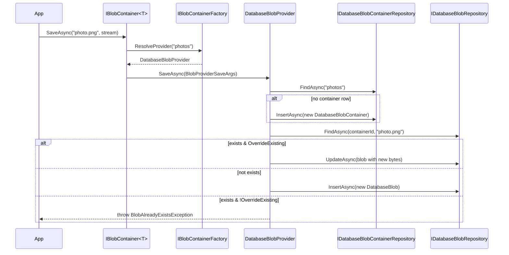

The **Database BLOB Storing Provider** stores binary content (`BlobProviderSaveArgs.BlobStream`) inside the same database the host uses for its other entities — no S3 bucket, no shared file path, no Azure account. It is the *minimum-friction* provider in the `Volo.Abp.BlobStoring` family: ship the migration, register the module, configure your container to call `UseDatabase()`, and `IBlobContainer` writes lands in two tables.

This module is the implementation of the contract laid out in [framework/blob-storing/intro](/framework/blob/blob-storing). It plugs into the same [`AbpBlobStoringOptions.Containers`](/framework/blob/blob-storing) pipeline used by the Azure, AWS, FileSystem, Aliyun, Minio, and Database providers. The only thing it adds is two aggregate roots — `DatabaseBlobContainer` and `DatabaseBlob` — plus a `DatabaseBlobProvider` that does the I/O.

Every package described here lives under `modules/blob-storing-database/src/` in the [abpframework/abp](https://github.com/abpframework/abp) repository.

## Package map

| Package | Role |
| --- | --- |
| `Volo.Abp.BlobStoring.Database.Domain.Shared` | Constants (`DatabaseBlobConsts`, `DatabaseContainerConsts`), `BlobStoringDatabaseErrorCodes`, and the `BlobStoringDatabaseResource` localization marker. |
| `Volo.Abp.BlobStoring.Database.Domain` | `DatabaseBlob`, `DatabaseBlobContainer` aggregate roots, repository interfaces, `DatabaseBlobProvider` (the actual `BlobProviderBase`), the `UseDatabase()` container-config extension, and `AbpBlobStoringDatabaseDbProperties`. |
| `Volo.Abp.BlobStoring.Database.EntityFrameworkCore` | `BlobStoringDbContext` + `IBlobStoringDbContext`, EF Core repositories, and `ConfigureBlobStoring()` model-builder extension. |
| `Volo.Abp.BlobStoring.Database.MongoDB` | `BlobStoringMongoDbContext` + `IBlobStoringMongoDbContext`, Mongo repository implementations, and the `ConfigureBlobStoring()` model-builder extension. |
| `Volo.Abp.BlobStoring.Database.Installer` | Empty CLI installer module (used by `abp add-module Volo.Abp.BlobStoring.Database`). |

There is no Application, HttpApi, or Web layer. The provider is invisible to end-users — they consume it through the standard `IBlobContainer<TContainer>` API.

## How a save propagates

The `DatabaseBlobProvider` is registered as a normal `BlobProviderBase` implementation by `BlobStoringDatabaseDomainModule`. When `AbpBlobStoringOptions.Containers.ConfigureDefault(...)` is left untouched and no container has a `ProviderType` set, the domain module automatically calls `container.UseDatabase()` so the provider becomes the default.



The two-aggregate split is deliberate. Containers are *named*, multi-tenant scopes (one row per logical container per tenant); blobs are the bytes (one row per stored item). This means listing every blob in a container is a single indexed `WHERE ContainerId = @id` query, and deleting a container can cascade through its blobs via FK.

## Default configuration

`BlobStoringDatabaseDomainModule.ConfigureServices` wires the provider as the default:

```csharp
[DependsOn(
    typeof(AbpDddDomainModule),
    typeof(AbpBlobStoringModule),
    typeof(BlobStoringDatabaseDomainSharedModule)
)]
public class BlobStoringDatabaseDomainModule : AbpModule
{
    public override void ConfigureServices(ServiceConfigurationContext context)
    {
        Configure<AbpBlobStoringOptions>(options =>
        {
            options.Containers.ConfigureDefault(container =>
            {
                if (container.ProviderType == null)
                {
                    container.UseDatabase();
                }
            });
        });
    }
}
```

That means: **if you reference `Volo.Abp.BlobStoring.Database.Domain` and do nothing else, every typed `IBlobContainer<T>` for which you have not explicitly chosen a different provider goes to the database**. Modules that already opt-in to this behavior include CMS Kit (media descriptors → `BlobStoring.Database`), File Management, etc.

To opt a single container *out* of the database provider and into, say, S3, set its `ProviderType` explicitly:

```csharp
Configure<AbpBlobStoringOptions>(options =>
{
    options.Containers.Configure<MyFilesContainer>(c => c.UseAws(aws => { /* … */ }));
});
```

## Constants & limits

`DatabaseBlobConsts` and `DatabaseContainerConsts` are *static mutable* — you can override them at startup. Defaults:

| Constant | Default | Meaning |
| --- | --- | --- |
| `DatabaseContainerConsts.MaxNameLength` | `128` | Max chars for `DatabaseBlobContainer.Name`. Enforced by entity + EF Core `HasMaxLength`. |
| `DatabaseBlobConsts.MaxNameLength` | `256` | Max chars for `DatabaseBlob.Name`. |
| `DatabaseBlobConsts.MaxContentLength` | `int.MaxValue` | Max bytes per blob row. Enforced inside `DatabaseBlob.CheckContentLength`. **2 GB ceiling** — see gotchas. |
| `AbpBlobStoringDatabaseDbProperties.ConnectionStringName` | `"AbpBlobStoring"` | EF Core / Mongo connection string key. |
| `AbpBlobStoringDatabaseDbProperties.DbTablePrefix` | `AbpCommonDbProperties.DbTablePrefix` (`Abp`) | Combined with `Blobs`/`BlobContainers` to form the table/collection names. |
| `AbpBlobStoringDatabaseDbProperties.DbSchema` | `AbpCommonDbProperties.DbSchema` | Schema for SQL. |

Result: out of the box you get `AbpBlobs` and `AbpBlobContainers` tables — or Mongo collections with the same names.

## Multi-tenancy

Both aggregates implement `IMultiTenant`. `DatabaseBlobProvider` reads `ICurrentTenant.Id` when it creates a `DatabaseBlobContainer` or `DatabaseBlob`, so the same container *name* (e.g. `"avatars"`) resolves to a different row per tenant. The EF Core mapping adds:

```csharp
b.HasIndex(x => new { x.TenantId, x.Name });        // containers
b.HasIndex(x => new { x.TenantId, x.ContainerId, x.Name }); // blobs
```

`AbpDbContext`'s `IMultiTenant` query filter handles tenant isolation; the data filter intercepts every `FindAsync` so a host-side tenant cannot read another tenant's blobs.

## Choosing the database provider

This is the right provider when:

* You want zero infrastructure — bytes live next to entities, get backed up with your `pg_dump`/`mongodump`, and are atomic with the rest of your unit of work.
* You are running CMS Kit, File Management, or any module whose default container is "wherever the default goes". Their migrations already include the two tables.
* The blobs are *small to moderate* — user avatars, generated thumbnails, signed certificates, small attachments. Bytes in SQL Server and PostgreSQL `varbinary(max)`/`bytea` cost storage and inflate page splits for big rows.

Avoid it for **streaming video, 100 MB+ uploads, or read-heavy CDN-class assets** — those are jobs for S3 / Azure Blob Storage or the FileSystem provider behind a CDN.

## Layer deep-dives

* [Domain layer](/modules/blob-storing-database/domain) — `DatabaseBlob`, `DatabaseBlobContainer`, `DatabaseBlobProvider`, repository contracts.
* [EF Core layer](/modules/blob-storing-database/efcore) — `BlobStoringDbContext`, repositories, model configuration, table layout.
* [MongoDB layer](/modules/blob-storing-database/mongodb) — `BlobStoringMongoDbContext`, Mongo repositories, collection layout.

## Related reading

* [Framework BLOB Storing intro](/framework/blob/blob-storing) — the abstractions this provider implements.
* [Provider catalogue](/framework/blob-storing/providers) — how Database compares to FileSystem, Azure, AWS, etc.
* [CMS Kit Media Descriptors](/modules/cms-kit/domain) — the typical *consumer* of this provider.
