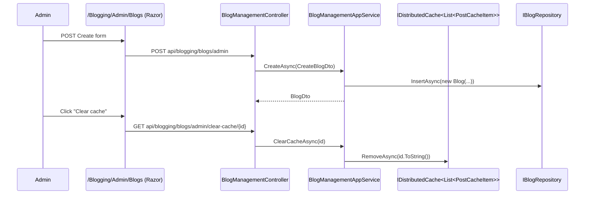

The admin application package is small and focused: it gives staff a way to **create, edit, delete,
and cache-bust blogs** themselves. The public `BlogAppService` only reads; the only place a `Blog`
aggregate is born is here. The admin contracts package also carries the two write DTOs (`CreateBlogDto`,
`UpdateBlogDto`) and the remote-service constants that separate the admin endpoints from the public
ones.

## File inventory

| File | Role |
| --- | --- |
| `Volo.Blogging.Admin.Application.Contracts/Admin/BloggingAdminRemoteServiceConsts.cs` | `RemoteServiceName = "BloggingAdmin"`, `ModuleName = "bloggingAdmin"` |
| `Volo.Blogging.Admin.Application.Contracts/Admin/BloggingAdminApplicationContractsModule.cs` | Empty module marker (depends on the shared contracts and `Volo.Blogging.Domain.Shared`) |
| `Volo.Blogging.Admin.Application.Contracts/Admin/Blogs/IBlogManagementAppService.cs` | The admin contract |
| `Volo.Blogging.Admin.Application.Contracts/Admin/Blogs/CreateBlogDto.cs` | `Name`, `ShortName`, `Description` |
| `Volo.Blogging.Admin.Application.Contracts/Admin/Blogs/UpdateBlogDto.cs` | Same + `ConcurrencyStamp` |
| `Volo.Blogging.Admin.Application/Admin/BloggingAdminApplicationModule.cs` | Wires `BloggingAdminApplicationAutoMapperProfile` |
| `Volo.Blogging.Admin.Application/Admin/BloggingAdminApplicationAutoMapperProfile.cs` | `Blog → BlogDto` (re-declared so the admin assembly is self-contained) |
| `Volo.Blogging.Admin.Application/Admin/BloggingAdminAppServiceBase.cs` | Base with `LocalizationResource = typeof(BloggingResource)` |
| `Volo.Blogging.Admin.Application/Admin/Blogs/BlogManagementAppService.cs` | The single service |

## Module

```csharp
[DependsOn(
    typeof(BloggingDomainModule),
    typeof(BloggingAdminApplicationContractsModule),
    typeof(AbpCachingModule),
    typeof(AbpAutoMapperModule),
    typeof(AbpDddApplicationModule))]
public class BloggingAdminApplicationModule : AbpModule
{
    public override void ConfigureServices(ServiceConfigurationContext context)
    {
        context.Services.AddAutoMapperObjectMapper<BloggingAdminApplicationModule>();
        Configure<AbpAutoMapperOptions>(options =>
            options.AddProfile<BloggingAdminApplicationAutoMapperProfile>(validate: true));
    }
}
```

The admin module depends on `BloggingDomainModule` directly rather than on the public
`BloggingApplicationModule`. That keeps `BloggingPermissions` reachable without dragging in
`PostAppService` / `FileAppService` — important if you split admin and public into separate hosts.

## The contract

```csharp
public interface IBlogManagementAppService : IApplicationService
{
    Task<ListResultDto<BlogDto>> GetListAsync();
    Task<BlogDto> GetAsync(Guid id);
    Task<BlogDto> CreateAsync(CreateBlogDto input);
    Task<BlogDto> UpdateAsync(Guid id, UpdateBlogDto input);
    Task DeleteAsync(Guid id);
    Task ClearCacheAsync(Guid id);
}
```

| DTO | Fields | Validation |
| --- | --- | --- |
| `CreateBlogDto` | `Name` (required), `ShortName` (required), `Description` | None at DTO level — DB length limits apply |
| `UpdateBlogDto` | Same as create + `ConcurrencyStamp` (via `IHasConcurrencyStamp`) | None at DTO level |
| `BlogDto` | `FullAuditedEntityDto<Guid>` + `Name`, `ShortName`, `Description`, `ConcurrencyStamp` | — |

`UpdateBlogDto` flows the `ConcurrencyStamp` through, so two admins editing the same blog at once
will see ABP's standard `AbpDbConcurrencyException`. `CreateBlogDto` deliberately omits it.

## `BlogManagementAppService`

```csharp
public class BlogManagementAppService : BloggingAdminAppServiceBase, IBlogManagementAppService
{
    private readonly IBlogRepository _blogRepository;
    private readonly IDistributedCache<List<PostCacheItem>> _postsCache;

    public BlogManagementAppService(
        IBlogRepository blogRepository,
        IDistributedCache<List<PostCacheItem>> postsCache)
    {
        _blogRepository = blogRepository;
        _postsCache = postsCache;
    }

    public virtual async Task<ListResultDto<BlogDto>> GetListAsync()
        => new ListResultDto<BlogDto>(
            ObjectMapper.Map<List<Blog>, List<BlogDto>>(await _blogRepository.GetListAsync()));

    public virtual async Task<BlogDto> GetAsync(Guid id)
        => ObjectMapper.Map<Blog, BlogDto>(await _blogRepository.GetAsync(id));

    [Authorize(BloggingPermissions.Blogs.Create)]
    public virtual async Task<BlogDto> CreateAsync(CreateBlogDto input)
    {
        var newBlog = new Blog(GuidGenerator.Create(), input.Name, input.ShortName)
        {
            Description = input.Description
        };
        newBlog = await _blogRepository.InsertAsync(newBlog);
        return ObjectMapper.Map<Blog, BlogDto>(newBlog);
    }

    [Authorize(BloggingPermissions.Blogs.Update)]   // see Gotchas
    public virtual async Task<BlogDto> UpdateAsync(Guid id, UpdateBlogDto input)
    {
        var blog = await _blogRepository.GetAsync(id);
        blog.SetName(input.Name);
        blog.SetShortName(input.ShortName);
        blog.Description = input.Description;
        blog.SetConcurrencyStampIfNotNull(input.ConcurrencyStamp);
        return ObjectMapper.Map<Blog, BlogDto>(blog);
    }

    [Authorize(BloggingPermissions.Blogs.Delete)]
    public virtual async Task DeleteAsync(Guid id)
        => await _blogRepository.DeleteAsync(id);

    [Authorize(BloggingPermissions.Blogs.ClearCache)]
    public virtual async Task ClearCacheAsync(Guid id)
        => await _postsCache.RemoveAsync(id.ToString());
}
```

The DBContext is `[IgnoreMultiTenancy]`, so `CreateAsync` always produces a host-level blog
regardless of the current tenant context.

### `UpdateAsync` quirk

`UpdateAsync` reads the blog, mutates it, and returns a mapped DTO **without an explicit
`UpdateAsync(blog)` call**. EF Core picks up the change because the aggregate is tracked, but the
unit-of-work commit happens after the method returns. The `ConcurrencyStamp` from the input is
applied via `SetConcurrencyStampIfNotNull`, so optimistic concurrency works as expected. In MongoDB,
however, where there is no tracker, this method is a no-op unless your custom `IBlogRepository`
intercepts somewhere — but the shipped `MongoBlogRepository` inherits the default behavior of
`MongoDbRepository<,,>` which *does* expose a unit-of-work that flushes outstanding `Get`
results. Verify if you build a custom database provider.

### `ClearCacheAsync`

The post cache is keyed by `BlogId.ToString()` (lowercase hyphenated form). Calling
`ClearCacheAsync(blogId)` forces the next `PostAppService.GetTimeOrderedListAsync(blogId)` call to
rebuild the `List<PostCacheItem>` from the database. This is exposed to admins so they can recover
from "I edited a post directly in the DB" situations without restarting the host.



## Permission summary

`BlogManagementAppService` consumes only permissions from the **`Blogging.Blog`** group:

| Permission | Used by |
| --- | --- |
| `Blogging.Blog.Management` | Admin menu visibility (not on the service itself) |
| `Blogging.Blog.Create` | `[Authorize]` on `CreateAsync` |
| `Blogging.Blog.Update` | `[Authorize]` declared on `UpdateAsync` |
| `Blogging.Blog.Delete` | `[Authorize]` on `DeleteAsync` |
| `Blogging.Blog.ClearCache` | `[Authorize]` on `ClearCacheAsync` |

`Get*` is unauthenticated by attribute, but the admin Razor Pages gate the view on
`Blogging.Blog.Management`, which is the de-facto admin role check.

## Object mapping

```csharp
public class BloggingAdminApplicationAutoMapperProfile : Profile
{
    public BloggingAdminApplicationAutoMapperProfile()
    {
        CreateMap<Blog, BlogDto>();
    }
}
```

Just one map. The mapping is redeclared (rather than reusing the public `BloggingApplicationAutoMapperProfile`)
so a microservice that ships only the admin stack can produce `BlogDto`s without referencing
`Volo.Blogging.Application`.

## Lifecycle: creating a blog from the admin UI

```mermaid
flowchart LR
  A[/Blogging/Admin/Blogs/Create Razor Page] --> B[CreateModel.OnPostAsync]
  B --> C[ObjectMapper Map BlogCreateModalView CreateBlogDto]
  C --> D[IBlogManagementAppService.CreateAsync]
  D --> E[new Blog GuidGenerator.Create input.Name input.ShortName]
  E --> F[IBlogRepository.InsertAsync]
  F --> G[BlogDto returned mapper Blog BlogDto]
  G --> H[NoContent response 204]
```

The admin page model (`CreateModel`) gates on `BloggingPermissions.Blogs.Create` before rendering the
form *and* before posting. The service-level `[Authorize]` is the defense-in-depth that protects the
HTTP endpoint when called outside the UI.

## Gotchas

- **`UpdateAsync` and `DeleteAsync` do not raise `PostChangedEvent`.** They affect `Blog`, not posts,
  so the post cache for that blog is untouched. If you rename a blog's `ShortName` the URL changes
  but cached `PostCacheItem.Url` values do not — they're per-post URLs, so this is fine; just be aware
  that the *cached blog list* (if your code adds one) would need separate invalidation.
- **There is no audit/history.** Deleting a blog hard-deletes through `IBlogRepository.DeleteAsync`,
  which is `FullAuditedAggregateRoot<Guid>`-aware — meaning rows are soft-deleted (`IsDeleted = 1`).
  Soft-deleted blogs disappear from `GetListAsync` thanks to ABP's default filter.
- **`Authorize(BloggingPermissions.Blogs.Update)` is declared on the implementation, not on the
  interface.** Static client proxies generated for `IBlogManagementAppService` therefore don't
  reflect the permission requirement; only the HTTP API enforces it.
- **`ClearCacheAsync` only clears the post cache.** There is no separate "blog cache" — `BlogAppService`
  hits the database every time. The name `ClearCacheAsync` refers specifically to
  `IDistributedCache<List<PostCacheItem>>`.
- **No bulk endpoints.** If you need to delete many blogs, you'll loop on the client side. The same
  applies to `GetListAsync`, which doesn't paginate (`ListResultDto<BlogDto>` is a flat list).
