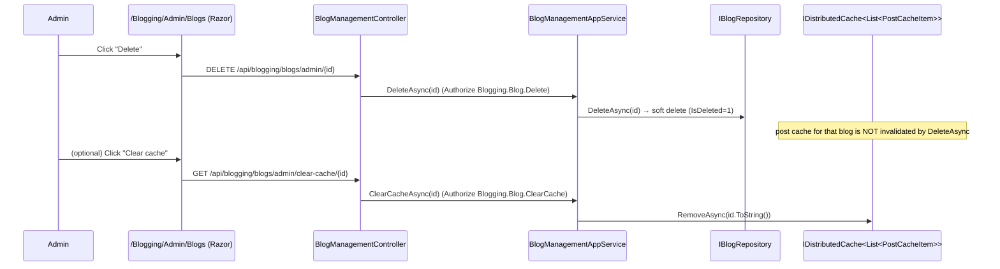

`Volo.Blogging.Admin.HttpApi` is the smallest assembly in the Blogging family: a single controller
that surfaces `IBlogManagementAppService` over REST. It exists as a separate package so administration
endpoints can be deployed alongside (or independently of) the public ones. The remote-service name is
`BloggingAdmin`, which keeps the static client proxies disjoint from the public `Blogging` ones.

## File inventory

| File | Role |
| --- | --- |
| `BloggingAdminHttpApiModule.cs` | DependsOn, application part wiring, localization base |
| `BlogManagementController.cs` | The only controller |

The companion `Volo.Blogging.Admin.HttpApi.Client` ships static proxies generated from
`IBlogManagementAppService`, suitable for a separate admin SPA or a microservice gateway.

## Module configuration

```csharp
[DependsOn(
    typeof(BloggingAdminApplicationContractsModule),
    typeof(AbpAspNetCoreMvcModule))]
public class BloggingAdminHttpApiModule : AbpModule
{
    public override void PreConfigureServices(ServiceConfigurationContext context)
    {
        PreConfigure<IMvcBuilder>(mvc =>
            mvc.AddApplicationPartIfNotExists(typeof(BloggingAdminHttpApiModule).Assembly));
    }

    public override void ConfigureServices(ServiceConfigurationContext context)
    {
        Configure<AbpLocalizationOptions>(options =>
            options.Resources.Get<BloggingResource>().AddBaseTypes(typeof(AbpUiResource)));
    }
}
```

There is no `FormBodyBindingIgnoredTypes` registration — the admin API does not accept multipart
uploads. `BloggingResource` is shared with the public module, so error messages localize identically.

## `BlogManagementController`

```csharp
[RemoteService(Name = BloggingAdminRemoteServiceConsts.RemoteServiceName)]  // "BloggingAdmin"
[Area(BloggingAdminRemoteServiceConsts.ModuleName)]                          // "bloggingAdmin"
[Route("api/blogging/blogs/admin")]
public class BlogManagementController : AbpControllerBase, IBlogManagementAppService
{
    private readonly IBlogManagementAppService _blogManagementAppService;

    [HttpGet]
    public virtual async Task<ListResultDto<BlogDto>> GetListAsync() { /* delegate */ }

    [HttpGet, Route("{id}")]
    public virtual async Task<BlogDto> GetAsync(Guid id) { /* delegate */ }

    [HttpPost]
    public virtual async Task<BlogDto> CreateAsync(CreateBlogDto input) { /* delegate */ }

    [HttpPut, Route("{id}")]
    public virtual async Task<BlogDto> UpdateAsync(Guid id, UpdateBlogDto input) { /* delegate */ }

    [HttpDelete, Route("{id}")]
    public virtual async Task DeleteAsync(Guid id) { /* delegate */ }

    [HttpGet, Route("clear-cache/{id}")]
    public virtual async Task ClearCacheAsync(Guid id) { /* delegate */ }
}
```

| Verb | Path | Permission | Returns |
| --- | --- | --- | --- |
| GET | `/api/blogging/blogs/admin` | — (anon by attribute; UI guards on `Blogging.Blog.Management`) | `ListResultDto<BlogDto>` |
| GET | `/api/blogging/blogs/admin/{id}` | — | `BlogDto` |
| POST | `/api/blogging/blogs/admin` | `Blogging.Blog.Create` | `BlogDto` |
| PUT | `/api/blogging/blogs/admin/{id}` | `Blogging.Blog.Update` | `BlogDto` |
| DELETE | `/api/blogging/blogs/admin/{id}` | `Blogging.Blog.Delete` | 204 |
| GET | `/api/blogging/blogs/admin/clear-cache/{id}` | `Blogging.Blog.ClearCache` | 204 |

Permission attributes are declared on the application service, not the controller. ABP's
authorization filter still picks them up because the implementation type is what runs after the
controller delegate.

### Notable shape: `clear-cache` is a GET

`ClearCacheAsync` is a GET with a side effect — pressing "Clear cache" in the admin UI fires a normal
hyperlink request. This is convenient but unusual; if you front the admin API with a cache or a CDN,
make sure the path is on the bypass list.

### Payloads

```csharp
public class CreateBlogDto
{
    [Required] public string Name { get; set; }
    [Required] public string ShortName { get; set; }
    public string Description { get; set; }
}

public class UpdateBlogDto : IHasConcurrencyStamp
{
    [Required] public string Name { get; set; }
    [Required] public string ShortName { get; set; }
    public string Description { get; set; }
    public string ConcurrencyStamp { get; set; }
}
```

`BlogDto` (from `Volo.Blogging.Application.Contracts.Shared`):

```csharp
public class BlogDto : FullAuditedEntityDto<Guid>, IHasConcurrencyStamp
{
    public string Name { get; set; }
    public string ShortName { get; set; }
    public string Description { get; set; }
    public string ConcurrencyStamp { get; set; }
}
```

## Example calls

### Create

```http
POST /api/blogging/blogs/admin HTTP/1.1
Authorization: Bearer <token with Blogging.Blog.Create>
Content-Type: application/json

{ "name": "Engineering Blog", "shortName": "eng", "description": "Tech updates" }
```

```http
HTTP/1.1 200 OK
Content-Type: application/json

{ "id": "...", "name": "Engineering Blog", "shortName": "eng",
  "description": "Tech updates", "concurrencyStamp": "..." }
```

### Update with concurrency stamp

```http
PUT /api/blogging/blogs/admin/{id} HTTP/1.1
Authorization: Bearer <token with Blogging.Blog.Update>
Content-Type: application/json

{ "name": "Engineering",
  "shortName": "engineering",
  "description": "Tech updates",
  "concurrencyStamp": "0e2f9c..." }
```

If a concurrent update has already changed the row, ABP returns the standard
`AbpDbConcurrencyException` (HTTP 409 if you have the default exception filter wired in).

### Clear cache

```http
GET /api/blogging/blogs/admin/clear-cache/{id} HTTP/1.1
Authorization: Bearer <token with Blogging.Blog.ClearCache>
```

Internally this is one `IDistributedCache.RemoveAsync(blogId.ToString())` call. The next visit to
the blog rebuilds `List<PostCacheItem>` from the database, which on a busy blog is a brief
read-amplification spike — schedule cache clears during low-traffic windows.

## Sequence: admin deletes a blog



Deleting a blog soft-deletes its row but doesn't cascade to posts or comments — the `Post` rows
remain, just invisible because the parent `Blog` is gone. Use a custom cleanup script if you want
hard purge semantics.

## Splitting public and admin into separate hosts

Because the two HTTP-API packages use different remote-service names, you can split them safely:

```csharp
// Admin host
[DependsOn(typeof(BloggingAdminHttpApiModule),
           typeof(BloggingAdminApplicationModule),
           typeof(BloggingEntityFrameworkCoreModule))]
public class AdminHostModule : AbpModule { /* … */ }

// Public host
[DependsOn(typeof(BloggingHttpApiModule),
           typeof(BloggingApplicationModule),
           typeof(BloggingEntityFrameworkCoreModule))]
public class PublicHostModule : AbpModule { /* … */ }
```

Both hosts read the same database; the public host's `IDistributedCache<List<PostCacheItem>>` is
flushed via the local event bus. If you split that cache across processes too (e.g. Redis), the
admin's `ClearCacheAsync` call is what *the public host* observes — they share the cache backend.

## Permission seeding

Make sure the admin role you assign has `Blogging.Blog.Management` (controls menu visibility) plus
whichever of `Create`, `Update`, `Delete`, `ClearCache` you want available. The default seed in
`BloggingPermissionDefinitionProvider` only declares the permissions — it does not assign them to
any role.

## Gotchas

- **There is no admin endpoint to manage posts, comments, or tags.** Those are managed through the
  public API with appropriate permissions, by the post author, or by direct database access.
  `BlogManagementController` exists exclusively for blog-level operations.
- **`GetListAsync` does not paginate.** A tenant with thousands of blogs is unusual, but if you
  build a multi-publisher SaaS on top, plan to extend the contract.
- **`UpdateAsync` returns the mapped DTO before the unit of work commits.** If the commit fails
  later in the request pipeline (e.g. SaveChanges throws), the caller still received a "success"
  body. Wrap with `UseTransactional()` or shape your client to refetch after the response.
- **`clear-cache/{id}` accepts a `Guid`, not a `shortName`.** You cannot bust the cache via the
  shortName even though the cache key is `BlogId.ToString()` — translate the shortName to id via
  `GET /api/blogging/blogs/by-shortname/{shortName}` first.
- **The static client proxy package is `BloggingAdmin`, not `Blogging`.** When you register remote
  services in a consumer, both names need entries:

  ```json
  "RemoteServices": {
    "Blogging":      { "BaseUrl": "https://api.example.com/" },
    "BloggingAdmin": { "BaseUrl": "https://api.example.com/" }
  }
  ```
