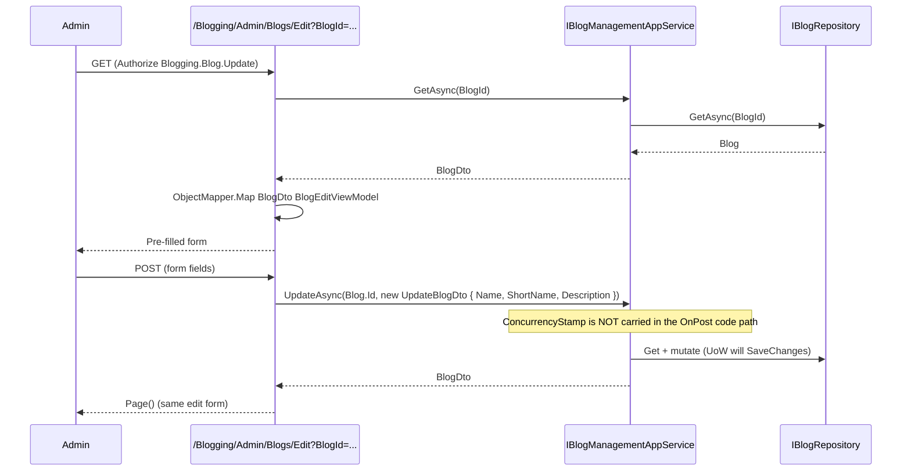

`Volo.Blogging.Admin.Web` is the back-office UI for blog management. It plugs into the ABP
administration shell and contributes three Razor Pages (`Index`, `Create`, `Edit`) plus a menu item
under the standard "Administration" group. Everything here calls `IBlogManagementAppService`, which
is the only application service on the admin side of the module.

## File inventory

| File | Role |
| --- | --- |
| `BloggingAdminWebModule.cs` | DependsOn, virtual file system, AutoMapper, navigation contributor, dynamic JS proxy disable |
| `AbpBloggingAdminWebAutoMapperProfile.cs` | `BlogCreateModalView → CreateBlogDto`, `BlogDto → BlogEditViewModel` |
| `Navigation/BloggingAdminMenuNames.cs` | `GroupName = "BlogManagement"`, `Blogs = "BlogManagement.Blogs"` |
| `Navigation/BloggingAdminMenuContributor.cs` | Adds the menu item under Administration |
| `Pages/BloggingAdminPageModel.cs` | Base page model; sets `ObjectMapperContext` |
| `Pages/BloggingAdminPage.cs` | Base view base class with `IHtmlLocalizer<BloggingResource>` and `MaxShortContentLength = 200` |
| `Pages/Blogging/Admin/Blogs/Index.cshtml(.cs)` | List/grid page |
| `Pages/Blogging/Admin/Blogs/Create.cshtml(.cs)` | Create modal |
| `Pages/Blogging/Admin/Blogs/Edit.cshtml(.cs)` | Edit page |

## Module configuration

```csharp
[DependsOn(
    typeof(BloggingAdminApplicationContractsModule),
    typeof(AbpAspNetCoreMvcUiBootstrapModule),
    typeof(AbpAspNetCoreMvcUiBundlingModule),
    typeof(AbpAutoMapperModule))]
public class BloggingAdminWebModule : AbpModule
{
    public override void PreConfigureServices(ServiceConfigurationContext context)
    {
        context.Services.PreConfigure<AbpMvcDataAnnotationsLocalizationOptions>(options =>
            options.AddAssemblyResource(typeof(BloggingResource), typeof(BloggingAdminWebModule).Assembly));

        PreConfigure<IMvcBuilder>(mvc =>
            mvc.AddApplicationPartIfNotExists(typeof(BloggingAdminWebModule).Assembly));
    }

    public override void ConfigureServices(ServiceConfigurationContext context)
    {
        Configure<AbpNavigationOptions>(options =>
            options.MenuContributors.Add(new BloggingAdminMenuContributor()));

        Configure<AbpVirtualFileSystemOptions>(options =>
            options.FileSets.AddEmbedded<BloggingAdminWebModule>());

        context.Services.AddAutoMapperObjectMapper<BloggingAdminWebModule>();
        Configure<AbpAutoMapperOptions>(options =>
            options.AddProfile<AbpBloggingAdminWebAutoMapperProfile>(validate: true));

        Configure<DynamicJavaScriptProxyOptions>(options =>
            options.DisableModule(BloggingAdminRemoteServiceConsts.ModuleName));
    }
}
```

The dynamic JS proxy module is disabled (`DisableModule("bloggingAdmin")`) because the admin Razor
Pages call into the application service on the server. If you build a Blazor/SPA admin UI that uses
the dynamic proxy, comment that line out in your host.

## Menu contribution

```csharp
public class BloggingAdminMenuContributor : IMenuContributor
{
    public async Task ConfigureMenuAsync(MenuConfigurationContext context)
    {
        if (context.Menu.Name == StandardMenus.Main)
            await ConfigureMainMenuAsync(context);
    }

    private Task ConfigureMainMenuAsync(MenuConfigurationContext context)
    {
        var l = context.GetLocalizer<BloggingResource>();

        var managementRootMenuItem = new ApplicationMenuItem(
                BloggingAdminMenuNames.GroupName,
                l["Menu:BlogManagement"])
            .RequirePermissions(BloggingPermissions.Blogs.Management);

        managementRootMenuItem.AddItem(new ApplicationMenuItem(
                BloggingAdminMenuNames.Blogs,
                l["Menu:Blogs"],
                "~/Blogging/Admin/Blogs")
            .RequirePermissions(BloggingPermissions.Blogs.Management));

        context.Menu.GetAdministration().AddItem(managementRootMenuItem);
        return Task.CompletedTask;
    }
}
```

The contributor hangs a **"Blog Management"** group off the standard Administration menu, with one
child item linking to `~/Blogging/Admin/Blogs`. Both nodes require `Blogging.Blog.Management`. Adding
new admin pages (e.g. a tag editor) means adding more `AddItem` calls here.

```mermaid
flowchart LR
  AbpAdmin[Administration menu] --> BlogMgmt[Blog Management]
  BlogMgmt --> Blogs[Blogs]
  Blogs --> Idx[/Blogging/Admin/Blogs]
```

## Page model base classes

```csharp
public abstract class BloggingAdminPageModel : AbpPageModel
{
    public BloggingAdminPageModel()
    {
        ObjectMapperContext = typeof(BloggingAdminWebModule);
    }
}
```

```csharp
public abstract class BloggingAdminPage : AbpPage
{
    [RazorInject]
    public IHtmlLocalizer<BloggingResource> L { get; set; }

    public const string DefaultTitle = "Blogging";
    public const int MaxShortContentLength = 200;
}
```

Setting `ObjectMapperContext = typeof(BloggingAdminWebModule)` ensures `ObjectMapper.Map<>()` in the
page models resolves the **admin** AutoMapper profile, not the public one. `MaxShortContentLength`
is used inside the cshtml to truncate long descriptions in the list grid.

## Razor pages

### `Index` — list

```csharp
public class IndexModel : BloggingAdminPageModel
{
    private readonly IAuthorizationService _authorization;

    public virtual async Task<ActionResult> OnGetAsync()
    {
        if (!await _authorization.IsGrantedAsync(BloggingPermissions.Blogs.Management))
            return Redirect("/");

        return Page();
    }
}
```

The cshtml renders a DataTables grid that fetches `IBlogManagementAppService.GetListAsync` via the
dynamic JS proxy bundle (which is generated for the *server*, since the dynamic JS proxy is disabled
in `BloggingAdminWebModule`, but ABP's per-page conventional client proxy still works for the
declared interface). The grid lists `Name`, `ShortName`, `Description` (truncated to
`MaxShortContentLength`), and an action column with edit/delete/clear-cache.

### `Create` — modal

```csharp
public class CreateModel : BloggingAdminPageModel
{
    [BindProperty] public BlogCreateModalView Blog { get; set; } = new();

    public virtual async Task<ActionResult> OnGetAsync()
    {
        if (!await _authorization.IsGrantedAsync(BloggingPermissions.Blogs.Create))
            return Redirect("/");
        return Page();
    }

    public virtual async Task<IActionResult> OnPostAsync()
    {
        var blogDto = ObjectMapper.Map<BlogCreateModalView, CreateBlogDto>(Blog);
        await _blogAppService.CreateAsync(blogDto);
        return NoContent();
    }

    public class BlogCreateModalView
    {
        [Required, DynamicStringLength(typeof(BlogConsts), nameof(BlogConsts.MaxNameLength))]
        public string Name { get; set; }

        [Required, DynamicStringLength(typeof(BlogConsts), nameof(BlogConsts.MaxShortNameLength))]
        public string ShortName { get; set; }

        [DynamicStringLength(typeof(BlogConsts), nameof(BlogConsts.MaxDescriptionLength))]
        public string Description { get; set; }
    }
}
```

Both the GET (render) and POST (submit) require the `Blogging.Blog.Create` permission; on POST,
`BlogManagementAppService.CreateAsync` is additionally gated by `[Authorize(...)]`. The `NoContent()`
response is what closes the modal client-side; the parent page listens for the AJAX completion and
refreshes the grid.

### `Edit` — page

```csharp
public class EditModel : BloggingAdminPageModel
{
    [BindProperty(SupportsGet = true)] public Guid BlogId { get; set; }
    [BindProperty] public BlogEditViewModel Blog { get; set; } = new();

    public virtual async Task<ActionResult> OnGetAsync()
    {
        if (!await _authorization.IsGrantedAsync(BloggingPermissions.Blogs.Update))
            return Redirect("/");

        var blog = await _blogAppService.GetAsync(BlogId);
        Blog = ObjectMapper.Map<BlogDto, BlogEditViewModel>(blog);
        return Page();
    }

    public virtual async Task<IActionResult> OnPostAsync()
    {
        await _blogAppService.UpdateAsync(Blog.Id, new UpdateBlogDto
        {
            Name = Blog.Name,
            ShortName = Blog.ShortName,
            Description = Blog.Description
        });
        return Page();
    }

    public class BlogEditViewModel : IHasConcurrencyStamp
    {
        [HiddenInput, Required] public Guid Id { get; set; }
        [Required, DynamicStringLength(typeof(BlogConsts), nameof(BlogConsts.MaxNameLength))]
        public string Name { get; set; }
        [Required, DynamicStringLength(typeof(BlogConsts), nameof(BlogConsts.MaxShortNameLength))]
        public string ShortName { get; set; }
        [DynamicStringLength(typeof(BlogConsts), nameof(BlogConsts.MaxDescriptionLength))]
        public string Description { get; set; }
        [HiddenInput] public string ConcurrencyStamp { get; set; }
    }
}
```

Notice the **concurrency stamp is *not* forwarded** in the `UpdateBlogDto`. The hidden input is on
the view model, but the manual `new UpdateBlogDto { ... }` construction omits it. As a result, two
admins editing the same blog at the same time silently overwrite each other in this UI — even though
the underlying `IBlogManagementAppService.UpdateAsync` is concurrency-aware. Patch the `OnPostAsync`
to include `ConcurrencyStamp = Blog.ConcurrencyStamp` if you need strict concurrency on this page.

## AutoMapper profile

```csharp
public class AbpBloggingAdminWebAutoMapperProfile : Profile
{
    public AbpBloggingAdminWebAutoMapperProfile()
    {
        CreateMap<CreateModel.BlogCreateModalView, CreateBlogDto>();
        CreateMap<BlogDto, EditModel.BlogEditViewModel>();
    }
}
```

Two view-model maps. They don't touch the public application's mapping — admin and public profiles
are kept disjoint so a microservice deployment that ships only one side doesn't carry the other's
mappings.

## Permission summary for the admin UI

| Permission | Used by | Effect when denied |
| --- | --- | --- |
| `Blogging.Blog.Management` | Menu item, `Index.OnGetAsync` | Menu hidden / redirect to `/` |
| `Blogging.Blog.Create` | `Create.OnGetAsync`, `Create.OnPostAsync` | Redirect to `/` (GET) or 403 on POST (from service `[Authorize]`) |
| `Blogging.Blog.Update` | `Edit.OnGetAsync` | Redirect to `/` |
| `Blogging.Blog.Delete` | Delete button in grid (server side enforced by `BlogManagementAppService.DeleteAsync`) | 403 |
| `Blogging.Blog.ClearCache` | Clear cache button (server side enforced) | 403 |

The minimum role to log in and "see something useful" in the admin UI is one that has
`Blogging.Blog.Management`. Roles that only have `Create`/`Update`/`Delete` without `Management`
won't see the menu item.

## Sequence: an admin updates a blog



## Integration with the public Web

The admin Razor Pages and the public Razor Pages can live in the same host or be split — they share
no routes (`/Blogging/Admin/Blogs/*` vs. `/blog/*`) and depend on different application services
(`IBlogManagementAppService` vs. `IBlogAppService`/`IPostAppService`). They share:

- `BloggingResource` for localization (`Menu:BlogManagement`, `Menu:Blogs`, etc.).
- `IDistributedCache<List<PostCacheItem>>` — `ClearCacheAsync` invoked from the admin grid invalidates
  what the public `/blog/{shortName}` page reads.

## Gotchas

- **The Edit page silently drops `ConcurrencyStamp` on submit.** Treat optimistic concurrency as
  best-effort on this page until you patch it (or rely on the JSON API path instead).
- **No "Clear cache" UI element renders without `Blogging.Blog.ClearCache`.** The button in the
  index grid is hidden by `RequirePermissions` on the toolbar contributor — make sure the role
  that should see it has the permission seeded.
- **The admin menu only contributes to `StandardMenus.Main`.** If your host uses a different menu
  name (custom theme, blazor shell), the menu item never appears. Either set `StandardMenus.Main`
  or write your own contributor that delegates to `ConfigureMainMenuAsync`.
- **`Pages/BloggingAdminPage.cs` defines a `DefaultTitle` constant** that is referenced from the
  cshtml. Renaming it won't break compilation, but the page titles will fall back to "(no title)"
  in your localization unless you set per-page titles via `ViewData["Title"]`.
- **No batch operations.** The grid is one-row-at-a-time. Plan a custom page if you need to bulk
  publish/unpublish blogs.
- **`Index.cshtml.cs.OnGetAsync` only checks `Blogging.Blog.Management`.** It does not check `Update`
  or `Delete` — those are enforced server-side when the toolbar actions fire. That means a role with
  just `Management` can *see* the grid but receive 403s on every action button. Seed the permissions
  together.
