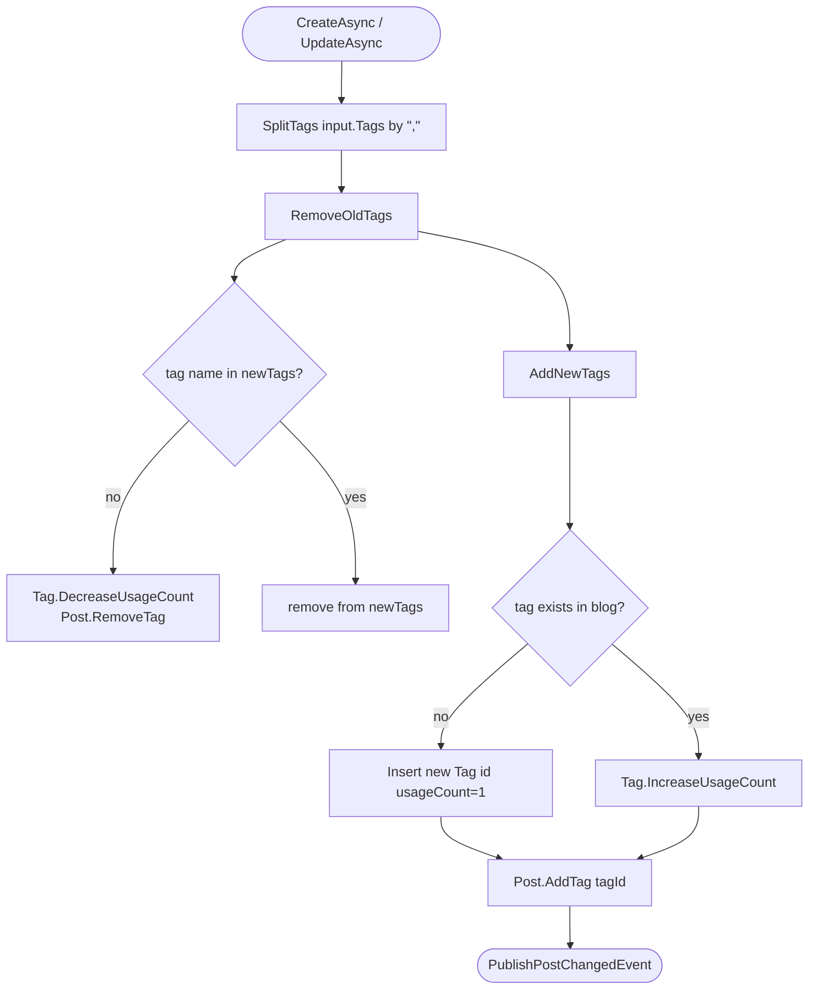
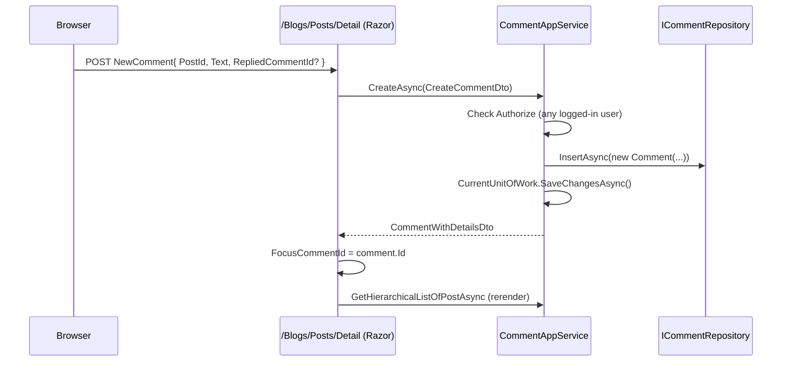

`Volo.Blogging.Application` implements the public surface of the module: everything a logged-in
blogger or anonymous reader does goes through one of six application services. The module wires up
the AutoMapper profile, two `OperationAuthorizationRequirement` policies, and two authorization
handlers (`PostAuthorizationHandler`, `CommentAuthorizationHandler`) that grant the *resource owner*
implicit update/delete rights. The corresponding interfaces live in
`Volo.Blogging.Application.Contracts` so non-MVC hosts can reference them through the static client
proxies.

## File inventory

| File | Role |
| --- | --- |
| `Volo/Blogging/BloggingApplicationModule.cs` | DependsOn, AutoMapper, authorization policies, authorization handlers |
| `Volo/Blogging/BloggingAppServiceBase.cs` | Sets `ObjectMapperContext` + `LocalizationResource` |
| `Volo/Blogging/BloggingApplicationAutoMapperProfile.cs` | All entity↔DTO maps |
| `Volo/Blogging/CommonOperations.cs` | `Update`, `Delete` operation requirements |
| `Volo/Blogging/BloggingFileContainer.cs` | Marker class for the named blob container |
| `Volo/Blogging/Blogs/BlogAppService.cs` | `GetListAsync`, `GetByShortNameAsync`, `GetAsync` |
| `Volo/Blogging/Posts/PostAppService.cs` | All public post CRUD + cache + tag sync + read tracking |
| `Volo/Blogging/Posts/PostAuthorizationHandler.cs` | Owner-or-permission check for `Update`/`Delete` |
| `Volo/Blogging/Comments/CommentAppService.cs` | Hierarchical fetch, create/update/delete |
| `Volo/Blogging/Comments/CommentAuthorizationHandler.cs` | Owner-or-permission check |
| `Volo/Blogging/Tagging/TagAppService.cs` | `GetPopularTagsAsync` |
| `Volo/Blogging/Members/MemberAppService.cs` | Public profile lookup + profile update |
| `Volo/Blogging/Files/FileAppService.cs` | Image upload + retrieval through `IBlobContainer<BloggingFileContainer>` |
| `Volo/Blogging/Files/BlogFileOptions.cs` | Options bag |
| `Volo/Blogging/Files/FileUploadConsts.cs` | `AllowedImageUploadFormats` |
| `Volo/Blogging/Files/ImageFormatHelper.cs` | Stream-sniffing image validator |

## Module configuration

```csharp
[DependsOn(
    typeof(BloggingDomainModule),
    typeof(BloggingApplicationContractsModule),
    typeof(AbpCachingModule),
    typeof(AbpAutoMapperModule),
    typeof(AbpBlobStoringModule),
    typeof(AbpDddApplicationModule))]
public class BloggingApplicationModule : AbpModule
{
    public override void ConfigureServices(ServiceConfigurationContext context)
    {
        context.Services.AddAutoMapperObjectMapper<BloggingApplicationModule>();
        Configure<AbpAutoMapperOptions>(o =>
            o.AddProfile<BloggingApplicationAutoMapperProfile>(validate: true));

        Configure<AuthorizationOptions>(options =>
        {
            options.AddPolicy("BloggingUpdatePolicy",
                policy => policy.Requirements.Add(CommonOperations.Update));
            options.AddPolicy("BloggingDeletePolicy",
                policy => policy.Requirements.Add(CommonOperations.Delete));
        });

        context.Services.AddSingleton<IAuthorizationHandler, CommentAuthorizationHandler>();
        context.Services.AddSingleton<IAuthorizationHandler, PostAuthorizationHandler>();
    }
}
```

The source-code comment on the `AddPolicy` calls flags the names as potential conflicts with other
modules; if you mix Blogging with a CMS module that also defines `BloggingUpdatePolicy`/`BloggingDeletePolicy`,
the policies will collide. In practice nobody else uses those names, but it's worth knowing.

## Object mapping

```csharp
CreateMap<Blog, BlogDto>();
CreateMap<BlogUser, BlogUserDto>();
CreateMap<Post, PostWithDetailsDto>()
    .Ignore(x => x.Writer).Ignore(x => x.CommentCount).Ignore(x => x.Tags);
CreateMap<Comment, CommentWithDetailsDto>().Ignore(x => x.Writer);
CreateMap<Tag, TagDto>();
CreateMap<Post, PostCacheItem>().Ignore(x => x.CommentCount).Ignore(x => x.Tags);
CreateMap<PostCacheItem, PostWithDetailsDto>()
    .IgnoreModificationAuditedObjectProperties()
    .IgnoreDeletionAuditedObjectProperties()
    .Ignore(x => x.ConcurrencyStamp)
    .Ignore(x => x.Writer)
    .Ignore(x => x.CommentCount)
    .Ignore(x => x.Tags);
```

`Writer` and `Tags` are filled by the application services after mapping — that's why both maps
`.Ignore(x => x.Writer).Ignore(x => x.Tags)`. The `PostCacheItem → PostWithDetailsDto` map exists
because the cached path doesn't go through the entity at all.

## `PostAppService` — the workhorse

`PostAppService` is the longest service in the module. It coordinates four collaborators
(`IPostRepository`, `ITagRepository`, `ICommentRepository`, `IBlogUserLookupService`), the post
cache, and the local event bus.

```csharp
public class PostAppService : BloggingAppServiceBase, IPostAppService
{
    protected IBlogUserLookupService UserLookupService { get; }
    protected IPostRepository PostRepository { get; }
    protected ITagRepository TagRepository { get; }
    protected ICommentRepository CommentRepository { get; }
    protected IDistributedCache<List<PostCacheItem>> PostsCache { get; }
    protected ILocalEventBus LocalEventBus { get; }
    // …
}
```

### Read paths

| Method | Behavior |
| --- | --- |
| `GetAsync(Guid id)` | Map `Post → PostWithDetailsDto`, attach tags + writer |
| `GetForReadingAsync(GetPostInput { BlogId, Url })` | Resolve by (blogId, url), **increments `ReadCount`**, attaches tags + writer |
| `GetListByBlogIdAndTagNameAsync(blogId, tagName)` | Bypasses the cache; fetches the full list and filters in memory if `tagName != null` |
| `GetTimeOrderedListAsync(blogId)` | **Cached** — `GetOrAddAsync(blogId.ToString(), …, AbsoluteExpiration = 1h)`. The cached payload is `List<PostCacheItem>` (includes tags + comment count) and is later projected to `PostWithDetailsDto` and decorated with writer info |
| `GetLatestBlogPostsAsync(blogId, count)` | Top-N by creation time desc, with writer hydration via a dictionary cache |
| `GetListByUserIdAsync(userId)` | All posts authored by `userId`, used by the member profile page |

`GetForReadingAsync` is the only read method that **mutates** state — it increments `ReadCount`. The
mutation rides on EF's change tracker / the Mongo upsert path; there is no explicit `UpdateAsync`
call, which means under MongoDB it relies on `IPostRepository.GetPostByUrl` returning a tracked
instance. Watch for "read counts don't go up" if you customise the repository.

### Write paths

```csharp
[Authorize(BloggingPermissions.Posts.Create)]
public virtual async Task<PostWithDetailsDto> CreateAsync(CreatePostDto input)
{
    input.Url = await RenameUrlIfItAlreadyExistAsync(input.BlogId, input.Url);

    var post = new Post(GuidGenerator.Create(), input.BlogId, input.Title, input.CoverImage, input.Url)
    {
        Content = input.Content,
        Description = input.Description
    };

    await PostRepository.InsertAsync(post);

    var tagList = SplitTags(input.Tags);
    await SaveTags(tagList, post);
    await PublishPostChangedEventAsync(post.BlogId);

    return ObjectMapper.Map<Post, PostWithDetailsDto>(post);
}
```

`UpdateAsync` and `DeleteAsync` follow the same shape:

- `[Authorize(...)]` requires the corresponding permission on the controller surface…
- …but `AuthorizationService.CheckAsync(post, CommonOperations.Update|Delete)` then runs the
  `PostAuthorizationHandler`, which short-circuits to "allowed" if `post.CreatorId == currentUserId`
  *even without the permission*.
- Tag synchronization runs through `SaveTags → RemoveOldTags + AddNewTags`, calling `IncreaseUsageCount`
  / `DecreaseUsageCount` along the way.
- `PublishPostChangedEventAsync` raises `PostChangedEvent` on the local bus, which the
  `PostCacheInvalidator` picks up.

The slug-uniqueness fallback:

```csharp
private async Task<string> RenameUrlIfItAlreadyExistAsync(Guid blogId, string url, Post existingPost = null)
{
    if (await PostRepository.IsPostUrlInUseAsync(blogId, url, existingPost?.Id))
        return url + "-" + Guid.NewGuid().ToString().Substring(0, 5);
    return url;
}
```

`Substring(0, 5)` of a `Guid.NewGuid().ToString()` returns the first five hex digits — about a 1‑in‑1,048,576
collision chance per attempt. There is no retry loop.

### Tag synchronization



`SplitTags` lowercases every tag (`ToLowerInvariant`) and dedupes, so `"C#, c#"` collapses to one tag.

## `BlogAppService`

```csharp
public class BlogAppService : BloggingAppServiceBase, IBlogAppService
{
    public virtual async Task<ListResultDto<BlogDto>> GetListAsync()
        => new ListResultDto<BlogDto>(
            ObjectMapper.Map<List<Blog>, List<BlogDto>>(await BlogRepository.GetListAsync()));

    public virtual async Task<BlogDto> GetByShortNameAsync(string shortName)
    {
        Check.NotNullOrWhiteSpace(shortName, nameof(shortName));
        var blog = await BlogRepository.FindByShortNameAsync(shortName)
                   ?? throw new EntityNotFoundException(typeof(Blog), shortName);
        return ObjectMapper.Map<Blog, BlogDto>(blog);
    }

    public virtual async Task<BlogDto> GetAsync(Guid id)
        => ObjectMapper.Map<Blog, BlogDto>(await BlogRepository.GetAsync(id));
}
```

Read-only. The administrative CRUD path (create/update/delete blogs, clear cache) lives in the
[Admin Application](/modules/blogging/admin-application).

## `CommentAppService`

```csharp
public virtual async Task<List<CommentWithRepliesDto>> GetHierarchicalListOfPostAsync(Guid postId)
{
    var comments = await GetListOfPostAsync(postId);     // flat list, mapped DTOs
    var userDictionary = new Dictionary<Guid, BlogUserDto>();

    // 1) hydrate writers
    foreach (var c in comments)
        if (c.CreatorId.HasValue) { /* look up + cache by id */ }

    // 2) regroup top-levels and their replies
    var hierarchicalComments = new List<CommentWithRepliesDto>();
    foreach (var c in comments)
    {
        var parent = hierarchicalComments.Find(x => x.Comment.Id == c.RepliedCommentId);
        if (parent != null) parent.Replies.Add(c);
        else hierarchicalComments.Add(new CommentWithRepliesDto { Comment = c });
    }

    return hierarchicalComments
        .OrderByDescending(x => x.Comment.CreationTime).ToList();
}
```

The grouping algorithm assumes the flat list arrives in *parent-before-reply* order; if a reply
preceded its parent, the reply would be promoted to a new "root". The EF/Mongo repositories return
results unordered by id, but in practice rows arrive in creation order which makes the loop correct.

`CreateAsync`, `UpdateAsync`, `DeleteAsync` are all `[Authorize]` (any logged-in user). Update/Delete
delegate to the resource-based authorization through `AuthorizationService.CheckAsync(comment,
CommonOperations.Update|Delete)`. Delete also enumerates `ICommentRepository.GetRepliesOfComment(id)`
and deletes each reply individually.

## `CommentAuthorizationHandler` and `PostAuthorizationHandler`

Both follow the same pattern:

```csharp
private async Task<bool> HasUpdatePermission(AuthorizationHandlerContext context, Post resource)
{
    if (resource.CreatorId != null && resource.CreatorId == context.User.FindUserId())
        return true;
    if (await PermissionChecker.IsGrantedAsync(context.User, BloggingPermissions.Posts.Update))
        return true;
    return false;
}
```

This is the **"author-is-trusted"** rule: a post author can edit/delete their own post even without
`Blogging.Post.Update` / `Blogging.Post.Delete`. The handler is registered as a singleton, which is
safe because it is stateless and depends only on `IPermissionChecker`.

## `TagAppService`

```csharp
public virtual async Task<List<TagDto>> GetPopularTagsAsync(Guid blogId, GetPopularTagsInput input)
{
    var postTags = (await TagRepository.GetListAsync(blogId))
        .OrderByDescending(t => t.UsageCount)
        .WhereIf(input.MinimumPostCount != null, t => t.UsageCount >= input.MinimumPostCount)
        .Take(input.ResultCount)
        .ToList();

    return new List<TagDto>(ObjectMapper.Map<List<Tag>, List<TagDto>>(postTags));
}
```

`GetPopularTagsInput` carries `ResultCount` (page size, default 10 in Razor Pages) and
`MinimumPostCount`. The whole list of tags for the blog is loaded and then trimmed in memory; for
blogs with thousands of tags this is something to watch.

## `MemberAppService`

```csharp
public virtual async Task<BlogUserDto> FindAsync(string username)
{
    var user = await _userRepository.FindAsync(x => x.UserName == username);
    return user == null ? null : ObjectMapper.Map<BlogUser, BlogUserDto>(user);
}

public virtual async Task UpdateUserProfileAsync(CustomIdentityBlogUserUpdateDto input)
{
    var user = await _userRepository.GetAsync(CurrentUser.Id.Value);
    user.Name = input.Name;
    user.Surname = input.Surname;
    user.WebSite = input.WebSite;
    user.Twitter = input.Twitter;
    user.Github = input.Github;
    user.Linkedin = input.Linkedin;
    user.Company = input.Company;
    user.JobTitle = input.JobTitle;
    user.Biography = input.Biography;
    await _userRepository.UpdateAsync(user);
}
```

`Find` is called by the public `/blog/members/{userName}` page. `UpdateUserProfileAsync` updates only
the seven blogging-specific properties — `UserName`/`Email`/etc. are left to Identity. There is no
`[Authorize]` attribute on the interface; the protection is `CurrentUser.Id.Value` throwing
`InvalidOperationException` for anonymous users.

## `FileAppService` and `IBlobContainer<BloggingFileContainer>`

```csharp
public class FileAppService : BloggingAppServiceBase, IFileAppService
{
    protected IBlobContainer<BloggingFileContainer> BlobContainer { get; }

    public virtual async Task<FileUploadOutputDto> CreateAsync(FileUploadInputDto input)
    {
        if (input.File == null) ThrowValidationException("Bytes of file can not be null or empty!", nameof(input.File));
        if (input.File.ContentLength > BloggingWebConsts.FileUploading.MaxFileSize)
            throw new UserFriendlyException(
                $"File exceeds the maximum upload size ({BloggingWebConsts.FileUploading.MaxFileSizeAsMegabytes} MB)!");

        var position = input.File.GetStream().Position;
        if (!ImageFormatHelper.IsValidImage(input.File.GetStream(), FileUploadConsts.AllowedImageUploadFormats))
            throw new UserFriendlyException("Invalid image format!");

        if (input.File.GetStream().CanSeek)
            input.File.GetStream().Position = position; // IsValidImage may move the cursor

        var uniqueFileName = GenerateUniqueFileName(Path.GetExtension(input.Name));
        await BlobContainer.SaveAsync(uniqueFileName, input.File.GetStream());
        return new FileUploadOutputDto { Name = uniqueFileName, WebUrl = "/api/blogging/files/www/" + uniqueFileName };
    }

    public virtual async Task<IRemoteStreamContent> GetFileAsync(string name)
    {
        var fileStream = await BlobContainer.GetAsync(name);
        return new RemoteStreamContent(fileStream, name, GetByExtension(Path.GetExtension(name)), disposeStream: true);
    }
}
```

| Limit | Value |
| --- | --- |
| `BloggingWebConsts.FileUploading.MaxFileSize` | 5,242,880 bytes (5 MB) |
| `FileUploadConsts.AllowedImageUploadFormats` | sniffed by `ImageFormatHelper` |
| Content types served | png, gif, jpg/jpeg; everything else falls back to `application/octet-stream` |

The stored file name is `Guid.NewGuid("N") + extension`, so the original name is discarded.
`WebUrl` always points to `/api/blogging/files/www/{name}`, which the public `BlogFilesController`
serves via `GetFileAsync`. The bare `/api/blogging/files/{name}` route (without `www/`) returns
`RawFileDto { Bytes }` — a JSON wrapper convenient for SPAs.

## Sequence: posting a comment



## Gotchas

- **The `CreateAsync` flow does not validate the cover image is reachable.** It assumes the URL was
  produced by a prior call to `FileAppService.CreateAsync`. If you build a custom UI, validate.
- **`SaveTags` mutates the `newTags` collection it was passed.** It removes already-tracked tags
  from the list as it walks through. Don't reuse the input list after the call.
- **`GetTimeOrderedListAsync` returns cached data first, then hydrates `Writer` per item per call.**
  The user lookup is *not* cached. With 100 posts and 50 distinct authors you do up to 50
  `IUserLookupService.FindByIdAsync` calls every cache hit.
- **`GetHierarchicalListOfPostAsync` is O(N²)** — for each comment it does a linear `Find` over the
  growing list of top-level comments. Threads with hundreds of replies will degrade noticeably.
- **`MemberAppService.UpdateUserProfileAsync` overwrites `Name`/`Surname` directly on the `BlogUser`
  aggregate.** It does **not** call back into Identity, so the values diverge from the canonical
  identity profile until the next `EntityUpdatedEto<UserEto>` arrives — at which point Identity wins.
- **`PostAuthorizationHandler` / `CommentAuthorizationHandler` are registered as singletons** with
  `AddSingleton`. ABP's `IPermissionChecker` is itself a scoped service but is resolved per call
  through the `AuthorizationHandlerContext`; the handlers themselves hold no per-request state.
