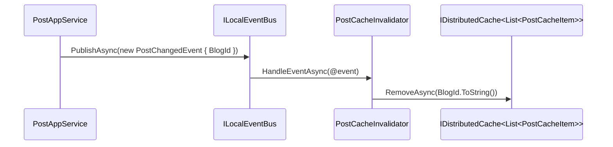
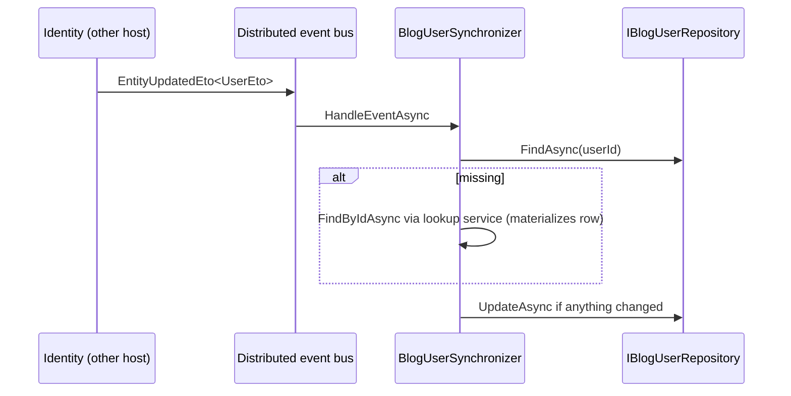

`Volo.Blogging.Domain` is the heart of the module. Everything else — REST controllers, Razor Pages,
EF/Mongo repositories, admin services — exists to shuttle data into and out of the five aggregates
declared here. The domain owns no host-process state: there is no static service container, no
ASP.NET dependency, just C# classes and repository interfaces. The companion `Volo.Blogging.Domain.Shared`
package carries constants, ETOs, and the `BloggingResource` localization key, so callers that should
not pull in EF can still validate inputs against `PostConsts.MaxTitleLength` etc.

## File inventory

| File | Role |
| --- | --- |
| `Volo/Blogging/AbpBloggingDbProperties.cs` | `DbTablePrefix = "Blg"`, `DbSchema`, `ConnectionStringName = "Blogging"` |
| `Volo/Blogging/BloggingDomainModule.cs` | Registers AutoMapper profile + ETO mappings on `AbpDistributedEntityEventOptions` |
| `Volo/Blogging/BloggingDomainMappingProfile.cs` | `Post → PostCacheItem` mapping (used by `PostAppService` cache path) |
| `Volo/Blogging/Blogs/Blog.cs` | `Blog` aggregate |
| `Volo/Blogging/Blogs/IBlogRepository.cs` | `FindByShortNameAsync` |
| `Volo/Blogging/Posts/Post.cs` | `Post` aggregate with `Collection<PostTag>` |
| `Volo/Blogging/Posts/PostTag.cs` | Join entity with composite key |
| `Volo/Blogging/Posts/IPostRepository.cs` | `GetPostsByBlogId`, `GetPostByUrl`, `IsPostUrlInUseAsync`, … |
| `Volo/Blogging/Posts/PostCacheItem.cs` | Serializable projection used by `IDistributedCache` |
| `Volo/Blogging/Posts/PostChangedEvent.cs` | Local event carrying `BlogId` |
| `Volo/Blogging/Posts/PostCacheInvalidator.cs` | `ILocalEventHandler<PostChangedEvent>` that removes the cache entry |
| `Volo/Blogging/Comments/Comment.cs` | `Comment` aggregate |
| `Volo/Blogging/Comments/ICommentRepository.cs` | Per-post queries, replies, bulk delete |
| `Volo/Blogging/Tagging/Tag.cs` | `Tag` aggregate with `UsageCount` |
| `Volo/Blogging/Tagging/ITagRepository.cs` | Lookup by name, by id list, bulk decrease |
| `Volo/Blogging/Users/BlogUser.cs` | Profile mirror for external Identity users |
| `Volo/Blogging/Users/IBlogUserRepository.cs` | Extends `IUserRepository<BlogUser>` with `GetUsersAsync(maxCount, filter)` |
| `Volo/Blogging/Users/BlogUserLookupService.cs` | Materializes `BlogUser` rows on demand |
| `Volo/Blogging/Users/IBlogUserLookupService.cs` | Marker interface |
| `Volo/Blogging/Users/BlogUserSynchronizer.cs` | `IDistributedEventHandler<EntityUpdatedEto<UserEto>>` |

## Module registration

```csharp
[DependsOn(
    typeof(BloggingDomainSharedModule),
    typeof(AbpDddDomainModule),
    typeof(AbpAutoMapperModule),
    typeof(AbpCachingModule)
)]
public class BloggingDomainModule : AbpModule
{
    public override void ConfigureServices(ServiceConfigurationContext context)
    {
        context.Services.AddAutoMapperObjectMapper<BloggingDomainModule>();

        Configure<AbpAutoMapperOptions>(options =>
            options.AddProfile<BloggingDomainMappingProfile>(validate: true));

        Configure<AbpDistributedEntityEventOptions>(options =>
        {
            options.EtoMappings.Add<Blog, BlogEto>(typeof(BloggingDomainModule));
            options.EtoMappings.Add<Comment, CommentEto>(typeof(BloggingDomainModule));
            options.EtoMappings.Add<Post, PostEto>(typeof(BloggingDomainModule));
            options.EtoMappings.Add<Tag, TagEto>(typeof(BloggingDomainModule));
        });
    }
}
```

The four ETO mappings are what makes blogging entity changes flow through ABP's distributed event bus
to other microservices. The ETOs live in `Volo.Blogging.Domain.Shared`, so a consumer subscriber can
reference just the shared package without pulling EF Core into its image.

## Aggregate: `Blog`

```csharp
public class Blog : FullAuditedAggregateRoot<Guid>
{
    [NotNull] public virtual string Name { get; protected set; }
    [NotNull] public virtual string ShortName { get; protected set; }
    [CanBeNull] public virtual string Description { get; set; }

    public Blog(Guid id, [NotNull] string name, [NotNull] string shortName)
    {
        Id = id;
        Name = Check.NotNullOrWhiteSpace(name, nameof(name));
        ShortName = Check.NotNullOrWhiteSpace(shortName, nameof(shortName));
    }

    public virtual Blog SetName([NotNull] string name) { /* checks then assigns */ }
    public virtual Blog SetShortName(string shortName) { /* checks then assigns */ }
}
```

`ShortName` is the URL segment. There is no length check inside the aggregate beyond null/whitespace —
the EF mapping enforces `BlogConsts.MaxShortNameLength = 32` and the DTOs validate via
`[DynamicStringLength]`. `Description` is mutable via property setter because no domain rule applies.

| Property | Type | Source of length |
| --- | --- | --- |
| `Name` | `string` | `BlogConsts.MaxNameLength = 256` |
| `ShortName` | `string` | `BlogConsts.MaxShortNameLength = 32` |
| `Description` | `string?` | `BlogConsts.MaxDescriptionLength = 1024` |

`IBlogRepository` adds a single lookup:

```csharp
public interface IBlogRepository : IBasicRepository<Blog, Guid>
{
    Task<Blog> FindByShortNameAsync(string shortName, CancellationToken cancellationToken = default);
}
```

## Aggregate: `Post`

```csharp
public class Post : FullAuditedAggregateRoot<Guid>
{
    public virtual Guid BlogId { get; protected set; }
    [NotNull] public virtual string Url { get; protected set; }
    [NotNull] public virtual string CoverImage { get; set; }
    [NotNull] public virtual string Title { get; protected set; }
    [CanBeNull] public virtual string Content { get; set; }
    [CanBeNull] public virtual string Description { get; set; }
    public virtual int ReadCount { get; protected set; }
    public virtual Collection<PostTag> Tags { get; protected set; }

    public Post(Guid id, Guid blogId, [NotNull] string title, [NotNull] string coverImage, [NotNull] string url)
    {
        Id = id;
        BlogId = blogId;
        Title = Check.NotNullOrWhiteSpace(title, nameof(title));
        Url = Check.NotNullOrWhiteSpace(url, nameof(url));
        CoverImage = Check.NotNullOrWhiteSpace(coverImage, nameof(coverImage));
        Tags = new Collection<PostTag>();
    }

    public virtual Post IncreaseReadCount() { ReadCount++; return this; }
    public virtual Post SetTitle([NotNull] string title) { /* … */ }
    public virtual Post SetUrl([NotNull] string url) { /* … */ }
    public virtual void AddTag(Guid tagId) => Tags.Add(new PostTag(Id, tagId));
    public virtual void RemoveTag(Guid tagId) => Tags.RemoveAll(t => t.TagId == tagId);
}
```

The post owns its tags through the `PostTag` collection. `AddTag`/`RemoveTag` are public so that
`PostAppService` can synchronize tags whenever an author edits a post. `IncreaseReadCount` is the
only mutator that doesn't take an argument — it is called from `PostAppService.GetForReadingAsync`.

`PostTag` itself:

```csharp
public class PostTag : CreationAuditedEntity
{
    public virtual Guid PostId { get; protected set; }
    public virtual Guid TagId { get; protected set; }
    public override object[] GetKeys() => new object[] { PostId, TagId };
}
```

The composite key is set up in the EF mapping and provided by `GetKeys()` for the MongoDB driver.

`IPostRepository` exposes all the queries the application layer needs:

| Method | Purpose |
| --- | --- |
| `GetPostsByBlogId(Guid id, ct)` | All posts for a blog, ordered by creation time descending |
| `IsPostUrlInUseAsync(blogId, url, excludingPostId?, ct)` | URL slug availability check |
| `GetPostByUrl(blogId, url, ct)` | Throws `EntityNotFoundException` if missing |
| `GetOrderedList(blogId, descending = false, ct)` | EF Core: descending by default; Mongo: ascending by default — see [EF Core](/modules/blogging/efcore) |
| `GetListByUserIdAsync(userId, ct)` | All posts authored by a user |
| `GetLatestBlogPostsAsync(blogId, count, ct)` | Top-N sidebar query for the detail page |

## Cache integration: `PostCacheItem`, `PostChangedEvent`, `PostCacheInvalidator`

`PostCacheItem` is a `[Serializable]` projection that includes the post's `Tags` and `CommentCount`,
so the public `PostAppService.GetTimeOrderedListAsync` can serve a blog's full list from cache without
re-querying tags per post.

```csharp
public class PostCacheInvalidator : ILocalEventHandler<PostChangedEvent>, ITransientDependency
{
    protected IDistributedCache<List<PostCacheItem>> Cache { get; }
    public PostCacheInvalidator(IDistributedCache<List<PostCacheItem>> cache) => Cache = cache;

    public virtual async Task HandleEventAsync(PostChangedEvent post)
        => await Cache.RemoveAsync(post.BlogId.ToString());
}
```

```csharp
public class PostChangedEvent
{
    public Guid BlogId { get; set; }
}
```

`PostAppService` raises this event after every Create/Update/Delete via `ILocalEventBus`. Because it
is a *local* event, invalidation runs in the same process; if you want cross-host invalidation you can
configure the event bus to publish it as a distributed event too.



## Aggregate: `Comment`

```csharp
public class Comment : FullAuditedAggregateRoot<Guid>
{
    public virtual Guid PostId { get; protected set; }
    public virtual Guid? RepliedCommentId { get; protected set; }
    public virtual string Text { get; protected set; }

    public Comment(Guid id, Guid postId, Guid? repliedCommentId, [NotNull] string text)
    {
        Id = id;
        PostId = postId;
        RepliedCommentId = repliedCommentId;
        Text = Check.NotNullOrWhiteSpace(text, nameof(text));
    }

    public void SetText(string text) => Text = Check.NotNullOrWhiteSpace(text, nameof(text));
}
```

Threading is **single-level**: when a user clicks "reply" on a sub-comment, the application service
still sets `RepliedCommentId` to the top-level parent so the hierarchy never grows past two levels.
`CommentAppService.GetHierarchicalListOfPostAsync` rebuilds the tree client-side.

`ICommentRepository`:

```csharp
public interface ICommentRepository : IBasicRepository<Comment, Guid>
{
    Task<List<Comment>> GetListOfPostAsync(Guid postId, CancellationToken ct = default);
    Task<int> GetCommentCountOfPostAsync(Guid postId, CancellationToken ct = default);
    Task<List<Comment>> GetRepliesOfComment(Guid id, CancellationToken ct = default);
    Task DeleteOfPost(Guid id, CancellationToken ct = default);
}
```

`DeleteOfPost` is invoked from `PostAppService.DeleteAsync` to remove every comment of a post being
deleted.

## Aggregate: `Tag`

```csharp
public class Tag : FullAuditedAggregateRoot<Guid>
{
    public virtual Guid BlogId { get; protected set; }
    public virtual string Name { get; protected set; }
    public virtual string Description { get; protected set; }
    public virtual int UsageCount { get; protected internal set; }

    public virtual void IncreaseUsageCount(int number = 1) { UsageCount += number; }

    public virtual void DecreaseUsageCount(int number = 1)
    {
        if (UsageCount <= 0) return;
        if (UsageCount - number <= 0) { UsageCount = 0; return; }
        UsageCount -= number;
    }
}
```

`UsageCount` is the foundation of the "Popular Tags" widget — `TagAppService.GetPopularTagsAsync`
orders by `UsageCount` descending and filters by `MinimumPostCount`. The counter is incremented in
`PostAppService.AddNewTags` and decremented in `RemoveOldTags`. Bulk decrement happens through
`ITagRepository.DecreaseUsageCountOfTagsAsync(List<Guid>)`, used when a post is deleted.

## Aggregate: `BlogUser` (Identity mirror)

`BlogUser` is a denormalized projection of an external Identity user. The base type implements
`IUser` (so any code asking for `IUser` can be served a `BlogUser`) and `IUpdateUserData` (so the
synchronizer can call `Update(IUserData)`):

```csharp
public class BlogUser : AggregateRoot<Guid>, IUser, IUpdateUserData
{
    public virtual Guid? TenantId { get; protected set; }
    public virtual string UserName { get; protected set; }
    public virtual string Email { get; protected set; }
    public virtual string Name { get; set; }
    public virtual string Surname { get; set; }
    public virtual bool IsActive { get; set; }
    public virtual bool EmailConfirmed { get; protected set; }
    public virtual string PhoneNumber { get; protected set; }
    public virtual bool PhoneNumberConfirmed { get; protected set; }

    [CanBeNull] public virtual string WebSite { get; set; }
    [CanBeNull] public virtual string Twitter { get; set; }
    [CanBeNull] public virtual string Github { get; set; }
    [CanBeNull] public virtual string Linkedin { get; set; }
    [CanBeNull] public virtual string Company { get; set; }
    [CanBeNull] public virtual string JobTitle { get; set; }
    [CanBeNull] public virtual string Biography { get; set; }

    public BlogUser(IUserData user) : base(user.Id)
    {
        TenantId = user.TenantId;
        UpdateInternal(user);
    }

    public virtual bool Update(IUserData user) { /* returns true if anything changed */ }
}
```

The seven nullable social-profile properties are unique to Blogging — they don't exist on the Identity
user. `MemberAppService.UpdateUserProfileAsync` (see [Application](/modules/blogging/application))
lets bloggers edit them from `/blog/members/{userName}`.

### Lookup and synchronization

```csharp
public class BlogUserLookupService : UserLookupService<BlogUser, IBlogUserRepository>, IBlogUserLookupService
{
    protected override BlogUser CreateUser(IUserData externalUser) => new BlogUser(externalUser);
}
```

`UserLookupService<,>` is an ABP infrastructure type: when `FindByIdAsync(userId)` is called, it
first looks in the local `IBlogUserRepository`. If absent, it resolves an `IExternalUserLookupServiceProvider`
(typically Identity) and persists a new `BlogUser` from the returned `IUserData`.

```csharp
public class BlogUserSynchronizer :
    IDistributedEventHandler<EntityUpdatedEto<UserEto>>,
    ITransientDependency
{
    public async Task HandleEventAsync(EntityUpdatedEto<UserEto> eventData)
    {
        var user = await UserRepository.FindAsync(eventData.Entity.Id)
                   ?? await UserLookupService.FindByIdAsync(eventData.Entity.Id);
        if (user == null) return;
        if (user.Update(eventData.Entity))
            await UserRepository.UpdateAsync(user);
    }
}
```



## Constants (`Domain.Shared`)

| Class | Field | Default |
| --- | --- | --- |
| `BlogConsts` | `MaxNameLength` / `MaxShortNameLength` / `MaxDescriptionLength` | 256 / 32 / 1024 |
| `PostConsts` | `MaxTitleLength` / `MaxUrlLength` / `MaxContentLength` / `MaxDescriptionLength` / `MaxTitleLengthToBeSeoFriendly` / `MaxSeoFriendlyDescriptionLength` | 512 / 64 / 1,048,576 / 1000 / 60 / 200 |
| `CommentConsts` | `MaxTextLength` | 1024 |
| `TagConsts` | `MaxNameLength` / `MaxDescriptionLength` | 64 / 512 |
| `UserConsts` | `MaxNameLength`, `MaxSurnameLength`, `MaxBiographyLength`, `MaxWebSiteLength`, `MaxTwitterLength`, `MaxGithubLength`, `MaxLinkedinLength`, `MaxCompanyLength`, `MaxJobTitleLength` | 64, 64, 1000, 256, 128, 256, 256, 256, 128 |

All numeric `Max*` are `static int` (mutable) except for `UserConsts` which uses `const int`. You can
tweak the mutable ones from your host's `PreConfigureServices` if your business prefers shorter
titles or longer descriptions; the EF migrations will still target the original column lengths unless
you regenerate them.

## Gotchas

- **`Tag.UsageCount` has a `protected internal set`.** Don't call `Tag.SetName(...)` and assume the
  count survives — only the Increase/Decrease methods (or repository updates) should touch it.
- **`BlogUser.Update` returns `bool`.** Callers must check the return value to decide whether to
  `UpdateAsync`. Skipping the check is wasted work, but it also means `Update` is the only place
  the equality check between `BlogUser` and `IUserData` lives. Adding a new mirrored field requires
  editing both `UpdateInternal` and `Equals`.
- **`PostCacheItem.Tags` is `List<Tag>`, not `List<TagDto>`.** That mapping is registered via
  `Post → PostCacheItem` (ignoring `Tags` and `CommentCount`) and the populated list is rebuilt
  by `PostAppService.GetTimeOrderedPostsAsync`. Be cautious if you serialize the cache to JSON —
  the `Tag` aggregate ships through.
- **`PostChangedEvent` carries only `BlogId`.** If you want a handler that needs the post id, raise
  your own event in addition to (not instead of) this one.
- **`Comment.RepliedCommentId` is not constrained to refer to the same post.** The application
  service is what enforces post scoping when it sets it. A direct repository call can produce orphan
  replies.
- **`IBlogUserLookupService` is just a marker.** All behavior lives in the base
  `UserLookupService<BlogUser, IBlogUserRepository>`. If you need to customize lookup behavior,
  override `BlogUserLookupService` rather than the interface.
