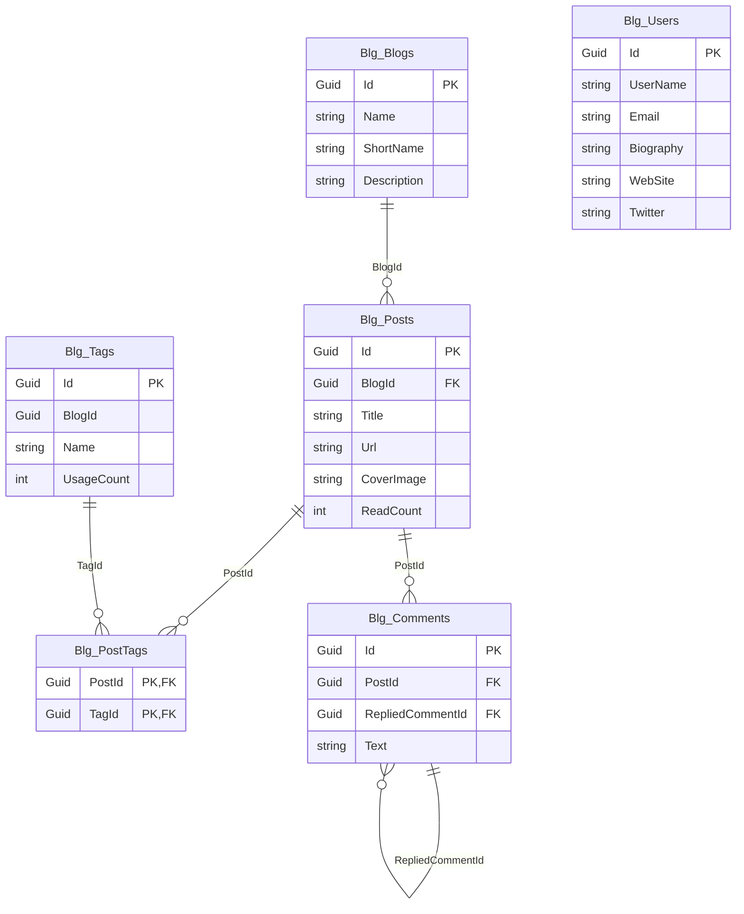

`Volo.Blogging.EntityFrameworkCore` is the relational-database adapter for the module. It declares a
single `BloggingDbContext` with six `DbSet<>` properties, registers five repositories, and configures
all entities through `BloggingDbContextModelBuilderExtensions.ConfigureBlogging`. Everything is wired
in a tenant-agnostic way (`[IgnoreMultiTenancy]`), so the blog catalog is shared by every tenant in
a multi-tenant host.

## File inventory

| File | Role |
| --- | --- |
| `EntityFrameworkCore/BloggingDbContext.cs` | The DbContext |
| `EntityFrameworkCore/IBloggingDbContext.cs` | Contract used by `EfCoreRepository<>` |
| `EntityFrameworkCore/BloggingDbContextModelBuilderExtensions.cs` | `ConfigureBlogging(ModelBuilder)` — all FluentAPI |
| `EntityFrameworkCore/BloggingEntityFrameworkCoreModule.cs` | DI registration |
| `BloggingEntityFrameworkCoreQueryableExtensions.cs` | `IncludeDetails()` for `Post` |
| `Blogs/EfCoreBlogRepository.cs` | `FindByShortNameAsync` |
| `Posts/EfCorePostRepository.cs` | All `IPostRepository` queries + `WithDetailsAsync` override |
| `Comments/EfCoreCommentRepository.cs` | `GetListOfPostAsync`, `DeleteOfPost`, … |
| `Tagging/EfCoreTagRepository.cs` | `GetListAsync(blogId)`, `DecreaseUsageCountOfTagsAsync`, … |
| `Users/EfCoreBlogUserRepository.cs` | `GetUsersAsync` and `IUserRepository<BlogUser>` |

## Module

```csharp
[DependsOn(typeof(BloggingDomainModule), typeof(AbpEntityFrameworkCoreModule))]
public class BloggingEntityFrameworkCoreModule : AbpModule
{
    public override void ConfigureServices(ServiceConfigurationContext context)
    {
        context.Services.AddAbpDbContext<BloggingDbContext>(options =>
        {
            options.AddRepository<Blog,     EfCoreBlogRepository>();
            options.AddRepository<BlogUser, EfCoreBlogUserRepository>();
            options.AddRepository<Post,     EfCorePostRepository>();
            options.AddRepository<Tag,      EfCoreTagRepository>();
            options.AddRepository<Comment,  EfCoreCommentRepository>();
        });
    }
}
```

The custom repositories take precedence over the generic `IRepository<TEntity, Guid>` resolution,
so calls like `IPostRepository.GetPostsByBlogId` resolve to the EF Core implementation. `PostTag` is
not in the list — it is owned by `Post` and accessed through the post navigation.

## DbContext and contract

```csharp
[IgnoreMultiTenancy]
[ConnectionStringName(AbpBloggingDbProperties.ConnectionStringName)] // "Blogging"
public class BloggingDbContext : AbpDbContext<BloggingDbContext>, IBloggingDbContext
{
    public DbSet<BlogUser> Users { get; set; }
    public DbSet<Blog>     Blogs { get; set; }
    public DbSet<Post>     Posts { get; set; }
    public DbSet<Tag>      Tags  { get; set; }
    public DbSet<PostTag>  PostTags { get; set; }
    public DbSet<Comment>  Comments { get; set; }

    public BloggingDbContext(DbContextOptions<BloggingDbContext> options) : base(options) { }

    protected override void OnModelCreating(ModelBuilder builder)
    {
        base.OnModelCreating(builder);
        builder.ConfigureBlogging();
    }
}
```

```csharp
[IgnoreMultiTenancy]
[ConnectionStringName(AbpBloggingDbProperties.ConnectionStringName)]
public interface IBloggingDbContext : IEfCoreDbContext
{
    DbSet<BlogUser> Users { get; }
    DbSet<Blog>     Blogs { get; }
    DbSet<Post>     Posts { get; }
    DbSet<Comment>  Comments { get; }
    DbSet<PostTag>  PostTags { get; }
    DbSet<Tag>      Tags { get; }
}
```

The `[IgnoreMultiTenancy]` attribute on the **interface** means the data filter for tenant id is
turned off across the board. Every entity is host-level. If you want per-tenant blogs in EF, you
need to subclass `BloggingDbContext`, drop the attribute, and add `TenantId` columns via object
extensions or a fresh migration.

## Model

`ConfigureBlogging` is roughly 80 lines of FluentAPI. The summary table:

| Entity | Table | Notable mappings |
| --- | --- | --- |
| `BlogUser` | `BlgUsers` | `ConfigureAbpUser()`; max lengths for `WebSite`, `Twitter`, `Github`, `Linkedin`, `Company`, `JobTitle`, `Biography` from `UserConsts` |
| `Blog` | `BlgBlogs` | `Name` required (256), `ShortName` required (32), `Description` (1024) |
| `Post` | `BlgPosts` | `Title` required (512), `CoverImage` required (no length), `Url` required (64), `Content` (1 MB), `Description` (1000); FK `BlogId → Blogs`; owns `Tags` collection (one-to-many on `PostTag.PostId`) |
| `Comment` | `BlgComments` | `Text` required (1024), `PostId` required FK, optional self-FK on `RepliedCommentId` |
| `Tag` | `BlgTags` | `Name` required (64), `Description` (512), `UsageCount` (mapped, no constraint); reverse one-to-many on `PostTag.TagId` |
| `PostTag` | `BlgPostTags` | Composite PK `(PostId, TagId)` |

Every entity calls `b.ConfigureByConvention()` so the base ABP audit / soft-delete / extra-properties
columns (`CreationTime`, `IsDeleted`, `ExtraProperties`, etc.) are added consistently.

A condensed view of the `Post` configuration:

```csharp
builder.Entity<Post>(b =>
{
    b.ToTable(AbpBloggingDbProperties.DbTablePrefix + "Posts", AbpBloggingDbProperties.DbSchema);
    b.ConfigureByConvention();

    b.Property(x => x.BlogId).HasColumnName(nameof(Post.BlogId));
    b.Property(x => x.Title).IsRequired().HasMaxLength(PostConsts.MaxTitleLength);
    b.Property(x => x.CoverImage).IsRequired();
    b.Property(x => x.Url).IsRequired().HasMaxLength(PostConsts.MaxUrlLength);
    b.Property(x => x.Content).IsRequired(false).HasMaxLength(PostConsts.MaxContentLength);
    b.Property(x => x.Description).IsRequired(false).HasMaxLength(PostConsts.MaxDescriptionLength);

    b.HasMany(p => p.Tags).WithOne().HasForeignKey(qt => qt.PostId);
    b.HasOne<Blog>().WithMany().IsRequired().HasForeignKey(p => p.BlogId);

    b.ApplyObjectExtensionMappings();
});
```

There are two foreign-key relationships from `Post`:

- `Post → Blog` (many-to-one, required, no navigation property on either side beyond `BlogId`).
- `Post → PostTag` (one-to-many on the owned `Tags` collection).

The `IsTenantOnlyDatabase()` early return at the top of `ConfigureBlogging` means a database that
only stores tenant data **skips** the entire mapping. This matters when you split into a host
database and a tenant database — Blogging only ever lives in the host DB.

## `IncludeDetails`

```csharp
public static class BloggingEntityFrameworkCoreQueryableExtensions
{
    public static IQueryable<Post> IncludeDetails(this IQueryable<Post> queryable, bool include = true)
    {
        if (!include) return queryable;
        return queryable.Include(x => x.Tags);
    }
}
```

`EfCorePostRepository.WithDetailsAsync` uses this so that `GetAsync(id, includeDetails: true)` returns
a post with its `PostTag` collection eagerly loaded.

## `EfCorePostRepository`

```csharp
public class EfCorePostRepository : EfCoreRepository<IBloggingDbContext, Post, Guid>, IPostRepository
{
    public virtual async Task<List<Post>> GetPostsByBlogId(Guid id, CancellationToken ct = default)
        => await (await GetDbSetAsync())
            .Where(p => p.BlogId == id)
            .OrderByDescending(p => p.CreationTime)
            .ToListAsync(GetCancellationToken(ct));

    public virtual async Task<bool> IsPostUrlInUseAsync(Guid blogId, string url, Guid? excludingPostId = null, CancellationToken ct = default)
    {
        var query = (await GetDbSetAsync()).Where(p => blogId == p.BlogId && p.Url == url);
        if (excludingPostId != null) query = query.Where(p => excludingPostId != p.Id);
        return await query.AnyAsync(GetCancellationToken(ct));
    }

    public virtual async Task<Post> GetPostByUrl(Guid blogId, string url, CancellationToken ct = default)
    {
        var post = await (await GetDbSetAsync())
            .FirstOrDefaultAsync(p => p.BlogId == blogId && p.Url == url, GetCancellationToken(ct));
        if (post == null) throw new EntityNotFoundException(typeof(Post), nameof(post));
        return post;
    }

    public virtual async Task<List<Post>> GetOrderedList(Guid blogId, bool descending = false, CancellationToken ct = default)
    {
        if (!descending)
            return await (await GetDbSetAsync()).Where(x => x.BlogId == blogId).OrderByDescending(x => x.CreationTime).ToListAsync(GetCancellationToken(ct));
        return await (await GetDbSetAsync()).Where(x => x.BlogId == blogId).OrderBy(x => x.CreationTime).ToListAsync(GetCancellationToken(ct));
    }

    // GetListByUserIdAsync, GetLatestBlogPostsAsync, WithDetailsAsync …
    public override async Task<IQueryable<Post>> WithDetailsAsync()
        => (await GetQueryableAsync()).IncludeDetails();
}
```

Two oddities to flag:

- **`GetOrderedList(blogId, descending = false)`** returns **descending** order when
  `descending == false`, and **ascending** when `descending == true`. This is the opposite of what the
  flag name suggests. The Mongo implementation goes the other way (ascending when `false`). The
  consuming code in `PostAppService.GetTimeOrderedPostsAsync` calls `GetOrderedList(blogId)` (no flag),
  so the cached "time-ordered" list is **descending by creation time** in EF — newest first.
- **`GetPostByUrl` throws `EntityNotFoundException`** instead of returning null — important if your
  custom UI relies on a null-pattern.

## Other repositories

```csharp
public class EfCoreBlogRepository : EfCoreRepository<IBloggingDbContext, Blog, Guid>, IBlogRepository
{
    public virtual async Task<Blog> FindByShortNameAsync(string shortName, CancellationToken ct = default)
        => await (await GetDbSetAsync()).FirstOrDefaultAsync(p => p.ShortName == shortName, GetCancellationToken(ct));
}
```

```csharp
public class EfCoreTagRepository : EfCoreRepository<IBloggingDbContext, Tag, Guid>, ITagRepository
{
    public virtual Task<List<Tag>> GetListAsync(Guid blogId, CancellationToken ct = default) =>
        (await GetDbSetAsync()).Where(t => t.BlogId == blogId).ToListAsync(GetCancellationToken(ct));

    public virtual Task<Tag> GetByNameAsync(Guid blogId, string name, CancellationToken ct = default) =>
        (await GetDbSetAsync()).FirstAsync(t => t.BlogId == blogId && t.Name == name, GetCancellationToken(ct));

    public virtual Task<Tag> FindByNameAsync(Guid blogId, string name, CancellationToken ct = default) =>
        (await GetDbSetAsync()).FirstOrDefaultAsync(t => t.BlogId == blogId && t.Name == name, GetCancellationToken(ct));

    public virtual async Task<List<Tag>> GetListAsync(IEnumerable<Guid> ids, CancellationToken ct = default) =>
        await (await GetDbSetAsync()).Where(t => ids.Contains(t.Id)).ToListAsync(GetCancellationToken(ct));

    public virtual async Task DecreaseUsageCountOfTagsAsync(List<Guid> ids, CancellationToken ct = default)
    {
        var tags = await (await GetDbSetAsync())
            .Where(t => ids.Any(id => id == t.Id))
            .ToListAsync(GetCancellationToken(ct));
        foreach (var tag in tags) tag.DecreaseUsageCount();
    }
}
```

`DecreaseUsageCountOfTagsAsync` loads tags into memory and mutates them — the change is picked up by
EF's tracker on SaveChanges. Bulk SQL UPDATE is not used.

The comment repository implements `GetListOfPostAsync`, `GetCommentCountOfPostAsync`,
`GetRepliesOfComment`, and `DeleteOfPost` (a bulk delete of `Where(p => p.PostId == postId)`).

## ER diagram



`BlogUser` has no explicit FK to anything — the linkage to posts/comments is by the `CreatorId`
audit column populated by ABP, not a declared foreign key.

## Migrations and schema

The module **does not ship its own migrations**. You add `BloggingDbContext` to your own DbContext
or simply include it in your migrations DbContext so EF Core's `Add-Migration` picks up the
mappings. Table prefix is `Blg` by default — change `AbpBloggingDbProperties.DbTablePrefix` *before*
migrating if you want a different prefix.

Typical bootstrap in a host's `DbMigrationService`:

```csharp
public class MyDbContextFactoryDbContextOptionsBuilder : IDesignTimeDbContextFactory<MyDbContext>
{
    public MyDbContext CreateDbContext(string[] args)
    {
        var builder = new DbContextOptionsBuilder<MyDbContext>().UseSqlServer(GetConnectionString());
        return new MyDbContext(builder.Options);
    }
}
```

Where `MyDbContext` shares the connection string named `"Default"` (Blogging falls back to it when
the named `"Blogging"` string is missing, courtesy of ABP's connection-string resolver).

## Query patterns to know

- **`GetTimeOrderedListAsync` cache rebuild** = `IPostRepository.GetOrderedList(blogId)` → `OrderByDescending(CreationTime)`.
- **Popular tag list** = `ITagRepository.GetListAsync(blogId)` loads *every* tag for the blog into
  memory, then `PostAppService.TagAppService.GetPopularTagsAsync` filters and takes top N. Add a
  custom EF query if blogs grow beyond a few thousand tags.
- **Reading a post** = `IPostRepository.GetPostByUrl(blogId, url)` → no `IncludeDetails`, so `Post.Tags`
  is empty until `PostAppService.GetTagsOfPostAsync(id)` issues a second query that goes through
  `IPostRepository.GetAsync(id)` (which respects `WithDetailsAsync`).

## Gotchas

- **`[IgnoreMultiTenancy]` lives on the interface and the implementation.** Even if you derive a new
  context, the data filter remains off unless you also remove the attribute from the *interface*
  binding. Re-declare a tenant-aware interface if you want filters back.
- **The default `OnModelCreating` order matters.** `base.OnModelCreating(builder)` must precede
  `builder.ConfigureBlogging()`, otherwise ABP's convention configuration (audit columns, extra
  properties) won't apply to Blogging entities.
- **`PostTag` has no auto-generated index on `(TagId)`.** Reverse lookups (find all posts using a
  tag) do a table scan unless you add an index in a custom migration.
- **`EfCorePostRepository.GetOrderedList` naming.** The parameter `descending = false` produces
  descending order — opposite of intuition. Either don't pass the flag (let the default behavior
  hold) or read the source before relying on it.
- **`Blg` is just three characters.** On case-insensitive collations you're fine; on case-sensitive
  PostgreSQL (`"BlgPosts"` vs. `"blgposts"`) make sure your migration uses quoted identifiers
  consistently. ABP defaults to quoted identifiers on PostgreSQL.
- **`BlogUser` is a separate table, not a view on the Identity user.** A row only appears the first
  time `BlogUserLookupService` is asked for that user; until then, joining `Posts.CreatorId` against
  `Users.Id` yields nothing.
