`Volo.Blogging.HttpApi` exposes the five public application services as conventional MVC controllers
under `/api/blogging/`. Every controller is a thin pass-through: it injects the matching app service
and forwards each method, so all business logic, authorization, caching, and tag synchronization
stays in the [Application layer](/modules/blogging/application). The host wires this package into
ASP.NET Core through its `BloggingHttpApiModule`.

## File inventory

| File | Route prefix | Backing service |
| --- | --- | --- |
| `BloggingHttpApiModule.cs` | — | Module configuration |
| `BlogsController.cs` | `api/blogging/blogs` | `IBlogAppService` |
| `PostsController.cs` | `api/blogging/posts` | `IPostAppService` |
| `CommentsController.cs` | `api/blogging/comments` | `ICommentAppService` |
| `TagsController.cs` | `api/blogging/tags` | `ITagAppService` |
| `BlogFilesController.cs` | `api/blogging/files` | `IFileAppService` |

All controllers share these attributes:

```csharp
[RemoteService(Name = BloggingRemoteServiceConsts.RemoteServiceName)]  // "Blogging"
[Area(BloggingRemoteServiceConsts.ModuleName)]                          // "blogging"
[Route("api/blogging/...")]
public class XController : AbpControllerBase, IXAppService { /* … */ }
```

The `[RemoteService]` and `[Area]` attributes are what tell ABP's dynamic client proxy generator to
group these endpoints under the `Blogging` module so client-side proxies can be created with
`ClientProxyFactory<IBlogAppService>()`.

## Module configuration

```csharp
[DependsOn(
    typeof(BloggingApplicationContractsModule),
    typeof(AbpAspNetCoreMvcModule))]
public class BloggingHttpApiModule : AbpModule
{
    public override void PreConfigureServices(ServiceConfigurationContext context)
    {
        PreConfigure<IMvcBuilder>(mvc => mvc.AddApplicationPartIfNotExists(typeof(BloggingHttpApiModule).Assembly));
    }

    public override void ConfigureServices(ServiceConfigurationContext context)
    {
        Configure<AbpLocalizationOptions>(options =>
            options.Resources.Get<BloggingResource>().AddBaseTypes(typeof(AbpUiResource)));

        Configure<AbpAspNetCoreMvcOptions>(options =>
            options.ConventionalControllers.FormBodyBindingIgnoredTypes.Add(typeof(FileUploadInputDto)));
    }
}
```

Two things to notice:

1. `AddApplicationPartIfNotExists` makes sure the embedded controllers are discoverable when the
   module is referenced through NuGet (where MVC otherwise would not scan the assembly).
2. `FormBodyBindingIgnoredTypes.Add(typeof(FileUploadInputDto))` is what lets `BlogFilesController.CreateAsync`
   accept a multipart form — without that hint, ABP's conventional controller path would try to bind
   the DTO from the JSON body.

## `BlogsController`

```csharp
[Route("api/blogging/blogs")]
public class BlogsController : AbpControllerBase, IBlogAppService
{
    [HttpGet]
    public virtual Task<ListResultDto<BlogDto>> GetListAsync() { /* delegate */ }

    [HttpGet, Route("by-shortname/{shortName}")]
    public virtual Task<BlogDto> GetByShortNameAsync(string shortName) { /* delegate */ }

    [HttpGet, Route("{id}")]
    public virtual Task<BlogDto> GetAsync(Guid id) { /* delegate */ }
}
```

| Verb | Path | Returns | Notes |
| --- | --- | --- | --- |
| GET | `/api/blogging/blogs` | `ListResultDto<BlogDto>` | All blogs (no paging) |
| GET | `/api/blogging/blogs/by-shortname/{shortName}` | `BlogDto` | 404 via `EntityNotFoundException` |
| GET | `/api/blogging/blogs/{id}` | `BlogDto` | — |

No authorization attributes; the public blog list is anonymous-friendly.

## `PostsController`

```csharp
[Route("api/blogging/posts")]
public class PostsController : AbpControllerBase, IPostAppService
{
    [HttpGet, Route("{blogId}/all")]
    public Task<ListResultDto<PostWithDetailsDto>> GetListByBlogIdAndTagNameAsync(Guid blogId, string tagName) { /* … */ }

    [HttpGet, Route("{blogId}/all/by-time")]
    public Task<ListResultDto<PostWithDetailsDto>> GetTimeOrderedListAsync(Guid blogId) { /* … */ }

    [HttpGet, Route("read")]
    public Task<PostWithDetailsDto> GetForReadingAsync(GetPostInput input) { /* … */ }

    [HttpGet, Route("{id}")]
    public Task<PostWithDetailsDto> GetAsync(Guid id) { /* … */ }

    [HttpPost]
    public Task<PostWithDetailsDto> CreateAsync(CreatePostDto input) { /* … */ }

    [HttpPut, Route("{id}")]
    public Task<PostWithDetailsDto> UpdateAsync(Guid id, UpdatePostDto input) { /* … */ }

    [HttpGet, Route("user/{userId}")]
    public Task<List<PostWithDetailsDto>> GetListByUserIdAsync(Guid userId) { /* … */ }

    [HttpGet, Route("{blogId}/latest/{count}")]
    public Task<List<PostWithDetailsDto>> GetLatestBlogPostsAsync(Guid blogId, int count) { /* … */ }

    [HttpDelete, Route("{id}")]
    public Task DeleteAsync(Guid id) { /* … */ }
}
```

| Verb | Path | Auth | Side effects |
| --- | --- | --- | --- |
| GET | `/{blogId}/all?tagName=` | anon | none |
| GET | `/{blogId}/all/by-time` | anon | populates the cache on first call |
| GET | `/read?blogId={g}&url={s}` | anon | **mutates** `ReadCount` |
| GET | `/{id}` | anon | none |
| GET | `/user/{userId}` | anon | none |
| GET | `/{blogId}/latest/{count}` | anon | none |
| POST | `/` | `Blogging.Post.Create` (on service) | tag sync, `PostChangedEvent` |
| PUT | `/{id}` | `Blogging.Post.Update` *or* author | tag sync, `PostChangedEvent` |
| DELETE | `/{id}` | `Blogging.Post.Delete` *or* author | deletes comments, decrements tags, `PostChangedEvent` |

Auth attributes are on the application service methods, not on the controller actions — but ABP's
`AbpAuthorizationFilter` still enforces them on incoming requests.

### `GetForReadingAsync` binding

```csharp
public class GetPostInput
{
    public Guid BlogId { get; set; }
    public string Url { get; set; }
}
```

Bound from query string because the action is `[HttpGet]`. Sample request:

```
GET /api/blogging/posts/read?BlogId=4ba31...&Url=hello-world HTTP/1.1
```

## `CommentsController`

```csharp
[Route("api/blogging/comments")]
public class CommentsController : AbpControllerBase, ICommentAppService
{
    [HttpGet, Route("hierarchical/{postId}")]
    public Task<List<CommentWithRepliesDto>> GetHierarchicalListOfPostAsync(Guid postId) { /* … */ }

    [HttpPost]
    public Task<CommentWithDetailsDto> CreateAsync(CreateCommentDto input) { /* … */ }

    [HttpPut, Route("{id}")]
    public Task<CommentWithDetailsDto> UpdateAsync(Guid id, UpdateCommentDto input) { /* … */ }

    [HttpDelete, Route("{id}")]
    public Task DeleteAsync(Guid id) { /* … */ }
}
```

| Verb | Path | Auth |
| --- | --- | --- |
| GET | `/hierarchical/{postId}` | anon |
| POST | `/` | any authenticated user |
| PUT | `/{id}` | author or `Blogging.Comment.Update` |
| DELETE | `/{id}` | author or `Blogging.Comment.Delete` |

DTOs:

```csharp
public class CreateCommentDto { public Guid? RepliedCommentId; public Guid PostId; [Required] public string Text; }
public class UpdateCommentDto : IHasConcurrencyStamp { [Required] public string Text; public string ConcurrencyStamp; }
public class CommentWithDetailsDto : FullAuditedEntityDto<Guid>, IHasConcurrencyStamp { /* Text, RepliedCommentId, Writer */ }
public class CommentWithRepliesDto { public CommentWithDetailsDto Comment; public List<CommentWithDetailsDto> Replies; }
```

## `TagsController`

```csharp
[Route("api/blogging/tags")]
public class TagsController : AbpControllerBase, ITagAppService
{
    [HttpGet, Route("popular/{blogId}")]
    public Task<List<TagDto>> GetPopularTagsAsync(Guid blogId, GetPopularTagsInput input) { /* … */ }
}
```

`GetPopularTagsInput { ResultCount, MinimumPostCount? }` is bound from the query string:

```
GET /api/blogging/tags/popular/{blogId}?ResultCount=10&MinimumPostCount=2
```

This is the only tag endpoint. There is no public "list all tags" route — that knowledge is owned
by `ITagRepository` and called directly by `PostAppService` when synchronizing post tags.

## `BlogFilesController`

```csharp
[Route("api/blogging/files")]
public class BlogFilesController : AbpControllerBase, IFileAppService
{
    [HttpGet, Route("{name}")]
    public Task<RawFileDto> GetAsync(string name)  //TODO: output cache would be good
        => _fileAppService.GetAsync(name);

    [HttpGet, Route("www/{name}")]
    public virtual Task<IRemoteStreamContent> GetFileAsync(string name)
        => _fileAppService.GetFileAsync(name);

    [HttpPost, Route("images/upload")]
    public Task<FileUploadOutputDto> CreateAsync(FileUploadInputDto input)
        => _fileAppService.CreateAsync(input);
}
```

| Verb | Path | Content-Type returned |
| --- | --- | --- |
| GET | `/{name}` | `application/json` — `RawFileDto { Bytes }` (base64 in JSON) |
| GET | `/www/{name}` | `image/{png,gif,jpeg}` streamed via `RemoteStreamContent` |
| POST | `/images/upload` | `application/json` — `FileUploadOutputDto { Name, WebUrl }` |

The two GET paths exist for two different consumers:

- **`/www/{name}`** is what Razor pages and the public site link to (an ``).
  The stream is sent with the right MIME type so browsers render it directly.
- **`/{name}`** returns the bytes wrapped in a DTO, useful for SPAs that want to inspect or transform
  the file before display. The `TODO` comment in the source notes output caching would help —
  there's currently no `Cache-Control` headers added by the controller.

### Upload — multipart form

`FileUploadInputDto` is registered in `FormBodyBindingIgnoredTypes` so multipart bindings work:

```http
POST /api/blogging/files/images/upload HTTP/1.1
Content-Type: multipart/form-data; boundary=...

--...
Content-Disposition: form-data; name="File"; filename="cover.png"
Content-Type: image/png
<binary>
--...
Content-Disposition: form-data; name="Name"
cover.png
--...--
```

Response:

```json
{ "name": "1d8f72c7d0524f...0123.png", "webUrl": "/api/blogging/files/www/1d8f72c7d0524f...0123.png" }
```

The original `Name` field is used only to extract the file extension; the stored name is always
`Guid.NewGuid("N") + extension`.

## Remote service name vs. admin

The two HTTP-API packages declare different remote-service names:

| Module | `RemoteServiceName` | `ModuleName` |
| --- | --- | --- |
| `Volo.Blogging.HttpApi` | `Blogging` | `blogging` |
| `Volo.Blogging.Admin.HttpApi` | `BloggingAdmin` | `bloggingAdmin` |

A consumer that needs only the public API can configure `AbpRemoteServiceOptions.RemoteServices["Blogging"]`
without touching admin endpoints — useful when the admin API is behind a private network and the
public API is on a CDN.

## Full route map

```mermaid
flowchart LR
  subgraph blogs[api/blogging/blogs]
    a1[GET /]
    a2[GET /by-shortname/&#123;sn&#125;]
    a3[GET /&#123;id&#125;]
  end
  subgraph posts[api/blogging/posts]
    b1[GET /&#123;blogId&#125;/all]
    b2[GET /&#123;blogId&#125;/all/by-time]
    b3[GET /read]
    b4[GET /&#123;id&#125;]
    b5[GET /user/&#123;userId&#125;]
    b6[GET /&#123;blogId&#125;/latest/&#123;count&#125;]
    b7[POST /]
    b8[PUT /&#123;id&#125;]
    b9[DELETE /&#123;id&#125;]
  end
  subgraph comments[api/blogging/comments]
    c1[GET /hierarchical/&#123;postId&#125;]
    c2[POST /]
    c3[PUT /&#123;id&#125;]
    c4[DELETE /&#123;id&#125;]
  end
  subgraph tags[api/blogging/tags]
    d1[GET /popular/&#123;blogId&#125;]
  end
  subgraph files[api/blogging/files]
    e1[GET /&#123;name&#125;]
    e2[GET /www/&#123;name&#125;]
    e3[POST /images/upload]
  end
```



## Calling the API from a `.HttpApi.Client` consumer

The companion `Volo.Blogging.HttpApi.Client` package generates static proxies from the same
interfaces. A non-MVC host can call into the API like this:

```csharp
public class PostFeedJob
{
    private readonly IPostAppService _posts;
    public PostFeedJob(IPostAppService posts) => _posts = posts;

    public Task<ListResultDto<PostWithDetailsDto>> GetAsync(Guid blogId)
        => _posts.GetTimeOrderedListAsync(blogId);
}
```

The proxy translates the call into `GET /api/blogging/posts/{blogId}/all/by-time` against the configured
`RemoteServices["Blogging"].BaseUrl`. Authentication tokens flow via whichever `IAccessTokenProvider`
the consumer registers (e.g. `AbpHttpClientIdentityModelModule`).

## Gotchas

- **`/api/blogging/posts/read` is a GET that mutates.** It bumps `ReadCount`. This breaks HTTP caching
  conventions (a GET should be safe). Don't put it behind an aggressive proxy cache.
- **`/api/blogging/files/{name}` returns base64 in JSON.** A naive client that downloads a 5 MB
  image gets ~6.6 MB of base64 plus JSON quoting. Prefer `/www/{name}` for binary delivery.
- **`Blogging.Post.Create` is required on every POST regardless of whether the user is the author.**
  Bloggers cannot create posts unless their role grants `Blogging.Post.Create`; the
  "author-is-trusted" exemption only applies to update/delete.
- **`PUT /api/blogging/posts/{id}` does not require the body's `BlogId` to match the existing post.**
  `PostAppService.UpdateAsync` happily uses the input's `BlogId` for the URL-uniqueness check, so a
  malicious caller with edit rights could *swap a post to another blog* if they know the target
  blog id. Add server-side checks in your customizations if you need to forbid this.
- **`DELETE /api/blogging/posts/{id}` triggers a per-comment delete loop.** Deleting a wildly popular
  post with thousands of comments produces a lot of database calls; consider a background job if
  this is a real concern in your deployment.
