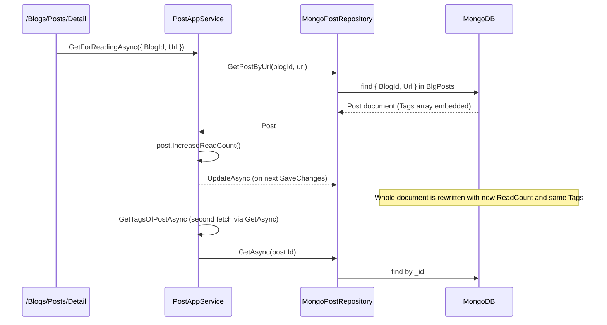

`Volo.Blogging.MongoDB` is the document-database alternative to the EF Core package. It declares one
`BloggingMongoDbContext` with five `IMongoCollection<>` properties, registers five repositories, and
maps each collection name through `AbpBloggingDbProperties.DbTablePrefix`. Like its EF Core sibling
it is `[IgnoreMultiTenancy]`, so a multi-tenant host stores blogs in the single host database.

## File inventory

| File | Role |
| --- | --- |
| `MongoDB/BloggingMongoDbContext.cs` | The DbContext |
| `MongoDB/IBloggingMongoDbContext.cs` | Interface used by `MongoDbRepository<>` |
| `MongoDB/BloggingMongoDbContextExtensions.cs` | `ConfigureBlogging(IMongoModelBuilder)` — collection names |
| `MongoDB/BloggingMongoDbModule.cs` | DI registration |
| `Blogs/MongoBlogRepository.cs` | `FindByShortNameAsync` |
| `Posts/MongoPostRepository.cs` | All `IPostRepository` queries |
| `Comments/MongoCommentRepository.cs` | Per-post queries, replies, bulk delete |
| `Tagging/MongoTagRepository.cs` | Lookups + `DecreaseUsageCountOfTagsAsync` |
| `Users/MongoBlogUserRepository.cs` | `GetUsersAsync` and `IUserRepository<BlogUser>` |

## Module

```csharp
[DependsOn(
    typeof(BloggingDomainModule),
    typeof(AbpMongoDbModule),
    typeof(AbpUsersMongoDbModule))]
public class BloggingMongoDbModule : AbpModule
{
    public override void ConfigureServices(ServiceConfigurationContext context)
    {
        context.Services.AddMongoDbContext<BloggingMongoDbContext>(options =>
        {
            options.AddRepository<Blog,     MongoBlogRepository>();
            options.AddRepository<BlogUser, MongoBlogUserRepository>();
            options.AddRepository<Post,     MongoPostRepository>();
            options.AddRepository<Tag,      MongoTagRepository>();
            options.AddRepository<Comment,  MongoCommentRepository>();
        });
    }
}
```

`AbpUsersMongoDbModule` is required because `BlogUser` inherits the standard ABP user mapping.
Without it `BlogUser` serializes but ABP's user-management infrastructure cannot recognize the
schema.

## DbContext and contract

```csharp
[IgnoreMultiTenancy]
[ConnectionStringName(AbpBloggingDbProperties.ConnectionStringName)]
public class BloggingMongoDbContext : AbpMongoDbContext, IBloggingMongoDbContext
{
    public IMongoCollection<BlogUser>     Users    => Collection<BlogUser>();
    public IMongoCollection<Blog>         Blogs    => Collection<Blog>();
    public IMongoCollection<Post>         Posts    => Collection<Post>();
    public IMongoCollection<Tagging.Tag>  Tags     => Collection<Tagging.Tag>();
    public IMongoCollection<Comment>      Comments => Collection<Comment>();

    protected override void CreateModel(IMongoModelBuilder modelBuilder)
    {
        base.CreateModel(modelBuilder);
        modelBuilder.ConfigureBlogging();
    }
}
```

```csharp
public static void ConfigureBlogging(this IMongoModelBuilder builder)
{
    builder.Entity<BlogUser>(b => b.CollectionName = AbpBloggingDbProperties.DbTablePrefix + "Users");
    builder.Entity<Blog>(b     => b.CollectionName = AbpBloggingDbProperties.DbTablePrefix + "Blogs");
    builder.Entity<Post>(b     => b.CollectionName = AbpBloggingDbProperties.DbTablePrefix + "Posts");
    builder.Entity<Tagging.Tag>(b => b.CollectionName = AbpBloggingDbProperties.DbTablePrefix + "Tags");
    builder.Entity<Comment>(b  => b.CollectionName = AbpBloggingDbProperties.DbTablePrefix + "Comments");
}
```

Default collection names:

| Entity | Collection |
| --- | --- |
| `BlogUser` | `BlgUsers` |
| `Blog` | `BlgBlogs` |
| `Post` | `BlgPosts` |
| `Tag` | `BlgTags` |
| `Comment` | `BlgComments` |

Notice `PostTag` is **absent** — Mongo serializes the `Post.Tags` collection as an embedded array
inside the `BlgPosts` document. There is no join collection. This is the most consequential
difference between the EF Core and Mongo implementations.

## Embedded `PostTag` array

A serialized `Post` document looks like:

```json
{
  "_id": "8e4c...","BlogId": "4ba3...",
  "Url": "hello-world","Title": "Hello, world","CoverImage": "https://…",
  "Content": "…","Description": "…",
  "ReadCount": 17,
  "Tags": [
    { "PostId": "8e4c...","TagId": "1c2d...","CreationTime": "…","CreatorId": "…" },
    { "PostId": "8e4c...","TagId": "9ab1...","CreationTime": "…","CreatorId": "…" }
  ],
  // ABP audit fields:
  "CreationTime": "…","CreatorId": "…","ExtraProperties": {}
}
```

`PostTag`'s composite `GetKeys()` is still honoured (Mongo doesn't enforce a key, but ABP uses it for
equality), and `BloggingApplicationAutoMapperProfile` maps the embedded list into `PostCacheItem.Tags`
the same way as EF.

## `MongoPostRepository`

```csharp
public class MongoPostRepository : MongoDbRepository<IBloggingMongoDbContext, Post, Guid>, IPostRepository
{
    public virtual async Task<List<Post>> GetPostsByBlogId(Guid id, CancellationToken ct = default)
        => await (await GetMongoQueryableAsync(ct))
            .Where(p => p.BlogId == id)
            .OrderByDescending(p => p.CreationTime)
            .ToListAsync(GetCancellationToken(ct));

    public virtual async Task<bool> IsPostUrlInUseAsync(Guid blogId, string url, Guid? excludingPostId = null, CancellationToken ct = default)
    {
        var query = (await GetMongoQueryableAsync(ct)).Where(p => blogId == p.BlogId && p.Url == url);
        if (excludingPostId != null) query = query.Where(p => excludingPostId != p.Id);
        return await query.AnyAsync(GetCancellationToken(ct));
    }

    public virtual async Task<Post> GetPostByUrl(Guid blogId, string url, CancellationToken ct = default)
    {
        var post = await (await GetMongoQueryableAsync(ct))
            .FirstOrDefaultAsync(p => p.BlogId == blogId && p.Url == url, GetCancellationToken(ct));
        if (post == null) throw new EntityNotFoundException(typeof(Post), nameof(post));
        return post;
    }

    public virtual async Task<List<Post>> GetOrderedList(Guid blogId, bool descending = false, CancellationToken ct = default)
    {
        var query = (await GetMongoQueryableAsync(ct)).Where(x => x.BlogId == blogId);
        if (!descending) return await query.OrderBy(x => x.CreationTime).ToListAsync(GetCancellationToken(ct));
        return await query.OrderByDescending(x => x.CreationTime).ToListAsync(GetCancellationToken(ct));
    }

    // GetListByUserIdAsync, GetLatestBlogPostsAsync follow the same pattern
}
```

### EF vs Mongo: `GetOrderedList` reverses the default

| Flag | EF Core | MongoDB |
| --- | --- | --- |
| `descending == false` (default) | OrderByDescending(CreationTime) | OrderBy(CreationTime) |
| `descending == true` | OrderBy(CreationTime) | OrderByDescending(CreationTime) |

`PostAppService.GetTimeOrderedPostsAsync` calls `GetOrderedList(blogId)` without specifying the flag,
so on **EF the cached list is newest-first**, but on **Mongo it is oldest-first**. If you switch
databases without updating the consumer, the visible order of posts on a blog home page changes.

This is almost certainly a bug. The pragmatic workaround is to either:

- Override `MongoPostRepository.GetOrderedList` in your host to flip the default, or
- Call `IPostRepository.GetOrderedList(blogId, descending: true)` from a custom application service.

## Other Mongo repositories

```csharp
public class MongoBlogRepository : MongoDbRepository<IBloggingMongoDbContext, Blog, Guid>, IBlogRepository
{
    public virtual async Task<Blog> FindByShortNameAsync(string shortName, CancellationToken ct = default)
        => await (await GetMongoQueryableAsync(ct))
            .FirstOrDefaultAsync(p => p.ShortName == shortName, GetCancellationToken(ct));
}
```

`MongoTagRepository`, `MongoCommentRepository`, and `MongoBlogUserRepository` follow the same
shape: each uses `await GetMongoQueryableAsync(ct)` and LINQ expressions translated by the MongoDB
driver. None of them creates explicit indexes — that is left to the host.

## Indexing recommendations

The shipped module does not configure any Mongo indexes beyond the implicit `_id`. For production
you'll typically want:

| Collection | Index | Used by |
| --- | --- | --- |
| `BlgBlogs` | `{ ShortName: 1 }` unique | `FindByShortNameAsync` |
| `BlgPosts` | `{ BlogId: 1, Url: 1 }` unique | `GetPostByUrl`, `IsPostUrlInUseAsync` |
| `BlgPosts` | `{ BlogId: 1, CreationTime: -1 }` | `GetPostsByBlogId`, `GetLatestBlogPostsAsync`, `GetOrderedList` |
| `BlgPosts` | `{ CreatorId: 1 }` | `GetListByUserIdAsync` |
| `BlgTags` | `{ BlogId: 1, Name: 1 }` unique | `FindByNameAsync`, `GetByNameAsync` |
| `BlgComments` | `{ PostId: 1, CreationTime: 1 }` | `GetListOfPostAsync`, `DeleteOfPost` |
| `BlgUsers` | `{ UserName: 1 }` unique, `{ Email: 1 }` unique | `IUserRepository<BlogUser>` defaults |

Run these once at deployment from a Mongo shell or a hosted-service that calls
`Collection.Indexes.CreateOneAsync(...)` on startup.

## Object equality and `PostTag` updates

In EF Core, mutating `Post.Tags` (`AddTag` / `RemoveTag`) is intercepted by the change tracker and
turned into INSERT/DELETE on the `BlgPostTags` table. In MongoDB the entire `Post` document is
replaced on update — there is no partial update of an embedded array. Two implications:

1. **Concurrent edits on different tags of the same post are last-writer-wins.** ABP's optimistic
   concurrency stamp catches it (`Post` is `FullAuditedAggregateRoot<Guid>`), so you get an
   `AbpDbConcurrencyException`; just be aware the conflict surface is wider than EF.
2. **Document size matters.** Mongo documents cap at 16 MB. A `Post.Content` field set to the
   1 MB `PostConsts.MaxContentLength` default leaves plenty of room, but if you customize that
   constant up *and* attach hundreds of tags, you can theoretically blow past the limit.

## Sequence: reading a post from Mongo



Note that `GetForReadingAsync` then calls `GetTagsOfPostAsync(id)`, which does a fresh `GetAsync(id)`
inside `PostAppService` — i.e. the same document is fetched twice. EF avoids the second round-trip
through change tracking, Mongo doesn't.

## Gotchas

- **`PostTag` is *not* a Mongo collection.** Don't write LINQ queries like
  `(await GetMongoQueryableAsync()).Where(...)` on `PostTag` — there's nothing to query. Reach into
  `Post.Tags` instead.
- **No FK enforcement.** Deleting a `Blog` does not cascade to posts/comments at the database level;
  the application service is your only guard. Run periodic cleanup if you create-delete frequently.
- **`MongoPostRepository.GetOrderedList(blogId)` is ascending by default** (see the EF/Mongo comparison
  above). This propagates into the cached `List<PostCacheItem>`, so MongoDB users see oldest-first.
- **The Mongo driver's LINQ provider does not support every C# expression.** `WhereIf` patterns work
  because they short-circuit at C# level, but `Take(int)` after `OrderByDescending` only generates a
  `$limit` if the underlying provider recognizes it (it does in `MongoDB.Driver` 2.18+). Pin the
  driver version your host uses.
- **`BlogUser` profile properties (Biography, Twitter, …) are serialized as plain strings without
  length validation in Mongo.** The values still respect `UserConsts.MaxLength` at the DTO layer
  during update, but a direct repository insert could exceed those limits.
- **`MongoCommentRepository.DeleteOfPost(postId)` is a single `DeleteManyAsync({ PostId })`** at the
  driver level. It is far more efficient than EF's tracked deletes, but it bypasses the in-process
  event bus — local handlers that subscribe to `EntityDeletedEventData<Comment>` won't fire.
