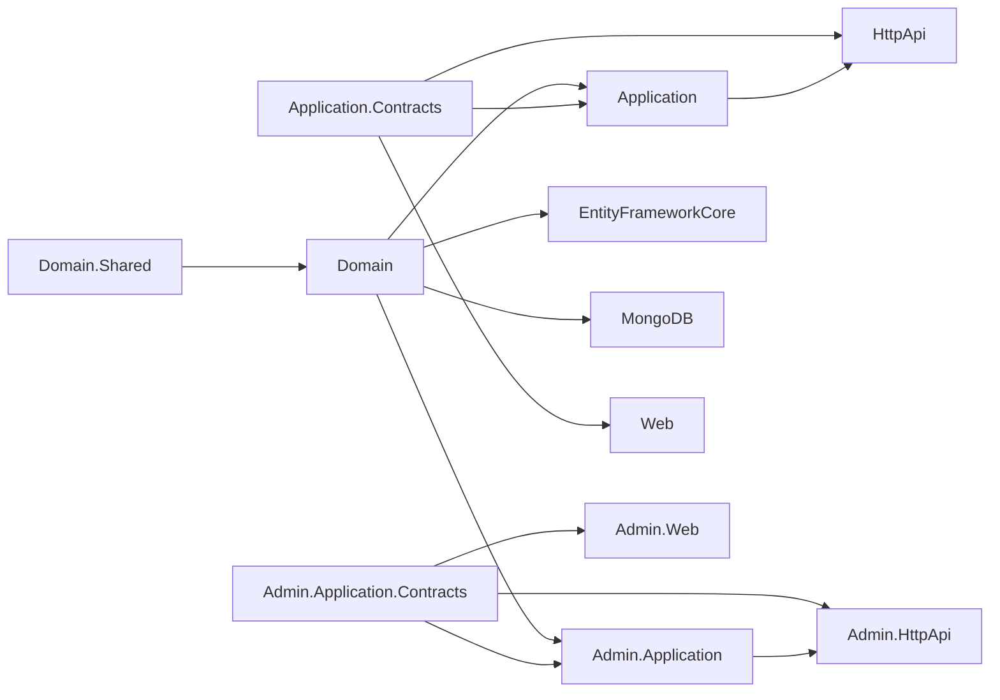
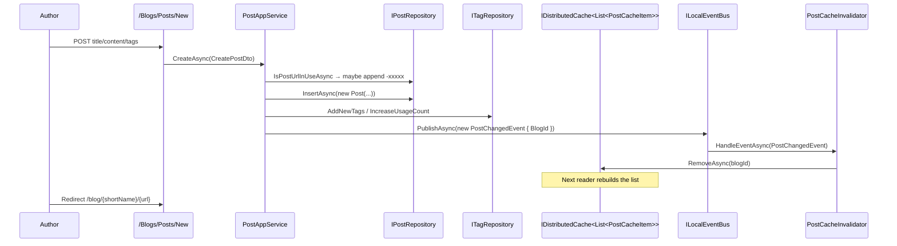

The Blogging module turns an ABP host into a full multi-blog publishing engine: it lets administrators
create independent **Blog** sites (each with its own short name and URL slug), and lets authenticated
users author **Posts**, attach **Tags**, leave threaded **Comments**, and upload cover images. It ships
with both a public-facing Razor UI (under `/blog/{blogShortName}`) and an administration UI mounted in
the standard ABP admin shell. The same domain is exposed over a JSON HTTP API so SPAs and mobile
clients can consume it. Underneath, posts are cached per blog in a distributed cache and invalidated by
a local event when anything in the blog changes.

This page is the entry point for the nine deep-dive pages that follow. It explains how the packages
fit together, what state each one owns, and which host-side concerns (auth, file storage, caching,
URL routing) the module integrates with.

## Source layout

```
modules/blogging/src/
├── Volo.Blogging.Domain.Shared/              Constants, ETOs, BloggingResource (localization)
├── Volo.Blogging.Domain/                     Blog, Post, Comment, Tag, BlogUser aggregates + repos
├── Volo.Blogging.Application.Contracts.Shared/ BloggingPermissions, BlogDto
├── Volo.Blogging.Application.Contracts/      Public IBlogAppService / IPostAppService / IFileAppService
├── Volo.Blogging.Application/                Public-facing app services (posts, comments, files…)
├── Volo.Blogging.Admin.Application.Contracts/ IBlogManagementAppService + Create/Update DTOs
├── Volo.Blogging.Admin.Application/          BlogManagementAppService (admin CRUD for blogs)
├── Volo.Blogging.HttpApi/                    BlogsController, PostsController, CommentsController…
├── Volo.Blogging.HttpApi.Client/             Static client proxies for the public API
├── Volo.Blogging.Admin.HttpApi/              BlogManagementController (admin REST)
├── Volo.Blogging.Admin.HttpApi.Client/       Static client proxies for the admin API
├── Volo.Blogging.EntityFrameworkCore/        BloggingDbContext, EfCore* repositories
├── Volo.Blogging.MongoDB/                    BloggingMongoDbContext, Mongo* repositories
├── Volo.Blogging.Web/                        Razor Pages /Blogs/{Index,Posts/{Index,Detail,New,Edit}}
├── Volo.Blogging.Admin.Web/                  Admin Razor Pages under /Blogging/Admin/Blogs
└── Volo.Blogging.Installer/                  Empty install package (registers NuGet feed)
```

The split between the **public** stack (`Application`, `HttpApi`, `Web`) and the **admin** stack
(`Admin.Application`, `Admin.HttpApi`, `Admin.Web`) is the most important shape to remember: the
public stack lets bloggers and readers interact with content under `/blog/...`, while the admin stack
is the back-office where staff create blogs themselves and clear caches.

## What each page covers

| Page | Focus |
| --- | --- |
| [Domain](/modules/blogging/domain) | `Blog`, `Post`, `Comment`, `Tag`, `BlogUser`, `PostTag`, `PostChangedEvent` and the repositories |
| [Application](/modules/blogging/application) | `BlogAppService`, `PostAppService`, `CommentAppService`, `TagAppService`, `MemberAppService`, `FileAppService` |
| [Admin Application](/modules/blogging/admin-application) | `BlogManagementAppService` and the admin permissions |
| [HTTP API](/modules/blogging/http-api) | The public `api/blogging/*` controllers |
| [Admin HTTP API](/modules/blogging/admin-http-api) | The administration `api/blogging/blogs/admin` controller |
| [EF Core](/modules/blogging/efcore) | `BloggingDbContext`, table mappings, EF Core repositories |
| [MongoDB](/modules/blogging/mongodb) | `BloggingMongoDbContext`, collection mappings, Mongo repositories |
| [Web](/modules/blogging/web) | Public Razor Pages, the `{blogShortName}` route constraint, Gravatar tag helper |
| [Admin Web](/modules/blogging/admin-web) | Admin Razor Pages under `/Blogging/Admin/Blogs`, the management menu |

## Module dependencies



A typical monolith references `Volo.Blogging.EntityFrameworkCore` (or `Volo.Blogging.MongoDB`) plus
both `Volo.Blogging.HttpApi`/`Volo.Blogging.Web` and the matching `Admin.*` packages. A microservice
deployment can split the public and admin APIs into separate hosts because they declare distinct
remote-service names (`Blogging` vs. `BloggingAdmin`).

## Aggregate roots at a glance

| Aggregate | Base | Owns | Notable invariants |
| --- | --- | --- | --- |
| `Blog` | `FullAuditedAggregateRoot<Guid>` | Name, ShortName, Description | `ShortName` is the URL segment; `Name`/`ShortName` cannot be null or whitespace |
| `Post` | `FullAuditedAggregateRoot<Guid>` | BlogId, Url, CoverImage, Title, Content, Description, ReadCount, `Collection<PostTag>` | Required Title/Url/CoverImage; `IncreaseReadCount()` only goes up |
| `Comment` | `FullAuditedAggregateRoot<Guid>` | PostId, RepliedCommentId, Text | Required Text; reply chain modeled by self-referencing `RepliedCommentId` |
| `Tag` | `FullAuditedAggregateRoot<Guid>` | BlogId, Name, Description, UsageCount | `IncreaseUsageCount`/`DecreaseUsageCount` (never below zero); name is unique per blog |
| `BlogUser` | `AggregateRoot<Guid>` implements `IUser`, `IUpdateUserData` | Profile mirror: Name/Surname/Email/UserName plus WebSite, Twitter, GitHub, LinkedIn, Company, JobTitle, Biography | Kept in sync with Identity via `EntityUpdatedEto<UserEto>` |

`PostTag` is a join entity (not an aggregate) with composite key `(PostId, TagId)`. It is owned by the
`Post` aggregate through `Post.Tags`.

## Cross-cutting infrastructure

The module relies on the following ABP building blocks; each deep-dive page explains how:

- **`IDistributedCache<List<PostCacheItem>>`** — `PostAppService.GetTimeOrderedListAsync` caches a
  blog's post list for one hour, keyed by `BlogId`. `PostCacheInvalidator` is a local event handler
  on `PostChangedEvent` that removes the cache entry whenever a post is created, updated, or deleted.
- **`AbpDistributedEntityEventOptions`** — `BloggingDomainModule` registers ETO mappings so that
  `Blog`, `Post`, `Comment`, and `Tag` create/update/delete events flow over the distributed event
  bus as `BlogEto`, `PostEto`, `CommentEto`, `TagEto`.
- **`IUserLookupService<BlogUser>`** — `BlogUserLookupService` lazily materializes a `BlogUser` row
  the first time the module asks for one; `BlogUserSynchronizer` updates the row whenever the source
  `IdentityUser` raises `EntityUpdatedEto<UserEto>`.
- **`IBlobContainer<BloggingFileContainer>`** — cover images and inline post images go through
  `FileAppService` and land in this named blob container. Image format is validated and a unique
  GUID file name is generated.
- **`AbpAuthorizationOptions`** — two operation requirements (`BloggingUpdatePolicy`,
  `BloggingDeletePolicy`) are bound to `PostAuthorizationHandler` and `CommentAuthorizationHandler`,
  which allow the author or any user with the corresponding permission to act on a post/comment.

## Permission map

`BloggingPermissions` (in `Application.Contracts.Shared`) declares four permission groups under
`"Blogging"`. The provider exposes:

| Group | Children |
| --- | --- |
| `Blogging.Blog` | `Management`, `Create`, `Update`, `Delete`, `ClearCache` |
| `Blogging.Post` | `Create`, `Update`, `Delete` |
| `Blogging.Tag` | `Create`, `Update`, `Delete` |
| `Blogging.Comment` | `Create`, `Update`, `Delete` |

Authors implicitly get update/delete on their own posts and comments through the authorization
handlers — the `*.Update` / `*.Delete` permissions are required only to manage *someone else's*
content. `Blogs.Management` gates the admin menu item.

## Routing and URLs

The public Web module configures these conventions in `BloggingWebModule.ConfigureServices`:

| Route template | Razor Page |
| --- | --- |
| `/blog/` | `/Blogs/Index` (lists blogs; auto-redirects if there's only one) |
| `/blog/{blogShortName}` | `/Blogs/Posts/Index` |
| `/blog/{blogShortName}/{postUrl}` | `/Blogs/Posts/Detail` |
| `/blog/{blogShortName}/posts/new` | `/Blogs/Posts/New` |
| `/blog/{blogShortName}/posts/{postId}/edit` | `/Blogs/Posts/Edit` |
| `/blog/members/{userName}` | `/Members/Index` |

The `blog` prefix is configurable via `BloggingUrlOptions.RoutePrefix`; setting it to `""` mounts the
blog at the site root, in which case `BloggingRouteConstraint` uses `IgnoredPaths` to keep MVC routes
like `/error` or `/ApplicationConfigurationScript` from matching `{blogShortName}`.

## Connection string and table prefix

`AbpBloggingDbProperties` defines:

```csharp
public static string DbTablePrefix { get; set; } = "Blg";
public static string DbSchema { get; set; } = AbpCommonDbProperties.DbSchema;
public const string ConnectionStringName = "Blogging";
```

EF Core produces `BlgBlogs`, `BlgPosts`, `BlgComments`, `BlgTags`, `BlgPostTags`, `BlgUsers`. MongoDB
mirrors these names as collections. The `[IgnoreMultiTenancy]` attribute on both DbContexts means the
module is **host-only** by default — every tenant sees the same blogs unless you remove the attribute
in a custom DbContext.

## Lifecycle: from post draft to public read



Every write path through `PostAppService` ends with `PublishPostChangedEventAsync`, so the cache and
event bus are always consistent regardless of which entry point (HTTP API, Razor Page, server-side
code) caused the change.

## Gotchas

- **The DbContext is `[IgnoreMultiTenancy]`.** Posts created while a tenant is impersonated still go
  into the *host* tables. If you want per-tenant blogs, you have to either remove the attribute and
  add a `TenantId` column via object extensions, or run a dedicated Blogging host per tenant.
- **`Blogs.Update` exists in the permission tree but is not enforced on `BlogManagementAppService.UpdateAsync`.**
  Only `Create`, `Delete`, and `ClearCache` are decorated with `[Authorize(...)]` today. Treat
  `Blogs.Management` as the de-facto gate.
- **Post URLs auto-rename on collision.** `RenameUrlIfItAlreadyExistAsync` appends `-` plus the first
  five characters of a fresh GUID if the chosen slug is already used in the same blog. The
  user-supplied URL is *not* preserved.
- **The cache key is `BlogId.ToString()`, not `BlogId.ToString("N")`.** If you reach into the cache
  manually, format the GUID with hyphens.
- **There is no `PostsController.GetTimeOrderedListAsync` on the admin API.** Only the public
  controller (`api/blogging/posts/{blogId}/all/by-time`) hits the cached path.
- **`CommentAppService.DeleteAsync` cascades replies in a loop, not at the DB level.** Heavy
  threads can produce a lot of round-trips; in EF Core this is fine in a single SaveChanges, but in
  MongoDB it is N+1 deletes.
