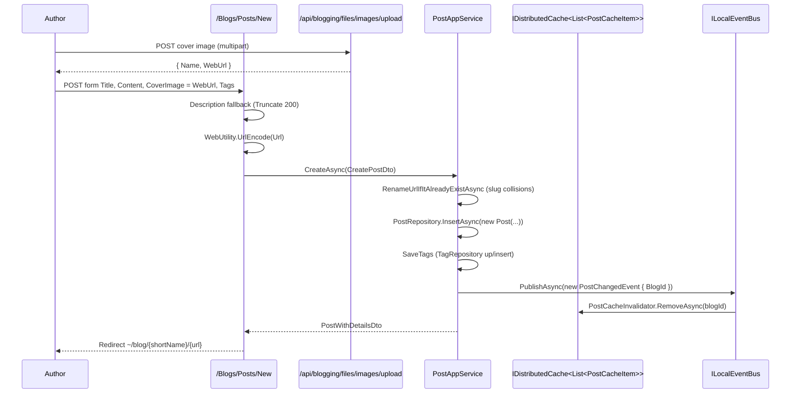

`Volo.Blogging.Web` is the public user interface of the module. It is a Razor Pages-based MVC area
that exposes a blog index, per-blog post lists, post detail pages with threaded comments, post
authoring and editing pages, and a member profile page. The package also configures route conventions
that map URLs like `/blog/{blogShortName}/{postUrl}` to those pages, hosts a Gravatar tag helper, and
adds the Prism.js bundle extensions for syntax-highlighted code blocks.

## File inventory

| File | Role |
| --- | --- |
| `BloggingWebModule.cs` | DependsOn, virtual file system, AutoMapper, Razor Page route conventions, Prism extensions, Twitter options |
| `BloggingUrlOptions.cs` | `RoutePrefix` ("blog" by default) and `IgnoredPaths` |
| `BloggingRouteConstraint.cs` | `IRouteConstraint` ("blogNameConstraint") that filters paths when `RoutePrefix` is `"/"` |
| `AbpBloggingWebAutoMapperProfile.cs` | View-model maps (PostWithDetailsDto ↔ EditPostViewModel, NewModel.CreatePostViewModel → CreatePostDto) |
| `SocialMedia/BloggingTwitterOptions.cs` | Holds the publisher Twitter handle |
| `Bundling/PrismjsScriptBundleContributorBloggingExtension.cs` | Adds language packs to the Prism script bundle |
| `Bundling/PrismjsStyleBundleContributorBloggingExtension.cs` | Adds the Prism stylesheet |
| `Areas/Blog/Controllers/PostsController.cs` | Legacy MVC route `Blog/Posts/Delete` (marked TODO) |
| `Areas/Blog/Controllers/CommentsController.cs` | Legacy MVC routes `Blog/Comments/{Delete,Update}` (marked TODO) |
| `Areas/Blog/Helpers/TagHelpers/GravatarTagHelper.cs` | `` Razor tag helper |
| `Pages/Blogs/BloggingPageModel.cs` | Base page model setting `ObjectMapperContext` |
| `Pages/Blogs/BloggingPageHelper.cs` | Static helpers used inside cshtml |
| `Pages/Blogs/Shared/Helpers/BlogNameControlHelper.cs` | `IsProhibitedFileFormatName(name)` for security |
| `Pages/Blogs/Index.cshtml(.cs)` | Lists blogs; redirects when there is only one |
| `Pages/Blogs/Posts/Index.cshtml(.cs)` | Per-blog post list with popular tags sidebar |
| `Pages/Blogs/Posts/Detail.cshtml(.cs)` | Post body, comments, related posts, Twitter share |
| `Pages/Blogs/Posts/New.cshtml(.cs)` | Authoring page (markdown + cover image upload) |
| `Pages/Blogs/Posts/Edit.cshtml(.cs)` | Editing page |
| `Pages/Members/Index.cshtml(.cs)` | `/blog/members/{userName}` profile |

## Module configuration

```csharp
[DependsOn(
    typeof(BloggingApplicationContractsModule),
    typeof(AbpAspNetCoreMvcUiBootstrapModule),
    typeof(AbpAspNetCoreMvcUiBundlingModule),
    typeof(AbpAutoMapperModule))]
public class BloggingWebModule : AbpModule
{
    public override void PreConfigureServices(ServiceConfigurationContext context)
    {
        context.Services.PreConfigure<AbpMvcDataAnnotationsLocalizationOptions>(options =>
            options.AddAssemblyResource(typeof(BloggingResource), typeof(BloggingWebModule).Assembly));

        PreConfigure<IMvcBuilder>(mvc =>
            mvc.AddApplicationPartIfNotExists(typeof(BloggingWebModule).Assembly));
    }

    public override void ConfigureServices(ServiceConfigurationContext context)
    {
        Configure<AbpVirtualFileSystemOptions>(o => o.FileSets.AddEmbedded<BloggingWebModule>());
        // … AutoMapper, Prism bundle extensions …

        Configure<RouteOptions>(options =>
            options.ConstraintMap.Add("blogNameConstraint", typeof(BloggingRouteConstraint)));

        Configure<BloggingUrlOptions>(options => { /* IgnoredPaths defaults */ });

        Configure<RazorPagesOptions>(options =>
        {
            var routePrefix = context.Services
                .GetRequiredServiceLazy<IOptions<BloggingUrlOptions>>().Value.Value.RoutePrefix;

            options.Conventions.AddPageRoute("/Blogs/Posts/Index",
                routePrefix + "{blogShortName:blogNameConstraint}");
            options.Conventions.AddPageRoute("/Blogs/Posts/Detail",
                routePrefix + "{blogShortName:blogNameConstraint}/{postUrl}");
            options.Conventions.AddPageRoute("/Blogs/Posts/Edit",
                routePrefix + "{blogShortName}/posts/{postId}/edit");
            options.Conventions.AddPageRoute("/Blogs/Posts/New",
                routePrefix + "{blogShortName}/posts/new");
            options.Conventions.AddPageRoute("/Members/Index", routePrefix + "members/{userName}");
        });

        Configure<DynamicJavaScriptProxyOptions>(o => o.DisableModule(BloggingRemoteServiceConsts.ModuleName));

        Configure<AbpAspNetCoreMvcOptions>(o =>
            o.ConventionalControllers.FormBodyBindingIgnoredTypes.Add(typeof(FileUploadInputDto)));
    }
}
```

Three notable details:

- The module **disables the dynamic JavaScript proxy** for `"blogging"` to prevent the auto-generated
  JS service stub from polluting the global namespace; the public Razor Pages use the app services
  directly on the server.
- Bundling extensions register Prism.js for post code blocks. If your host already configures Prism
  globally, these stack on top — no duplicate Prism includes.
- `BloggingUrlOptions.IgnoredPaths` is seeded with `bundlingOptions.BundleFolderName` and the
  conventional ABP system paths (`error`, `ApplicationConfigurationScript`, `ServiceProxyScript`,
  `Languages/Switch`, `ApplicationLocalizationScript`).

## URL options and route constraint

```csharp
public class BloggingUrlOptions
{
    private string _routePrefix = "blog";

    public string RoutePrefix
    {
        get => GetFormattedRoutePrefix();
        set => _routePrefix = value;
    }

    public List<string> IgnoredPaths { get; } = new();

    private string GetFormattedRoutePrefix()
    {
        if (string.IsNullOrWhiteSpace(_routePrefix)) return "/";
        return _routePrefix.EnsureEndsWith('/').EnsureStartsWith('/');
    }
}
```

```csharp
public class BloggingRouteConstraint : IRouteConstraint
{
    public virtual bool Match(HttpContext httpContext, IRouter route, string routeKey,
        RouteValueDictionary values, RouteDirection routeDirection)
    {
        if (BloggingUrlOptions.RoutePrefix != "/" || !BloggingUrlOptions.IgnoredPaths.Any())
            return true;

        var displayUrl = httpContext.Request.GetDisplayUrl();
        if (BloggingUrlOptions.IgnoredPaths.Any(p =>
                displayUrl.Contains(p, StringComparison.InvariantCultureIgnoreCase)))
            return false;

        return true;
    }
}
```

When the prefix is `"/"` (you mount the blog at site root), the constraint is what stops the
`{blogShortName}` parameter from swallowing requests like `/ApplicationConfigurationScript`. Add your
own paths to `IgnoredPaths` if you also serve other root-level conventions.

| `RoutePrefix` setting | Public URLs |
| --- | --- |
| `"blog"` (default) | `/blog/{shortName}/{postUrl}` |
| `""` | `/{shortName}/{postUrl}` (constraint active) |
| `"news"` | `/news/{shortName}/{postUrl}` |

## Razor page models

### `IndexModel` — listing blogs

```csharp
public class IndexModel : AbpPageModel
{
    public IReadOnlyList<BlogDto> Blogs { get; private set; }

    public virtual async Task<IActionResult> OnGetAsync()
    {
        var result = await _blogAppService.GetListAsync();

        if (result.Items.Count == 1)
        {
            var blog = result.Items[0];
            return RedirectToPage("./Posts/Index", new { blogShortName = blog.ShortName });
        }

        Blogs = result.Items;
        return Page();
    }
}
```

A single-blog deployment never shows a chooser — the page auto-redirects.

### `IndexModel` (Posts) — per-blog post list

```csharp
public class IndexModel : BloggingPageModel
{
    [BindProperty(SupportsGet = true)] public string BlogShortName { get; set; }
    [BindProperty(SupportsGet = true)] public string TagName { get; set; }

    public BlogDto Blog { get; set; }
    public IReadOnlyList<PostWithDetailsDto> Posts { get; set; }
    public IReadOnlyList<TagDto> PopularTags { get; set; }

    public virtual async Task<ActionResult> OnGetAsync()
    {
        if (BlogNameControlHelper.IsProhibitedFileFormatName(BlogShortName)) return NotFound();

        try { Blog = await _blogAppService.GetByShortNameAsync(BlogShortName); }
        catch (EntityNotFoundException) { return RedirectToPage("/Blogs/Index"); }

        Posts = (await _postAppService.GetListByBlogIdAndTagNameAsync(Blog.Id, TagName)).Items;
        PopularTags = await _tagAppService.GetPopularTagsAsync(
            Blog.Id, new GetPopularTagsInput { ResultCount = 10, MinimumPostCount = 2 });

        return Page();
    }
}
```

Notice the page list uses the **uncached** `GetListByBlogIdAndTagNameAsync` (so tag filters work),
not the cached `GetTimeOrderedListAsync`. If you want to leverage the cache here, override the page
to call the time-ordered method when `TagName` is null.

### `DetailModel` — post detail with comments

The detail model coordinates four collaborators:

```csharp
private async Task GetData()
{
    Blog = await _blogAppService.GetByShortNameAsync(BlogShortName);
    Post = await _postAppService.GetForReadingAsync(new GetPostInput { BlogId = Blog.Id, Url = PostUrl });

    PostsList = Post.Writer != null
        ? await _postAppService.GetListByUserIdAsync(Post.Writer.Id)
        : new List<PostWithDetailsDto>();

    LatestPosts = await _postAppService.GetLatestBlogPostsAsync(Blog.Id, 5);
    CommentsWithReplies = await _commentAppService.GetHierarchicalListOfPostAsync(Post.Id);
    CountComments();
}

public string GetTwitterShareUrl(string title, string url, string linkedAccounts)
{
    var readAtString = " | Read More At ";
    var otherCharsLength = (readAtString + linkedAccounts).Length + 1;
    var maxTitleLength = 280 - TwitterLinkLength - otherCharsLength;
    title = title.Length < maxTitleLength ? title : title.Substring(0, maxTitleLength - 3) + "...";
    var text = title + readAtString + url + " " + linkedAccounts;
    return new UriBuilder("https://twitter.com/intent/tweet")
        { Query = "text=" + HttpUtility.UrlEncode(text) }.ToString();
}
```

`OnPostAsync` posts a new comment via `CommentAppService`, captures the new id into `FocusCommentId`
(used by the cshtml to scroll the page to the fresh comment), and re-renders the data. `TwitterLinkLength`
is `23` — the fixed length Twitter applies to t.co-wrapped URLs.

### `NewModel` — authoring

```csharp
public virtual async Task<ActionResult> OnGetAsync()
{
    if (!await _authorization.IsGrantedAsync(BloggingPermissions.Posts.Create)) return Redirect("/");
    if (BlogNameControlHelper.IsProhibitedFileFormatName(BlogShortName)) return NotFound();

    Blog = await _blogAppService.GetByShortNameAsync(BlogShortName);
    Post = new CreatePostViewModel { BlogId = Blog.Id };
    return Page();
}

public virtual async Task<ActionResult> OnPost()
{
    var blog = await _blogAppService.GetAsync(Post.BlogId);
    if (string.IsNullOrEmpty(Post.Description))
        Post.Description = Post.Content.Truncate(PostConsts.MaxSeoFriendlyDescriptionLength);
    Post.Url = WebUtility.UrlEncode(Post.Url);

    var postWithDetailsDto = await _postAppService.CreateAsync(
        ObjectMapper.Map<CreatePostViewModel, CreatePostDto>(Post));

    var urlPrefix = _blogOptions.RoutePrefix;
    return Redirect(Url.Content(
        $"~{urlPrefix}{WebUtility.UrlEncode(blog.ShortName)}/{WebUtility.UrlEncode(postWithDetailsDto.Url)}"));
}
```

Two auto-fixes for SEO friendliness:

- If `Description` is empty the first 200 characters of `Content` (`MaxSeoFriendlyDescriptionLength`)
  are used as the meta description.
- The URL slug is `WebUtility.UrlEncode`d before being saved — but only at the page level. The
  application service does not encode further, so the encoded slug is what becomes the
  permanent URL.

## Sequence: post publish lifecycle



## `GravatarTagHelper`

Razor markup:

```html

```

renders:

```html

```

The helper computes an MD5 hash of the lower-cased email, picks `secure.gravatar.com` over
`www.gravatar.com` when the request is HTTPS (or when `force-secure-request="true"`), and translates
the strongly typed `GravatarDefaultImage` and `GravatarRating` enums to their Gravatar URL codes via
`[Description("…")]` attributes. The seven supported default avatars are `Default`, `Http404`,
`MysteryMan`, `Identicon`, `MonsterId`, `Wavatar`, `Retro`; the four ratings are
`GeneralAudiences`, `ParentalGuidance`, `Restricted`, `OnlyMature`.

## Legacy `Areas/Blog/Controllers`

`PostsController` and `CommentsController` under the `Blog` area expose `Blog/{Controller}/{Action}`
routes for delete/update. The source comments mark them as `//TODO: Is that being used?` — they
predate the move to Razor Pages and may be removed in a future version. Don't rely on them in custom
Razor pages; prefer the JSON API.

## Twitter integration

```csharp
public class BloggingTwitterOptions { public string Site { get; set; } }
```

The detail page passes `linkedAccounts` (from your `BloggingTwitterOptions.Site` configuration) into
`GetTwitterShareUrl` so the tweet ends with `via @yourpublication`. Configure in your host:

```csharp
Configure<BloggingTwitterOptions>(opts => opts.Site = "@example_dev");
```

## Gotchas

- **The single-blog redirect on `/blog/`** can confuse SEO crawlers if you later add a second blog —
  bookmarks land on `/blog/{shortName}` rather than `/blog/`. Ship a second blog in maintenance mode
  if you want a clean cutover.
- **`BlogNameControlHelper.IsProhibitedFileFormatName(BlogShortName)`** rejects shortnames that look
  like static files (e.g. `favicon.ico`) on every page that takes a `{blogShortName}` parameter.
  Don't pick a shortname that ends in a file extension.
- **`OnPost` in `NewModel` reads `Post.BlogId` from the form**. The hidden input is required and
  validated, but an attacker who has `Blogging.Post.Create` could `BlogId`-jack to another blog by
  forging the form. Add server-side checks if you support multiple blogs with different writer roles.
- **`GetListByBlogIdAndTagNameAsync` does not use the cache.** The post list page rebuilds from the
  database on every visit. If your blog has many posts and you don't filter by tag, consider
  switching the page to `GetTimeOrderedListAsync` when `TagName == null`.
- **`DetailModel` does five backend calls per page load.** On cold caches this can add up; pre-warm
  the cache with a startup task that calls `GetTimeOrderedListAsync` for each blog if you need
  predictable first-byte times.
- **Editing a post through `Edit.cshtml`** uses an `EditPostViewModel` that's mapped from
  `PostWithDetailsDto`, but `.Ignore(x => x.Tags)` in the AutoMapper profile means the tags textbox
  starts empty unless the page model populates it manually before the first render.
