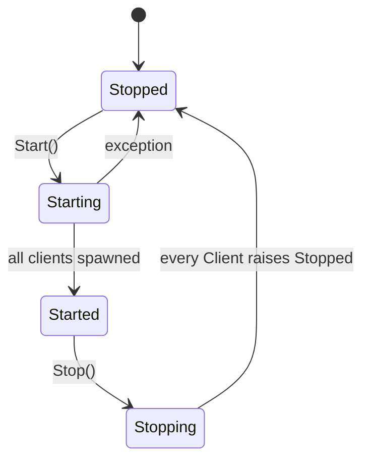
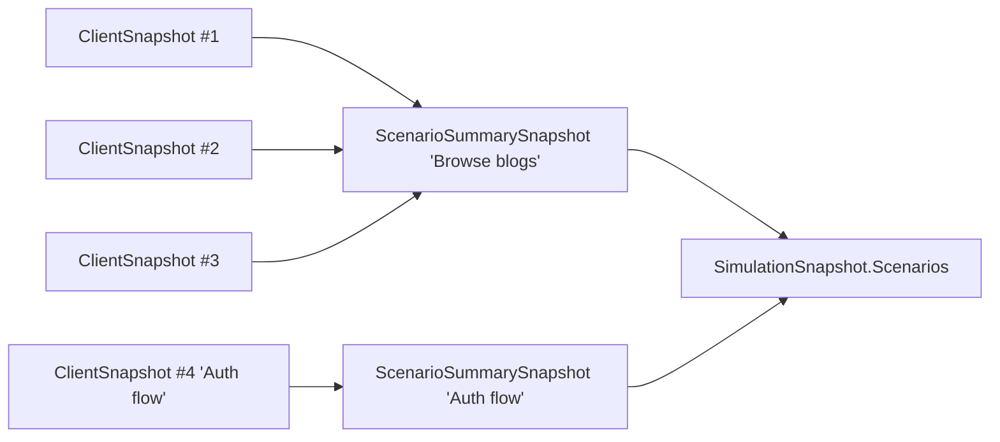
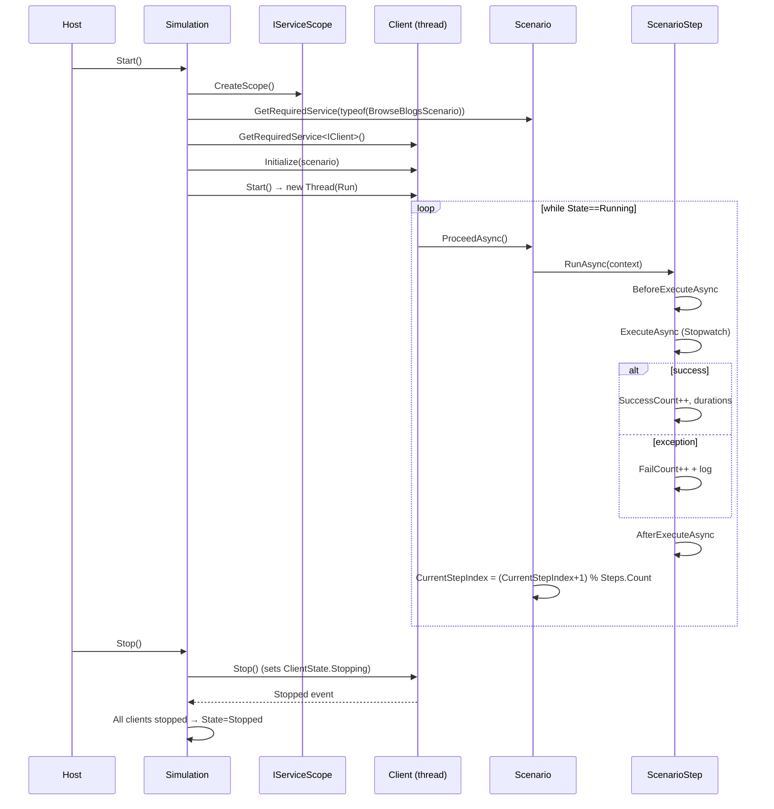

`Volo.ClientSimulation` is the engine. It defines a small but tightly coupled set of types that
collectively run a load test: a single `Simulation` singleton, one `Client` per simulated user
(each on its own OS thread), a `Scenario` of repeating `ScenarioStep`s, an execution context bag,
and a serializable snapshot tree the dashboard polls every second. The whole engine fits in roughly
twenty files.

## File inventory

| File | Type | Role |
| --- | --- | --- |
| `ClientSimulationModule.cs` | `AbpModule` | Depends on `AbpHttpClientIdentityModelModule` so scenarios can authenticate |
| `ClientSimulationOptions.cs` | options bag | `List<ScenarioConfiguration> Scenarios` |
| `ScenarioConfiguration.cs` | record-shaped class | `(Type ScenarioType, int ClientCount)` |
| `Simulation.cs` | singleton | Owns clients, owns the run lifecycle |
| `SimulationState.cs` | enum | `Stopped`, `Starting`, `Started`, `Stopping` |
| `Clients/Client.cs` | transient | One per simulated user; one thread |
| `Clients/IClient.cs` | interface | `Initialize`/`Start`/`Stop`/`CreateSnapshot` |
| `Clients/ClientState.cs` | enum | `Stopped`, `Running`, `Stopping` |
| `Scenarios/Scenario.cs` | abstract | `List<ScenarioStep> Steps` and `ProceedAsync` |
| `Scenarios/ScenarioStep.cs` | abstract | `RunAsync` with timing instrumentation |
| `Scenarios/SleepScenarioStep.cs` | concrete | `Task.Delay(Duration)` |
| `Scenarios/ScenarioExecutionContext.cs` | per-scenario state | `IServiceProvider` + `Dictionary<string, object>` |
| `Snapshot/SimulationSnapshot.cs` | serializable | Top-level snapshot, with `CreateSummaries()` |
| `Snapshot/ClientSnapshot.cs` | serializable | Per-client state + scenario snapshot |
| `Snapshot/ScenarioSnapshot.cs` | serializable | Steps + `CurrentStep` |
| `Snapshot/ScenarioStepSnapshot.cs` | serializable | Per-step counters + min/max/avg/last duration |
| `Snapshot/ScenarioSummarySnapshot.cs` | serializable | Aggregated per-scenario steps |
| `Snapshot/ScenarioStepSummarySnapshot.cs` | serializable | Aggregated per-step |

## Module

```csharp
[DependsOn(typeof(AbpHttpClientIdentityModelModule))]
public class ClientSimulationModule : AbpModule { }
```

No `ConfigureServices` body — the only registrations come from ABP's convention scanning and from
the `[Dependency]` interfaces on `Simulation`, `Client`, and the various `Scenario` subclasses you
define.

## Options and configuration

```csharp
public class ClientSimulationOptions
{
    public List<ScenarioConfiguration> Scenarios { get; }
    public ClientSimulationOptions() => Scenarios = new List<ScenarioConfiguration>();
}

public class ScenarioConfiguration
{
    public Type ScenarioType { get; }
    public int ClientCount { get; }
    public ScenarioConfiguration(Type scenarioType, int clientCount = 1)
    {
        ScenarioType = scenarioType;
        ClientCount = clientCount;
    }
}
```

Add scenarios in your host module:

```csharp
Configure<ClientSimulationOptions>(options =>
{
    options.Scenarios.Add(new ScenarioConfiguration(typeof(WhoAmIScenario), clientCount: 4));
    options.Scenarios.Add(new ScenarioConfiguration(typeof(BrowseBlogsScenario), clientCount: 16));
});
```

The total number of OS threads spawned when the simulation starts equals the sum of all
`ClientCount` values.

## `Simulation` — the singleton orchestrator

```csharp
public class Simulation : ISingletonDependency, IDisposable
{
    public SimulationState State { get; private set; }
    public List<IClient> Clients { get; }

    public virtual void Start()
    {
        lock (SyncObj)
        {
            if (State != SimulationState.Stopped)
                throw new UserFriendlyException($"Simulation should be stopped to be able to start. Current state is '{State}'.");

            State = SimulationState.Starting;

            try
            {
                DisposeResources();
                ServiceScope = ServiceScopeFactory.CreateScope();

                foreach (var scenarioConfiguration in Options.Scenarios)
                    for (int i = 0; i < scenarioConfiguration.ClientCount; i++)
                    {
                        var scenario = (Scenario)ServiceScope.ServiceProvider
                            .GetRequiredService(scenarioConfiguration.ScenarioType);

                        var client = ServiceScope.ServiceProvider.GetRequiredService<IClient>();
                        client.Stopped += Client_OnStopped;
                        client.Initialize(scenario);
                        Clients.Add(client);
                    }

                foreach (var client in Clients) client.Start();

                State = SimulationState.Started;
            }
            catch (Exception ex)
            {
                Logger.LogException(ex);
                State = SimulationState.Stopped;
            }
        }
    }

    public virtual void Stop()
    {
        lock (SyncObj)
        {
            if (State != SimulationState.Started)
                throw new UserFriendlyException($"Simulation should be started to be able to stop. Current state is '{State}'.");

            State = SimulationState.Stopping;
            foreach (var client in Clients) client.Stop();
        }
    }

    public virtual SimulationSnapshot CreateSnapshot()
    {
        SimulationSnapshot snapshot;
        lock (SyncObj)
        {
            snapshot = new SimulationSnapshot
            {
                State = State,
                Clients = Clients.Select(c => c.CreateSnapshot()).ToList()
            };
        }
        snapshot.CreateSummaries();
        return snapshot;
    }

    protected virtual void Client_OnStopped(object sender, EventArgs e)
    {
        lock (SyncObj)
        {
            if (Clients.All(c => c.State == ClientState.Stopped))
                State = SimulationState.Stopped;
        }
    }
}
```

State transitions:



The single `SyncObj` lock serializes every transition; `CreateSnapshot()` takes the same lock so the
dashboard never observes a half-constructed state. After cloning the clients list it calls
`snapshot.CreateSummaries()` *outside* the lock — only the captured list is used.

## `Client`

```csharp
public class Client : IClient, ITransientDependency
{
    public event EventHandler Stopped;
    public ClientState State { get; private set; }

    protected Scenario Scenario { get; private set; }
    protected Thread ClientThread;

    public void Initialize(Scenario scenario)
    {
        lock (SyncLock) { /* require Stopped, save Scenario */ }
    }

    public void Start()
    {
        lock (SyncLock)
        {
            if (State != ClientState.Stopped)
                throw new UserFriendlyException($"Client should be stopped to be able to start it. Current state is '{State}'.");

            State = ClientState.Running;
            Scenario.Reset();
            ClientThread = new Thread(Run);
            ClientThread.Start();
        }
    }

    public void Stop()
    {
        lock (SyncLock)
        {
            if (State != ClientState.Running) return;
            State = ClientState.Stopping;
        }
    }

    private void Run()
    {
        while (true)
        {
            lock (SyncLock)
            {
                if (State != ClientState.Running)
                {
                    State = ClientState.Stopped;
                    ClientThread = null;
                    Stopped.InvokeSafely(this);
                    break;
                }
            }
            AsyncHelper.RunSync(() => Scenario.ProceedAsync());
        }
    }
}
```

Two design choices to note:

- **One OS thread per client.** `new Thread(Run).Start()` — not `Task.Run`. That keeps the threading
  predictable but caps the maximum useful `ClientCount` at "a few hundred" on most machines.
- **`AsyncHelper.RunSync` bridges async scenarios.** The step infrastructure is fully async, but the
  driver runs synchronously on the dedicated thread. Avoid `ConfigureAwait(false)` quirks in step
  code that touches `HttpContext` — there's no HTTP context here anyway.

The `Stopped` event is what `Simulation.Client_OnStopped` listens to so it can flip the simulation
state to `Stopped` once every client has reported in.

## `Scenario`

```csharp
public abstract class Scenario : ITransientDependency
{
    protected List<ScenarioStep> Steps { get; }
    protected int CurrentStepIndex { get; set; }
    protected ScenarioExecutionContext ExecutionContext { get; }

    protected Scenario(IServiceProvider serviceProvider)
    {
        ExecutionContext = new ScenarioExecutionContext(serviceProvider);
        Steps = new List<ScenarioStep>();
    }

    public virtual string GetDisplayText()
    {
        var attr = GetType().GetCustomAttributes(true).OfType<DisplayNameAttribute>().FirstOrDefault();
        return attr?.DisplayName ?? GetType().Name.RemovePostFix(nameof(Scenario));
    }

    public virtual async Task ProceedAsync()
    {
        CheckStepCount();
        await Steps[CurrentStepIndex].RunAsync(ExecutionContext);
        CurrentStepIndex++;
        if (CurrentStepIndex >= Steps.Count) CurrentStepIndex = 0;
    }

    public void Reset()
    {
        CurrentStepIndex = 0;
        foreach (var step in Steps) step.Reset();
        ExecutionContext.Reset();
    }

    public ScenarioSnapshot CreateSnapshot() => new ScenarioSnapshot
    {
        DisplayText = GetDisplayText(),
        Steps = Steps.Select(s => s.CreateSnapshot()).ToList(),
        CurrentStep = CurrentStep.CreateSnapshot()
    };

    protected void AddStep(ScenarioStep step) => Steps.Add(step);
}
```

Concrete scenarios are added to DI through `ITransientDependency`. They are resolved via
`GetRequiredService(scenarioConfiguration.ScenarioType)`, so any constructor-injected dependency
works — including `IHttpClientFactory`, ABP dynamic proxies, `IConfiguration`, your own services, etc.

A scenario example you might write:

```csharp
[DisplayName("Browse blogs")]
public class BrowseBlogsScenario : Scenario
{
    public BrowseBlogsScenario(IServiceProvider sp, IBlogAppService blogApp) : base(sp)
    {
        AddStep(new ListBlogsStep(blogApp));
        AddStep(new ReadFirstPostStep(blogApp));
        AddStep(new SleepScenarioStep("cool-down", 500));
    }
}
```

The `[DisplayName]` becomes the scenario card title in the dashboard.

## `ScenarioStep`

```csharp
public abstract class ScenarioStep
{
    protected int ExecutionCount;
    protected int SuccessCount;
    protected int FailCount;
    protected double TotalExecutionDuration;
    protected double MinExecutionDuration;
    protected double MaxExecutionDuration;
    protected double LastExecutionDuration;

    public async Task RunAsync(ScenarioExecutionContext context)
    {
        await BeforeExecuteAsync(context);
        var stopwatch = Stopwatch.StartNew();
        try
        {
            await ExecuteAsync(context);
            SuccessCount++;
            LastExecutionDuration = stopwatch.Elapsed.TotalMilliseconds;
            TotalExecutionDuration += LastExecutionDuration;
            if (MinExecutionDuration > LastExecutionDuration) MinExecutionDuration = LastExecutionDuration;
            if (MaxExecutionDuration < LastExecutionDuration) MaxExecutionDuration = LastExecutionDuration;
        }
        catch (Exception ex)
        {
            FailCount++;
            context.ServiceProvider.GetService<ILogger<ScenarioStep>>().LogException(ex);
        }
        finally
        {
            stopwatch.Stop();
            ExecutionCount++;
        }
        await AfterExecuteAsync(context);
    }

    protected virtual Task BeforeExecuteAsync(ScenarioExecutionContext context) => Task.CompletedTask;
    protected abstract Task ExecuteAsync(ScenarioExecutionContext context);
    protected virtual Task AfterExecuteAsync(ScenarioExecutionContext context) => Task.CompletedTask;

    public virtual string GetDisplayText()
    {
        var attr = GetType().GetCustomAttributes(true).OfType<DisplayNameAttribute>().FirstOrDefault();
        return attr?.DisplayName ?? GetType().Name.RemovePostFix(nameof(ScenarioStep));
    }

    public ScenarioStepSnapshot CreateSnapshot() => new()
    {
        DisplayText = GetDisplayText(),
        ExecutionCount = ExecutionCount,
        LastExecutionDuration = LastExecutionDuration,
        MaxExecutionDuration = MaxExecutionDuration,
        MinExecutionDuration = MinExecutionDuration,
        TotalExecutionDuration = TotalExecutionDuration,
        AvgExecutionDuration = SuccessCount == 0 ? 0.0 : TotalExecutionDuration / SuccessCount,
        FailCount = FailCount,
        SuccessCount = SuccessCount
    };

    public virtual void Reset() { /* zero all counters */ }
}
```

Counter accounting per `RunAsync` call:

| Outcome | `ExecutionCount` | `SuccessCount` | `FailCount` | `TotalExecutionDuration` |
| --- | --- | --- | --- | --- |
| Success | +1 | +1 | — | += elapsed ms |
| Exception | +1 | — | +1 | — |

`AvgExecutionDuration` is `Total / SuccessCount`, so failures do not weight the average — they just
inflate `ExecutionCount`. Compare `SuccessCount` against `ExecutionCount` to spot failure rates.

## `ScenarioExecutionContext`

```csharp
public class ScenarioExecutionContext
{
    public IServiceProvider ServiceProvider { get; }
    public Dictionary<string, object> Properties { get; }

    public ScenarioExecutionContext(IServiceProvider serviceProvider)
    {
        ServiceProvider = serviceProvider;
        Properties = new Dictionary<string, object>();
    }

    public virtual void Reset() => Properties.Clear();
}
```

`ServiceProvider` is the scoped provider — the one created by `Simulation` in `Start()`. The
`Properties` bag is your "session storage". Typical usage:

```csharp
public class LoginStep : ScenarioStep
{
    protected override async Task ExecuteAsync(ScenarioExecutionContext context)
    {
        var token = await SignInAsync();
        context.Properties["access_token"] = token;
    }
}

public class CallApiStep : ScenarioStep
{
    protected override async Task ExecuteAsync(ScenarioExecutionContext context)
    {
        var token = (string)context.Properties["access_token"];
        var client = context.ServiceProvider.GetRequiredService<IBlogAppService>();
        await client.GetListAsync();
    }
}
```

`Reset()` is called when the simulation starts (via `Scenario.Reset()`) — counters reset, properties
cleared.

## `SleepScenarioStep`

```csharp
public class SleepScenarioStep : ScenarioStep
{
    public string Name { get; }
    public int Duration { get; }

    public SleepScenarioStep(string name, int duration = 1000) { Name = name; Duration = duration; }

    protected override Task ExecuteAsync(ScenarioExecutionContext context) => Task.Delay(Duration);

    public override string GetDisplayText() => base.GetDisplayText() + $" ({Name})";
}
```

A no-op step that introduces think-time. Defaults to 1 second. `GetDisplayText()` becomes
`"Sleep (cool-down)"` — useful when you have several sleeps with different names in one scenario.

## Snapshot tree

```csharp
[Serializable] public class SimulationSnapshot
{
    public SimulationState State;
    public List<ClientSnapshot> Clients;
    public List<ScenarioSummarySnapshot> Scenarios;

    public void CreateSummaries()
    {
        // Group client snapshots by Scenario.DisplayText, sum per-step counters
        // produce ScenarioSummarySnapshot/ScenarioStepSummarySnapshot.
    }
}

[Serializable] public class ClientSnapshot
{
    public ClientState State;
    public ScenarioSnapshot Scenario;
}

[Serializable] public class ScenarioSnapshot
{
    public string DisplayText;
    public List<ScenarioStepSnapshot> Steps;
    public ScenarioStepSnapshot CurrentStep;
}

[Serializable] public class ScenarioStepSnapshot
{
    public string DisplayText;
    public int ExecutionCount, SuccessCount, FailCount;
    public double AvgExecutionDuration, TotalExecutionDuration, MinExecutionDuration, MaxExecutionDuration, LastExecutionDuration;
}
```

`SimulationSnapshot.CreateSummaries` walks every client snapshot and merges their step counters into
a single `ScenarioSummarySnapshot` keyed by `DisplayText`. The summary's `AvgExecutionDuration` is
recomputed as `Total / SuccessCount` from the aggregated counters, so it is a true average across all
clients running that scenario.



## End-to-end run



## Gotchas

- **`Simulation.Start` is *not idempotent*.** Calling Start while running throws a
  `UserFriendlyException`. Catch and ignore at the call site if you want a "start if stopped"
  semantic.
- **Failed steps still keep the scenario rolling.** Exceptions in `ExecuteAsync` are logged and the
  loop continues to the next step. There is no "stop on first failure" mode — you'd implement that
  by setting a flag in `ExecutionContext.Properties` and checking it in `BeforeExecuteAsync`.
- **`MinExecutionDuration` starts at 0 and only decreases.** Until the first successful run it
  reads 0 — looks like the step is instant. Average is the more reliable indicator on small samples.
- **The shared service scope is created once per Start.** Long-running simulations effectively run
  every dependency as a singleton for the duration. If you depend on `IServiceProvider`-scoped state
  that mutates per request (e.g., `ICurrentUser`), set it inside `ScenarioExecutionContext.Properties`
  rather than relying on DI scope.
- **`Thread.Start()` doesn't propagate the calling thread's culture.** Localized step display text
  may surprise you — call `Thread.CurrentThread.CurrentCulture = …` in `BeforeExecuteAsync` if you
  care.
- **`Scenario.GetDisplayText` derives names by stripping the `Scenario` suffix.** A class named
  `BrowseBlogs` (no suffix) would still display as `BrowseBlogs`; a class named `XYZScenario`
  displays as `XYZ`. `[DisplayName]` always wins when present.
- **`SimulationSnapshot.CreateSummaries` runs outside the lock.** It operates on the cloned list of
  `ClientSnapshot` objects already collected under the lock, so this is safe; mentioned only because
  reading the source can suggest otherwise.
