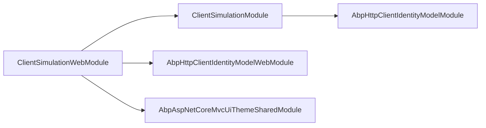
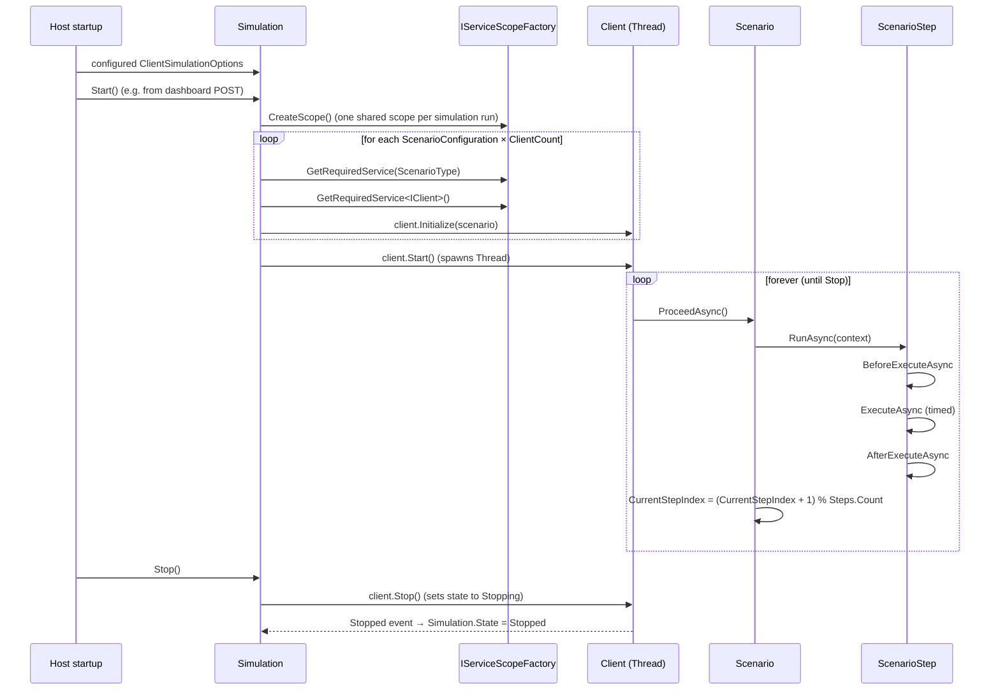
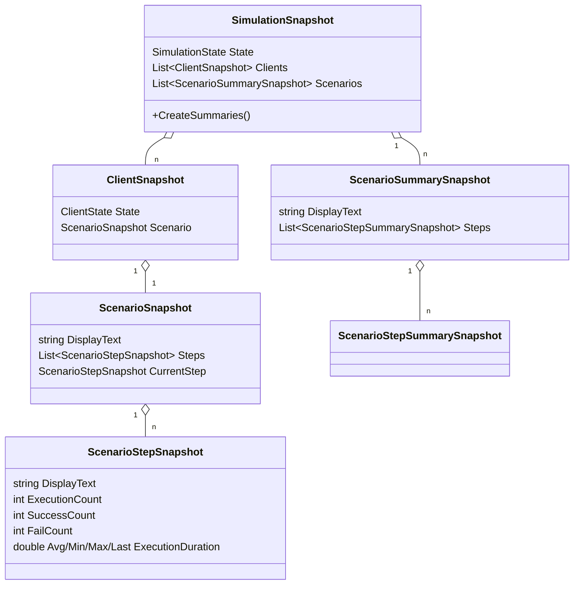

The Client Simulation module turns an ABP host into a tiny load-test driver. You configure one or
more **scenarios** (each scenario is a `Scenario` subclass that runs a sequence of `ScenarioStep`s),
attach a **client count** to each scenario, and the singleton `Simulation` spins up one thread per
client. Each client repeatedly executes its scenario's steps in a loop, tracking execution counts and
durations per step. The Web companion package adds a Razor Pages dashboard that polls a snapshot
every second so you can watch the simulation live.

Unlike Locust or k6, Client Simulation runs in the **same process** as the workload it is testing
(or in a sibling process pointed at the real workload via your usual ABP HTTP clients). It is
particularly handy for testing identity flows, dynamic client proxy hot paths, and ABP-level
cross-cutting concerns (auth, caching, distributed events) under realistic load.

This page is the entry point for the two deep-dive pages that follow. It explains how the runtime
fits together, what data the snapshot carries, and what hooks the Web package exposes.

## Source layout

```
modules/client-simulation/src/
├── Volo.ClientSimulation/                    Core: Simulation, Client, Scenario, ScenarioStep, snapshots
│   ├── ClientSimulationModule.cs             DependsOn(AbpHttpClientIdentityModelModule)
│   ├── ClientSimulationOptions.cs            List<ScenarioConfiguration>
│   ├── ScenarioConfiguration.cs              (Type ScenarioType, int ClientCount)
│   ├── Simulation.cs                         Singleton orchestrator (Start/Stop/CreateSnapshot)
│   ├── SimulationState.cs                    Stopped | Starting | Started | Stopping
│   ├── Clients/Client.cs                     One thread, one scenario; loops ProceedAsync
│   ├── Clients/ClientState.cs                Stopped | Running | Stopping
│   ├── Scenarios/Scenario.cs                 List<ScenarioStep> + Reset/ProceedAsync
│   ├── Scenarios/ScenarioStep.cs             Abstract base; Execute + timing instrumentation
│   ├── Scenarios/SleepScenarioStep.cs        Built-in step: Task.Delay
│   ├── Scenarios/ScenarioExecutionContext.cs Bag (Dictionary<string, object> + IServiceProvider)
│   └── Snapshot/*Snapshot.cs                 Serializable summaries for the dashboard
└── Volo.ClientSimulation.Web/                Web: dashboard + start/stop endpoints
    ├── ClientSimulationWebModule.cs          Adds embedded files; depends on AbpHttpClientIdentityModelWebModule
    └── Pages/ClientSimulation/
        ├── Index.cshtml(.cs/.js)             Wrapper page: <div id="SimulationArea">
        ├── SimulationArea.cshtml(.cs)        Page model: Snapshot + OnPostStart/OnPostStop
        └── SimulationArea.js                 setTimeout(refresh, 1000) loop
```

The dependency on `AbpHttpClientIdentityModelModule` means the core package brings the IdentityModel
HTTP client out of the box — your scenarios can resolve dynamic ABP proxies that fetch tokens from
the configured OIDC server, ready to drive real authenticated workloads.

## What each page covers

| Page | Focus |
| --- | --- |
| [Core](/modules/client-simulation/core) | `Simulation`, `Client`, `Scenario`, `ScenarioStep`, `SleepScenarioStep`, `ClientSimulationOptions`, and the snapshot DTOs |
| [Web](/modules/client-simulation/web) | The Razor dashboard, Start/Stop endpoints, and how to mount it in a host |

## Module dependencies



The core package depends only on the IdentityModel HTTP client, so it is safe to add to a console
host that just needs to issue authenticated calls. The Web package additionally pulls in
`AbpAspNetCoreMvcUiThemeSharedModule` so the dashboard renders with the standard ABP theme.

## Building blocks

| Type | Lifetime | Role |
| --- | --- | --- |
| `Simulation` | `ISingletonDependency` | Owns the running clients; exposes `Start()`, `Stop()`, `CreateSnapshot()` |
| `IClient` / `Client` | `ITransientDependency` | One per scenario client. Holds a `Scenario` and runs a dedicated `Thread` |
| `Scenario` | `ITransientDependency` (abstract) | Holds `List<ScenarioStep>` and a `ScenarioExecutionContext` |
| `ScenarioStep` | Created by your scenario | One unit of work. Tracks `ExecutionCount`, `SuccessCount`, `FailCount`, min/max/avg durations |
| `ScenarioExecutionContext` | Per scenario | Carries the `IServiceProvider` and a `Properties` dictionary for cross-step state |
| `SleepScenarioStep` | — | Built-in step: `Task.Delay(Duration)` |
| `*Snapshot` | Per `CreateSnapshot()` | Serializable views consumed by the dashboard or external tooling |

## Run cycle



A few invariants worth highlighting:

- **One service scope per simulation run.** `Simulation.Start()` creates a scope and resolves every
  scenario and client from it. The scope lives for the lifetime of the run and is disposed when the
  simulation moves back to `Stopped`. That means `ITransientDependency` scenarios act more like
  "scenario-scoped singletons" — they're constructed once and reused for every loop iteration.
- **Each client gets its own scenario instance.** Because each scenario is resolved separately, two
  clients running the same scenario type do *not* share `Scenario.CurrentStepIndex` or per-step
  counters. Step counters are aggregated in the *summary* snapshot, not the per-client snapshot.
- **The thread loop is a busy-loop on `AsyncHelper.RunSync(() => Scenario.ProceedAsync())`.** This
  is `Thread`-based, not Task-based, so a single client occupies a real OS thread. Don't configure
  `ClientCount` higher than your machine can absorb.

## Snapshot model



`CreateSummaries()` aggregates per-client step counters into a per-scenario rollup so the dashboard
can show a single table per scenario instead of one table per client.

## Minimal sample configuration

```csharp
public class WhoAmIScenario : Scenario
{
    public WhoAmIScenario(IServiceProvider sp) : base(sp)
    {
        AddStep(new HitWhoAmIStep());                    // your custom step
        AddStep(new SleepScenarioStep("cool-down", 250));
    }
}

[DependsOn(typeof(ClientSimulationModule), typeof(ClientSimulationWebModule))]
public class MyHostModule : AbpModule
{
    public override void ConfigureServices(ServiceConfigurationContext context)
    {
        Configure<ClientSimulationOptions>(options =>
        {
            options.Scenarios.Add(new ScenarioConfiguration(typeof(WhoAmIScenario), clientCount: 8));
        });
    }
}
```

Hit `/ClientSimulation` in the browser, press **Start**, watch the table refresh.

## Where to extend

| Need | Where |
| --- | --- |
| New step type | Subclass `ScenarioStep`, override `ExecuteAsync` |
| Cross-step state (token, session) | Use `ExecutionContext.Properties["key"]` |
| Async setup before each iteration | Override `BeforeExecuteAsync` |
| External metrics push | Subclass `Simulation` (override `CreateSnapshot` to flush to Prometheus, etc.) |
| Persistent results | Capture `SimulationSnapshot` post-run via a background service |

## Gotchas

- **`Simulation` is a singleton across the host.** There is one simulation, one state machine, and
  one set of clients. Two browser tabs that both press Start will see the second click fail with
  `"Simulation should be stopped to be able to start. Current state is 'Started'."`.
- **No automatic stop condition.** Once started, the simulation runs forever — there is no
  duration, iteration cap, or RPS target. You have to call `Stop()` explicitly (or kill the host).
- **No authorization on the dashboard.** Mount it behind your own auth policy or only expose it on
  internal networks; see [Web](/modules/client-simulation/web).
- **The dashboard hardcodes a 1-second poll.** That is fast enough for development but produces
  measurable load on its own with many scenarios. Patch `SimulationArea.js` if you need a slower
  cadence.
- **The scoring is rough.** `MinExecutionDuration` is seeded at `0.0` and only updated when
  `MinExecutionDuration > LastExecutionDuration`, so until you observe at least one duration the
  reported min stays at `0`. That's by design but can be misleading on small samples.
