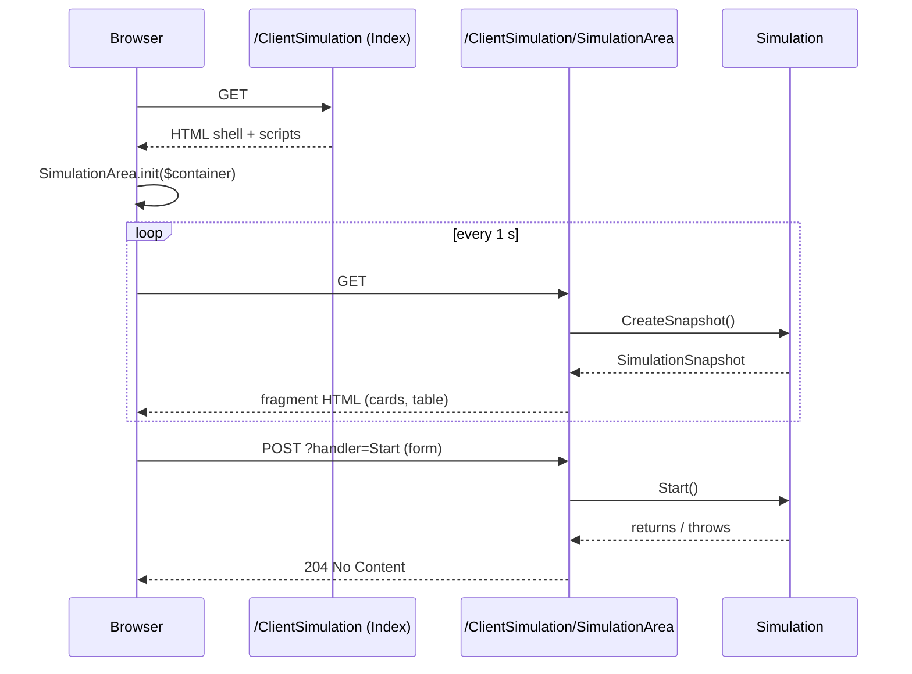

`Volo.ClientSimulation.Web` is a thin Razor Pages UI that sits on top of the
[Client Simulation Core](/modules/client-simulation/core). It contributes one wrapper page
(`Index.cshtml`) that hosts a polled fragment (`SimulationArea.cshtml`), plus a tiny JavaScript file
that refreshes the fragment every second. There are no controllers, no SignalR hub, no API surface
beyond the page handlers — start, stop, and the snapshot are all reached through the page
infrastructure.

## File inventory

| File | Role |
| --- | --- |
| `ClientSimulationWebModule.cs` | Depends on the core module, the IdentityModel web client, and the ABP theme shared module; adds the embedded file set |
| `Pages/ClientSimulation/Index.cshtml(.cs)` | Wrapper page: `<div id="SimulationArea"></div>` + bundles |
| `Pages/ClientSimulation/SimulationArea.cshtml(.cs)` | Page model with `Snapshot`, `OnPostStartAsync`, `OnPostStopAsync` |
| `Pages/ClientSimulation/Index.js` | Bootstrap: calls `SimulationArea.init($('#SimulationArea'))` |
| `Pages/ClientSimulation/SimulationArea.js` | Polls `/ClientSimulation/SimulationArea` every 1 s |

## Module

```csharp
[DependsOn(
    typeof(ClientSimulationModule),
    typeof(AbpHttpClientIdentityModelWebModule),
    typeof(AbpAspNetCoreMvcUiThemeSharedModule))]
public class ClientSimulationWebModule : AbpModule
{
    public override void ConfigureServices(ServiceConfigurationContext context)
    {
        Configure<AbpVirtualFileSystemOptions>(options =>
            options.FileSets.AddEmbedded<ClientSimulationWebModule>("Volo.ClientSimulation"));
    }
}
```

The embedded file set is registered under the `"Volo.ClientSimulation"` virtual path. That is what
makes `/Pages/ClientSimulation/SimulationArea.css` and the two JS files served from the assembly
embedded resources reachable from the bundle pipeline configured in `Index.cshtml`.

`AbpHttpClientIdentityModelWebModule` is pulled in so that scenarios that call ABP HTTP clients can
acquire access tokens through the standard web-friendly IdentityModel provider — useful when the
dashboard host *also* drives traffic against itself.

## Pages

### `Index.cshtml`

```cshtml
@page
@using Volo.ClientSimulation.Pages.ClientSimulation
@model Volo.ClientSimulation.Pages.ClientSimulation.IndexModel
@section styles {
    <abp-style-bundle>
        <abp-style src="/Pages/ClientSimulation/SimulationArea.css" />
    </abp-style-bundle>
}
@section scripts {
    <abp-script-bundle>
        <abp-script src="/Pages/ClientSimulation/SimulationArea.js" />
        <abp-script src="/Pages/ClientSimulation/Index.js" />
    </abp-script-bundle>
}
<div id="SimulationArea"></div>
```

```csharp
public class IndexModel : PageModel
{
    public virtual Task<IActionResult> OnGetAsync()
        => Task.FromResult<IActionResult>(Page());
}
```

The wrapper page renders just one `<div>` and registers the script + style bundles. Everything else
is done by the fragment page polled inside that div.

### `SimulationArea.cshtml.cs`

```csharp
public class SimulationAreaModel : PageModel
{
    public SimulationSnapshot Snapshot { get; private set; }
    protected Simulation Simulation { get; }

    public SimulationAreaModel(Simulation simulation) => Simulation = simulation;

    public virtual Task<IActionResult> OnGetAsync()
    {
        Snapshot = Simulation.CreateSnapshot();
        return Task.FromResult<IActionResult>(Page());
    }

    public virtual async Task<IActionResult> OnPostStartAsync()
    {
        Simulation.Start();
        return new NoContentResult();
    }

    public virtual async Task<IActionResult> OnPostStopAsync()
    {
        Simulation.Stop();
        return new NoContentResult();
    }
}
```

Three handlers, three responsibilities:

| Handler | Verb | Effect |
| --- | --- | --- |
| `OnGetAsync` | GET | Calls `Simulation.CreateSnapshot()` and renders the fragment |
| `OnPostStartAsync` | POST `?handler=Start` | Calls `Simulation.Start()`; returns 204 |
| `OnPostStopAsync` | POST `?handler=Stop` | Calls `Simulation.Stop()`; returns 204 |

The `@page "{handler?}"` directive on the cshtml (visible at the top of the file) is what enables
the handler-routed POSTs.

### `SimulationArea.cshtml` (excerpt)

```cshtml
@page "{handler?}"
@{ Layout = null; }
@using Volo.ClientSimulation
@using Volo.ClientSimulation.Clients
@model SimulationAreaModel

<abp-alert alert-type="Primary">
    <form class="d-inline" id="StartButtonForm" method="post" asp-page-handler="Start" data-ajaxForm="true">
        <abp-button button-type="Primary" type="submit"
                    disabled="@(Model.Snapshot.State != SimulationState.Stopped)">Start</abp-button>
    </form>
    <form class="d-inline" id="StopButtonForm" method="post" asp-page-handler="Stop" data-ajaxForm="true">
        <abp-button button-type="Primary" type="submit"
                    disabled="@(Model.Snapshot.State != SimulationState.Started)">Stop</abp-button>
    </form>
    <span class="ms-3">@Model.Snapshot.State</span>
</abp-alert>

<abp-card class="mt-3">
    <abp-card-header>Clients</abp-card-header>
    <abp-card-body>
        @foreach (var client in Model.Snapshot.Clients)
        {
            <span class="simulation-client simulation-client-@client.State.ToString().ToLowerInvariant()">
                <span class="simulation-client-icon">@* fa-play/fa-eject/fa-stop *@</span>
                <span class="simulation-client-scenario">@client.Scenario.DisplayText</span>
                <span class="simulation-client-scenario-current-step">
                    @if (client.State != ClientState.Stopped) { <text>| @client.Scenario.CurrentStep.DisplayText</text> }
                </span>
            </span>
        }
    </abp-card-body>
</abp-card>

<abp-card class="mt-3">
    <abp-card-header>Scenarios</abp-card-header>
    <abp-card-body>
        @foreach (var scenario in Model.Snapshot.Scenarios)
        {
            <abp-card class="simulation-scenario">
                <abp-card-header>@scenario.DisplayText</abp-card-header>
                <abp-card-body>
                    <abp-table>
                        <thead>
                            <tr><th>Step</th><th>Execution</th><th>Success</th><th>Fail</th>
                                <th>Min</th><th>Max</th><th>Avg</th></tr>
                        </thead>
                        <tbody>
                            @foreach (var step in scenario.Steps)
                            {
                                <tr>
                                    <th>@step.DisplayText</th>
                                    <th>@step.ExecutionCount</th>
                                    <th>@step.SuccessCount</th>
                                    <th>
                                        @if (step.FailCount > 0)
                                        { <span class="step-positive-fail-count">@step.FailCount</span> }
                                        else { <text>@step.FailCount</text> }
                                    </th>
                                    <th>@step.MinExecutionDuration.ToString("0.0") ms</th>
                                    <th>@step.MaxExecutionDuration.ToString("0.0") ms</th>
                                    <th>@step.AvgExecutionDuration.ToString("0.0") ms</th>
                                </tr>
                            }
                        </tbody>
                    </abp-table>
                </abp-card-body>
            </abp-card>
        }
    </abp-card-body>
</abp-card>
```

The Start/Stop buttons are plain forms submitted via the ABP `data-ajaxForm="true"` convention — that
posts the form in the background, expects a 2xx response, and lets the surrounding fragment refresh
on the next polling tick.

The per-client "card" colors itself via the `simulation-client-{state}` CSS class. The
`simulation-scenario` cards display the aggregated `ScenarioSummarySnapshot` data.

## JavaScript

```javascript
// Index.js
(function ($) {
    $(function () { SimulationArea.init($('#SimulationArea')); });
})(jQuery);
```

```javascript
// SimulationArea.js
var SimulationArea = {};
(function ($) {
    var $mainContainer = null;

    function refreshSimulationArea() {
        $.get('/ClientSimulation/SimulationArea')
            .done(function (result) { $mainContainer.html(result); })
            .always(function () { setTimeout(refreshSimulationArea, 1000); });
    }

    SimulationArea.init = function ($container) {
        $mainContainer = $container;
        setTimeout(refreshSimulationArea, 1000);
    };
})(jQuery);
```

The polling logic:

1. `Index.js` runs on document ready, hands the container `<div>` to `SimulationArea.init`.
2. `init` schedules `refreshSimulationArea` 1 second later.
3. `refresh` GETs `/ClientSimulation/SimulationArea`. On success the returned HTML replaces the
   container; on failure (or success) the function schedules itself again 1 second later via
   `.always`.

The cadence is fixed — there is no exponential backoff and no jitter. With many scenarios running,
the snapshot polling itself is a measurable load (`CreateSnapshot()` takes the simulation's
synchronization lock).



## Hosting the dashboard

In a host module, depend on `ClientSimulationWebModule`, configure scenarios, and pin the route in
your `AbpAspNetCoreMvcOptions` if needed:

```csharp
[DependsOn(
    typeof(ClientSimulationWebModule),
    typeof(AbpAspNetCoreMvcUiBasicThemeModule),
    /* your modules */)]
public class HarnessHostModule : AbpModule
{
    public override void ConfigureServices(ServiceConfigurationContext context)
    {
        Configure<ClientSimulationOptions>(options =>
        {
            options.Scenarios.Add(new ScenarioConfiguration(typeof(BrowseBlogsScenario), clientCount: 8));
        });
    }
}
```

The page lives at `/ClientSimulation` and the polled fragment at `/ClientSimulation/SimulationArea`.
There is no menu contributor — wire it into your own navigation if you want a link from the main
shell.

## Protecting the dashboard

Out of the box, the dashboard has **no authorization attributes**: anyone who can reach
`/ClientSimulation` can press Start and start hammering whatever the host is wired up to. Three
practical options:

1. **Auth policy on the page conventions**:

   ```csharp
   Configure<RazorPagesOptions>(options =>
   {
       options.Conventions.AuthorizePage("/ClientSimulation/Index",
           policy: "RequireAdmin");
       options.Conventions.AuthorizePage("/ClientSimulation/SimulationArea",
           policy: "RequireAdmin");
   });
   ```

2. **YARP / reverse-proxy gate**: only expose `/ClientSimulation` on an internal subdomain.

3. **Custom permission**: define a `ClientSimulation.Run` permission and subclass the page models
   to call `IAuthorizationService.IsGrantedAsync` in `OnGetAsync`/`OnPostStartAsync`.

The shipped code does none of this — it assumes the host owner makes that decision.

## Customizing the dashboard

The cshtml files are embedded resources reachable through the virtual file system. You can override
them in your host by placing a file at the same path (e.g.
`Pages/ClientSimulation/SimulationArea.cshtml`) — ABP's virtual file system picks the file system
copy first.

To extend the JS poll interval, override `SimulationArea.js` similarly and change the `1000`
constant. The handler URLs (`/ClientSimulation/SimulationArea` etc.) are hard-coded in the script;
keep them aligned if you rename the page.

## What about authentication for the simulated traffic?

`ClientSimulationWebModule` depends on `AbpHttpClientIdentityModelWebModule`, which means that
scenarios resolving ABP dynamic proxy clients inside the dashboard host can transparently acquire
access tokens via the configured OIDC client. If your scenarios target a *different* host's APIs,
configure `AbpHttpClientBuilderOptions`/`RemoteServices` for that target and the dashboard's
identity flow will obtain tokens before each request.

## Gotchas

- **`@page "{handler?}"` on the fragment** is what makes `?handler=Start`/`?handler=Stop` work. If
  you rewrite the fragment as a partial view you lose the start/stop endpoints; keep it a Razor Page.
- **`OnPostStartAsync` is declared `async` but does not `await` anything.** Calling `.Start()` is
  synchronous (it locks, allocates a scope, spawns threads). Don't rely on its async signature for
  timing.
- **`CreateSnapshot()` acquires the simulation's lock.** A polling browser session that opens many
  tabs of the dashboard can contend for that lock; degrade to a single tab during real load tests.
- **The dashboard is not real-time.** Up to 1 second of staleness between the actual counters and
  what is shown. For high-RPS scenarios consider exporting the snapshot to Prometheus via a hosted
  service instead.
- **No "reset" button.** Counters only reset on `Start()` (which calls `Scenario.Reset()`). To clear
  numbers you must Stop and Start again — even a no-op restart resets state.
- **`Layout = null;` on the fragment** is essential; without it the polled response would include
  the full layout HTML and the container `<div>` would nest layouts indefinitely.
- **Embedded path is `"Volo.ClientSimulation"`** (the assembly name) — if you fork the module and
  rename the assembly, update the `AddEmbedded<...>("Volo.ClientSimulation")` argument or the
  files won't be served.
