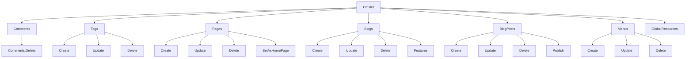
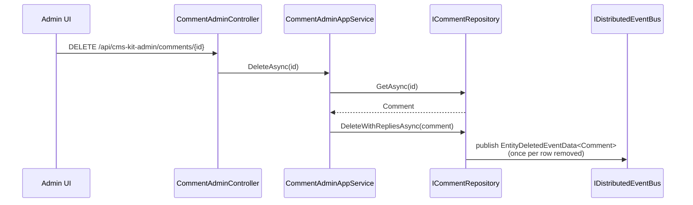
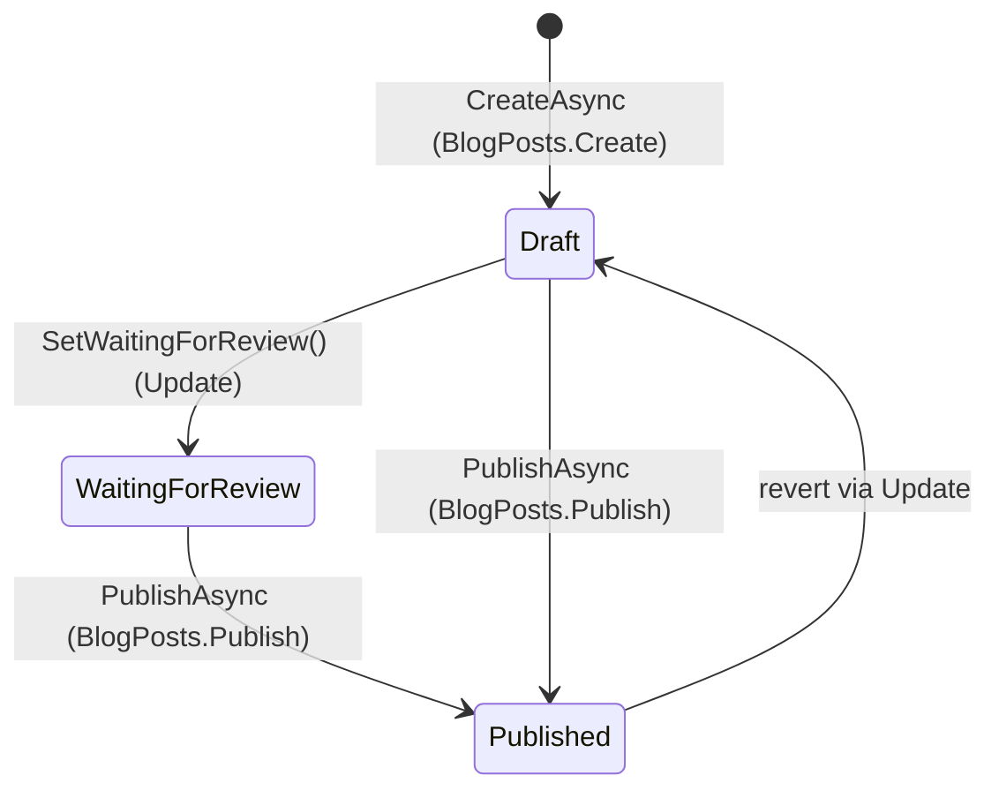

`Volo.CmsKit.Admin.Application` is the *management* side of CMS Kit: every create/update/delete operation, plus admin-only reads (the paged comment list, the "is there a post waiting for review" check, the per-blog feature toggle). The matching `Admin.Application.Contracts` package defines the interfaces, DTOs and permission tree.

## File inventory

```
Volo.CmsKit.Admin.Application/Volo/CmsKit/Admin/
├── CmsKitAdminAppServiceBase.cs
├── CmsKitAdminApplicationAutoMapperProfile.cs
├── CmsKitAdminApplicationModule.cs
├── Blogs/                BlogAdminAppService, BlogPostAdminAppService, BlogFeatureAdminAppService
├── Comments/             CommentAdminAppService
├── GlobalResources/      GlobalResourceAdminAppService
├── MediaDescriptors/     MediaDescriptorAdminAppService
├── Menus/                MenuItemAdminAppService
├── Pages/                PageAdminAppService
└── Tags/                 TagAdminAppService, EntityTagAdminAppService
```

```
Volo.CmsKit.Admin.Application.Contracts/Volo/CmsKit/
├── Admin/                12 interfaces + DTOs (see overview)
├── Permissions/          CmsKitAdminPermissions, CmsKitAdminPermissionDefinitionProvider
└── Admin/CmsKitAdminApplicationContractsModule.cs
```

## Module wiring

```csharp
[DependsOn(
    typeof(CmsKitAdminApplicationContractsModule),
    typeof(AbpAutoMapperModule),
    typeof(CmsKitCommonApplicationModule)
)]
public class CmsKitAdminApplicationModule : AbpModule
{
    public override void ConfigureServices(ServiceConfigurationContext context)
    {
        context.Services.AddAutoMapperObjectMapper<CmsKitAdminApplicationModule>();

        ConfigureTagOptions();        // registers TagEntityTypeDefiniton for BlogPost
        ConfigureCommentOptions();    // registers CommentEntityTypeDefinition for BlogPost
        // also registers MediaDescriptorDefinition for BlogPost & Page when MediaFeature on

        Configure<AbpAutoMapperOptions>(options =>
        {
            options.AddMaps<CmsKitAdminApplicationModule>(validate: true);
        });
    }
}
```

`ConfigureTagOptions` declares the canonical `BlogPost` entity type as taggable and binds the create/update/delete actions to `CmsKitAdminPermissions.BlogPosts.Create | Update`. Same trick for `MediaDescriptor` definitions and comment entity types. This is where you'd add your own taggable / commentable / media-holding entity types if you have them.

## Permission tree

`CmsKitAdminPermissions` exposes a flat namespace of constants:

```csharp
public static class CmsKitAdminPermissions
{
    public const string GroupName = "CmsKit";

    public static class Comments { public const string Default, Delete; }
    public static class Tags     { public const string Default, Create, Update, Delete; }
    public static class Contents { public const string Default, Create, Update, Delete; }
    public static class Pages    { public const string Default, Create, Update, Delete, SetAsHomePage; }
    public static class Blogs    { public const string Default, Create, Update, Delete, Features; }
    public static class BlogPosts{ public const string Default, Create, Update, Delete, Publish; }
    public static class Menus    { public const string Default, Create, Update, Delete; }
    public static class GlobalResources { public const string Default; }
}
```

`CmsKitAdminPermissionDefinitionProvider` registers them, *each gated by the appropriate `RequireGlobalFeatures(typeof(BlogsFeature)) / CommentsFeature / …`*. If a global feature is off, the permissions for that feature simply don't appear in the permission UI — and you cannot grant them.



## App service catalogue

Every admin app service follows the same anatomy:

```csharp
[RequiresFeature(CmsKitFeatures.XxxEnable)]
[RequiresGlobalFeature(typeof(XxxFeature))]
[Authorize(CmsKitAdminPermissions.Xxx.Default)]
public class XxxAdminAppService : CmsKitAdminAppServiceBase, IXxxAdminAppService { … }
```

Three gates: the per-tenant feature toggle, the global feature toggle, and the default permission.

| Service | Interface | Notable methods |
| --- | --- | --- |
| `BlogAdminAppService` | `IBlogAdminAppService : ICrudAppService<BlogDto, Guid, BlogGetListInput, CreateBlogDto, UpdateBlogDto>` | full CRUD; `CreateAsync` calls `BlogManager.CreateAsync` + `BlogFeatureManager.SetDefaultsAsync(blog.Id)` |
| `BlogPostAdminAppService` | `IBlogPostAdminAppService` | `CreateAsync/UpdateAsync/DeleteAsync/Publish` plus list with status/tag/author filters |
| `BlogFeatureAdminAppService` | `IBlogFeatureAdminAppService` | `GetAsync(blogId)`, `SetAsync(blogId, featureName, isEnabled)` |
| `CommentAdminAppService` | `ICommentAdminAppService` | paged list with author + text filter; soft `[Authorize(Comments.Delete)]` on delete; `DeleteWithRepliesAsync` cascade |
| `PageAdminAppService` | `IPageAdminAppService` | CRUD + `SetAsHomePageAsync` + cache invalidation of `DefaultHomePageCacheKey` |
| `MenuItemAdminAppService` | `IMenuItemAdminAppService` | CRUD + `MoveAsync` (uses `MenuItemManager.MoveAsync` to rewrite siblings) |
| `TagAdminAppService` | `ITagAdminAppService` | CRUD + `GetTagDefinitionsAsync()` |
| `EntityTagAdminAppService` | `IEntityTagAdminAppService` | `AddTagToEntityAsync`, `RemoveTagFromEntityAsync`, `SetEntityTagsAsync` |
| `MediaDescriptorAdminAppService` | `IMediaDescriptorAdminAppService` | accepts `CreateMediaInputWithStream`; saves bytes via `IBlobContainer<MediaContainer>` + descriptor row |
| `GlobalResourceAdminAppService` | `IGlobalResourceAdminAppService` | get/update by name; used for `GlobalScript`/`GlobalStyle` reserved keys |

### `BlogPostAdminAppService.CreateAsync`

```csharp
[Authorize(CmsKitAdminPermissions.BlogPosts.Create)]
public virtual async Task<BlogPostDto> CreateAsync(CreateBlogPostDto input)
{
    var author = await UserLookupService.GetByIdAsync(CurrentUser.GetId());
    var blog   = await BlogRepository.GetAsync(input.BlogId);

    var blogPost = await BlogPostManager.CreateAsync(
        author, blog, input.Title, input.Slug,
        BlogPostStatus.Draft,            // newly created posts are always Draft
        input.ShortDescription, input.Content, input.CoverImageMediaId);

    input.MapExtraPropertiesTo(blogPost);
    await BlogPostRepository.InsertAsync(blogPost);

    return ObjectMapper.Map<BlogPost, BlogPostDto>(blogPost);
}
```

The status is *forced* to `Draft` here — `BlogPostStatus.Published` is only reachable via the `[Authorize(CmsKitAdminPermissions.BlogPosts.Publish)]`-gated `PublishAsync(id)`. That's how you build a two-eyes workflow (a Contributor role with `BlogPosts.Create | Update`, an Editor role with `Publish`).

### `TagAdminAppService` & dynamic localisation

```csharp
public virtual async Task<List<TagDefinitionDto>> GetTagDefinitionsAsync()
{
    var definitions = await TagDefinitionStore.GetTagEntityTypeDefinitionListAsync();
    return definitions
        .Select(s => new TagDefinitionDto
        {
            EntityType  = s.EntityType,
            DisplayName = s.DisplayName?.Localize(StringLocalizerFactory) ?? s.EntityType
        }).ToList();
}
```

`ITagDefinitionStore` is fed by `CmsKitTagOptions.EntityTypes`. `DisplayName` is an `ILocalizableString` — the AppService resolves it through `IStringLocalizerFactory` so the admin UI can render a tenant's locale instead of the raw entity name.

### `MenuItemAdminAppService`

```csharp
[Authorize(CmsKitAdminPermissions.Menus.Create)]
public virtual async Task<MenuItemDto> CreateAsync(MenuItemCreateInput input)
{
    var menuItem = new MenuItem(GuidGenerator.Create(), input.DisplayName,
        input.Url.IsNullOrEmpty() ? "#" : input.Url,
        input.IsActive, input.ParentId, input.Icon, input.Order,
        input.Target, input.ElementId, input.CssClass, CurrentTenant.Id);

    if (input.PageId.HasValue)
        MenuManager.SetPageUrl(menuItem,
            await PageRepository.GetAsync(input.PageId.Value));

    input.MapExtraPropertiesTo(menuItem);
    await MenuItemRepository.InsertAsync(menuItem);

    return ObjectMapper.Map<MenuItem, MenuItemDto>(menuItem);
}
```

Notice the `Url.IsNullOrEmpty() ? "#"` fallback — a menu item that points at a `PageId` *first* has its URL stamped to `"#"` so the entity invariant (`Url` is `NotNull`) is satisfied; then `SetPageUrl` overwrites it with `/<page-slug>`.

## Sequence: comment moderation



`DeleteWithRepliesAsync` removes the parent plus first-level replies in a single transaction. Multi-level threads are not handled — if you ever wire reply-to-reply, override the repo.

## `Publish` workflow



`PublishAsync(id)` simply calls `blogPost.SetPublished()` then saves; the permission ringfences the action.

## AutoMapper

`CmsKitAdminApplicationAutoMapperProfile` registers the admin DTO maps:

* `Blog ↔ BlogDto`, `CreateBlogDto → Blog`, `UpdateBlogDto → Blog`
* `BlogPost ↔ BlogPostDto`, `BlogPost → BlogPostListDto`, `CreateBlogPostDto → BlogPost`, `UpdateBlogPostDto → BlogPost`
* `Comment → CommentDto`, `Comment → CommentWithAuthorDto`, `CmsUser → CmsUserDto` (admin-side variant)
* `Page → PageDto`, `CreatePageInputDto → Page`, `UpdatePageInputDto → Page`
* `Tag → TagDto`, `MenuItem → MenuItemDto`, `MediaDescriptor → MediaDescriptorDto`, `GlobalResource → GlobalResourcesDto`

All maps are `validate: true`-checked at startup.

## Permission gotchas

* **`BlogPosts.Publish` is required on top of `BlogPosts.Update`** to call `PublishAsync`. Editors need both.
* **`Comments.Delete` is per-method.** The default permission lets an admin *list / view* comments; deleting requires the child grant.
* **All admin permissions require their global feature** — granting a permission whose `RequireGlobalFeatures` parent is off does nothing; the AppService still throws `RequiresGlobalFeatureException` at runtime.

## Gotchas

* **`CmsKitFeatures.XxxEnable` is per-tenant.** A tenant can be locked out of comments while still having the global feature on — the AppService throws `AbpFeatureNotEnabledException`.
* **`UpdateAsync` flows always re-check the slug** via the manager. Bumping `BlogPost.Title` while keeping the slug doesn't roundtrip the slug check (only the slug setter does).
* **Concurrency stamps.** Every update DTO carries `ConcurrencyStamp` and the AppService calls `entity.SetConcurrencyStampIfNotNull(input.ConcurrencyStamp)` — a stale UI gets `AbpDbConcurrencyException`.
* **`Page.SetAsHomePageAsync` invalidates `PageConsts.DefaultHomePageCacheKey`** in the AppService, not the manager. If you call the manager directly, you have to clear the cache yourself.
* **Media upload uses `[FormBody] CreateMediaInputWithStream`** — registered in `Admin.Web` via `options.ConventionalControllers.FormBodyBindingIgnoredTypes.Add(typeof(CreateMediaInputWithStream))`. Without that registration the dynamic controller binds the stream as JSON and fails.

## Cross-links

* [Common.Application](/modules/cms-kit/common-application) — shared AppServices (`TagAppService`, `MediaDescriptorAppService`, `BlogFeatureAppService`).
* [Public.Application](/modules/cms-kit/public-application) — counterpart visitor-side AppServices.
* [Admin.HttpApi](/modules/cms-kit/admin-http-api) — controllers wrapping these AppServices.
* [Admin.Web](/modules/cms-kit/admin-web) — Razor Pages calling these AppServices.
* [Domain](/modules/cms-kit/domain) — managers and repositories used here.
