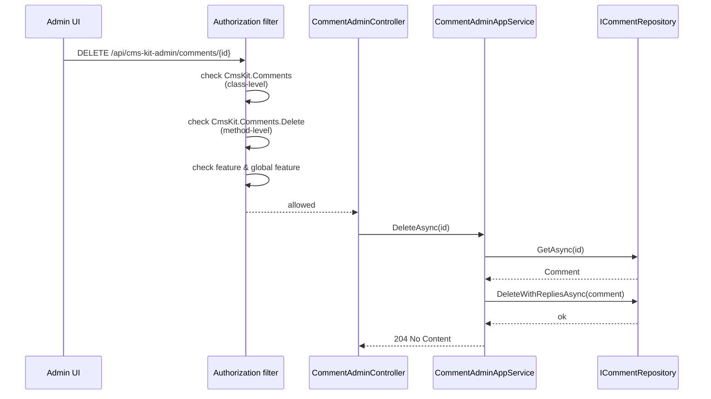
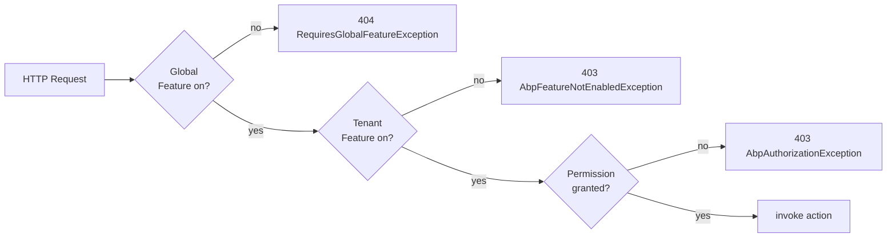

`Volo.CmsKit.Admin.HttpApi` is the *back-office HTTP surface*. Twelve controllers, one per admin AppService, each implementing the corresponding interface. All routes live under `api/cms-kit-admin/*` and inherit a common set of guards.

## File inventory

```
Volo.CmsKit.Admin.HttpApi/Volo/CmsKit/Admin/
├── CmsKitAdminController.cs
├── CmsKitAdminHttpApiModule.cs
├── Blogs/BlogAdminController.cs / BlogPostAdminController.cs / BlogFeatureAdminController.cs
├── Comments/CommentAdminController.cs
├── GlobalResources/GlobalResourceAdminController.cs
├── MediaDescriptors/MediaDescriptorAdminController.cs
├── Menus/MenuItemAdminController.cs
├── Pages/PageAdminController.cs
└── Tags/EntityTagAdminController.cs / TagAdminController.cs
```

## Module wiring

```csharp
[DependsOn(
    typeof(CmsKitAdminApplicationContractsModule),
    typeof(CmsKitCommonHttpApiModule)
)]
public class CmsKitAdminHttpApiModule : AbpModule
{
    public override void PreConfigureServices(ServiceConfigurationContext context)
    {
        PreConfigure<IMvcBuilder>(mvcBuilder =>
        {
            mvcBuilder.AddApplicationPartIfNotExists(typeof(CmsKitAdminHttpApiModule).Assembly);
        });
    }

    public override void ConfigureServices(ServiceConfigurationContext context)
    {
        Configure<AbpAspNetCoreMvcOptions>(options =>
        {
            options.ConventionalControllers.FormBodyBindingIgnoredTypes
                .Add(typeof(CreateMediaInputWithStream));
        });
    }
}
```

`AddApplicationPartIfNotExists` makes ASP.NET MVC scan the assembly for controllers. `FormBodyBindingIgnoredTypes` is the critical bit for media uploads — see below.

## Controller anatomy

Every controller follows the same template:

```csharp
[RequiresFeature(CmsKitFeatures.XxxEnable)]
[RequiresGlobalFeature(typeof(XxxFeature))]
[RemoteService(Name = CmsKitAdminRemoteServiceConsts.RemoteServiceName)]   // "CmsKitAdmin"
[Area(CmsKitAdminRemoteServiceConsts.ModuleName)]                          // "cms-kit-admin"
[Authorize(CmsKitAdminPermissions.Xxx.Default)]
[Route("api/cms-kit-admin/<resource>")]
public class XxxAdminController : CmsKitAdminController, IXxxAdminAppService
{
    protected IXxxAdminAppService XxxAdminAppService { get; }
    // …methods delegate to the AppService.
}
```

Implementing the AppService interface is what makes the controller eligible for the framework's [`Auto API Controllers`](/framework/api-development/auto-api-controllers) sibling system *and* lets the dynamic-HTTP-proxy regenerate consistent clients. The class also carries explicit `[HttpGet]/[HttpPost]/…/[Route]` attributes per method so the routes are unambiguous in `Program.cs`.

### `BlogAdminController`

```csharp
[RequiresFeature(CmsKitFeatures.BlogEnable)]
[RequiresGlobalFeature(typeof(BlogsFeature))]
[Authorize(CmsKitAdminPermissions.Blogs.Default)]
[Route("api/cms-kit-admin/blogs")]
public class BlogAdminController : CmsKitAdminController, IBlogAdminAppService
{
    [HttpGet]                       Task<PagedResultDto<BlogDto>> GetListAsync(BlogGetListInput input);
    [HttpGet] [Route("{id}")]       Task<BlogDto>                  GetAsync(Guid id);
    [HttpPost]                      Task<BlogDto>                  CreateAsync(CreateBlogDto input);
    [HttpPut]  [Route("{id}")]      Task<BlogDto>                  UpdateAsync(Guid id, UpdateBlogDto input);
    [HttpDelete] [Route("{id}")]    Task                           DeleteAsync(Guid id);
}
```

Full CRUD. The default permission is `Blogs.Default`; the individual method overrides bump it to `.Create / .Update / .Delete` via `[Authorize(...)]` on the AppService.

### `CommentAdminController`

```csharp
[Route("api/cms-kit-admin/comments")]
public class CommentAdminController : CmsKitAdminController, ICommentAdminAppService
{
    [HttpGet]                     Task<PagedResultDto<CommentWithAuthorDto>> GetListAsync(CommentGetListInput input);
    [HttpGet]   [Route("{id}")]   Task<CommentWithAuthorDto>                 GetAsync(Guid id);
    [HttpDelete][Route("{id}")]
    [Authorize(CmsKitAdminPermissions.Comments.Delete)]
                                  Task                                       DeleteAsync(Guid id);
}
```

Notice that `Delete` requires the child permission on top of the controller's class-level `Comments.Default` — the framework evaluates both.

### `MediaDescriptorAdminController`

The interesting one. Media upload is a multipart `POST` where the body carries `Bytes` + metadata:

```csharp
public class CreateMediaInputWithStream
{
    public string EntityType { get; set; }
    public IRemoteStreamContent Bytes  { get; set; }
}
```

The framework's dynamic controller convention normally binds DTOs as JSON. Adding `typeof(CreateMediaInputWithStream)` to `FormBodyBindingIgnoredTypes` forces ASP.NET to bind from `multipart/form-data` instead. **Without that registration the upload returns 415 Unsupported Media Type**.

### `MenuItemAdminController`

Includes a `[HttpPost] /move` route to call `MenuItemAdminAppService.MoveAsync(input)` — used by the admin drag-and-drop UI.

### `BlogFeatureAdminController`

Drives the per-blog feature toggle settings page:

```csharp
[Route("api/cms-kit-admin/blogs/{blogId}/features")]
public class BlogFeatureAdminController : CmsKitAdminController, IBlogFeatureAdminAppService
{
    [HttpGet]                     Task<BlogFeatureDto> GetAsync(Guid blogId, string featureName);
    [HttpPut]                     Task                 SetAsync(Guid blogId, BlogFeatureInputDto input);
}
```

The `Authorize` policy is `CmsKitAdminPermissions.Blogs.Features`.

## Sequence: pseudo-anonymous comment delete



## URL prefix

The repository contains a `CmsKitAdminController` base class with no `[Route]`, plus per-class `[Route]` attributes. Routes are:

| Controller | Route prefix |
| --- | --- |
| `BlogAdminController` | `api/cms-kit-admin/blogs` |
| `BlogPostAdminController` | `api/cms-kit-admin/blog-posts` |
| `BlogFeatureAdminController` | `api/cms-kit-admin/blogs/{blogId}/features` |
| `CommentAdminController` | `api/cms-kit-admin/comments` |
| `PageAdminController` | `api/cms-kit-admin/pages` |
| `MenuItemAdminController` | `api/cms-kit-admin/menus` |
| `TagAdminController` | `api/cms-kit-admin/tags` |
| `EntityTagAdminController` | `api/cms-kit-admin/entity-tags` |
| `MediaDescriptorAdminController` | `api/cms-kit-admin/media` |
| `GlobalResourceAdminController` | `api/cms-kit-admin/global-resources` |

## Authorization layers

A request is fenced by *three* gates the framework processes in order:

1. `[RequiresGlobalFeature]` — short-circuits at the action filter level if disabled globally.
2. `[RequiresFeature]` — checks the tenant's `CmsKitFeatures.XxxEnable` toggle.
3. `[Authorize(CmsKitAdminPermissions.Xxx.…)]` — ABP's permission system, evaluated via `IAuthorizationService`.



## Dynamic JS proxy

The admin UI is Razor Pages, so the auto-generated JS proxy isn't needed for the admin module. `CmsKitAdminWebModule.ConfigureServices` calls:

```csharp
Configure<DynamicJavaScriptProxyOptions>(options =>
{
    options.DisableModule(CmsKitAdminRemoteServiceConsts.ModuleName);
});
```

This prevents `/abp/api-definition` from advertising the admin endpoints to the JS proxy generator. Apps that want a SPA admin must call `options.EnableModule(...)` from their host.

## Gotchas

* **Multipart upload type registration is in `ConfigureServices`, not in PreConfigure.** The conventional controller framework reads `FormBodyBindingIgnoredTypes` *after* `PreConfigureServices`; adding the type earlier is fine, later is too late.
* **`[Route]` on the controller, not on the AppService.** The interface (`IBlogAdminAppService`) has no `[Route]`. If you fork the controller and forget the attribute, the framework's `auto-routing` falls back to `cms-kit-admin/<class-name>` which may not be what you want.
* **Method-level permissions don't *replace* the class-level one.** They're additive. `Authorize` filters compose so the action needs both `Blogs.Default` and `Blogs.Create`.
* **`api/cms-kit-admin/menus/move` is special.** It's a `POST` with a `MoveMenuItemInput` body that rewrites multiple items in a single transaction — single-item PATCH endpoints are *not* available.
* **`DELETE` returns 204** by convention; the AppService method is `Task` not `Task<bool>` so there's no success indicator beyond the status code.
* **CORS not configured by the module.** Calling `cms-kit-admin/*` from a cross-origin SPA needs your own policy.
* **OData filter strings are unsupported.** All filtering is done via dedicated `XxxGetListInput` DTOs. The framework's `IPagedAndSortedResultRequest` is used for skip/take/sort.

## Cross-links

* [Admin.Application](/modules/cms-kit/admin-application) — AppServices behind these controllers.
* [HttpApi roll-up](/modules/cms-kit/http-api) — common controllers and constants.
* [Public.HttpApi](/modules/cms-kit/public-http-api) — visitor side.
* [Admin.Web](/modules/cms-kit/admin-web) — Razor consumer.
