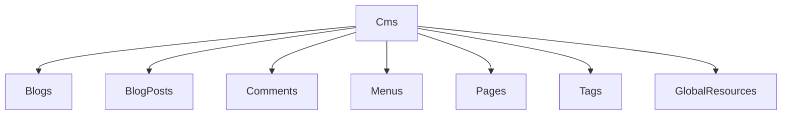
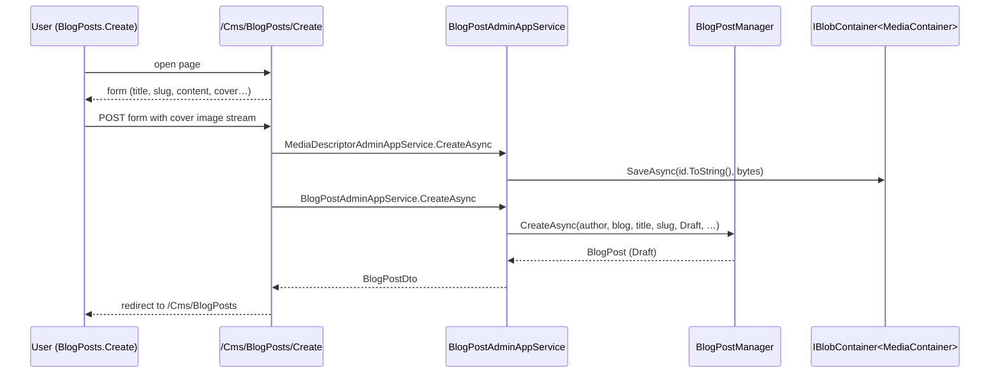

`Volo.CmsKit.Admin.Web` is the Razor Pages back office. Each enabled feature gets its own folder under `Pages/CmsKit/<Feature>/`, a corresponding entry in the side menu, an entry in the toolbar, and a route prefix under `/Cms/<Feature>`.

## File inventory (high-level)

```
Volo.CmsKit.Admin.Web/
├── CmsKitAdminWebModule.cs
├── Menus/CmsKitAdminMenuContributor.cs  + CmsKitAdminMenus.cs
└── Pages/CmsKit/
    ├── Blogs/         (Index, CreateModal, EditModal, …)
    ├── BlogPosts/     (Index, Create, Update)
    ├── Comments/      (Index, Details)
    ├── Contents/      (widget tooling)
    ├── GlobalResources/ (Index — manage GlobalScript & GlobalStyle)
    ├── Menus/MenuItems/ (Index drag-and-drop, CreateModal, UpdateModal)
    ├── Pages/         (Index, Create, Update)
    └── Tags/          (Index, CreateModal, EditModal, Components/TagEditor)
```

## Module wiring (selected)

```csharp
[DependsOn(
    typeof(CmsKitAdminApplicationContractsModule),
    typeof(CmsKitCommonWebModule)
)]
public class CmsKitAdminWebModule : AbpModule
{
    public override void ConfigureServices(ServiceConfigurationContext context)
    {
        Configure<AbpNavigationOptions>(options =>
        {
            options.MenuContributors.Add(new CmsKitAdminMenuContributor());
        });

        Configure<AbpVirtualFileSystemOptions>(options =>
        {
            options.FileSets.AddEmbedded<CmsKitAdminWebModule>("Volo.CmsKit.Admin.Web");
        });

        context.Services.AddAutoMapperObjectMapper<CmsKitAdminWebModule>();
        Configure<AbpAutoMapperOptions>(options =>
        {
            options.AddMaps<CmsKitAdminWebModule>(validate: true);
        });

        Configure<RazorPagesOptions>(options =>
        {
            // Conventions.AuthorizeFolder + AddPageRoute calls — see below.
        });

        Configure<AbpPageToolbarOptions>(options =>
        {
            // Toolbar.AddButton for every list page — see below.
        });

        Configure<DynamicJavaScriptProxyOptions>(options =>
        {
            options.DisableModule(CmsKitAdminRemoteServiceConsts.ModuleName);
        });

        Configure<AbpAspNetCoreMvcOptions>(options =>
        {
            options.ConventionalControllers.FormBodyBindingIgnoredTypes
                .Add(typeof(CreateMediaInputWithStream));
        });
    }
}
```

## Page authorization conventions

```csharp
Configure<RazorPagesOptions>(options =>
{
    options.Conventions.AuthorizeFolder("/CmsKit/Tags/", CmsKitAdminPermissions.Tags.Default);
    options.Conventions.AuthorizeFolder("/CmsKit/Tags/CreateModal", CmsKitAdminPermissions.Tags.Create);
    options.Conventions.AuthorizeFolder("/CmsKit/Tags/UpdateModal", CmsKitAdminPermissions.Tags.Update);

    options.Conventions.AuthorizeFolder("/CmsKit/Pages",            CmsKitAdminPermissions.Pages.Default);
    options.Conventions.AuthorizeFolder("/CmsKit/Pages/Create",     CmsKitAdminPermissions.Pages.Create);
    options.Conventions.AuthorizeFolder("/CmsKit/Pages/Update",     CmsKitAdminPermissions.Pages.Update);
    options.Conventions.AuthorizeFolder("/CmsKit/Pages/SetAsHomePage", CmsKitAdminPermissions.Pages.SetAsHomePage);

    options.Conventions.AuthorizeFolder("/CmsKit/Blogs",            CmsKitAdminPermissions.Blogs.Default);
    options.Conventions.AuthorizeFolder("/CmsKit/Blogs/Create",     CmsKitAdminPermissions.Blogs.Create);
    options.Conventions.AuthorizeFolder("/CmsKit/Blogs/Update",     CmsKitAdminPermissions.Blogs.Update);

    options.Conventions.AuthorizeFolder("/CmsKit/BlogPosts",        CmsKitAdminPermissions.BlogPosts.Default);
    options.Conventions.AuthorizeFolder("/CmsKit/BlogPosts/Create", CmsKitAdminPermissions.BlogPosts.Create);
    options.Conventions.AuthorizeFolder("/CmsKit/BlogPosts/Update", CmsKitAdminPermissions.BlogPosts.Update);

    options.Conventions.AuthorizeFolder("/CmsKit/Comments/",        CmsKitAdminPermissions.Comments.Default);

    options.Conventions.AuthorizeFolder("/CmsKit/Menus",            CmsKitAdminPermissions.Menus.Default);
    options.Conventions.AuthorizePage("/CmsKit/Menus/MenuItems/CreateModal", CmsKitAdminPermissions.Menus.Create);
    options.Conventions.AuthorizePage("/CmsKit/Menus/MenuItems/UpdateModal", CmsKitAdminPermissions.Menus.Update);

    options.Conventions.AuthorizeFolder("/CmsKit/GlobalResources", CmsKitAdminPermissions.GlobalResources.Default);
});
```

These are *additional* gates on top of the AppService `[Authorize]` attributes — the Razor page can't even be requested by an unauthorised user, so the user never sees a 403 from the AppService directly.

## Friendly URL aliases

```csharp
Configure<RazorPagesOptions>(options =>
{
    options.Conventions.AddPageRoute("/CmsKit/Tags/Index",       "/Cms/Tags");
    options.Conventions.AddPageRoute("/CmsKit/Pages/Index",      "/Cms/Pages");
    options.Conventions.AddPageRoute("/CmsKit/Pages/Create",     "/Cms/Pages/Create");
    options.Conventions.AddPageRoute("/CmsKit/Pages/Update",     "/Cms/Pages/Update/{Id}");
    options.Conventions.AddPageRoute("/CmsKit/Blogs/Index",      "/Cms/Blogs");
    options.Conventions.AddPageRoute("/CmsKit/BlogPosts/Index",  "/Cms/BlogPosts");
    options.Conventions.AddPageRoute("/CmsKit/BlogPosts/Create", "/Cms/BlogPosts/Create");
    options.Conventions.AddPageRoute("/CmsKit/BlogPosts/Update", "/Cms/BlogPosts/Update/{Id}");
    options.Conventions.AddPageRoute("/CmsKit/Comments/Index",   "/Cms/Comments");
    options.Conventions.AddPageRoute("/CmsKit/Comments/Details", "/Cms/Comments/{Id}");
    options.Conventions.AddPageRoute("/CmsKit/Menus/MenuItems/Index", "/Cms/Menus/Items");
    options.Conventions.AddPageRoute("/CmsKit/GlobalResources/Index", "/Cms/GlobalResources");
});
```

So the URL surface is `/Cms/Pages`, `/Cms/Blogs`, etc. — short and consistent. The folder names inside `Pages/CmsKit/...` reflect the C# layout.

## Page toolbar buttons

```csharp
Configure<AbpPageToolbarOptions>(options =>
{
    options.Configure<Pages.CmsKit.Tags.IndexModel>(toolbar =>
    {
        toolbar.AddButton(
            LocalizableString.Create<CmsKitResource>("NewTag"),
            icon: "plus", name: "NewButton",
            requiredPolicyName: CmsKitAdminPermissions.Tags.Create);
    });

    options.Configure<Pages.CmsKit.Pages.IndexModel>(toolbar =>
    {
        toolbar.AddButton(
            LocalizableString.Create<CmsKitResource>("NewPage"),
            icon: "plus", name: "CreatePage",
            requiredPolicyName: CmsKitAdminPermissions.Pages.Create);
    });

    options.Configure<Pages.CmsKit.Blogs.IndexModel>(...);
    options.Configure<Pages.CmsKit.BlogPosts.IndexModel>(...);
    options.Configure<Pages.CmsKit.Menus.MenuItems.IndexModel>(...);
});
```

The toolbar shows the *New …* button only when the user has the matching permission.

## Menu contributor

`CmsKitAdminMenuContributor` registers nine top-level menu items under a `CmsKitAdminMenus.CmsMenu` parent — each gated by global feature, tenant feature, and permission:

```csharp
cmsMenus.Add(new ApplicationMenuItem(
        CmsKitAdminMenus.Pages.PagesMenu,
        l["Pages"].Value,
        "/Cms/Pages",
        "fa fa-file-alt",
        order: 6)
    .RequireFeatures(CmsKitFeatures.PageEnable)
    .RequireGlobalFeatures(typeof(PagesFeature))
    .RequirePermissions(CmsKitAdminPermissions.Pages.Default));
```

`ApplicationMenuItem.RequireFeatures` / `RequireGlobalFeatures` / `RequirePermissions` hide the item unless every gate passes. The result is a side menu that shows only the CMS Kit features the current tenant actually has and the current user can access.



## Object extension propagation

`CmsKitAdminWebModule.PostConfigureServices` calls `ModuleExtensionConfigurationHelper.ApplyEntityConfigurationToUi` for each entity name in `CmsKitModuleExtensionConsts.EntityNames`. That means if you registered an extra property on a CMS Kit entity, the Razor *Create / Update* form auto-renders an input for it — no hand-coded `<form-group>` needed.

## Page hierarchy

```
/Cms/Blogs                   → Index (list)
/Cms/Blogs                   → CreateModal (modal opened from Index toolbar)
/Cms/Blogs                   → EditModal (modal opened from row action)
/Cms/BlogPosts               → Index
/Cms/BlogPosts/Create        → Create (full page)
/Cms/BlogPosts/Update/{Id}   → Update (full page)
/Cms/Pages                   → Index
/Cms/Pages/Create            → Create
/Cms/Pages/Update/{Id}       → Update
/Cms/Tags                    → Index
/Cms/Tags                    → CreateModal / EditModal
/Cms/Comments                → Index (filterable)
/Cms/Comments/{Id}           → Details
/Cms/Menus/Items             → Index (drag-and-drop tree)
/Cms/Menus/Items             → CreateModal / UpdateModal
/Cms/GlobalResources         → Index (GlobalScript + GlobalStyle editors)
```

## Sequence: creating a blog post



## Tag editor view component

`Pages/CmsKit/Tags/Components/TagEditor/TagEditorViewComponent.cs` is the multi-select used inside the BlogPost Create / Update pages. It calls `ITagAdminAppService.GetTagDefinitionsAsync` and `ITagAppService.GetAllRelatedTagsAsync` to render a chip-style editor.

## Gotchas

* **Razor page authorization is *additional* to AppService permissions.** Removing the `AuthorizeFolder` doesn't expose the AppService — the controller still enforces — but it does let unauthenticated users *see* the page and get a 403 from JS calls.
* **Toolbar buttons are configured by `IndexModel` type.** If you rename the model class in a fork, the toolbar registration silently does nothing.
* **`SetAsHomePage` lives at `/CmsKit/Pages/SetAsHomePage`** — a folder gate, but the actual page is rendered from the Index via a modal. The gate prevents direct navigation.
* **`Menus/MenuItems/CreateModal` uses `AuthorizePage`, not `AuthorizeFolder`.** It targets the modal page only — the rest of the menus folder uses the broader folder gate.
* **`DynamicJavaScriptProxyOptions.DisableModule("cms-kit-admin")`** disables the admin endpoints from JS. The Razor pages use *Auto API Controllers* + jQuery `abp.services.xxx.yyy.invoke` regardless — re-enable from your host if you also want JS proxy.
* **`CreateMediaInputWithStream` registration is *in this module***, not in `Admin.HttpApi`. If you reference the HttpApi but not the Web module, multipart media uploads still fail. The dependency graph normally pulls Web in when you want the UI; if you build a custom controller using the AppService, register the type yourself.

## Cross-links

* [Admin.Application](/modules/cms-kit/admin-application) — AppServices consumed by these pages.
* [Common.Web](/modules/cms-kit/web) — shared widgets (`ContentFragmentViewComponent`, Markdig).
* [Public.Web](/modules/cms-kit/public-web) — visitor-facing companion.
* [Web roll-up](/modules/cms-kit/web).
