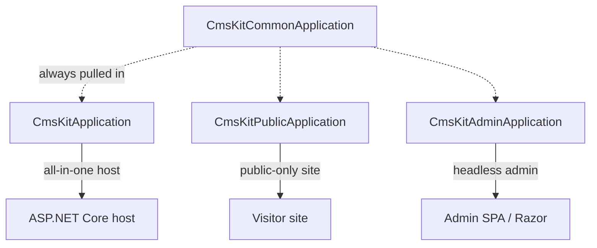
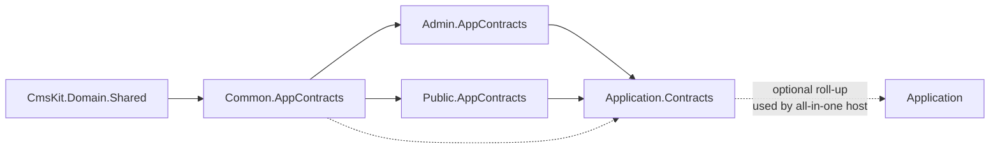

The top-level `Volo.CmsKit.Application` and `Volo.CmsKit.Application.Contracts` packages are *meta-modules*: they contain no AppServices of their own. Their entire job is to depend on the admin and public splits so a host project can reference one package and get everything.

## Files

```
Volo.CmsKit.Application/
└── Volo/CmsKit/CmsKitApplicationModule.cs

Volo.CmsKit.Application.Contracts/
└── Volo/CmsKit/CmsKitApplicationContractsModule.cs
```

Yes — *one file each*. The work is done by the `DependsOn` attributes.

## `CmsKitApplicationContractsModule`

```csharp
[DependsOn(
    typeof(CmsKitPublicApplicationContractsModule),
    typeof(CmsKitAdminApplicationContractsModule)
)]
public class CmsKitApplicationContractsModule : AbpModule { }
```

That single dependency line pulls in:

* **Public contracts** — `IBlogPostPublicAppService`, `ICommentPublicAppService`, `IReactionPublicAppService`, `IRatingPublicAppService`, `IPagePublicAppService`, `IMenuItemPublicAppService`, `IGlobalResourcePublicAppService`, plus all the public DTOs and `CmsKitPublicPermissions`.
* **Admin contracts** — `IBlogAdminAppService`, `IBlogPostAdminAppService`, `ICommentAdminAppService`, `IPageAdminAppService`, `IMenuItemAdminAppService`, `IGlobalResourceAdminAppService`, `IMediaDescriptorAdminAppService`, `IEntityTagAdminAppService`, `ITagAdminAppService`, `IBlogFeatureAdminAppService`, plus admin DTOs and `CmsKitAdminPermissions`.

Both of those transitively pull in `CmsKitCommonApplicationContractsModule` so you also get `IBlogFeatureAppService`, `ITagAppService`, `IMediaDescriptorAppService`, the `ContentFragment` system, `CmsUserDto`, `MenuItemDto`, `PageDto` (common variant), `PopularTagDto`, `CmsKitPermissions` and `CmsKitPermissionDefinitionProvider`.

## `CmsKitApplicationModule`

```csharp
[DependsOn(
    typeof(CmsKitPublicApplicationModule),
    typeof(CmsKitAdminApplicationModule),
    typeof(CmsKitApplicationContractsModule)
)]
public class CmsKitApplicationModule : AbpModule { }
```

Same pattern: depend on the two halves of the application split plus the contracts roll-up. Nothing else.

## When to reference which package



| Project shape | Reference |
| --- | --- |
| Single host running admin pages **and** the public site | `Volo.CmsKit.Application` |
| Public site only (no admin endpoints) | `Volo.CmsKit.Public.Application` |
| Admin-only (e.g. a back-office API host) | `Volo.CmsKit.Admin.Application` |
| Two separate API hosts (admin / public) | each side references its half |

The same logic applies to the `Application.Contracts` siblings — pick the one matching what the AppService implementation host needs to expose.

## Multi-host transitive references

A typical microservice-style decomposition has:

* `Admin.Host` → references `CmsKitAdminApplication`, `CmsKitAdminHttpApi`, `CmsKitAdminWeb`.
* `Public.Host` → references `CmsKitPublicApplication`, `CmsKitPublicHttpApi`, `CmsKitPublicWeb`.
* `Blazor.WebAssembly` client → references `CmsKitApplicationContracts` + `CmsKitHttpApiClient`, so it can call both halves through dynamic-HTTP-proxies.

When two physical hosts each own their half of CMS Kit, they must point at the same database (or replicas of the same logical data). The aggregates do **not** publish cross-side domain events — admin and public read/write the same EF Core / Mongo state directly.

## Mermaid: contracts module graph



## When you cannot use the roll-up

The roll-up is the right default. Two scenarios call for skipping it:

1. **Public-facing host without an admin UI.** Referencing the roll-up still ships the admin services *and* their permissions — exposing controllers under `api/cms-kit-admin/*` even if you never want them visible. Reference `Volo.CmsKit.Public.Application` only.
2. **Headless admin running in a separate service.** Mirror reason — reference `Volo.CmsKit.Admin.Application` only.

In both cases the static `[DependsOn]` graph means common contracts (Tags, BlogFeature, MediaDescriptor) come along whether you want them or not — that's by design because admin and public share those DTOs.

## Gotchas

* **`CmsKitApplicationModule` does not register an AutoMapper profile.** Each half (`CmsKitAdminApplicationModule`, `CmsKitPublicApplicationModule`, `CmsKitCommonApplicationModule`) registers its own. Referencing only the roll-up still pulls them in transitively — you don't need to call `AddMaps` yourself.
* **Adding new AppServices.** Do *not* add them here — pick admin, public, or common depending on the visibility. The roll-up is intentionally inert; touching it would couple unrelated changes.
* **Razor area collisions.** Admin endpoints live under `Area = "cmsKitAdmin"` (`CmsKitAdminRemoteServiceConsts.ModuleName`), public under `Area = "cmsKitPublic"`. Referencing the roll-up exposes *both* areas — make sure your `app.UseAuthorization()` policy actually protects the admin area.
* **CLI installer.** `abp add-module Volo.CmsKit` adds **the roll-up** by default. To opt into a split, pass `--add-on-to` with the specific layer you want; the CLI then references only the matching `Public.*` or `Admin.*` packages.

## Cross-links

* [Overview](/modules/cms-kit/overview)
* [Admin.Application](/modules/cms-kit/admin-application)
* [Public.Application](/modules/cms-kit/public-application)
* [Common.Application](/modules/cms-kit/common-application)
* [HttpApi roll-up](/modules/cms-kit/http-api) — the matching pattern at the HTTP layer.
* [Web roll-up](/modules/cms-kit/web) — the matching pattern at the Razor layer.
