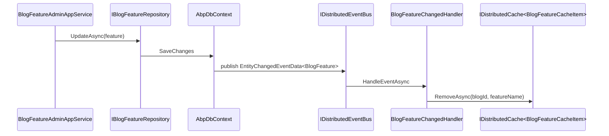
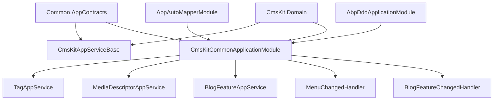

`Volo.CmsKit.Common.Application` carries the three AppServices that *both* the admin and public sides need to call, plus the distributed-event handlers that wire cross-cutting concerns together. Everything specific to one side lives in `Admin.Application` or `Public.Application`.

## File inventory

```
Volo.CmsKit.Common.Application/Volo/CmsKit/
├── CmsKitAppServiceBase.cs
├── CmsKitCommonApplicationAutoMapperProfile.cs
├── CmsKitCommonApplicationModule.cs
├── Blogs/
│   ├── BlogFeatureAppService.cs
│   └── BlogFeatureChangedHandler.cs
├── MediaDescriptors/MediaDescriptorAppService.cs
├── Menus/
│   ├── MenuApplicationConsts.cs
│   └── MenuChangedHandler.cs
└── Tags/TagAppService.cs
```

## Module wiring

```csharp
[DependsOn(
    typeof(CmsKitCommonApplicationContractsModule),
    typeof(CmsKitDomainModule),
    typeof(AbpDddApplicationModule),
    typeof(AbpAutoMapperModule)
)]
public class CmsKitCommonApplicationModule : AbpModule
{
    public override void ConfigureServices(ServiceConfigurationContext context)
    {
        Configure<AbpAutoMapperOptions>(options =>
        {
            options.AddMaps<CmsKitCommonApplicationModule>(validate: true);
        });
    }
}
```

The `validate: true` flag forces AutoMapper to verify every map at startup — if a property in a `Volo.CmsKit.Common.Application` DTO doesn't have a source mapping, the app fails to boot.

## `CmsKitAppServiceBase`

The base class every CMS Kit AppService inherits, on every side. It sets `LocalizationResource = typeof(CmsKitResource)` so `L["…"]` returns CMS Kit strings out of the box.

## `TagAppService` — `ITagAppService`

A thin wrapper over `ITagRepository` exposed *publicly* (no `[Authorize]`):

```csharp
public class TagAppService : CmsKitAppServiceBase, ITagAppService
{
    protected ITagRepository TagRepository { get; }

    public virtual async Task<List<TagDto>> GetAllRelatedTagsAsync(
        string entityType, string entityId)
    {
        var entities = await TagRepository
            .GetAllRelatedTagsAsync(entityType, entityId);
        return ObjectMapper.Map<List<Tag>, List<TagDto>>(entities);
    }

    public virtual async Task<List<PopularTagDto>> GetPopularTagsAsync(
        string entityType, int maxCount)
    {
        return ObjectMapper.Map<List<PopularTag>, List<PopularTagDto>>(
            await TagRepository.GetPopularTagsAsync(entityType, maxCount));
    }
}
```

These two methods power the public tag widgets (`PopularTagsViewComponent`, `TagViewComponent`) and the admin tag editor inside the blog-post create page. Because the service is shared, both sides can call it — but the *admin* side also needs `TagAdminAppService` (in `Admin.Application`) to create / update / delete tags.

## `MediaDescriptorAppService` — `IMediaDescriptorAppService`

```csharp
[RequiresGlobalFeature(typeof(MediaFeature))]
public class MediaDescriptorAppService : CmsKitAppServiceBase, IMediaDescriptorAppService
{
    protected IMediaDescriptorRepository MediaDescriptorRepository { get; }
    protected IBlobContainer<MediaContainer>    MediaContainer { get; }

    public virtual async Task<RemoteStreamContent> DownloadAsync(Guid id)
    {
        var entity = await MediaDescriptorRepository.GetAsync(id);
        var stream = await MediaContainer.GetAsync(id.ToString());

        return new RemoteStreamContent(stream, entity.Name, entity.MimeType);
    }
}
```

The single `DownloadAsync` is reached from both sides. The mapping between `MediaDescriptor.Id` (Guid) and the BLOB key (`id.ToString()`) is the cornerstone of the contract — the descriptor row and the BLOB object are joined by GUID-as-string.

The actual BLOB lives in `IBlobContainer<MediaContainer>`. By default the [`BlobStoringDatabase`](/modules/blob-storing-database/overview) provider catches it, so the bytes end up in `AbpBlobs` under the `cms-kit-media` container. Configure another provider:

```csharp
Configure<AbpBlobStoringOptions>(options =>
{
    options.Containers.Configure<MediaContainer>(c =>
        c.UseAws(aws => { /* … */ }));
});
```

`RemoteStreamContent` is the framework's wrapper for `application/octet-stream`-style downloads — it carries `(stream, fileName, contentType)` and is auto-handled by the framework's `RemoteStreamContent` controller filter so the response sets `Content-Disposition: attachment; filename=…`.

## `BlogFeatureAppService` — `IBlogFeatureAppService`

```csharp
[RequiresGlobalFeature(typeof(BlogsFeature))]
public class BlogFeatureAppService : CmsKitAppServiceBase, IBlogFeatureAppService
{
    protected virtual IBlogFeatureRepository BlogFeatureRepository { get; }
    protected virtual IDistributedCache<BlogFeatureCacheItem, BlogFeatureCacheKey> Cache { get; }

    public virtual async Task<BlogFeatureDto> GetOrDefaultAsync(Guid blogId, string featureName)
    {
        var cacheItem = await Cache.GetOrAddAsync(
            new BlogFeatureCacheKey(blogId, featureName),
            () => GetOrDefaultFromRepositoryAsync(blogId, featureName));

        return ObjectMapper.Map<BlogFeatureCacheItem, BlogFeatureDto>(cacheItem);
    }

    protected virtual async Task<BlogFeatureCacheItem> GetOrDefaultFromRepositoryAsync(
        Guid blogId, string featureName)
    {
        var feature = await BlogFeatureRepository.FindAsync(blogId, featureName);
        var blogFeature = feature ?? new BlogFeature(blogId, featureName);

        return ObjectMapper.Map<BlogFeature, BlogFeatureCacheItem>(blogFeature);
    }
}
```

The per-blog feature toggle is cached *aggressively* via `IDistributedCache<BlogFeatureCacheItem, BlogFeatureCacheKey>` because public pages query it on every read — "is the blog open for comments?", "are reactions enabled?", etc. Hitting the database on every page render would be expensive.

The cache is invalidated by `BlogFeatureChangedHandler`:

```csharp
public class BlogFeatureChangedHandler :
    IDistributedEventHandler<EntityChangedEventData<BlogFeature>>,
    ITransientDependency
{
    protected IDistributedCache<BlogFeatureCacheItem, BlogFeatureCacheKey> Cache { get; }

    public virtual async Task HandleEventAsync(EntityChangedEventData<BlogFeature> eventData)
    {
        await Cache.RemoveAsync(new BlogFeatureCacheKey(
            eventData.Entity.BlogId, eventData.Entity.FeatureName));
    }
}
```

`EntityChangedEventData<BlogFeature>` is published automatically by `AbpDbContext` whenever a `BlogFeature` is inserted/updated/deleted, so changes from the admin UI invalidate the cache without explicit code.



## `MenuChangedHandler` — keep menu items synced with pages

```csharp
public static class MenuApplicationConsts
{
    public const string MenuItemCacheKey = "MenuItem";
}
```

`MenuChangedHandler` watches `EntityUpdatedEventData<Page>` and rewrites every `MenuItem` whose `PageId == page.Id`:

```csharp
public class MenuChangedHandler
    : IDistributedEventHandler<EntityUpdatedEventData<Page>>,
      ITransientDependency
{
    public virtual async Task HandleEventAsync(EntityUpdatedEventData<Page> eventData)
    {
        var menuItems = await MenuItemRepository.GetListByPageIdAsync(eventData.Entity.Id);
        foreach (var item in menuItems)
        {
            item.SetUrl(PageConsts.UrlPrefix + eventData.Entity.Slug);
        }
        await MenuItemRepository.UpdateManyAsync(menuItems);
    }
}
```

That solves a classic CMS problem: rename a page slug from `/about` to `/about-us` and every menu link that pointed at it follows automatically. The aggregate side stores `PageId`; the URL is just a denormalised cache.

## AutoMapper profile

The common profile registers the bidirectional maps both halves need:

* `Tag → TagDto`
* `PopularTag → PopularTagDto`
* `BlogFeature → BlogFeatureCacheItem → BlogFeatureDto`
* `MenuItem → MenuItemDto`
* `MediaDescriptor → MediaDescriptorDto`
* `CmsUser → CmsUserDto`
* `Page → PageDto` (content-fragment variant)

It is validated at startup (`validate: true`); missing source properties throw `AutoMapperConfigurationException`.

## Permission set

The shared `CmsKitPermissions` (defined in `Common.Application.Contracts`) currently exposes only the group name:

```csharp
public static class CmsKitPermissions
{
    public const string GroupName = "CmsKit";
}
```

The per-feature permission constants live in `CmsKitAdminPermissions` and `CmsKitPublicPermissions`. The group name is shared so the permission-management UI groups all CMS Kit permissions together.

## Module dependency tree



## Gotchas

* **`MediaDescriptor.Id.ToString()` is the BLOB key.** Don't shorten it, don't strip dashes. The container expects the canonical `D` format.
* **`MediaDescriptorAppService.DownloadAsync` doesn't check ownership.** Any authenticated user (or any user, if the controller allows anonymous) can pull any media by Guid. If you need access control, wrap the AppService or use the admin variant which is `[Authorize]`d.
* **`BlogFeatureAppService` caches indefinitely.** The cache item has no TTL set explicitly; the framework default kicks in (`AbpDistributedCacheOptions.CacheItemMaxAge`). Tune via `Configure<DistributedCacheEntryOptions>` for `BlogFeatureCacheItem`.
* **`BlogFeatureChangedHandler` invalidates by `(BlogId, FeatureName)`.** A "delete-all-features" operation results in many separate cache evictions — fine for a handful of toggles, but watch out if you script it.
* **Menu sync is *page-update-only*.** Deleting a page does not auto-clear menu items that reference it; you'll be left with a broken link. Handle via your own `EntityDeletedEventData<Page>` if you need to.
* **`CmsKitAppServiceBase` does not call `LocalizationResource =`.** The class chain (`CmsKitAppServiceBase → ApplicationService`) sets it via the standard `LocalizationResource` property override.

## Cross-links

* [Domain](/modules/cms-kit/domain) — entities and managers consumed here.
* [Admin.Application](/modules/cms-kit/admin-application) / [Public.Application](/modules/cms-kit/public-application) — the sides this layer feeds.
* [Blob Storing Database](/modules/blob-storing-database/overview) — default backend for `MediaContainer`.
* [Volo.Abp.Caching](/framework/caching/intro) — `IDistributedCache<TItem, TKey>`.
