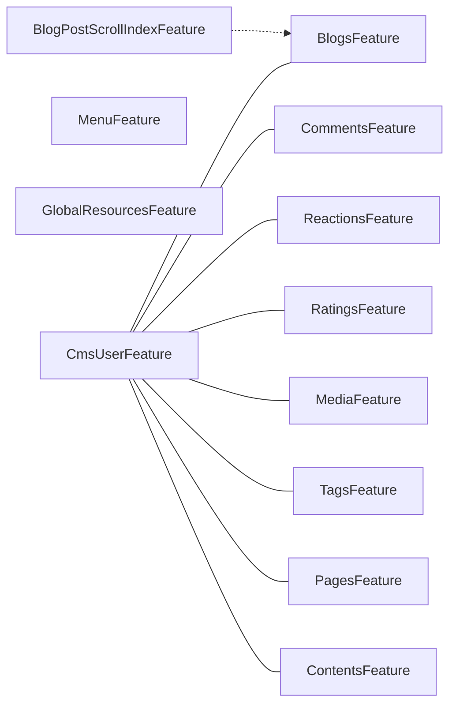

`Volo.CmsKit.Domain.Shared` is the *smallest* CMS Kit package: pure constants, enums, attributes, and the feature-toggle classes. No business logic lives here, but everything else in the kit references it. It is the natural starting point for understanding the moving parts.

## Layout

```
Volo.CmsKit.Domain.Shared/Volo/
├── Abp
│   ├── GlobalFeatures/GlobalModuleFeaturesDictionaryCmsKitExtensions.cs
│   └── ObjectExtending/
│       ├── CmsKitModuleExtensionConfiguration.cs
│       ├── CmsKitModuleExtensionConfigurationDictionaryExtensions.cs
│       └── CmsKitModuleExtensionConsts.cs
└── CmsKit
    ├── CmsKitDomainSharedModule.cs
    ├── CmsKitErrorCodes.cs
    ├── EntityTypeDefinition.cs
    ├── Blogs/                  (BlogConsts, BlogPostConsts, BlogPostStatus, BlogFeatureConsts)
    ├── Comments/               (CommentConsts, CommentEntityTypeDefinition, CmsKitCommentOptions)
    ├── Entities/               (CmsEntityConsts)
    ├── Features/               (CmsKitFeatures, CmsKitFeatureDefinitionProvider)
    ├── GlobalFeatures/         (GlobalCmsKitFeatures + 11 feature classes)
    ├── GlobalResources/        (GlobalResourceConsts)
    ├── Localization/           (CmsKitResource + embedded JSONs)
    ├── MediaDescriptors/       (MediaDescriptorConsts)
    ├── Menus/                  (MenuConsts, MenuItemConsts)
    ├── Pages/                  (PageConsts)
    ├── Ratings/                (RatingConsts)
    ├── Reactions/              (StandardReactions, UserReactionConsts)
    └── Tags/                   (TagConsts)
```

## Module wiring

```csharp
[DependsOn(
    typeof(AbpValidationModule),
    typeof(AbpGlobalFeaturesModule),
    typeof(AbpFeaturesModule)
)]
public class CmsKitDomainSharedModule : AbpModule
{
    public override void ConfigureServices(ServiceConfigurationContext context)
    {
        Configure<AbpVirtualFileSystemOptions>(options =>
        {
            options.FileSets.AddEmbedded<CmsKitDomainSharedModule>();
        });

        Configure<AbpLocalizationOptions>(options =>
        {
            options.Resources
                .Add<CmsKitResource>("en")
                .AddBaseTypes(typeof(AbpValidationResource))
                .AddVirtualJson("Volo/CmsKit/Localization/Resources");
        });

        Configure<AbpExceptionLocalizationOptions>(options =>
        {
            options.MapCodeNamespace("CmsKit", typeof(CmsKitResource));
        });
    }
}
```

Three things land here: a virtual file set for the embedded localization JSONs, the `CmsKitResource` registration (with `AbpValidationResource` as a base type so messages like `[Required]` resolve), and the mapping `CmsKit:* → CmsKitResource` so any `BusinessException("CmsKit:Tag:0001")` gets translated.

## Length constants

Every aggregate has a corresponding `…Consts` class. They're `static` properties so consuming applications can override them at startup.

| Entity / concept | Constant | Default |
| --- | --- | --- |
| All CMS Kit entity ids | `CmsEntityConsts.MaxEntityIdLength` | 64 |
| All CMS Kit entity type strings | `CmsEntityConsts.MaxEntityTypeLength` | 64 |
| `Blog.Name` / `Slug` | `BlogConsts.MaxNameLength` / `MaxSlugLength` | 64 / 64 |
| `BlogPost.Title` | `BlogPostConsts.MaxTitleLength` | 64 |
| `BlogPost.Slug` | `BlogPostConsts.MaxSlugLength` / `MinSlugLength` | 256 / 2 |
| `BlogPost.ShortDescription` / `Content` | `BlogPostConsts.MaxShortDescriptionLength` / `MaxContentLength` | 256 / `int.MaxValue` |
| `BlogPost.EntityType` | `BlogPostConsts.EntityType` | `"BlogPost"` |
| `BlogFeature.FeatureName` | `BlogFeatureConsts.MaxFeatureNameLenth` | 64 |
| `Page.Title` / `Slug` | `PageConsts.MaxTitleLength` / `MaxSlugLength` | 256 / 256 |
| `Page.Content` / `Script` / `Style` | `PageConsts.MaxContentLength` / `MaxScriptLength` / `MaxStyleLength` | `int.MaxValue` each |
| `Page.EntityType` | `PageConsts.EntityType` | `"Page"` |
| Page URL prefix | `PageConsts.UrlPrefix` | `"/"` |
| Default home-page cache key | `PageConsts.DefaultHomePageCacheKey` | `"DefaultHomePage"` |
| `Comment.Text` | `CommentConsts.MaxTextLength` | 512 |
| `Comment.Url` | `CommentConsts.MaxUrlLength` | 512 |
| `Comment.EntityType` | `CommentConsts.EntityType` | `"Comment"` |
| `Tag.Name` | `TagConsts.MaxNameLength` | 32 |
| `Rating.StarCount` | `RatingConsts.MinStarCount` / `MaxStarCount` | 1 / 5 |
| `UserReaction.ReactionName` | `UserReactionConsts.MaxReactionNameLength` | 32 |
| `MediaDescriptor.Name` / `MimeType` | `MediaDescriptorConsts.MaxNameLength` / `MaxMimeTypeLength` | 255 / 128 |
| `MenuItem.DisplayName` / `Url` | `MenuItemConsts.MaxDisplayNameLength` / `MaxUrlLength` | 64 / 1024 |
| `GlobalResource.Name` / `Value` | `GlobalResourceConsts.MaxNameLength` / `MaxValueLength` | 128 / `int.MaxValue` |
| Reserved global-resource keys | `GlobalResourceConsts.GlobalStyleName` / `GlobalScriptName` | `"GlobalStyle"` / `"GlobalScript"` |

Override examples:

```csharp
public override void PreConfigureServices(ServiceConfigurationContext context)
{
    BlogPostConsts.MaxTitleLength = 200;
    CommentConsts.MaxTextLength    = 4000;
}
```

Set these before the EF Core model builder runs (i.e. before `OnModelCreating`). Otherwise the column was already sized.

## `BlogPostStatus`

```csharp
public enum BlogPostStatus { Draft, Published, WaitingForReview }
```

Used by `BlogPost.SetDraft()`, `SetPublished()`, `SetWaitingForReview()` on the domain entity and surfaced through the admin AppService's `Publish` permission gate.

## `StandardReactions`

Twelve built-in reaction codes used by `ReactionDefinition` in the `Volo.CmsKit.Domain` module wiring:

```csharp
public static class StandardReactions
{
    public const string Smile       = "_SM";
    public const string ThumbsUp    = "_TU";
    public const string ThumbsDown  = "_TD";
    public const string Confused    = "_CF";
    public const string Eyes        = "_EY";
    public const string Heart       = "_HE";
    public const string HeartBroken = "_HB";
    public const string Wink        = "_WI";
    public const string Pray        = "_PR";
    public const string Rocket      = "_RO";
    public const string Victory     = "_VI";
    public const string Rock        = "_RC";
}
```

The two-character `_XX` codes minimise the storage in `UserReaction.ReactionName` while leaving the *display* up to localisation (icon picked by the view component based on the code).

## `EntityTypeDefinition`

The base class for the seven *taggable* / *commentable* / *ratable* / *reactable* / *media-holding* entity-type registrations:

```csharp
public abstract class EntityTypeDefinition : IEquatable<EntityTypeDefinition>
{
    public EntityTypeDefinition([NotNull] string entityType)
    {
        EntityType = Check.NotNullOrEmpty(entityType, nameof(entityType));
    }

    [NotNull] public string EntityType { get; protected set; }

    public bool Equals(EntityTypeDefinition other) =>
        EntityType == other?.EntityType;
}
```

Derived types live in [Domain](/modules/cms-kit/domain):

* `CommentEntityTypeDefinition` (Domain.Shared) — also takes the comment type.
* `RatingEntityTypeDefinition`, `ReactionEntityTypeDefinition`, `TagEntityTypeDefiniton` *(note typo in source)*, `MediaDescriptorDefinition` (Domain).

To allow comments on your own `Product`, register in your host module:

```csharp
Configure<CmsKitCommentOptions>(options =>
{
    options.EntityTypes.Add(new CommentEntityTypeDefinition("Product"));
});
```

Forget that and `CommentManager.CreateAsync` throws `EntityNotCommentableException`.

## Global feature classes

Eleven classes in `Volo/CmsKit/GlobalFeatures/`, all decorated with `[GlobalFeatureName("CmsKit.<Name>")]`. They're aggregated under `GlobalCmsKitFeatures`:

```csharp
public class GlobalCmsKitFeatures : GlobalModuleFeatures
{
    public const string ModuleName = "CmsKit";

    public ReactionsFeature   Reactions        => GetFeature<ReactionsFeature>();
    public CommentsFeature    Comments         => GetFeature<CommentsFeature>();
    public MediaFeature       Media            => GetFeature<MediaFeature>();
    public RatingsFeature     Ratings          => GetFeature<RatingsFeature>();
    public TagsFeature        Tags             => GetFeature<TagsFeature>();
    public PagesFeature       Pages            => GetFeature<PagesFeature>();
    public BlogsFeature       Blogs            => GetFeature<BlogsFeature>();
    public CmsUserFeature     User             => GetFeature<CmsUserFeature>();
    public MenuFeature        Menu             => GetFeature<MenuFeature>();
    public GlobalResourcesFeature GlobalResources     => GetFeature<GlobalResourcesFeature>();
    public BlogPostScrollIndexFeature BlogPostScrollIndex => GetFeature<BlogPostScrollIndexFeature>();
    // ContentsFeature also exists for content widgets.
}
```

The dictionary extension makes the usage ergonomic:

```csharp
GlobalFeatureManager.Instance.Modules.CmsKit(cmsKit =>
{
    cmsKit.Blogs.Enable();
    cmsKit.Tags.Enable();
    cmsKit.Comments.Enable();        // also enables User
    cmsKit.Reactions.Enable();       // also enables User
    cmsKit.GlobalResources.Enable();
});
```

`Enable()` overrides on **CommentsFeature, ReactionsFeature, RatingsFeature, MediaFeature, TagsFeature, PagesFeature, ContentsFeature** all force-enable `CmsUserFeature` first — which is why the `[NotNull] internal CmsUserFeature(GlobalModuleFeatures module)` constructor explicitly says "Do not disable this manually".



## Runtime features (`CmsKitFeatures`)

`CmsKitFeatureDefinitionProvider` adds a tenant-level toggle for every globally-enabled feature:

```csharp
public static class CmsKitFeatures
{
    public const string GroupName = "CmsKit";

    public const string BlogEnable           = GroupName + ".BlogEnable";
    public const string CommentEnable        = GroupName + ".CommentEnable";
    public const string GlobalResourceEnable = GroupName + ".GlobalResourceEnable";
    public const string MenuEnable           = GroupName + ".MenuEnable";
    public const string PageEnable           = GroupName + ".PageEnable";
    public const string RatingEnable         = GroupName + ".RatingEnable";
    public const string ReactionEnable       = GroupName + ".ReactionEnable";
    public const string TagEnable            = GroupName + ".TagEnable";
}
```

The provider only contributes a definition when the matching `GlobalFeature` is enabled, so tenants never see a toggle for a feature you've globally disabled.

This is what AppServices guard against — every AppService method body of any consequence carries both attributes:

```csharp
[RequiresFeature(CmsKitFeatures.CommentEnable)]
[RequiresGlobalFeature(typeof(CommentsFeature))]
public class CommentPublicAppService : CmsKitPublicAppServiceBase, ICommentPublicAppService { … }
```

## Error codes

`CmsKitErrorCodes` is a flat list of stable strings used by exception types. Map any of these to a tenant-visible message via the standard ABP localisation pipeline (the `CmsKitDomainSharedModule` already maps the `"CmsKit"` namespace).

```csharp
public static class CmsKitErrorCodes
{
    public static class Tags
    {
        public const string TagAlreadyExist     = "CmsKit:Tag:0001";
        public const string EntityNotTaggable   = "CmsKit:Tag:0002";
    }
    public static class Pages
    {
        public const string SlugAlreadyExist    = "CmsKit:Page:0001";
        public const string MultipleHomePage    = "CmsKit:Page:0002";
    }
    public static class Ratings    { public const string EntityCantHaveRating   = "CmsKit:Rating:0001"; }
    public static class Reactions  { public const string EntityCantHaveReaction = "CmsKit:Reaction:0001"; }
    public static class Blogs      { public const string SlugAlreadyExists      = "CmsKit:Blog:0001"; }
    public static class BlogPosts  { public const string SlugAlreadyExist       = "CmsKit:BlogPost:0001"; }
    public static class Comments   { public const string EntityNotCommentable   = "CmsKit:Comments:0001"; }
    public static class MediaDescriptors
    {
        public const string InvalidName             = "CmsKit:Media:0001";
        public const string EntityTypeDoesntExist   = "CmsKit:Media:0002";
    }
}
```

Each is thrown by a corresponding exception in `Volo.CmsKit.Domain` (e.g. `TagAlreadyExistException`, `BlogPostSlugAlreadyExistException`, `EntityCantHaveRatingException`, …).

## Object-extension constants

`CmsKitModuleExtensionConsts` declares the module name and the entity names used by `ObjectExtensionManager`:

```csharp
public static class CmsKitModuleExtensionConsts
{
    public const string ModuleName = "CmsKit";

    public static class EntityNames
    {
        public const string Blog            = "Blog";
        public const string BlogPost        = "BlogPost";
        public const string BlogFeature     = "BlogFeature";
        public const string MediaDescriptor = "MediaDescriptor";
        public const string Page            = "Page";
        public const string Tag             = "Tag";
        public const string Comment         = "Comment";
        public const string MenuItem        = "MenuItem";
        public const string CmsUser         = "CmsUser";
        public const string GlobalResource  = "GlobalResource";
    }
}
```

`CmsKitDomainModule.PostConfigureServices` then calls `ModuleExtensionConfigurationHelper.ApplyEntityConfigurationToEntity` for each of those — see the [Domain](/modules/cms-kit/domain) page.

## Localisation

`CmsKitResource` is the marker class loaded by `Configure<AbpLocalizationOptions>` above. The embedded JSON lives at `Volo/CmsKit/Localization/Resources/*.json`. All Razor Pages, view components, and AppService validation messages use it.

## Gotchas

* **`UserReactionConsts.MaxReactionNameLength = 32`.** `StandardReactions` codes are three chars, so you have plenty of room for custom names. Going above 32 requires resizing.
* **`CmsKitFeatures` only defines toggles for globally-enabled features.** If you forgot to enable, say, `RatingsFeature` globally, the tenant toggle never appears in the admin UI — and that is by design.
* **Constants are mutable static.** Set them in `PreConfigureServices` of your *startup* module before any of the model builders run; otherwise the column was already sized.
* **`BlogPostConsts.MinSlugLength = 2`** — a one-letter slug is rejected. Easy to miss until QA hands you `"x"`.
* **Typo: `TagEntityTypeDefiniton`.** The class name is genuinely missing the second `i`. If you grep for `TagEntityTypeDefinition` you'll come up empty.
* **`PageConsts.UrlPrefix` is mutable** and applied via `EnsureStartsWith('/').EnsureEndsWith('/')`. If you serve pages under `/cms/` instead of `/`, set this before the menu integration runs.

## Cross-links

* [Overview](/modules/cms-kit/overview)
* [Domain](/modules/cms-kit/domain) — where the constants become entity constraints.
* [EF Core](/modules/cms-kit/efcore) / [MongoDB](/modules/cms-kit/mongodb) — where the toggles gate table / collection creation.
* [Framework Global Features](/framework/global-features/intro)
* [Framework Features](/modules/feature-management/overview)
