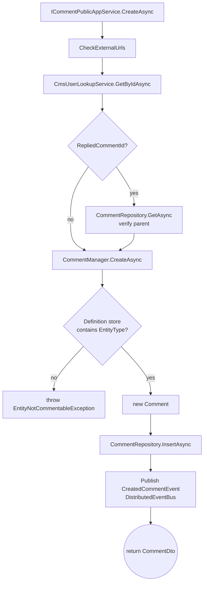

`Volo.CmsKit.Domain` is where the business invariants live. Every feature follows the same recipe: an aggregate root + a `DomainService` *Manager* + an `IXxxRepository` contract + (for entity-typed features) an options class and a definition store. This page walks each feature in turn so you can find the surface area you need quickly.

## Module wiring

```csharp
[DependsOn(
    typeof(CmsKitDomainSharedModule),
    typeof(AbpUsersDomainModule),
    typeof(AbpDddDomainModule),
    typeof(AbpBlobStoringModule)
)]
public class CmsKitDomainModule : AbpModule
{
    public override void ConfigureServices(ServiceConfigurationContext context)
    {
        if (GlobalFeatureManager.Instance.IsEnabled<ReactionsFeature>())
        {
            Configure<CmsKitReactionOptions>(options =>
            {
                if (GlobalFeatureManager.Instance.IsEnabled<BlogsFeature>())
                {
                    options.EntityTypes.Add(new ReactionEntityTypeDefinition(
                        BlogPostConsts.EntityType,
                        reactions: new[]
                        {
                            new ReactionDefinition(StandardReactions.Smile),
                            new ReactionDefinition(StandardReactions.ThumbsUp),
                            new ReactionDefinition(StandardReactions.ThumbsDown),
                            new ReactionDefinition(StandardReactions.Confused),
                            new ReactionDefinition(StandardReactions.Eyes),
                            new ReactionDefinition(StandardReactions.Heart),
                            new ReactionDefinition(StandardReactions.HeartBroken),
                            new ReactionDefinition(StandardReactions.Wink),
                            new ReactionDefinition(StandardReactions.Pray),
                            new ReactionDefinition(StandardReactions.Rocket),
                            new ReactionDefinition(StandardReactions.Victory),
                            new ReactionDefinition(StandardReactions.Rock),
                        }));
                }

                if (GlobalFeatureManager.Instance.IsEnabled<CommentsFeature>())
                {
                    options.EntityTypes.Add(new ReactionEntityTypeDefinition(
                        CommentConsts.EntityType,
                        reactions: new[]
                        {
                            new ReactionDefinition(StandardReactions.ThumbsUp),
                            new ReactionDefinition(StandardReactions.ThumbsDown),
                        }));
                }
            });
        }

        if (GlobalFeatureManager.Instance.IsEnabled<RatingsFeature>())
        {
            Configure<CmsKitRatingOptions>(options =>
            {
                if (GlobalFeatureManager.Instance.IsEnabled<BlogsFeature>())
                {
                    options.EntityTypes.Add(new RatingEntityTypeDefinition(
                        BlogPostConsts.EntityType));
                }
            });
        }
    }

    public override void PostConfigureServices(ServiceConfigurationContext context)
    {
        OneTimeRunner.Run(() =>
        {
            ModuleExtensionConfigurationHelper.ApplyEntityConfigurationToEntity(
                CmsKitModuleExtensionConsts.ModuleName,
                CmsKitModuleExtensionConsts.EntityNames.Blog, typeof(Blog));
            // …same for BlogPost, BlogFeature, MediaDescriptor, Page,
            //   Tag, Comment, MenuItem, CmsUser
        });
    }
}
```

Two important behaviours:

* **Default reactions** are wired *here*, not in seed data. Enable `BlogsFeature` and `ReactionsFeature` together and BlogPost gets twelve reactions; enable `CommentsFeature` too and Comment gets thumbs-up/down.
* **Object-extension propagation** happens in `PostConfigureServices`. Properties you registered in the host module via `ObjectExtensionManager.Instance.AddOrUpdateProperty<…>` are mirrored onto these entity types so EF Core knows to serialise them into the `ExtraProperties` column.

## Blogs

### `Blog`

```csharp
public class Blog : FullAuditedAggregateRoot<Guid>, IMultiTenant
{
    [NotNull] public virtual string Name  { get; protected set; }
    [NotNull] public virtual string Slug  { get; protected set; }
    public virtual Guid? TenantId { get; protected set; }

    public virtual void SetSlug(string slug)
    {
        Check.NotNullOrWhiteSpace(slug, nameof(slug), BlogConsts.MaxNameLength);
        Slug = SlugNormalizer.Normalize(slug);
    }
}
```

`SlugNormalizer` lowercases, unidecodes and hyphenates via the `Slugify` + `Unidecode.NET` packages — so `SetSlug("Hello World!")` stores `"hello-world"`.

### `BlogPost`

`FullAuditedAggregateRoot<Guid>`, multi-tenant, `IHasEntityVersion` (optimistic concurrency).

```csharp
public class BlogPost : FullAuditedAggregateRoot<Guid>, IMultiTenant, IHasEntityVersion
{
    public virtual Guid   BlogId            { get; protected set; }
    [NotNull] public virtual string Title            { get; protected set; }
    [NotNull] public virtual string Slug             { get; protected set; }
    [NotNull] public virtual string ShortDescription { get; protected set; }
    public virtual string Content { get; protected set; }
    public Guid?  CoverImageMediaId { get; set; }
    public virtual Guid?  TenantId  { get; protected set; }
    public Guid   AuthorId          { get; set; }
    public virtual CmsUser Author    { get; set; }
    public virtual BlogPostStatus Status { get; set; }
    public virtual int    EntityVersion    { get; protected set; }

    public virtual void SetDraft()            => Status = BlogPostStatus.Draft;
    public virtual void SetPublished()        => Status = BlogPostStatus.Published;
    public virtual void SetWaitingForReview() => Status = BlogPostStatus.WaitingForReview;
}
```

The `CoverImageMediaId` is a `MediaDescriptor.Id` — the actual bytes live in BLOB storage.

### Domain services

```csharp
public class BlogManager : DomainService
{
    public virtual async Task<Blog> CreateAsync(string name, string slug)
    {
        await CheckSlugAsync(slug);
        return new Blog(GuidGenerator.Create(), name, slug, CurrentTenant.Id);
    }
    // UpdateAsync / CheckSlugAsync …
}

public class BlogPostManager : DomainService
{
    public virtual async Task<BlogPost> CreateAsync(
        CmsUser author, Blog blog, string title, string slug, BlogPostStatus status,
        string shortDescription = null, string content = null, Guid? coverImageMediaId = null)
    {
        var blogPost = new BlogPost(GuidGenerator.Create(), blog.Id, author.Id,
            title, slug, shortDescription, content, coverImageMediaId,
            CurrentTenant.Id, status);

        await CheckSlugExistenceAsync(blog.Id, blogPost.Slug);
        return blogPost;
    }

    public virtual async Task SetSlugUrlAsync(BlogPost blogPost, string newSlug)
    {
        await CheckSlugExistenceAsync(blogPost.BlogId, newSlug);
        blogPost.SetSlug(newSlug);
    }
}
```

`BlogPostSlugAlreadyExistException` (error code `CmsKit:BlogPost:0001`) is thrown when a slug collides within the same blog — slugs are unique *per blog*, not globally.

### `BlogFeature`

A per-blog toggle table. `IDefaultBlogFeatureProvider` supplies the defaults, `BlogFeatureManager.SetDefaultsAsync(blogId)` is invoked from `BlogAdminAppService.CreateAsync` so every new blog starts with the seeded toggles.

### Repository

```csharp
public interface IBlogPostRepository : IBasicRepository<BlogPost, Guid>
{
    Task<List<BlogPost>> GetListAsync(string filter = null, Guid? blogId = null,
        Guid? authorId = null, Guid? tagId = null, BlogPostStatus? statusFilter = null,
        int maxResultCount = int.MaxValue, int skipCount = 0, string sorting = null,
        CancellationToken cancellationToken = default);

    Task<bool>     SlugExistsAsync(Guid blogId, string slug, …);
    Task<BlogPost> GetBySlugAsync(Guid blogId, string slug, …);

    Task<List<CmsUser>> GetAuthorsHasBlogPostsAsync(
        int skipCount, int maxResultCount, string sorting, string filter, …);
    Task<int>           GetAuthorsHasBlogPostsCountAsync(string filter, …);
    Task<CmsUser>       GetAuthorHasBlogPostAsync(Guid id, …);

    Task<bool> HasBlogPostWaitingForReviewAsync(…);
}
```

`HasBlogPostWaitingForReviewAsync` powers the "pending review" notification in the admin UI.

## Pages

```csharp
public class Page : FullAuditedAggregateRoot<Guid>, IMultiTenant, IHasEntityVersion
{
    public virtual string Title   { get; protected set; }
    public virtual string Slug    { get; protected set; }
    public virtual string Content { get; protected set; }
    public virtual string Script  { get; protected set; }
    public virtual string Style   { get; protected set; }
    public virtual bool   IsHomePage    { get; protected set; }
    public virtual int    EntityVersion { get; protected set; }

    internal virtual void SetSlug(string slug) =>
        Slug = SlugNormalizer.Normalize(Check.NotNullOrEmpty(slug, nameof(slug), PageConsts.MaxSlugLength));

    internal void SetIsHomePage(bool isHomePage) => IsHomePage = isHomePage;
}
```

`Script` and `Style` are *unlimited* by default — a `Page` can carry a full inline `<style>` block and a custom JS. The admin UI renders these into the public page layout.

`PageManager.SetHomePageAsync(page)` enforces the single-home invariant:

```csharp
public virtual async Task SetHomePageAsync(Page page)
{
    var homePage = await GetHomePageAsync();
    if (!page.IsHomePage)
    {
        if (homePage != null)
        {
            homePage.SetIsHomePage(false);
            await PageRepository.UpdateAsync(homePage);
        }
        homePage = await PageRepository.GetAsync(page.Id);
    }
    homePage.SetIsHomePage(!page.IsHomePage);
    await PageRepository.UpdateAsync(homePage);
}
```

If two rows ever have `IsHomePage = true`, `GetHomePageAsync` throws `BusinessException("There can be only one home page.")` — the row-uniqueness is *not* enforced by the DB; it's a soft invariant.

A `PageChangedHandler` (a `IDistributedEventHandler<EntityChangedEventData<Page>>`) keeps `MenuItem.Url` in sync when a page slug changes — see [Menus](#menus).

## Comments

```csharp
public class Comment : AggregateRoot<Guid>, IHasCreationTime, IMustHaveCreator, IMultiTenant
{
    public virtual string EntityType        { get; protected set; }
    public virtual string EntityId          { get; protected set; }
    public virtual string Text              { get; protected set; }
    public virtual Guid?  RepliedCommentId  { get; protected set; }
    public virtual Guid   CreatorId         { get; set; }
    public virtual DateTime CreationTime    { get; set; }
    public virtual string Url               { get; set; }
}
```

A `Comment` is polymorphic — `(EntityType, EntityId)` references *any* entity registered through `CmsKitCommentOptions`. Threading is a self-referencing `RepliedCommentId`.

`CommentManager.CreateAsync` validates the entity type:

```csharp
public virtual async Task<Comment> CreateAsync(CmsUser creator, string entityType,
    string entityId, string text, string url = null, Guid? repliedCommentId = null)
{
    if (!await DefinitionStore.IsDefinedAsync(entityType))
    {
        throw new EntityNotCommentableException(entityType);
    }

    return new Comment(GuidGenerator.Create(), entityType, entityId, text,
        repliedCommentId, creator.Id, url, CurrentTenant.Id);
}
```

`ICommentEntityTypeDefinitionStore` is fed by `CmsKitCommentOptions.EntityTypes`. CMS Kit pre-registers `BlogPostConsts.EntityType` when both `BlogsFeature` and `CommentsFeature` are on; you register your own custom entity types yourself.

Repository extras (beyond `IBasicRepository`):

* `GetWithAuthorAsync(id)` — single comment + author.
* `GetListAsync(...)` — admin paged list with text/entity/author/date filters.
* `GetListWithAuthorsAsync(entityType, entityId)` — public list grouped per entity.
* `DeleteWithRepliesAsync(comment)` — cascade through `RepliedCommentId`.



### `CmsKitCommentOptions`

```csharp
public class CmsKitCommentOptions
{
    public List<CommentEntityTypeDefinition> EntityTypes { get; } = new();
    public bool IsRecaptchaEnabled { get; set; }
    public Dictionary<string, List<string>> AllowedExternalUrls { get; set; } = new();
}
```

`AllowedExternalUrls` is the basis of the spam filter — `CommentPublicAppService.CheckExternalUrls` runs a regex over `Comment.Text` and rejects any URL not in the per-entity allow list.

## Reactions

```csharp
public class UserReaction : BasicAggregateRoot<Guid>, IHasCreationTime, IMustHaveCreator, IMultiTenant
{
    public virtual string EntityType   { get; protected set; }
    public virtual string EntityId     { get; protected set; }
    public virtual string ReactionName { get; protected set; }
    public virtual Guid   CreatorId    { get; set; }
}
```

`ReactionManager.GetOrCreateAsync` is upsert-style — if the (user, entity, reaction) already exists it returns it; otherwise verifies via `IReactionDefinitionStore.IsDefinedAsync(entityType)` and inserts.

`GetSummariesAsync(entityType, entityId)` joins `UserReactionRepository.GetSummariesAsync` (returns `List<ReactionSummaryQueryResultItem>`, i.e. count-per-reaction) with `IReactionDefinitionStore.GetReactionsAsync` so the result includes definitions that have a count of 0.

### `CmsKitReactionOptions`

Holds `List<ReactionEntityTypeDefinition>`. Each entity-type definition carries a *constrained* list of allowed `ReactionDefinition` so different entities can have different palettes (e.g. comments only allow `_TU` and `_TD`).

## Ratings

```csharp
public class Rating : BasicAggregateRoot<Guid>, IHasCreationTime, IMustHaveCreator
{
    public virtual string EntityType { get; protected set; }
    public virtual string EntityId   { get; protected set; }
    public virtual short  StarCount  { get; protected set; }   // 1..5

    public virtual void SetStarCount(short starCount)
    {
        if (starCount <= RatingConsts.MaxStarCount &&
            starCount >= RatingConsts.MinStarCount)
            StarCount = starCount;
        else
            throw new ArgumentOutOfRangeException(
                $"Choosen star must between {RatingConsts.MinStarCount} and {RatingConsts.MaxStarCount}");
    }
}
```

`RatingManager.SetStarAsync(user, entityType, entityId, starCount)` — find the user's existing rating, otherwise verify `IRatingEntityTypeDefinitionStore.IsDefinedAsync` and insert.

`IRatingRepository.GetGroupedStarCountsAsync(entityType, entityId)` returns `List<RatingWithStarCountQueryResultItem>` — counts per star value.

## Tags

Two aggregates: `Tag` (definition) and `EntityTag` (assignment).

```csharp
public class Tag : FullAuditedAggregateRoot<Guid>, IMultiTenant
{
    [NotNull] public virtual string EntityType { get; protected set; }
    [NotNull] public virtual string Name       { get; protected set; }
}

public class EntityTag : Entity, IMultiTenant
{
    public virtual Guid   TagId    { get; set; }
    public virtual string EntityId { get; set; }
    public override object[] GetKeys() => new object[] { TagId, EntityId };
}
```

`TagManager.GetOrAddAsync(entityType, name)` is the canonical entry point. `EntityTagManager` handles the assignment. `EntityCantHaveTagException` is thrown via `EntityNotTaggableException` when an entity type isn't in `CmsKitTagOptions.EntityTypes`.

Useful repository methods:

```csharp
Task<List<Tag>>        GetAllRelatedTagsAsync(string entityType, string entityId, …);
Task<List<PopularTag>> GetPopularTagsAsync(string entityType, int maxCount, …);
```

## Menus

```csharp
public class MenuItem : AuditedAggregateRoot<Guid>, IMultiTenant
{
    public Guid?  ParentId    { get; set; }
    [NotNull] public string DisplayName { get; protected set; }
    public bool   IsActive    { get; set; }
    [NotNull] public string Url         { get; protected set; }
    public string Icon       { get; set; }
    public int    Order       { get; set; }
    public string Target      { get; set; }
    public string ElementId   { get; set; }
    public string CssClass    { get; set; }
    public Guid?  PageId      { get; protected set; }
}
```

Trees rooted at `ParentId = null`. `MenuItemManager.MoveAsync(menuItemId, newParentMenuItemId, position)` is wrapped in `[UnitOfWork]` because it rewrites every sibling's `Order`.

```csharp
public virtual void SetPageUrl(MenuItem menuItem, Page page)
{
    menuItem.SetPageId(page.Id);
    menuItem.SetUrl(PageConsts.UrlPrefix + page.Slug);
}
```

When a `MenuItem.PageId` is set, the `PageChangedHandler` keeps the URL in sync if the page's slug changes. Plain (URL-only) menu items don't have a `PageId`.

## Global Resources

```csharp
public class GlobalResource : AuditedAggregateRoot<Guid>, IMultiTenant
{
    public virtual string Name  { get; private set; }   // "GlobalScript" / "GlobalStyle" / …
    public virtual string Value { get; private set; }
}
```

Two reserved names — `GlobalResourceConsts.GlobalScriptName` and `GlobalResourceConsts.GlobalStyleName` — are rendered into every public page by `GlobalScriptViewComponent` / `GlobalStyleViewComponent` in the Public.Web module. Anything else is just a key-value blob.

`GlobalResourceManager.SetAsync(name, value)` is the canonical write path.

## Media Descriptors

```csharp
public class MediaDescriptor : FullAuditedAggregateRoot<Guid>, IMultiTenant
{
    public string EntityType { get; protected set; }
    public string Name       { get; protected set; }   // validated by MediaDescriptorChecks
    public string MimeType   { get; protected set; }
    public long   Size       { get; protected set; }
}
```

A `MediaDescriptor` is a *metadata row*; the bytes live in a BLOB container (default: the [Database BLOB provider](/modules/blob-storing-database/overview)). `MediaDescriptorManager.CreateAsync` verifies the entity type against `IMediaDescriptorDefinitionStore`, validates the filename via `MediaDescriptorChecks.IsValidMediaFileName`, then returns the descriptor (the actual `IBlobContainer.SaveAsync` happens in the `MediaDescriptorAppService` so the BLOB is saved next to the metadata).

`MediaContainer` is a marker class:

```csharp
[BlobContainerName("cms-kit-media")]
public class MediaContainer { }
```

Inject `IBlobContainer<MediaContainer>` to push bytes into that container.

## CmsUser projection

```csharp
public class CmsUser : AggregateRoot<Guid>, IUser, IUpdateUserData
{
    public virtual string UserName  { get; protected set; }
    public virtual string Email     { get; protected set; }
    public virtual string Name      { get; set; }
    public virtual string Surname   { get; set; }
    public virtual bool   IsActive  { get; set; }
    public virtual bool   EmailConfirmed       { get; protected set; }
    public virtual string PhoneNumber          { get; protected set; }
    public virtual bool   PhoneNumberConfirmed { get; protected set; }
}
```

`CmsUser` shadow-copies the *minimum* user data needed to render comments, ratings, reactions and blog-post authors without taking a hard dependency on the Identity module. The synchroniser keeps it fresh:

```csharp
public class CmsUserSynchronizer
    : IDistributedEventHandler<EntityUpdatedEto<UserEto>>,
      ITransientDependency
{
    public virtual async Task HandleEventAsync(EntityUpdatedEto<UserEto> eventData)
    {
        if (!GlobalFeatureManager.Instance.IsEnabled<CmsUserFeature>()) return;
        // Find-or-create, then Update(user data) …
    }
}
```

`ICmsUserLookupService` is the read-side; `ICmsUserRepository` exposes Identity-style queries.

## Repository contracts at a glance

| Aggregate | Interface | Notable extras |
| --- | --- | --- |
| `Blog` | `IBlogRepository` | `GetBySlugAsync`, `SlugExistsAsync` |
| `BlogPost` | `IBlogPostRepository` | filtered `GetListAsync`, `HasBlogPostWaitingForReviewAsync`, authors API |
| `BlogFeature` | `IBlogFeatureRepository` | `FindAsync(blogId, featureName)` |
| `Page` | `IPageRepository` | `GetBySlugAsync`, `ExistsAsync(slug)`, `GetListOfHomePagesAsync` |
| `Comment` | `ICommentRepository` | `GetWithAuthorAsync`, `GetListAsync(filter…)`, `DeleteWithRepliesAsync` |
| `Rating` | `IRatingRepository` | `GetCurrentUserRatingAsync`, `GetGroupedStarCountsAsync` |
| `UserReaction` | `IUserReactionRepository` | `GetListForUserAsync`, `GetSummariesAsync` |
| `Tag` | `ITagRepository` | `GetAllRelatedTagsAsync`, `GetPopularTagsAsync` |
| `EntityTag` | `IEntityTagRepository` | `FindAsync(tagId, entityId)`, `DeleteAllOfEntityAsync` |
| `MediaDescriptor` | `IMediaDescriptorRepository` | basic + multi-key lookups |
| `MenuItem` | `IMenuItemRepository` | `GetListAsync()` (tree fetch), `UpdateManyAsync` |
| `GlobalResource` | `IGlobalResourceRepository` | `FindByNameAsync` |
| `CmsUser` | `ICmsUserRepository` | Identity-style lookups |

## Gotchas

* **Slug normalisation is non-reversible.** `SlugNormalizer.Normalize("São Paulo")` returns `"sao-paulo"`. Don't store the user's original input and assume you can round-trip it.
* **Single-home invariant is *soft*.** The DB allows two pages with `IsHomePage = true`. The `PageManager` keeps it to one, but a rogue migration / manual SQL can break it; `GetHomePageAsync` then throws.
* **Reaction entity types are configured at module-load.** Adding `Configure<CmsKitReactionOptions>` *after* the module starts has no effect because the options snapshot is captured early.
* **`Tag` allows the same name across different entity types.** `(EntityType, Name)` is unique by *manager logic*, but the EF Core index is `(TenantId, Name)` — not unique. `TagAlreadyExistException` is thrown via `ITagRepository.AnyAsync(entityType, name)`.
* **`MediaDescriptor` doesn't include bytes.** The bytes live in `IBlobContainer<MediaContainer>`. Delete the descriptor and the BLOB stays; clean-up is up to your app.
* **`CmsUser` is a *projection*, not the truth.** Update Identity → `EntityUpdatedEto<UserEto>` fires → `CmsUserSynchronizer` updates the shadow. If the distributed event bus is unreliable (in-process bus crashes mid-handler), the projection can drift.
* **`Comment.RepliedCommentId` doesn't have a database FK.** It's a plain `Guid?`. Deleting a thread root via `DeleteWithRepliesAsync` walks the tree manually.

## Cross-links

* [Domain.Shared](/modules/cms-kit/domain-shared) — constants and feature classes used here.
* [EF Core](/modules/cms-kit/efcore) — entity-to-table mapping and indexes.
* [MongoDB](/modules/cms-kit/mongodb) — collection layout.
* [Admin.Application](/modules/cms-kit/admin-application) / [Public.Application](/modules/cms-kit/public-application) — consumers of these domain services.
* [Blob Storing Database](/modules/blob-storing-database/overview) — default `MediaDescriptor` backend.
