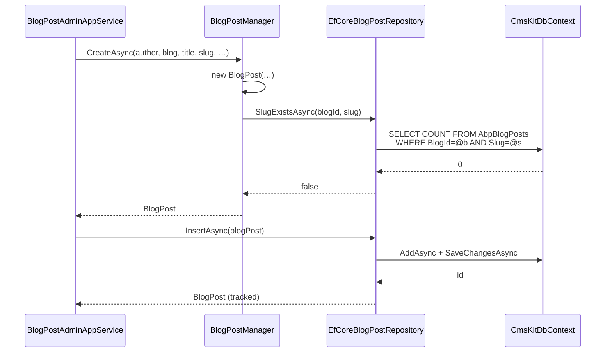

The EF Core layer translates the [Domain](/modules/cms-kit/domain) entities into tables and the repository contracts into `EfCoreRepository<TContext, TEntity, TKey>` implementations. The novelty here is that the model builder *checks every `GlobalFeature`* before mapping its entities — disabling `BlogsFeature` means there are no `AbpBlogs` / `AbpBlogPosts` / `AbpBlogFeatures` tables at all.

## File inventory

```
Volo.CmsKit.EntityFrameworkCore/Volo/CmsKit/
├── EntityFrameworkCore/
│   ├── CmsKitDbContext.cs
│   ├── CmsKitDbContextModelCreatingExtensions.cs
│   ├── CmsKitEntityFrameworkCoreModule.cs
│   └── ICmsKitDbContext.cs
├── Blogs/EfCoreBlogRepository.cs / EfCoreBlogPostRepository.cs / EfCoreBlogFeatureRepository.cs
├── Comments/EfCoreCommentRepository.cs
├── GlobalResources/EfCoreGlobalResourceRepository.cs
├── MediaDescriptors/EfCoreMediaDescriptorRepository.cs
├── Menus/EfCoreMenuItemRepository.cs
├── Pages/EfCorePageRepository.cs
├── Ratings/EfCoreRatingRepository.cs
├── Reactions/EfCoreUserReactionRepository.cs
├── Tags/EfCoreTagRepository.cs / EfCoreEntityTagRepository.cs
└── Users/EfCoreCmsUserRepository.cs
```

## DbContext

```csharp
[ConnectionStringName(AbpCmsKitDbProperties.ConnectionStringName)]
public class CmsKitDbContext : AbpDbContext<CmsKitDbContext>, ICmsKitDbContext
{
    public DbSet<Comment>            Comments         { get; set; }
    public DbSet<CmsUser>            User             { get; set; }
    public DbSet<UserReaction>       Reactions        { get; set; }
    public DbSet<Rating>             Ratings          { get; set; }
    public DbSet<Tag>                Tags             { get; set; }
    public DbSet<EntityTag>          EntityTags       { get; set; }
    public DbSet<Page>               Pages            { get; set; }
    public DbSet<Blog>               Blogs            { get; set; }
    public DbSet<BlogPost>           BlogPosts        { get; set; }
    public DbSet<BlogFeature>        BlogFeatures     { get; set; }
    public DbSet<MediaDescriptor>    MediaDescriptors { get; set; }
    public DbSet<MenuItem>           MenuItems        { get; set; }
    public DbSet<GlobalResource>     GlobalResources  { get; set; }

    protected override void OnModelCreating(ModelBuilder builder)
    {
        base.OnModelCreating(builder);
        builder.ConfigureCmsKit();
    }
}
```

The `[ConnectionStringName("CmsKit")]` attribute lets you point CMS Kit at a dedicated database via `ConnectionStrings:CmsKit`. Like the [Identity module](/modules/identity/efcore), a real ABP application normally implements `ICmsKitDbContext` on its `AppDbContext`:

```csharp
context.Services.AddAbpDbContext<AppDbContext>(options =>
{
    options.ReplaceDbContext<ICmsKitDbContext>();
});
```

That way one EF Core migration project owns the full schema.

## `ConfigureCmsKit()` — feature-gated model builder

Every entity block is wrapped in a `GlobalFeatureManager.Instance.IsEnabled<…>()` check. The pattern repeats for every feature:

```csharp
if (GlobalFeatureManager.Instance.IsEnabled<CommentsFeature>())
{
    builder.Entity<Comment>(b =>
    {
        b.ToTable(AbpCmsKitDbProperties.DbTablePrefix + "Comments",
                  AbpCmsKitDbProperties.DbSchema);
        b.ConfigureByConvention();
        b.Property(x => x.EntityType).IsRequired().HasMaxLength(CommentConsts.MaxEntityTypeLength);
        b.Property(x => x.EntityId).IsRequired().HasMaxLength(CommentConsts.MaxEntityIdLength);
        b.Property(x => x.Text).IsRequired().HasMaxLength(CommentConsts.MaxTextLength);
        b.Property(x => x.RepliedCommentId);
        b.Property(x => x.Url).HasMaxLength(CommentConsts.MaxUrlLength);

        b.HasIndex(x => new { x.TenantId, x.EntityType, x.EntityId });
        b.HasIndex(x => new { x.TenantId, x.RepliedCommentId });

        b.ApplyObjectExtensionMappings();
    });
}
else
{
    builder.Ignore<Comment>();
}
```

`builder.Ignore<TEntity>()` keeps EF Core from creating either a table or a query type for the entity, so disabled features don't appear in migrations at all.

### Resulting table layout (defaults)

| Feature toggle | Table | Key columns / indexes |
| --- | --- | --- |
| `CmsUserFeature` | `AbpUsers` | PK `Id`. Indexes `(TenantId, UserName)`, `(TenantId, Email)`. `ConfigureAbpUser()` adds the `IUser` columns. |
| `ReactionsFeature` | `AbpUserReactions` | PK `Id`. Indexes `(TenantId, EntityType, EntityId, ReactionName)`, `(TenantId, CreatorId, EntityType, EntityId, ReactionName)`. |
| `CommentsFeature` | `AbpComments` | PK `Id`. Indexes `(TenantId, EntityType, EntityId)`, `(TenantId, RepliedCommentId)`. |
| `RatingsFeature` | `AbpRatings` | PK `Id`. Index `(TenantId, EntityType, EntityId, CreatorId)`. |
| `TagsFeature` | `AbpTags`, `AbpEntityTags` | `AbpEntityTags` has composite PK `(EntityId, TagId)`. |
| `PagesFeature` | `AbpPages` | Index `(TenantId, Slug)` (named `Url`). |
| `BlogsFeature` | `AbpBlogs`, `AbpBlogPosts`, `AbpBlogFeatures` | `AbpBlogPosts` has index `(Slug, BlogId)`. |
| `MediaFeature` | `AbpMediaDescriptors` | Just the standard FullAudit/Multi-tenant columns. |
| `MenuFeature` | `AbpMenuItems` | Standard audit columns only. |
| `GlobalResourcesFeature` | `AbpGlobalResources` | Standard audit columns only. |

Every entity calls `b.ApplyObjectExtensionMappings()` so any extra property registered via `ObjectExtensionManager.Instance.AddOrUpdateProperty<…>` lands in the `ExtraProperties` JSON column.

### Page index oddity

```csharp
b.HasIndex(x => new { x.TenantId, Url = x.Slug });
```

The index is built over `Slug` but *aliased* to `Url` because the runtime column was renamed in a migration; EF Core uses the alias for migration metadata. If you rename `Slug` in an extension, mirror the alias.

### Tag uniqueness — by manager, not by DB

```csharp
b.HasIndex(x => new { x.TenantId, x.Name });   // NOT unique
```

The DB lets you create two `Tag`s with the same `(Name, EntityType)`. Uniqueness is enforced by `TagManager.CreateAsync` via `ITagRepository.AnyAsync(entityType, name)`. Add your own unique index if you want belt-and-braces.

## Repositories

All twelve follow the same pattern: `EfCoreRepository<ICmsKitDbContext, TEntity, TKey>` + a few entity-specific queries. Two are worth looking at in detail.

### `EfCoreBlogPostRepository`

```csharp
public class EfCoreBlogPostRepository
    : EfCoreRepository<ICmsKitDbContext, BlogPost, Guid>, IBlogPostRepository
{
    public virtual async Task<List<BlogPost>> GetListAsync(
        string filter = null, Guid? blogId = null, Guid? authorId = null,
        Guid? tagId = null, BlogPostStatus? statusFilter = null,
        int maxResultCount = int.MaxValue, int skipCount = 0,
        string sorting = null, CancellationToken cancellationToken = default)
    {
        var query = await GetQueryableAsync();

        if (tagId.HasValue)
        {
            var entityTagDbSet = (await GetDbContextAsync()).Set<EntityTag>();
            query = query.Join(entityTagDbSet, bp => bp.Id.ToString(),
                              et => et.EntityId,
                              (bp, et) => new { BlogPost = bp, EntityTag = et })
                         .Where(x => x.EntityTag.TagId == tagId.Value)
                         .Select(x => x.BlogPost);
        }

        return await query
            .WhereIf(!filter.IsNullOrEmpty(), bp =>
                bp.Title.Contains(filter) || bp.ShortDescription.Contains(filter))
            .WhereIf(blogId.HasValue,   bp => bp.BlogId == blogId.Value)
            .WhereIf(authorId.HasValue, bp => bp.AuthorId == authorId.Value)
            .WhereIf(statusFilter.HasValue, bp => bp.Status == statusFilter.Value)
            .OrderBy(sorting.IsNullOrEmpty()
                ? $"{nameof(BlogPost.CreationTime)} desc" : sorting)
            .Skip(skipCount).Take(maxResultCount)
            .ToListAsync(GetCancellationToken(cancellationToken));
    }
}
```

The `tagId` join uses `bp.Id.ToString()` because `EntityTag.EntityId` is a `string` while `BlogPost.Id` is a `Guid`. That's the only place in CMS Kit where you'll see a `ToString()` in a `Join` — see [gotcha #1](#gotchas).

### `EfCoreCommentRepository`

```csharp
public class EfCoreCommentRepository
    : EfCoreRepository<ICmsKitDbContext, Comment, Guid>, ICommentRepository
{
    public virtual async Task<CommentWithAuthorQueryResultItem> GetWithAuthorAsync(
        Guid id, CancellationToken cancellationToken = default)
    {
        var dbContext = await GetDbContextAsync();

        var query = from comment in dbContext.Set<Comment>()
                    join user in dbContext.Set<CmsUser>() on comment.CreatorId equals user.Id
                    where comment.Id == id
                    select new CommentWithAuthorQueryResultItem
                    {
                        Comment = comment,
                        Author  = user
                    };

        return await query.SingleOrDefaultAsync(GetCancellationToken(cancellationToken));
    }

    public virtual async Task DeleteWithRepliesAsync(
        Comment comment, CancellationToken cancellationToken = default)
    {
        var dbContext = await GetDbContextAsync();
        var replies = await dbContext.Set<Comment>()
            .Where(c => c.RepliedCommentId == comment.Id)
            .ToListAsync(GetCancellationToken(cancellationToken));

        dbContext.RemoveRange(replies);
        await DeleteAsync(comment, cancellationToken: GetCancellationToken(cancellationToken));
    }
}
```

`DeleteWithRepliesAsync` is *one-level*. If you wired multi-level threads (reply-to-reply) the deletes won't cascade automatically — you'd need to recurse or change the implementation to load the whole tree first.

## Module registration

```csharp
[DependsOn(
    typeof(CmsKitDomainModule),
    typeof(AbpUsersEntityFrameworkCoreModule),
    typeof(AbpEntityFrameworkCoreModule)
)]
public class CmsKitEntityFrameworkCoreModule : AbpModule
{
    public override void ConfigureServices(ServiceConfigurationContext context)
    {
        context.Services.AddAbpDbContext<CmsKitDbContext>(options =>
        {
            options.AddRepository<CmsUser,          EfCoreCmsUserRepository>();
            options.AddRepository<UserReaction,     EfCoreUserReactionRepository>();
            options.AddRepository<Comment,          EfCoreCommentRepository>();
            options.AddRepository<Rating,           EfCoreRatingRepository>();
            options.AddRepository<Tag,              EfCoreTagRepository>();
            options.AddRepository<EntityTag,        EfCoreEntityTagRepository>();
            options.AddRepository<Page,             EfCorePageRepository>();
            options.AddRepository<Blog,             EfCoreBlogRepository>();
            options.AddRepository<BlogPost,         EfCoreBlogPostRepository>();
            options.AddRepository<BlogFeature,      EfCoreBlogFeatureRepository>();
            options.AddRepository<MediaDescriptor,  EfCoreMediaDescriptorRepository>();
            options.AddRepository<GlobalResource,   EfCoreGlobalResourceRepository>();
        });
    }
}
```

Note `MenuItem` is *not* registered here — it's registered in `Volo.CmsKit.MongoDB` but on the EF Core side it relies on the convention-based registration from `AddDefaultRepositories(includeAllEntities: true)`. In practice the framework's `AbpDbContext` auto-registers a basic repository for every `DbSet`, and the `EfCoreMenuItemRepository` is then resolved by interface mapping. If you want the explicit registration, add it yourself.

## Sequence: BlogPost create



## Multi-tenancy & data filters

`ConfigureByConvention()` honours `IMultiTenant` on every aggregate. The `TenantId` query filter is added implicitly; calling `CurrentTenant.Change(tenantId)` switches the active scope. Tags and reactions are also tenant-scoped — host-level seed data needs an explicit `CurrentTenant.Change(null)` around it.

## Migrations

CMS Kit doesn't ship migrations. Run them from your `AppDbContext` migration project. A first migration with all features enabled produces ~13 tables.

## Gotchas

1. **`BlogPost ↔ EntityTag` join via `ToString()`.** Because `EntityTag.EntityId` is a `string` and `BlogPost.Id` is a `Guid`, the LINQ join coerces the GUID with `.ToString()`. On most providers this becomes `CAST(... AS NVARCHAR)` and **prevents the index on `EntityId` from being used**. For high-volume tag-filter pages, consider denormalising the tag list on the post.
2. **`builder.Ignore<TEntity>()` is sticky.** If you turn on `BlogsFeature` after running a migration without it, the new tables don't get created until you add a migration — toggling features requires migration discipline.
3. **`AbpMenuItems` has no index.** The Razor admin page loads the full tree (`GetListAsync`) every render. Fine for hundreds of items, problematic for thousands.
4. **`AbpEntityTags` PK is `(EntityId, TagId)`** — not `(TenantId, EntityId, TagId)`. A multi-tenant deployment must rely on the global query filter to keep tenants separate; the *primary key* is not tenant-scoped. Two tenants can't end up sharing a row because `EntityId` includes any tenant-specific prefix you supply, but the constraint is *logical*, not enforced.
5. **Tag uniqueness is logical.** No unique index on `(TenantId, EntityType, Name)`. `TagAlreadyExistException` is thrown by `TagManager`, not by SQL, so concurrent creates can both win — add your own constraint if you care.
6. **`Page.Slug` index aliased as `Url`.** A migration in CMS Kit history once renamed the column; the alias remains for compatibility.
7. **The `CmsKitFeatureDefinitionProvider` reads `GlobalFeatureManager.Instance` at startup.** Disabling a global feature after the first request leaves the EF Core mapping cached. You must restart.

## Cross-links

* [Domain](/modules/cms-kit/domain) — entities and managers behind these tables.
* [MongoDB](/modules/cms-kit/mongodb) — sibling provider.
* [Domain.Shared](/modules/cms-kit/domain-shared) — feature classes consulted by the model builder.
* [Volo.Abp.EntityFrameworkCore](/framework/data/ef-core) — `AbpDbContext`, `EfCoreRepository`, conventions.
