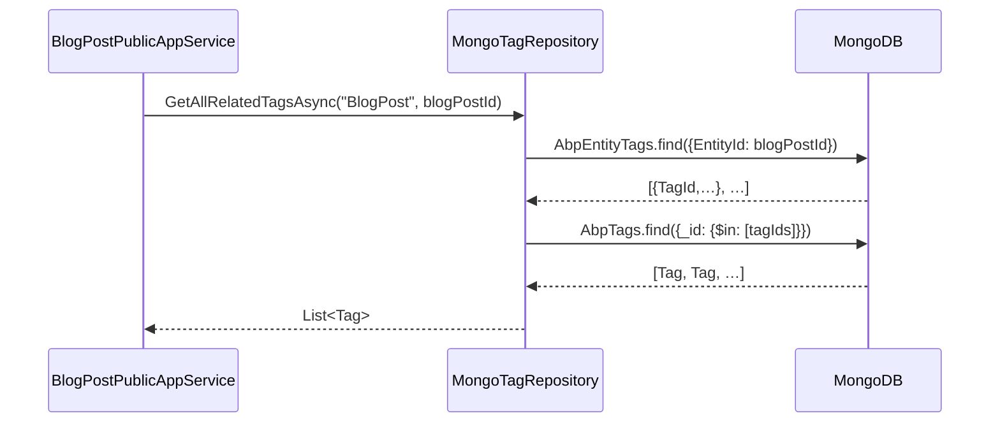

The MongoDB sibling of the [EF Core layer](/modules/cms-kit/efcore). Same `Volo.CmsKit.Domain` contracts, document-store implementations.

## File inventory

```
Volo.CmsKit.MongoDB/Volo/CmsKit/MongoDB/
├── CmsKitMongoDbContext.cs
├── CmsKitMongoDbContextExtensions.cs
├── CmsKitMongoDbModule.cs
├── ICmsKitMongoDbContext.cs
├── Blogs/MongoBlog*.cs              (Repository, BlogPost, BlogFeature)
├── Comments/MongoCommentRepository.cs
├── GlobalResources/MongoGlobalResourceRepository.cs
├── MediaDescriptors/MongoMediaDescriptorRepository.cs
├── Menus/MongoMenuItemRepository.cs
├── Pages/MongoPageRepository.cs
├── Ratings/MongoRatingRepository.cs
├── Reactions/MongoUserReactionRepository.cs
├── Tags/MongoTagRepository.cs / MongoEntityTagRepository.cs
└── Users/MongoCmsUserRepository.cs
```

## DbContext

```csharp
[ConnectionStringName(AbpCmsKitDbProperties.ConnectionStringName)]
public class CmsKitMongoDbContext : AbpMongoDbContext, ICmsKitMongoDbContext
{
    public IMongoCollection<Comment>          Comments         => Collection<Comment>();
    public IMongoCollection<UserReaction>     UserReactions    => Collection<UserReaction>();
    public IMongoCollection<CmsUser>          CmsUsers         => Collection<CmsUser>();
    public IMongoCollection<Rating>           Ratings          => Collection<Rating>();
    public IMongoCollection<Tag>              Tags             => Collection<Tag>();
    public IMongoCollection<EntityTag>        EntityTags       => Collection<EntityTag>();
    public IMongoCollection<Page>             Pages            => Collection<Page>();
    public IMongoCollection<Blog>             Blogs            => Collection<Blog>();
    public IMongoCollection<BlogPost>         BlogPosts        => Collection<BlogPost>();
    public IMongoCollection<BlogFeature>      BlogFeatures     => Collection<BlogFeature>();
    public IMongoCollection<MediaDescriptor>  MediaDescriptors => Collection<MediaDescriptor>();
    public IMongoCollection<MenuItem>         MenuItems        => Collection<MenuItem>();
    public IMongoCollection<GlobalResource>   GlobalResources  => Collection<GlobalResource>();

    protected override void CreateModel(IMongoModelBuilder modelBuilder)
    {
        base.CreateModel(modelBuilder);
        modelBuilder.ConfigureCmsKit();
    }
}
```

Note `Tag = Volo.CmsKit.Tags.Tag` alias in the source — `MongoDB.Driver` has its own `Tag` symbol.

## Collection naming

`ConfigureCmsKit` is a long but uniform list:

```csharp
public static void ConfigureCmsKit(this IMongoModelBuilder builder)
{
    builder.Entity<CmsUser>(x         => x.CollectionName = AbpCmsKitDbProperties.DbTablePrefix + "Users");
    builder.Entity<UserReaction>(x    => x.CollectionName = AbpCmsKitDbProperties.DbTablePrefix + "UserReactions");
    builder.Entity<Comment>(x         => x.CollectionName = AbpCmsKitDbProperties.DbTablePrefix + "Comments");
    builder.Entity<Rating>(x          => x.CollectionName = AbpCmsKitDbProperties.DbTablePrefix + "Ratings");
    builder.Entity<Tag>(x             => x.CollectionName = AbpCmsKitDbProperties.DbTablePrefix + "Tags");
    builder.Entity<EntityTag>(x       => x.CollectionName = AbpCmsKitDbProperties.DbTablePrefix + "EntityTags");
    builder.Entity<Page>(x            => x.CollectionName = AbpCmsKitDbProperties.DbTablePrefix + "Pages");
    builder.Entity<Blog>(x            => x.CollectionName = AbpCmsKitDbProperties.DbTablePrefix + "Blogs");
    builder.Entity<BlogPost>(x        => x.CollectionName = AbpCmsKitDbProperties.DbTablePrefix + "BlogPosts");
    builder.Entity<BlogFeature>(x     => x.CollectionName = AbpCmsKitDbProperties.DbTablePrefix + "BlogFeatures");
    builder.Entity<MediaDescriptor>(x => x.CollectionName = AbpCmsKitDbProperties.DbTablePrefix + "MediaDescriptors");
    builder.Entity<MenuItem>(x        => x.CollectionName = AbpCmsKitDbProperties.DbTablePrefix + "MenuItems");
    builder.Entity<GlobalResource>(x  => x.CollectionName = AbpCmsKitDbProperties.DbTablePrefix + "GlobalResources");
}
```

Unlike the EF Core layer, **the Mongo model builder does not feature-gate**. Disabling, say, `BlogsFeature` still maps the `AbpBlogs` collection. The collection just stays empty because the AppService is guarded with `[RequiresGlobalFeature(typeof(BlogsFeature))]`. If you depend on the disabled-feature being absent from the schema, EF Core does that for you; Mongo does not.

Also note: **no indexes are declared**. You add them manually, or you'll regret it the moment your tag-filter or comment-list grows past a few thousand documents. Recommended indexes:

```javascript
db.AbpComments.createIndex({ TenantId: 1, EntityType: 1, EntityId: 1 });
db.AbpComments.createIndex({ TenantId: 1, RepliedCommentId: 1 });
db.AbpUserReactions.createIndex({ TenantId: 1, EntityType: 1, EntityId: 1, ReactionName: 1 });
db.AbpUserReactions.createIndex({ TenantId: 1, CreatorId: 1, EntityType: 1, EntityId: 1, ReactionName: 1 });
db.AbpRatings.createIndex({ TenantId: 1, EntityType: 1, EntityId: 1, CreatorId: 1 });
db.AbpTags.createIndex({ TenantId: 1, Name: 1 });
db.AbpEntityTags.createIndex({ EntityId: 1, TagId: 1 }, { unique: true });
db.AbpEntityTags.createIndex({ TenantId: 1, EntityId: 1, TagId: 1 });
db.AbpBlogPosts.createIndex({ Slug: 1, BlogId: 1 });
db.AbpPages.createIndex({ TenantId: 1, Slug: 1 });
db.AbpUsers.createIndex({ TenantId: 1, UserName: 1 });
db.AbpUsers.createIndex({ TenantId: 1, Email: 1 });
```

These mirror the indexes the EF Core mapping creates automatically.

## Module registration

```csharp
[DependsOn(
    typeof(CmsKitDomainModule),
    typeof(AbpUsersMongoDbModule),
    typeof(AbpMongoDbModule)
)]
public class CmsKitMongoDbModule : AbpModule
{
    public override void ConfigureServices(ServiceConfigurationContext context)
    {
        context.Services.AddMongoDbContext<CmsKitMongoDbContext>(options =>
        {
            options.AddRepository<CmsUser,         MongoCmsUserRepository>();
            options.AddRepository<UserReaction,    MongoUserReactionRepository>();
            options.AddRepository<Comment,         MongoCommentRepository>();
            options.AddRepository<Rating,          MongoRatingRepository>();
            options.AddRepository<Tag,             MongoTagRepository>();
            options.AddRepository<EntityTag,       MongoEntityTagRepository>();
            options.AddRepository<Page,            MongoPageRepository>();
            options.AddRepository<Blog,            MongoBlogRepository>();
            options.AddRepository<BlogPost,        MongoBlogPostRepository>();
            options.AddRepository<MediaDescriptor, MongoMediaDescriptorRepository>();
            options.AddRepository<MenuItem,        MongoMenuItemRepository>();
            options.AddRepository<GlobalResource,  MongoGlobalResourceRepository>();
        });
    }
}
```

`BlogFeatureRepository` for Mongo is `MongoBlogFeatureRepository` — note it isn't explicitly registered here; the framework's basic-repository convention picks it up.

## Sample repository

```csharp
public class MongoCommentRepository
    : MongoDbRepository<ICmsKitMongoDbContext, Comment, Guid>, ICommentRepository
{
    public virtual async Task<CommentWithAuthorQueryResultItem> GetWithAuthorAsync(
        Guid id, CancellationToken cancellationToken = default)
    {
        var token = GetCancellationToken(cancellationToken);
        var dbContext = await GetDbContextAsync(token);

        var commentQueryable = await GetMongoQueryableAsync(token);
        var userQueryable = dbContext.Collection<CmsUser>().AsQueryable();

        var query = from comment in commentQueryable
                    join user in userQueryable on comment.CreatorId equals user.Id
                    where comment.Id == id
                    select new CommentWithAuthorQueryResultItem
                    {
                        Comment = comment,
                        Author  = user
                    };

        return await query.SingleOrDefaultAsync(token);
    }
}
```

Mongo's LINQ provider runs the join in the application layer — it isn't a Mongo `$lookup` aggregation. For high-volume comment lists that's the bottleneck; consider denormalising the author info into the comment document via an embedded BSON sub-document if you need to scale.

## Sequence: tag list for a blog post



Two round-trips because the LINQ provider can't translate the cross-collection join.

## Document layout

Top-level samples (defaults):

`AbpBlogPosts` document:

```json
{
  "_id": "…uuid…",
  "BlogId": "…uuid…",
  "Title": "Hello world",
  "Slug": "hello-world",
  "ShortDescription": "…",
  "Content": "…",
  "CoverImageMediaId": null,
  "TenantId": null,
  "AuthorId": "…uuid…",
  "Status": 1,            // BlogPostStatus.Published
  "EntityVersion": 0,
  "CreationTime": "…",
  "CreatorId": "…",
  "ExtraProperties": { }
}
```

`AbpComments` document is shallow — `RepliedCommentId` is just a UUID. There's no embedded reply array.

## Choosing Mongo for CMS Kit

Mongo is a good fit when:

* You already run a Mongo cluster and don't want to introduce SQL just for the CMS.
* You favour document-shape extensions (the `ExtraProperties` becomes a real sub-document, not a JSON string).
* You handle indexing yourself.

Mongo is a poor fit when:

* You need cross-collection joins regularly (tag filter, comment-with-author). Each "join" is N+1.
* You depend on the EF Core feature-gated schema for migrations.

## Gotchas

* **No indexes shipped.** Add them. The framework's data filters do not magically apply them.
* **No feature-gating.** Disabled features still produce empty collections. Keep AppService `[RequiresGlobalFeature]` decorations as your real gate.
* **Joins run client-side.** `from a in A join b in B on …` materialises both sides; not an aggregation pipeline. For large data, write a Mongo `$lookup` aggregation by hand using `IMongoQueryable.As<BsonDocument>` or drop down to `IMongoCollection` directly.
* **`Tag` aliasing.** The DbContext source uses `using Tag = Volo.CmsKit.Tags.Tag;` to disambiguate from `MongoDB.Driver.Tag`. If you fork, keep the alias.
* **EntityVersion is not a native Mongo concurrency token.** `IHasEntityVersion` works because `MongoDbRepository` increments it manually on update — beware if you write to the collection from outside ABP.
* **Connection-string fallback.** Without `ConnectionStrings:CmsKit`, the module shares the `Default` Mongo database. Acceptable for small apps; isolate when content grows.

## Cross-links

* [Domain](/modules/cms-kit/domain) — entities and repository contracts.
* [EF Core](/modules/cms-kit/efcore) — relational sibling.
* [Volo.Abp.MongoDB](/framework/persistence/mongodb) — `AbpMongoDbContext`, `MongoDbRepository`.
* [Overview](/modules/cms-kit/overview)
