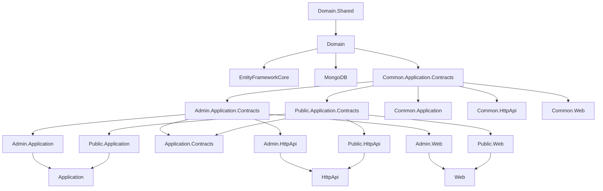

The **CMS Kit module** is ABP's lego box of content-management primitives. Rather than ship a monolithic CMS, it exposes a dozen *independently toggleable* features — Pages, Blogs, Comments, Reactions, Ratings, Tags, Menus, Media (`MediaDescriptor`), Global Resources (global JS/CSS), and a `CmsUser` projection — that you bolt onto an existing ABP app. Every feature is gated by a `GlobalFeature` so unwanted pieces are removed from the database model, the AppServices, the controllers, and the UI. Tenants can additionally toggle a feature off at runtime via the standard ABP feature-management system.

Every package described here ships under `modules/cms-kit/src/Volo.CmsKit.*` in the [abpframework/abp](https://github.com/abpframework/abp) repository.

## Package map

CMS Kit's layering is unusual: it splits Application, HttpApi, and Web into **Admin / Public / Common** trios, so an end-user-facing site can ship the read-side only without exposing management endpoints.

| Package | Role |
| --- | --- |
| `Volo.CmsKit.Domain.Shared` | Length constants, `GlobalCmsKitFeatures` + per-feature classes (`BlogsFeature`, `CommentsFeature`, …), `CmsKitFeatures`/`CmsKitFeatureDefinitionProvider`, `CmsKitResource`, `CmsKitErrorCodes`, `StandardReactions`. |
| `Volo.CmsKit.Domain` | Aggregate roots (`Blog`, `BlogPost`, `Page`, `Comment`, `Tag`, `EntityTag`, `Rating`, `UserReaction`, `MediaDescriptor`, `MenuItem`, `GlobalResource`, `CmsUser`, `BlogFeature`) + domain services (`BlogManager`, `BlogPostManager`, `PageManager`, `CommentManager`, `TagManager`, `RatingManager`, `ReactionManager`, `MediaDescriptorManager`, `MenuItemManager`, `GlobalResourceManager`). Repository interfaces and option classes (`CmsKitCommentOptions`, `CmsKitReactionOptions`, `CmsKitRatingOptions`, `CmsKitTagOptions`, `CmsKitMediaOptions`). |
| `Volo.CmsKit.EntityFrameworkCore` | `CmsKitDbContext` + `ICmsKitDbContext`, `ConfigureCmsKit()` model-builder extension, twelve `EfCore*Repository` implementations. |
| `Volo.CmsKit.MongoDB` | `CmsKitMongoDbContext` + `ICmsKitMongoDbContext`, MongoDB equivalents for all repositories. |
| `Volo.CmsKit.Common.Application.Contracts` | DTOs / interfaces shared between admin and public sides: `IBlogFeatureAppService`, `ITagAppService`, `IMediaDescriptorAppService`, `MenuItemDto`, `PopularTagDto`, `CmsUserDto`, content fragment system (`ContentFragment`, `IContent`, `BlogPostCommonDto`). `CmsKitPermissions`, `CmsKitPermissionDefinitionProvider`. |
| `Volo.CmsKit.Common.Application` | AutoMapper profile + shared services (`BlogFeatureAppService`, `TagAppService`, `MediaDescriptorAppService`). |
| `Volo.CmsKit.Admin.Application.Contracts` | Admin-only interfaces (`IBlogAdminAppService`, `IBlogPostAdminAppService`, `ICommentAdminAppService`, `IPageAdminAppService`, `IMenuItemAdminAppService`, `IGlobalResourceAdminAppService`, `IMediaDescriptorAdminAppService`, `IEntityTagAdminAppService`, `ITagAdminAppService`, `IBlogFeatureAdminAppService`) + DTOs + `CmsKitAdminPermissions`. |
| `Volo.CmsKit.Admin.Application` | `*AdminAppService` implementations + AutoMapper profile. |
| `Volo.CmsKit.Public.Application.Contracts` | Public-side interfaces (`IBlogPostPublicAppService`, `ICommentPublicAppService`, `IReactionPublicAppService`, `IRatingPublicAppService`, `IPagePublicAppService`, `IMenuItemPublicAppService`, `IGlobalResourcePublicAppService`) + DTOs + `CmsKitPublicPermissions`. |
| `Volo.CmsKit.Public.Application` | `*PublicAppService` implementations + AutoMapper profile. |
| `Volo.CmsKit.Application.Contracts` / `Volo.CmsKit.Application` | Roll-up modules that depend on **both** admin and public + common contracts/applications. |
| `Volo.CmsKit.HttpApi`, `.Admin.HttpApi`, `.Public.HttpApi`, `.Common.HttpApi` | ASP.NET Core controllers that implement the AppService interfaces. Admin lives at `api/cms-kit-admin/*`, public at `api/cms-kit-public/*`. |
| `Volo.CmsKit.HttpApi.Client`, `.Admin.HttpApi.Client`, `.Public.HttpApi.Client`, `.Common.HttpApi.Client` | Static C# dynamic-HTTP-proxy modules. |
| `Volo.CmsKit.Web`, `.Admin.Web`, `.Public.Web`, `.Common.Web` | Razor Pages admin UI, public view components / tag helpers, shared widgets, navigation contributors. |
| `Volo.CmsKit.Installer` | Empty module used by the ABP CLI `add-module Volo.CmsKit` command. |

## Feature toggles

CMS Kit features sit on **two** orthogonal axes:

1. **`GlobalFeature`** — compile-time / startup-time opt-in. Disabling a global feature removes its EF Core entity from `OnModelCreating`, removes its Mongo collection from the model builder, suppresses its AppServices via `[RequiresGlobalFeature]`, suppresses its menu items, etc. Set them in your host module's `PreConfigureServices` / `ConfigureServices` via `GlobalFeatureManager.Instance.Modules.CmsKit()`.
2. **`Feature`** — runtime tenant-level toggle. Each global feature defines a string constant in `CmsKitFeatures` (e.g. `"CmsKit.BlogEnable"`) which the `CmsKitFeatureDefinitionProvider` only contributes if its parent global feature is enabled. AppServices then carry `[RequiresFeature(CmsKitFeatures.BlogEnable)]` so a tenant can be locked out of blogs from the admin UI.

The `GlobalCmsKitFeatures` class fans these out:

```csharp
public class GlobalCmsKitFeatures : GlobalModuleFeatures
{
    public const string ModuleName = "CmsKit";

    public ReactionsFeature   Reactions       => GetFeature<ReactionsFeature>();
    public CommentsFeature    Comments        => GetFeature<CommentsFeature>();
    public MediaFeature       Media           => GetFeature<MediaFeature>();
    public RatingsFeature     Ratings         => GetFeature<RatingsFeature>();
    public TagsFeature        Tags            => GetFeature<TagsFeature>();
    public PagesFeature       Pages           => GetFeature<PagesFeature>();
    public BlogsFeature       Blogs           => GetFeature<BlogsFeature>();
    public CmsUserFeature     User            => GetFeature<CmsUserFeature>();
    public MenuFeature        Menu            => GetFeature<MenuFeature>();
    public GlobalResourcesFeature GlobalResources => GetFeature<GlobalResourcesFeature>();
    public BlogPostScrollIndexFeature BlogPostScrollIndex => GetFeature<BlogPostScrollIndexFeature>();
}
```

Enabling **CommentsFeature** auto-enables **CmsUserFeature** (you can't comment without a user projection):

```csharp
public override void Enable()
{
    var userFeature = FeatureManager.Modules.CmsKit().User;
    if (!userFeature.IsEnabled) userFeature.Enable();
    base.Enable();
}
```

The other features wire up similarly — see [domain-shared](/modules/cms-kit/domain-shared) for the full list.

## Layer cake



## Three deployment shapes

The split lets you choose:

| Shape | Reference |
| --- | --- |
| **All-in-one** — admin and public in one host. | `Volo.CmsKit.Web`, `.HttpApi`, `.Application`. |
| **Public-only site** — visitor-facing reads / writes; admin lives elsewhere. | `Volo.CmsKit.Public.Web`, `.Public.HttpApi`, `.Public.Application`. |
| **Headless API** — Razor / Blazor / Angular SPA over an API host. | `Volo.CmsKit.Admin.HttpApi` + `.Public.HttpApi` (or both) + `*.Application`. UI is whatever your front-end is. |

## Database properties

```csharp
public static class AbpCmsKitDbProperties
{
    public const  string ConnectionStringName = "CmsKit";
    public static string DbTablePrefix        = AbpCommonDbProperties.DbTablePrefix; // "Abp"
    public static string DbSchema             = AbpCommonDbProperties.DbSchema;
}
```

Default table names are therefore `AbpComments`, `AbpPages`, `AbpBlogs`, `AbpBlogPosts`, `AbpTags`, `AbpEntityTags`, `AbpUserReactions`, `AbpRatings`, `AbpMenuItems`, `AbpMediaDescriptors`, `AbpGlobalResources`, `AbpBlogFeatures`, `AbpUsers` (CMS Kit user projection). Override the prefix / schema before the module starts to relocate them.

CMS Kit also typically uses [`Volo.Abp.BlobStoring.Database`](/modules/blob-storing-database/overview) by default to store its `MediaDescriptor` payloads, so add that connection string too.

## Layer deep-dives

* [Domain.Shared](/modules/cms-kit/domain-shared) — constants, error codes, global-feature classes, `CmsKitFeatures`, `StandardReactions`, `EntityTypeDefinition`.
* [Domain](/modules/cms-kit/domain) — aggregate roots, domain services, repository contracts, option classes.
* [EF Core](/modules/cms-kit/efcore) — `CmsKitDbContext`, model-builder, twelve repositories.
* [MongoDB](/modules/cms-kit/mongodb) — `CmsKitMongoDbContext`, Mongo repositories.
* [Application](/modules/cms-kit/application) — roll-up module wiring.
* [Common.Application](/modules/cms-kit/common-application) — `BlogFeatureAppService`, `TagAppService`, `MediaDescriptorAppService`.
* [Admin.Application](/modules/cms-kit/admin-application) — twelve admin AppServices and their permissions.
* [Public.Application](/modules/cms-kit/public-application) — public-facing AppServices.
* [HttpApi](/modules/cms-kit/http-api) / [Admin.HttpApi](/modules/cms-kit/admin-http-api) / [Public.HttpApi](/modules/cms-kit/public-http-api) — controllers and routes.
* [Web](/modules/cms-kit/web) / [Admin.Web](/modules/cms-kit/admin-web) / [Public.Web](/modules/cms-kit/public-web) — Razor Pages and view components.

## Related reading

* [Volo.Abp.BlobStoring.Database](/modules/blob-storing-database/overview) — default backend for `MediaDescriptor` content.
* [Identity module](/modules/identity/overview) — primary user system that `CmsUserSynchronizer` shadow-copies into `CmsUser`.
* [Feature Management module](/modules/feature-management/overview) — runtime feature toggles per tenant.
