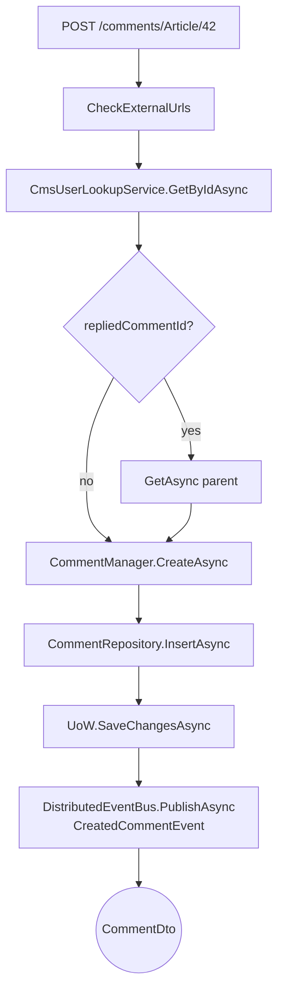
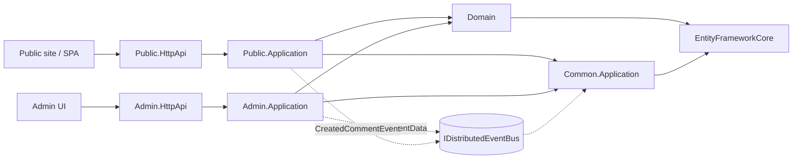

`Volo.CmsKit.Public.Application` is the AppService layer your visitors talk to. Where the [admin side](/modules/cms-kit/admin-application) is *write-heavy* and permission-fenced, the public side is *read-heavy* and either anonymous or `[Authorize]` (i.e. logged-in user — no permission needed).

## File inventory

```
Volo.CmsKit.Public.Application/Volo/CmsKit/Public/
├── CmsKitPublicAppServiceBase.cs
├── CmsKitPublicApplicationModule.cs
├── PublicApplicationAutoMapperProfile.cs
├── Blogs/BlogPostPublicAppService.cs
├── Comments/CommentPublicAppService.cs
├── GlobalResources/
│   ├── GlobalResourcePublicAppService.cs
│   └── Handlers/GlobalResourceEventHandler.cs
├── Menus/MenuItemPublicAppService.cs
├── Pages/PagePublicAppService.cs
├── Ratings/RatingPublicAppService.cs
└── Reactions/ReactionPublicAppService.cs
```

```
Volo.CmsKit.Public.Application.Contracts/Volo/CmsKit/
├── Permissions/CmsKitPublicPermissions.cs / CmsKitPublicPermissionDefinitionProvider.cs
└── Public/
    ├── CmsKitPublicApplicationContractsModule.cs
    ├── CmsKitPublicRemoteServiceConsts.cs       (RemoteServiceName, ModuleName "cmsKitPublic")
    ├── Blogs/ (BlogPostGetListInput, BlogPostFiltered…, GetBlogFeatureInput, IBlogPostPublicAppService)
    ├── Comments/ (CommentDto, CommentWithDetailsDto, CmsUserDto, CreateCommentInput, UpdateCommentInput, ICommentPublicAppService, CreatedCommentEvent)
    ├── GlobalResources/ (GlobalResourceDto, IGlobalResourcePublicAppService)
    ├── Menus/IMenuItemPublicAppService.cs
    ├── Pages/IPagePublicAppService.cs
    ├── Ratings/ (RatingDto, RatingWithStarCountDto, CreateUpdateRatingInput, IRatingPublicAppService)
    └── Reactions/ (ReactionDto, ReactionWithSelectionDto, IReactionPublicAppService)
```

## Module wiring

```csharp
[DependsOn(
    typeof(CmsKitCommonApplicationModule),
    typeof(CmsKitPublicApplicationContractsModule),
    typeof(AbpCachingModule)
)]
public class CmsKitPublicApplicationModule : AbpModule
{
    public override void ConfigureServices(ServiceConfigurationContext context)
    {
        context.Services.AddAutoMapperObjectMapper<CmsKitPublicApplicationModule>();
        Configure<AbpAutoMapperOptions>(options =>
        {
            options.AddMaps<CmsKitPublicApplicationModule>(validate: true);
        });
    }
}
```

`AbpCachingModule` shows up here because the public side caches aggressively — page reads, blog-feature lookups, etc.

## Permissions

The public side only ships **one** permission set:

```csharp
public static class CmsKitPublicPermissions
{
    public const string GroupName = "CmsKitPublic";

    public static class Comments
    {
        public const string Default   = GroupName + ".Comments";
        public const string DeleteAll = Default + ".DeleteAll";
    }
}
```

`Comments.DeleteAll` is the moderator power that lets a logged-in user delete *other people's* comments. Without it, `CommentPublicAppService.DeleteAsync(id)` only succeeds if `comment.CreatorId == CurrentUser.Id`:

```csharp
[Authorize]
public virtual async Task DeleteAsync(Guid id)
{
    var allowDelete = await AuthorizationService.IsGrantedAsync(
        CmsKitPublicPermissions.Comments.DeleteAll);

    var comment = await CommentRepository.GetAsync(id);
    if (allowDelete || comment.CreatorId == CurrentUser.Id)
    {
        await CommentRepository.DeleteWithRepliesAsync(comment);
    }
    else
    {
        throw new AbpAuthorizationException();
    }
}
```

## AppService catalogue

### `ICommentPublicAppService`

```csharp
public interface ICommentPublicAppService : IApplicationService
{
    Task<ListResultDto<CommentWithDetailsDto>> GetListAsync(string entityType, string entityId);
    Task<CommentDto> CreateAsync(string entityType, string entityId, CreateCommentInput input);
    Task<CommentDto> UpdateAsync(Guid id, UpdateCommentInput input);
    Task DeleteAsync(Guid id);
}
```

`CommentWithDetailsDto` is *nested* — `GetListAsync` returns root comments only; the replies are folded into each parent's `Replies` list by `ConvertCommentsToNestedStructure`. So one HTTP call returns the whole thread.

`CreateAsync` is `[Authorize]` (you must be logged in) and runs three checks:

1. **URL allow-list** — `CheckExternalUrls` regex-scans the text. If `CmsKitCommentOptions.AllowedExternalUrls[entityType]` exists, any URL outside the list throws.
2. **User projection lookup** — `ICmsUserLookupService.GetByIdAsync` retrieves the `CmsUser` shadow row, or auto-creates it from `IUserData`.
3. **Reply parent exists** — if `RepliedCommentId.HasValue`, `CommentRepository.GetAsync` is called to validate.



The `CreatedCommentEvent` is the only distributed event the public side raises — your moderation / notification module subscribes to it.

### `IReactionPublicAppService`

```csharp
public interface IReactionPublicAppService : IApplicationService
{
    Task<ListResultDto<ReactionWithSelectionDto>> GetForSelectionAsync(string entityType, string entityId);
    Task CreateAsync(string entityType, string entityId, string reaction);
    Task DeleteAsync(string entityType, string entityId, string reaction);
}
```

`GetForSelectionAsync` is the heart of the smiley toolbar — for a given entity it returns every defined reaction, the count per reaction, and which one the current user already picked. Anonymous users get `IsSelectedByCurrentUser = false`.

`CreateAsync` is upsert-ish: `ReactionManager.GetOrCreateAsync` returns the existing one without modification.

### `IRatingPublicAppService`

```csharp
public interface IRatingPublicAppService : IApplicationService
{
    Task<RatingDto> CreateAsync(string entityType, string entityId, CreateUpdateRatingInput input);
    Task DeleteAsync(string entityType, string entityId);
    Task<List<RatingWithStarCountDto>> GetGroupedStarCountsAsync(string entityType, string entityId);
}
```

The `CreateAsync` method is overload-of-upsert — `RatingManager.SetStarAsync` updates or inserts. The aggregate's `SetStarCount` throws `ArgumentOutOfRangeException` if not within `[1, 5]`.

### `IBlogPostPublicAppService`

```csharp
public interface IBlogPostPublicAppService : IApplicationService
{
    Task<PagedResultDto<BlogPostCommonDto>> GetListAsync(string blogSlug, BlogPostGetListInput input);
    Task<BlogPostCommonDto> GetAsync(string blogSlug, string blogPostSlug);

    Task<PagedResultDto<CmsUserDto>> GetAuthorsHasBlogPostsAsync(BlogPostFilteredPagedAndSortedResultRequestDto input);
    Task<CmsUserDto> GetAuthorHasBlogPostAsync(Guid id);
    Task DeleteAsync(Guid id);
}
```

`GetListAsync` filters by `BlogPostStatus.Published` regardless of input — drafts never escape via this side. The blog is resolved from `blogSlug` so a public URL stays human-readable.

`DeleteAsync` is `[Authorize]` — it lets an *author* delete their own blog post. A non-author who hits the endpoint gets `AbpAuthorizationException`.

### `IPagePublicAppService`

```csharp
public class PagePublicAppService : CmsKitPublicAppServiceBase, IPagePublicAppService
{
    public virtual async Task<PageDto> FindBySlugAsync(string slug)
    {
        var page = await PageRepository.FindBySlugAsync(slug);
        return page is null ? null : ObjectMapper.Map<Page, PageDto>(page);
    }

    public virtual async Task<PageDto> FindDefaultHomePageAsync()
    {
        var pageCacheItem = await PageCache.GetAsync(PageConsts.DefaultHomePageCacheKey);
        if (pageCacheItem is null)
        {
            var page = await PageManager.GetHomePageAsync();
            if (page is null) return null;

            pageCacheItem = ObjectMapper.Map<Page, PageCacheItem>(page);
            await PageCache.SetAsync(PageConsts.DefaultHomePageCacheKey, pageCacheItem,
                new DistributedCacheEntryOptions
                {
                    AbsoluteExpiration = DateTimeOffset.Now.AddHours(1)
                });
        }
        return ObjectMapper.Map<PageCacheItem, PageDto>(pageCacheItem);
    }
}
```

Home page is cached for **1 hour absolute**. The admin side invalidates the cache (`InvalidateDefaultHomePageCacheAsync`) on any home-page update so editors don't have to wait.

### `IMenuItemPublicAppService`

```csharp
public interface IMenuItemPublicAppService : IApplicationService
{
    Task<ListResultDto<MenuItemDto>> GetListAsync();
}
```

Single method, no filter. The full menu tree is returned and the *consumer* (a Razor view component) renders it. Caching is done at the view-component level; the AppService just reads.

### `IGlobalResourcePublicAppService`

```csharp
public interface IGlobalResourcePublicAppService : IApplicationService
{
    Task<GlobalResourceDto> FindGlobalStyleAsync();
    Task<GlobalResourceDto> FindGlobalScriptAsync();
}
```

Two helpers that wrap `IGlobalResourceRepository.FindByNameAsync(GlobalResourceConsts.GlobalStyleName)` / `GlobalScriptName`. Both are cached by `GlobalResourceEventHandler` — an `IDistributedEventHandler<EntityChangedEventData<GlobalResource>>` clears the cache when admin edits land.

## Cross-side data layout



Both sides hit the same database. Cache invalidation flows through the distributed event bus; no admin-to-public sync code lives in either AppService.

## AutoMapper

`PublicApplicationAutoMapperProfile` registers maps for every DTO in the public contracts package — `Comment → CommentDto`, `Comment → CommentWithDetailsDto`, `CmsUser → CmsUserDto` (public-side variant, fewer fields than the admin one), `Rating → RatingDto`, `Reaction → ReactionDto`, `BlogPost → BlogPostCommonDto`, `Page → PageDto`, `Page → PageCacheItem`, `PageCacheItem → PageDto`, `MenuItem → MenuItemDto`, `GlobalResource → GlobalResourceDto`.

`validate: true` — missing maps trip startup.

## Gotchas

* **Anonymous reads, authenticated writes.** Every `GetListAsync` is anonymous; every `CreateAsync` / `DeleteAsync` / `UpdateAsync` is `[Authorize]`. That's intentional — if you front the public API with a CDN, you can cache the read endpoints aggressively.
* **`CommentPublicAppService.UpdateAsync` only lets the original author edit.** If you need moderator-edit, add a new permission and short-circuit the `comment.CreatorId != CurrentUser.GetId()` check.
* **Reaction names are case-sensitive.** The store and the AppService pass strings around with no normalisation; `"_TU"` and `"_tu"` are different.
* **`BlogPost.Status` filter is opaque.** `IBlogPostPublicAppService.GetListAsync` always restricts to `Published`. You can't pass a `BlogPostGetListInput.StatusFilter` from outside; the field is honoured only on the admin side.
* **Home-page cache is per-tenant.** The cache key `"DefaultHomePage"` lives under each tenant — switching the current tenant returns a different entry.
* **`CreatedCommentEvent` is the only event.** Reactions, ratings, and views do **not** raise events. Add your own handlers if you need to count "likes per article" in a separate aggregate.
* **`AllowedExternalUrls` matches against a fixed regex.** It only catches `https?://…` patterns. `www.foo.com` without a scheme gets prefixed inside `CheckExternalUrls` and then matched — but `foo.com` without `www.` or scheme slips through.

## Cross-links

* [Admin.Application](/modules/cms-kit/admin-application) — write-side counterpart.
* [Common.Application](/modules/cms-kit/common-application) — shared AppServices and cache handlers.
* [Public.HttpApi](/modules/cms-kit/public-http-api) — controllers.
* [Public.Web](/modules/cms-kit/public-web) — view components calling these AppServices.
* [Domain](/modules/cms-kit/domain) — entities, managers, options.
