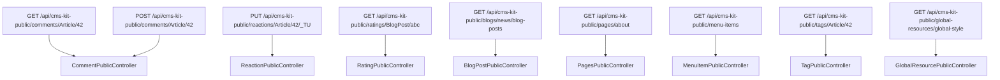
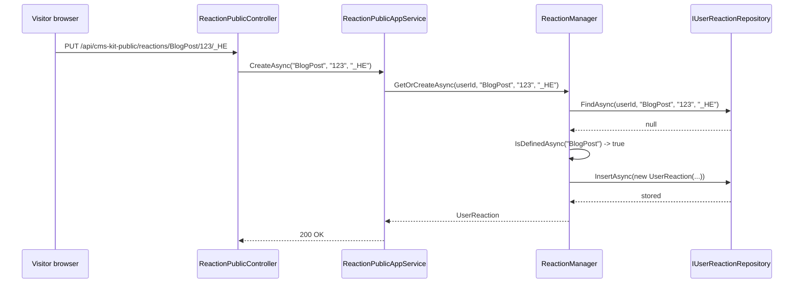

`Volo.CmsKit.Public.HttpApi` exposes the read/write surface a *visitor* needs. Where the [admin](/modules/cms-kit/admin-http-api) routes have rich permission gates, the public routes are either anonymous (reads) or simply require an authenticated user (writes).

## File inventory

```
Volo.CmsKit.Public.HttpApi/Volo/CmsKit/Public/
├── CmsKitPublicControllerBase.cs
├── CmsKitPublicHttpApiModule.cs
├── Blogs/BlogPostPublicController.cs
├── Comments/CommentPublicController.cs
├── GlobalResources/GlobalResourcePublicController.cs
├── Menus/MenuItemPublicController.cs
├── Pages/PagesPublicController.cs
├── Ratings/RatingPublicController.cs
├── Reactions/ReactionPublicController.cs
└── Tags/TagPublicController.cs
```

## Module wiring

```csharp
[DependsOn(
    typeof(CmsKitPublicApplicationContractsModule),
    typeof(CmsKitCommonHttpApiModule)
)]
public class CmsKitPublicHttpApiModule : AbpModule
{
    public override void PreConfigureServices(ServiceConfigurationContext context)
    {
        PreConfigure<IMvcBuilder>(mvcBuilder =>
        {
            mvcBuilder.AddApplicationPartIfNotExists(typeof(CmsKitPublicHttpApiModule).Assembly);
        });
    }
}
```

Only the application-part registration. No `Configure<…>` because the public side has no special model-binding requirements.

## Remote service constants

```csharp
public class CmsKitPublicRemoteServiceConsts
{
    public const string RemoteServiceName = "CmsKitPublic";
    public const string ModuleName        = "cms-kit";  // NOT "cms-kit-public"
}
```

Every controller carries `[Area("cms-kit")]`. The *route* uses the `cms-kit-public` prefix but the *area* name is `cms-kit` — this is an asymmetry inherited from earlier versions and worth remembering when you scope `DynamicJavaScriptProxyOptions.EnableModule(...)`.

## Controller catalogue

### `CommentPublicController`

```csharp
[Route("api/cms-kit-public/comments")]
public class CommentPublicController : CmsKitPublicControllerBase, ICommentPublicAppService
{
    [HttpGet]    [Route("{entityType}/{entityId}")]
        Task<ListResultDto<CommentWithDetailsDto>> GetListAsync(string entityType, string entityId);

    [HttpPost]   [Route("{entityType}/{entityId}")]
        Task<CommentDto> CreateAsync(string entityType, string entityId, CreateCommentInput input);

    [HttpPut]    [Route("{id}")]
        Task<CommentDto> UpdateAsync(Guid id, UpdateCommentInput input);

    [HttpDelete] [Route("{id}")]
        Task             DeleteAsync(Guid id);
}
```

The `(entityType, entityId)` shape is used as the *resource path*. Listing all comments for `Article#42` is `GET /api/cms-kit-public/comments/Article/42`.

### `ReactionPublicController`

```csharp
[Route("api/cms-kit-public/reactions")]
public class ReactionPublicController : CmsKitPublicControllerBase, IReactionPublicAppService
{
    [HttpGet]    [Route("{entityType}/{entityId}")]
        Task<ListResultDto<ReactionWithSelectionDto>> GetForSelectionAsync(string entityType, string entityId);

    [HttpPut]    [Route("{entityType}/{entityId}/{reaction}")]
        Task CreateAsync(string entityType, string entityId, string reaction);

    [HttpDelete] [Route("{entityType}/{entityId}/{reaction}")]
        Task DeleteAsync(string entityType, string entityId, string reaction);
}
```

`PUT` (not `POST`) for create because the operation is idempotent — toggling a reaction the user already gave is a no-op.

### `RatingPublicController`

```csharp
[Route("api/cms-kit-public/ratings")]
public class RatingPublicController : CmsKitPublicControllerBase, IRatingPublicAppService
{
    [HttpGet]    [Route("{entityType}/{entityId}")]
        Task<List<RatingWithStarCountDto>> GetGroupedStarCountsAsync(string entityType, string entityId);

    [HttpPost]   [Route("{entityType}/{entityId}")]
        Task<RatingDto> CreateAsync(string entityType, string entityId, CreateUpdateRatingInput input);

    [HttpDelete] [Route("{entityType}/{entityId}")]
        Task            DeleteAsync(string entityType, string entityId);
}
```

`CreateAsync` is also used as upsert (the AppService delegates to `RatingManager.SetStarAsync`).

### `PagesPublicController`

```csharp
[Route("api/cms-kit-public/pages")]
public class PagesPublicController : CmsKitPublicControllerBase, IPagePublicAppService
{
    [HttpGet] [Route("{slug}")] Task<PageDto> FindBySlugAsync(string slug);
    [HttpGet]                   Task<PageDto> FindDefaultHomePageAsync();
}
```

Two endpoints; the second is the cached default-home lookup, the first is slug-based and skips the cache.

### `BlogPostPublicController`

```csharp
[Route("api/cms-kit-public/blogs/{blogSlug}/blog-posts")]
public class BlogPostPublicController : CmsKitPublicControllerBase, IBlogPostPublicAppService
{
    [HttpGet]                  Task<PagedResultDto<BlogPostCommonDto>> GetListAsync(string blogSlug, BlogPostGetListInput input);
    [HttpGet] [Route("{blogPostSlug}")] Task<BlogPostCommonDto>        GetAsync(string blogSlug, string blogPostSlug);

    [HttpGet] [Route("/api/cms-kit-public/blog-post-authors")]          Task<PagedResultDto<CmsUserDto>> GetAuthorsHasBlogPostsAsync(BlogPostFilteredPagedAndSortedResultRequestDto input);
    [HttpGet] [Route("/api/cms-kit-public/blog-post-authors/{id}")]     Task<CmsUserDto>                 GetAuthorHasBlogPostAsync(Guid id);

    [HttpDelete] [Route("/api/cms-kit-public/blog-posts/{id}")]         Task DeleteAsync(Guid id);
}
```

Authors are kept on their own route (`/blog-post-authors`) because they're cross-blog. Delete is *not* `[Authorize]` at the controller level — the AppService enforces "creator only" semantics.

### `MenuItemPublicController` & `GlobalResourcePublicController`

```csharp
[Route("api/cms-kit-public/menu-items")]
public class MenuItemPublicController : CmsKitPublicControllerBase, IMenuItemPublicAppService
{
    [HttpGet] Task<ListResultDto<MenuItemDto>> GetListAsync();
}

[Route("api/cms-kit-public/global-resources")]
public class GlobalResourcePublicController : CmsKitPublicControllerBase, IGlobalResourcePublicAppService
{
    [HttpGet] [Route("global-style")]  Task<GlobalResourceDto> FindGlobalStyleAsync();
    [HttpGet] [Route("global-script")] Task<GlobalResourceDto> FindGlobalScriptAsync();
}
```

### `TagPublicController`

```csharp
[Route("api/cms-kit-public/tags")]
public class TagPublicController : CmsKitPublicControllerBase, ITagAppService
{
    [HttpGet] [Route("{entityType}/{entityId}")]
        Task<List<TagDto>> GetAllRelatedTagsAsync(string entityType, string entityId);

    [HttpGet] [Route("popular-tags/{entityType}/{maxCount}")]
        Task<List<PopularTagDto>> GetPopularTagsAsync(string entityType, int maxCount);
}
```

Implements the *common* `ITagAppService` — the same interface that `TagAppService` in `Common.Application` satisfies. Mounting it under the public area gives anonymous tag access.

## URL map summary



## Sequence: smiley reaction toggle



## Authorization layers

The public controllers don't use class-level `[Authorize]`. Instead each AppService method opts in:

```csharp
[Authorize] public virtual Task<CommentDto> CreateAsync(…)
[Authorize] public virtual Task<CommentDto> UpdateAsync(…)
[Authorize] public virtual Task           DeleteAsync(…)
// GetListAsync is anonymous.
```

`[RequiresFeature]` and `[RequiresGlobalFeature]` are at the controller class level, so the global/tenant toggles still cause an early 403/404.

## Caching the read side

Every `GET` endpoint here is safe to cache at the edge. A typical reverse-proxy setup:

```nginx
location /api/cms-kit-public/pages/        { proxy_cache cmskit; proxy_cache_valid 200 1m; }
location /api/cms-kit-public/menu-items    { proxy_cache cmskit; proxy_cache_valid 200 5m; }
location /api/cms-kit-public/global-resources/ { proxy_cache cmskit; proxy_cache_valid 200 5m; }
```

The home page already has a server-side `IDistributedCache` (1 hour) — see [Public.Application](/modules/cms-kit/public-application).

## Gotchas

* **`[Area("cms-kit")]` not `"cms-kit-public"`.** The route prefix says one thing, the area says another. Filters on area name should use the constant.
* **`PUT` for reaction create.** Idempotent on purpose; if your client sends a `POST` it'll 405.
* **DELETE writes have no `[Authorize]` at the controller level**, but the AppService throws `AbpAuthorizationException` if the caller isn't the creator and lacks `Comments.DeleteAll`. Don't be tempted to short-circuit by adding `[AllowAnonymous]`.
* **The `tagId` filter on blog posts uses `Id.ToString()` in the EF Core join** — see the [EF Core gotcha #1](/modules/cms-kit/efcore#gotchas). It works but doesn't use the index well.
* **No HEAD support.** Cache invalidation by E-Tag/If-Modified-Since isn't shipped; ABP responses don't set `ETag`. Layer a custom middleware if you need conditional GET.
* **No anti-forgery on writes.** ABP's anti-forgery is configured at the host level — the CMS Kit public controllers don't add their own `[ValidateAntiForgeryToken]`. SPA clients usually use bearer tokens, which sidesteps the issue; cookie-auth SPAs must add their own protection.
* **CORS is on the host.** Same caveat as admin.

## Cross-links

* [Public.Application](/modules/cms-kit/public-application)
* [HttpApi roll-up](/modules/cms-kit/http-api)
* [Admin.HttpApi](/modules/cms-kit/admin-http-api)
* [Public.Web](/modules/cms-kit/public-web)
