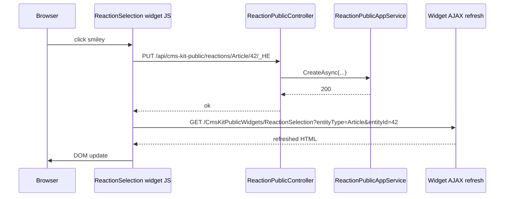

`Volo.CmsKit.Public.Web` is the part visitors actually see. It ships a handful of widget-shaped view components, three Razor pages (blog index, blog post, page-by-slug), a menu contributor that mirrors `MenuItem` aggregates into the framework navigation system, and layout hooks that inject `<script>` / `<style>` from `GlobalResource` rows.

## File inventory

```
Volo.CmsKit.Public.Web/
├── CmsKitPublicWebModule.cs
├── Controllers/
│   ├── CmsKitPublicCommentsController.cs
│   ├── CmsKitPublicGlobalResourcesController.cs
│   └── CmsKitPublicWidgetsController.cs
├── Menus/
│   ├── CmsKitPublicMenuContributor.cs
│   └── CmsKitPublicMenus.cs                (public const string Public = "CmsKit.Public";)
├── Pages/
│   ├── Public/CmsKit/
│   │   ├── Pages/Index.cshtml              (slug-driven page render)
│   │   ├── Blogs/Index.cshtml              (blog landing)
│   │   └── Blogs/BlogPost.cshtml           (post detail)
│   └── CmsKit/Shared/Components/
│       ├── Blogs/BlogPostComment/DefaultBlogPostCommentViewComponent.cs
│       ├── Commenting/CommentingViewComponent.cs
│       ├── GlobalResources/Script/GlobalScriptViewComponent.cs
│       ├── GlobalResources/Style/GlobalStyleViewComponent.cs
│       ├── PopularTags/PopularTagsViewComponent.cs
│       ├── Rating/RatingViewComponent.cs
│       ├── ReactionSelection/ReactionSelectionViewComponent.cs
│       └── Tags/TagViewComponent.cs
└── Security/Captcha/SimpleMathsCaptchaGenerator.cs
```

## Module wiring

```csharp
[DependsOn(
    typeof(CmsKitPublicApplicationContractsModule),
    typeof(CmsKitCommonWebModule)
)]
public class CmsKitPublicWebModule : AbpModule
{
    public override void ConfigureServices(ServiceConfigurationContext context)
    {
        Configure<AbpNavigationOptions>(options =>
        {
            options.MenuContributors.Add(new CmsKitPublicMenuContributor());
            options.MainMenuNames.Add(CmsKitMenus.Public);
        });

        Configure<AbpVirtualFileSystemOptions>(options =>
            options.FileSets.AddEmbedded<CmsKitPublicWebModule>("Volo.CmsKit.Public.Web"));

        context.Services.AddAutoMapperObjectMapper<CmsKitPublicWebModule>();
        Configure<AbpAutoMapperOptions>(options =>
            options.AddMaps<CmsKitPublicWebModule>(validate: true));

        Configure<DynamicJavaScriptProxyOptions>(options =>
            options.DisableModule(CmsKitPublicRemoteServiceConsts.ModuleName));

        Configure<AbpDistributedCacheOptions>(options =>
            options.KeyPrefix = "CmsKit:");
    }

    public override void PostConfigureServices(ServiceConfigurationContext context)
    {
        if (GlobalFeatureManager.Instance.IsEnabled<PagesFeature>())
        {
            Configure<RazorPagesOptions>(options =>
            {
                options.Conventions.AddPageRoute(
                    "/Public/CmsKit/Pages/Index",
                    PageConsts.UrlPrefix + "{slug:minlength(1)}");
                options.Conventions.AddPageRoute(
                    "/Public/CmsKit/Blogs/Index",
                    @"/blogs/{blogSlug:minlength(1)}");
                options.Conventions.AddPageRoute(
                    "/Public/CmsKit/Blogs/BlogPost",
                    @"/blogs/{blogSlug}/{blogPostSlug:minlength(1)}");
            });
        }

        if (GlobalFeatureManager.Instance.IsEnabled<GlobalResourcesFeature>())
        {
            Configure<AbpLayoutHookOptions>(options =>
            {
                options.Add(LayoutHooks.Head.Last, typeof(GlobalStyleViewComponent));
                options.Add(LayoutHooks.Body.Last, typeof(GlobalScriptViewComponent));
            });
        }
    }

    public override void OnApplicationInitialization(ApplicationInitializationContext context)
    {
        if (GlobalFeatureManager.Instance.IsEnabled<PagesFeature>())
            context.GetApplicationBuilder().UseHomePageDefaultMiddleware();
    }
}
```

The `UseHomePageDefaultMiddleware()` is the special sauce that maps `GET /` to the page marked `IsHomePage = true` — the home page **never has a static URL**; the request comes in at root and the middleware rewrites it to the page's slug before MVC sees it.

## Route conventions

| Razor page | Public URL |
| --- | --- |
| `/Public/CmsKit/Pages/Index` | `{PageConsts.UrlPrefix}{slug:minlength(1)}` (default `/{slug}`) |
| `/Public/CmsKit/Blogs/Index` | `/blogs/{blogSlug:minlength(1)}` |
| `/Public/CmsKit/Blogs/BlogPost` | `/blogs/{blogSlug}/{blogPostSlug:minlength(1)}` |

`PageConsts.UrlPrefix` defaults to `"/"`, so a `Page` with slug `about` is reachable at `/about`. Override the prefix to relocate the entire CMS under `/cms/`:

```csharp
PageConsts.UrlPrefix = "/cms/";   // before module configuration
```

(Set this in `PreConfigureServices` of your host module before the route registration runs.)

## Layout hooks — GlobalScript / GlobalStyle

```csharp
if (GlobalFeatureManager.Instance.IsEnabled<GlobalResourcesFeature>())
{
    Configure<AbpLayoutHookOptions>(options =>
    {
        options.Add(LayoutHooks.Head.Last, typeof(GlobalStyleViewComponent));
        options.Add(LayoutHooks.Body.Last, typeof(GlobalScriptViewComponent));
    });
}
```

`AbpLayoutHookOptions` is the standard framework mechanism to inject content into `<head>` and `<body>`. The two view components fetch `GlobalResourceConsts.GlobalStyleName` / `GlobalScriptName` via the public AppService (cached) and emit `<style>...</style>` / `<script>...</script>`.

## Menu contributor

```csharp
public class CmsKitPublicMenuContributor : IMenuContributor
{
    public async Task ConfigureMenuAsync(MenuConfigurationContext context)
    {
        if (context.Menu.Name == CmsKitMenus.Public)
            await ConfigureMainMenuAsync(context);
    }

    private async Task ConfigureMainMenuAsync(MenuConfigurationContext context)
    {
        if (GlobalFeatureManager.Instance.IsEnabled<MenuFeature>())
        {
            var menuAppService = context.ServiceProvider
                .GetRequiredService<IMenuItemPublicAppService>();

            var menuItems = await menuAppService.GetListAsync();

            foreach (var root in menuItems.Items.Where(x => x.ParentId == null && x.IsActive))
                AddChildItems(root, menuItems.Items, context.Menu);
        }
    }
}
```

The contributor only fires for the `CmsKitMenus.Public` menu name. Your layout renders that menu via `<abp-menu name="CmsKit.Public" />` and the framework calls the contributor; the contributor reads the menu tree from the AppService and translates `MenuItem` aggregates into `ApplicationMenuItem` nodes.

The recursion walks the tree depth-first; siblings are sorted by `Order`.

## Widget view components

Six widgets, all decorated with the framework's `[Widget(...)]` attribute so they auto-refresh on AJAX events and load their JS / CSS bundles.

| Component | `ViewComponent.Name` | Purpose |
| --- | --- | --- |
| `CommentingViewComponent` | `CmsCommenting` | full comment thread + composer with optional captcha |
| `ReactionSelectionViewComponent` | `CmsReactionSelection` | smiley toolbar (uses `ReactionIcons`) |
| `RatingViewComponent` | (default) | 5-star widget |
| `TagViewComponent` | (default) | shows tags for an entity |
| `PopularTagsViewComponent` | (default) | top-N tags by frequency |
| `DefaultBlogPostCommentViewComponent` | (default) | wires the comment widget specifically for `BlogPost` |
| `GlobalScriptViewComponent` / `GlobalStyleViewComponent` | (default) | layout hooks |

Embedding a comment thread on your own page:

```html
@await Component.InvokeAsync("CmsCommenting", new { entityType = "Article", entityId = "42" })
```

### `CommentingViewComponent`

```csharp
[ViewComponent(Name = "CmsCommenting")]
[Widget(
    ScriptTypes = new[] { typeof(CommentingScriptBundleContributor) },
    StyleTypes  = new[] { typeof(CommentingStyleBundleContributor) },
    RefreshUrl  = "/CmsKitPublicWidgets/Commenting",
    AutoInitialize = true)]
public class CommentingViewComponent : AbpViewComponent
{
    public ICommentPublicAppService CommentPublicAppService { get; }
    public IMarkdownToHtmlRenderer  MarkdownToHtmlRenderer  { get; }
    public CmsKitCommentOptions     CmsKitCommentOptions    { get; }
    public SimpleMathsCaptchaGenerator SimpleMathsCaptchaGenerator { get; }

    [HiddenInput, BindProperty] public string RecaptchaToken { get; set; }
    [HiddenInput, BindProperty] public Guid   CaptchaId      { get; set; }
    // …
}
```

The captcha is `SimpleMathsCaptchaGenerator` — a tiny "2 + 3 = ?"-style challenge shown to anonymous-comment posts. Enable in options:

```csharp
Configure<CmsKitCommentOptions>(options => options.IsRecaptchaEnabled = true);
```

`MarkdownToHtmlRenderer` uses the singleton Markdig pipeline from [Common.Web](/modules/cms-kit/web).

### `ReactionSelectionViewComponent`

```csharp
[ViewComponent(Name = "CmsReactionSelection")]
[Widget(RefreshUrl = "/CmsKitPublicWidgets/ReactionSelection", AutoInitialize = true)]
public class ReactionSelectionViewComponent : AbpViewComponent
{
    public virtual async Task<IViewComponentResult> InvokeAsync(string entityType, string entityId)
    {
        var summaries = await ReactionPublicAppService.GetForSelectionAsync(entityType, entityId);
        // …pass to view, which uses Options.ReactionIcons[reaction.Name].
    }
}
```

The view renders each reaction with its icon from `CmsKitUiOptions.ReactionIcons`.

## Sequence: visitor toggles a reaction



The `RefreshUrl` attribute on the widget is what powers the re-render — the framework's widget JS polls or calls that URL on action; the controller (`CmsKitPublicWidgetsController.ReactionSelection`) re-invokes the view component server-side and returns the HTML.

## Page structure

`Pages/Public/CmsKit/Pages/Index.cshtml` is shocking-simple:

```cshtml
@page "{slug?}"
@model Volo.CmsKit.Public.Web.Pages.Public.CmsKit.Pages.IndexModel

@if (Model.Page != null)
{
    <article>
        <h1>@Model.Page.Title</h1>
        @if (!string.IsNullOrWhiteSpace(Model.Page.Style))
        {
            <style>@Html.Raw(Model.Page.Style)</style>
        }
        <div>@Html.Raw(Model.Page.Content)</div>
        @if (!string.IsNullOrWhiteSpace(Model.Page.Script))
        {
            <script>@Html.Raw(Model.Page.Script)</script>
        }
    </article>
}
```

`Style` and `Script` are rendered raw — a page editor with write access can effectively inject arbitrary JS. **This is intentional** for CMS use cases but means admin permissions matter more than usual.

## Gotchas

* **Home page middleware rewrites `/`.** If your host also serves a SPA at `/`, the middleware wins. Disable by not enabling `PagesFeature`, or by reordering middleware.
* **Page route prefix is captured at startup.** Changing `PageConsts.UrlPrefix` after `PostConfigureServices` runs does nothing.
* **Captcha is *math* by default**, not Google reCAPTCHA. Customise by replacing `SimpleMathsCaptchaGenerator` with your own implementation registered as a singleton.
* **Layout hooks fire on every request.** The `GlobalStyleViewComponent` caches the resource lookup via `IGlobalResourcePublicAppService` — which caches under the hood — but the *render* still runs every request. For a high-traffic site, ensure your `IDistributedCache` is tuned.
* **`AbpDistributedCacheOptions.KeyPrefix = "CmsKit:"`** scopes the cache; shared cache instances stay clean between modules.
* **`MainMenuNames.Add(CmsKitMenus.Public)`** registers the menu in the framework's main-menu list so it's renderable by default; you still need `<abp-menu name="CmsKit.Public" />` in your layout to actually show it.
* **`Style` / `Script` are rendered raw HTML.** Don't grant `Pages.Update` to untrusted users.

## Cross-links

* [Admin.Web](/modules/cms-kit/admin-web) — companion back office.
* [Common.Web](/modules/cms-kit/web) — `CmsKitUiOptions.ReactionIcons`, Markdig pipeline.
* [Public.Application](/modules/cms-kit/public-application) — AppServices behind the widgets.
* [Public.HttpApi](/modules/cms-kit/public-http-api) — the AJAX endpoints widgets call.
