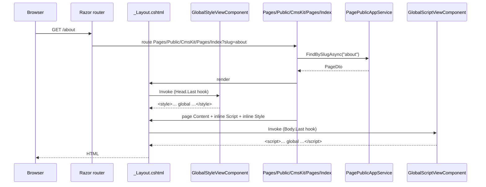

`Volo.CmsKit.Web` is the all-in-one Razor module that depends on both `Admin.Web` and `Public.Web`. The shared `Common.Web` package holds widgets and *cross-cutting UI options*: the `CmsKitUiOptions.ReactionIcons` map, the Markdig markdown pipeline, and the embedded virtual file system for content widgets.

## File inventory

```
Volo.CmsKit.Web/
└── CmsKitWebModule.cs

Volo.CmsKit.Common.Web/
├── CmsKitCommonWebModule.cs
├── CmsKitUiOptions.cs
├── Icons/LocalizableIconDictionary.cs
├── Controllers/CmsKitCommonWidgetsController.cs
└── Pages/CmsKit/Components/
    ├── ContentPreview/ContentPreviewViewComponent.cs (+ .cshtml)
    └── Contents/ContentFragmentViewComponent.cs       (+ .cshtml)
```

## `CmsKitWebModule`

```csharp
[DependsOn(
    typeof(CmsKitPublicWebModule),
    typeof(CmsKitAdminWebModule),
    typeof(CmsKitApplicationContractsModule)
)]
public class CmsKitWebModule : AbpModule { }
```

Same pattern as the [Application](/modules/cms-kit/application) and [HttpApi](/modules/cms-kit/http-api) roll-ups — single `DependsOn`, no body.

## `CmsKitCommonWebModule`

```csharp
[DependsOn(
    typeof(AbpAspNetCoreMvcUiThemeSharedModule),
    typeof(CmsKitCommonApplicationContractsModule),
    typeof(AbpAutoMapperModule)
)]
public class CmsKitCommonWebModule : AbpModule
{
    public override void ConfigureServices(ServiceConfigurationContext context)
    {
        Configure<CmsKitUiOptions>(options =>
        {
            options.ReactionIcons[StandardReactions.Smile]
                = new LocalizableIconDictionary("fas fa-smile text-warning");
            options.ReactionIcons[StandardReactions.ThumbsUp]
                = new LocalizableIconDictionary("fa fa-thumbs-up text-primary");
            options.ReactionIcons[StandardReactions.Confused]
                = new LocalizableIconDictionary("fas fa-surprise text-warning");
            options.ReactionIcons[StandardReactions.Eyes]
                = new LocalizableIconDictionary("fas fa-meh-rolling-eyes text-warning");
            options.ReactionIcons[StandardReactions.Heart]
                = new LocalizableIconDictionary("fa fa-heart text-danger");
            options.ReactionIcons[StandardReactions.HeartBroken]
                = new LocalizableIconDictionary("fas fa-heart-broken text-danger");
            options.ReactionIcons[StandardReactions.Wink]
                = new LocalizableIconDictionary("fas fa-grin-wink text-warning");
            options.ReactionIcons[StandardReactions.Pray]
                = new LocalizableIconDictionary("fas fa-praying-hands text-info");
            options.ReactionIcons[StandardReactions.Rocket]
                = new LocalizableIconDictionary("fa fa-rocket text-success");
            options.ReactionIcons[StandardReactions.ThumbsDown]
                = new LocalizableIconDictionary("fa fa-thumbs-down text-secondary");
            options.ReactionIcons[StandardReactions.Victory]
                = new LocalizableIconDictionary("fas fa-hand-peace text-warning");
            options.ReactionIcons[StandardReactions.Rock]
                = new LocalizableIconDictionary("fas fa-hand-rock text-warning");
        });

        context.Services
            .AddSingleton(_ => new MarkdownPipelineBuilder()
                .UseAutoLinks()
                .UseBootstrap()
                .UseGridTables()
                .UsePipeTables()
                .Build());

        Configure<AbpVirtualFileSystemOptions>(options =>
        {
            options.FileSets.AddEmbedded<CmsKitCommonWebModule>();
        });

        Configure<DynamicJavaScriptProxyOptions>(options =>
        {
            options.DisableModule(CmsKitCommonRemoteServiceConsts.ModuleName);
        });
    }
}
```

Three big-ticket items:

1. **`CmsKitUiOptions.ReactionIcons`** — maps each `StandardReactions._XX` code to a Font Awesome class + colour. Override these to use a different icon set (e.g. Bootstrap Icons):

   ```csharp
   Configure<CmsKitUiOptions>(options =>
   {
       options.ReactionIcons[StandardReactions.Heart]
           = new LocalizableIconDictionary("bi bi-heart-fill text-danger");
   });
   ```

   `LocalizableIconDictionary` is a `Dictionary<string, string>` keyed by culture code with a `"default"` fallback — you can have a different icon per locale.

2. **Markdig pipeline** — a singleton `MarkdownPipeline` used by the content-fragment view component. Auto-links, Bootstrap CSS-friendly tables, grid tables, pipe tables. To enable footnotes:

   ```csharp
   context.Services.RemoveAll<MarkdownPipeline>();
   context.Services.AddSingleton(_ => new MarkdownPipelineBuilder()
       .UseAutoLinks().UseBootstrap().UseGridTables().UsePipeTables()
       .UseFootnotes()      // additional Markdig extension
       .Build());
   ```

3. **Virtual file system** — embeds the shared partial views (`ContentPreview`, `ContentFragment`) so any side can render them without re-shipping assets.

## `CmsKitUiOptions` and `LocalizableIconDictionary`

```csharp
public class CmsKitUiOptions
{
    public Dictionary<string, LocalizableIconDictionary> ReactionIcons { get; set; } = new();
}

public class LocalizableIconDictionary : Dictionary<string, string>
{
    public LocalizableIconDictionary(string defaultIcon) { this["default"] = defaultIcon; }
}
```

The view components look up `ReactionIcons[reactionName]` and resolve via `CurrentCulture.Name` with `"default"` as fallback.

## Shared widgets

### `ContentFragmentViewComponent`

Renders a content fragment (markdown text → HTML via Markdig + Bootstrap):

```csharp
public class ContentFragmentViewComponent : AbpViewComponent
{
    private readonly MarkdownPipeline _pipeline;
    public ContentFragmentViewComponent(MarkdownPipeline pipeline) { _pipeline = pipeline; }

    public IViewComponentResult Invoke(string markdown)
    {
        var html = Markdig.Markdown.ToHtml(markdown ?? string.Empty, _pipeline);
        return View((object) html);
    }
}
```

Used by `BlogPost.cshtml` to render the body, and by the admin preview pane.

### `ContentPreviewViewComponent`

Like the fragment, but exposes a structured preview model (title, description, hero image URL) for use in cards and lists.

### `CmsKitCommonWidgetsController`

A `Controller` (not an MVC controller — a `Microsoft.AspNetCore.Mvc.Controller` for view rendering) that exposes the widgets via `/CmsKit/Widgets/...` AJAX endpoints. The admin and public sides both call into it.

## `DynamicJavaScriptProxyOptions.DisableModule(...)`

`Common.Web` disables the JS proxy for the *common* module because the Razor pages don't use it. Admin and Public each disable their own area too — the result is that none of CMS Kit's endpoints appear in `/abp/api-definition` unless you re-enable from the host:

```csharp
Configure<DynamicJavaScriptProxyOptions>(options =>
{
    options.EnableModule(CmsKitPublicRemoteServiceConsts.ModuleName);  // re-enable
});
```

Useful when you want a SPA to consume the public API through the auto-generated proxy.

## Roll-up sequence: serving a page



The `GlobalScriptViewComponent` / `GlobalStyleViewComponent` are registered via `AbpLayoutHookOptions.Add(LayoutHooks.Head.Last, …)` — see [Public.Web](/modules/cms-kit/public-web).

## Gotchas

* **`ReactionIcons` is *not* a `IDictionary<…, IDictionary<…>>`.** Re-assigning the outer dictionary replaces *all* icons. Always use the indexer to override a single one.
* **Markdig pipeline is a singleton.** Mutating it after registration affects every render. Always build a new one and re-register.
* **`AbpVirtualFileSystemOptions.AddEmbedded<CmsKitCommonWebModule>()` is called *without* a namespace argument** — the framework uses the assembly's default namespace. If you fork the assembly, you'll likely need to pass the namespace explicitly.
* **The Markdig pipeline does not sanitise HTML.** Trusting user-supplied markdown is risky — combine with a `HtmlSanitizer` if you accept untrusted input (the CMS Kit admin UI restricts which roles can edit content, so by default this is fine).
* **`DisableModule(...)` calls compose.** Disabling the same area twice is harmless, but *enabling* in your host wins because it runs after.
* **`CmsKitUiOptions` is registered globally, not per-tenant.** Tenant-specific icons require per-tenant override at request time.

## Cross-links

* [Admin.Web](/modules/cms-kit/admin-web) — admin Razor pages and toolbar configuration.
* [Public.Web](/modules/cms-kit/public-web) — visitor-facing view components and layout hooks.
* [HttpApi roll-up](/modules/cms-kit/http-api) — the HTTP surface served by these UIs.
