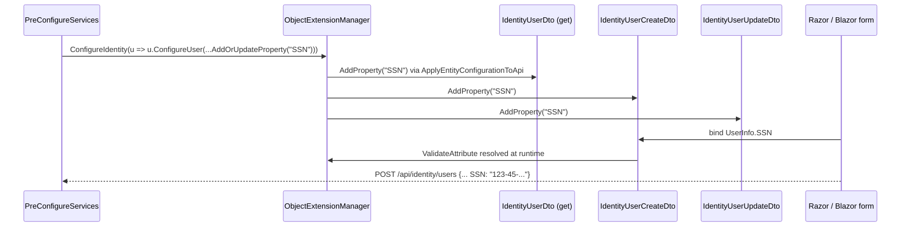

`Volo.Abp.Identity.Application.Contracts` is the *stable surface* of the Identity module. It defines the three customer-facing app-service interfaces (`IIdentityUserAppService`, `IIdentityRoleAppService`, `IIdentityUserLookupAppService`), the integration-service contract used by service-to-service calls, every DTO, the `IdentityPermissions` static class, the permission-definition provider, the remote-service constants, and the AutoAPI route prefix. Client proxies, HTTP controllers, Blazor pages and Razor Pages all reference *this* assembly — never `Volo.Abp.Identity.Application`.

Reference this package when you want to call the Identity HTTP API from another service (`IIdentityUserAppService` resolves to either a real implementation or a client proxy depending on the host), to add a custom permission gate, or to add an extra DTO property through the object-extension system.

## File inventory

| File | Role |
| --- | --- |
| `AbpIdentityApplicationContractsModule.cs` | Registers the permission definition provider and applies object-extension configuration to the create/update DTOs. |
| `IIdentityUserAppService.cs` | CRUD + role assignment + lookup by username/email. |
| `IIdentityRoleAppService.cs` | CRUD + `GetAllListAsync`. |
| `IIdentityUserLookupAppService.cs` | Cross-service lookup (`UserData`, paginated search, count). |
| `Integration/IIdentityUserIntegrationService.cs` | `[IntegrationService]` `GetRoleNamesAsync(Guid id)`. |
| `IdentityUserDto.cs`, `IdentityUserCreateDto.cs`, `IdentityUserUpdateDto.cs`, `IdentityUserCreateOrUpdateDtoBase.cs`, `IdentityUserUpdateRolesDto.cs` | User DTO family. |
| `IdentityRoleDto.cs`, `IdentityRoleCreateDto.cs`, `IdentityRoleUpdateDto.cs`, `IdentityRoleCreateOrUpdateDtoBase.cs` | Role DTO family. |
| `GetIdentityUsersInput.cs`, `GetIdentityRolesInput.cs` | Paged-and-sorted query inputs. |
| `UserLookupSearchInputDto.cs`, `UserLookupCountInputDto.cs` | Lookup query inputs. |
| `IdentityPermissions.cs` | The 11 permission name constants. |
| `IdentityPermissionDefinitionProvider.cs` | Registers them with the Permission Management module. |
| `IdentityRemoteServiceConsts.cs` | `RemoteServiceName = "AbpIdentity"`, `ModuleName = "identity"`. |

## App-service interfaces

### `IIdentityUserAppService`

```csharp
public interface IIdentityUserAppService
    : ICrudAppService<
        IdentityUserDto,
        Guid,
        GetIdentityUsersInput,
        IdentityUserCreateDto,
        IdentityUserUpdateDto>
{
    Task<ListResultDto<IdentityRoleDto>> GetRolesAsync(Guid id);
    Task<ListResultDto<IdentityRoleDto>> GetAssignableRolesAsync();
    Task                                 UpdateRolesAsync(Guid id, IdentityUserUpdateRolesDto input);
    Task<IdentityUserDto>                FindByUsernameAsync(string userName);
    Task<IdentityUserDto>                FindByEmailAsync(string email);
}
```

`ICrudAppService<…>` brings `GetAsync(Guid)`, `GetListAsync(GetIdentityUsersInput)`, `CreateAsync(IdentityUserCreateDto)`, `UpdateAsync(Guid, IdentityUserUpdateDto)` and `DeleteAsync(Guid)` for free, with full client-proxy support. The five custom methods cover the things ABP's `CrudAppService` shorthand cannot express.

### `IIdentityRoleAppService`

```csharp
public interface IIdentityRoleAppService
    : ICrudAppService<
        IdentityRoleDto,
        Guid,
        GetIdentityRolesInput,
        IdentityRoleCreateDto,
        IdentityRoleUpdateDto>
{
    Task<ListResultDto<IdentityRoleDto>> GetAllListAsync();
}
```

`GetAllListAsync` is paged-result-free — it is used by the role picker dropdowns where 256 roles fit on one screen.

### `IIdentityUserLookupAppService`

This is the *cross-service* lookup contract. Other ABP modules (Audit Logging, BLOB Storing, CMS Kit, Tenant Management) call it through `IExternalUserLookupServiceProvider` rather than `IIdentityUserAppService` because it returns `UserData` (a tier-shared DTO) rather than `IdentityUserDto`.

```csharp
public interface IIdentityUserLookupAppService : IApplicationService
{
    Task<UserData>               FindByIdAsync(Guid id);
    Task<UserData>               FindByUserNameAsync(string userName);
    Task<ListResultDto<UserData>>SearchAsync(UserLookupSearchInputDto input);
    Task<long>                   GetCountAsync(UserLookupCountInputDto input);
}
```

The matching HTTP endpoint is *not* protected by `AbpIdentity.UserLookup.Default` — instead, the permission is registered with `ClientPermissionValueProvider.ProviderName` only, so an *application* (M2M client) can call it while end users cannot.

### `IIdentityUserIntegrationService`

```csharp
[IntegrationService]
public interface IIdentityUserIntegrationService : IApplicationService
{
    Task<string[]> GetRoleNamesAsync(Guid id);
}
```

The `[IntegrationService]` attribute marks this service as *internal* — `AbpAuditingOptions`, distributed-event registration, and HTTP API exposure all branch on it. It is used by the OpenIddict / IdentityServer hosts to map an authenticated user id back to role claims at token issuance time.

## DTO family

### User DTOs

```csharp
public class IdentityUserDto
    : ExtensibleFullAuditedEntityDto<Guid>,
      IMultiTenant, IHasConcurrencyStamp, IHasEntityVersion
{
    public Guid?   TenantId { get; set; }
    public string  UserName { get; set; }
    public string  Name { get; set; }
    public string  Surname { get; set; }
    public string  Email { get; set; }
    public bool    EmailConfirmed { get; set; }
    public string  PhoneNumber { get; set; }
    public bool    PhoneNumberConfirmed { get; set; }
    public bool    IsActive { get; set; }
    public bool    LockoutEnabled { get; set; }
    public int     AccessFailedCount { get; set; }
    public DateTimeOffset? LockoutEnd { get; set; }
    public string  ConcurrencyStamp { get; set; }
    public int     EntityVersion { get; set; }
    public DateTimeOffset? LastPasswordChangeTime { get; set; }
}

public abstract class IdentityUserCreateOrUpdateDtoBase : ExtensibleObject
{
    [Required]
    [DynamicStringLength(typeof(IdentityUserConsts), nameof(IdentityUserConsts.MaxUserNameLength))]
    public string UserName { get; set; }

    [DynamicStringLength(typeof(IdentityUserConsts), nameof(IdentityUserConsts.MaxNameLength))]
    public string Name { get; set; }

    [DynamicStringLength(typeof(IdentityUserConsts), nameof(IdentityUserConsts.MaxSurnameLength))]
    public string Surname { get; set; }

    [Required, EmailAddress]
    [DynamicStringLength(typeof(IdentityUserConsts), nameof(IdentityUserConsts.MaxEmailLength))]
    public string Email { get; set; }

    [DynamicStringLength(typeof(IdentityUserConsts), nameof(IdentityUserConsts.MaxPhoneNumberLength))]
    public string PhoneNumber { get; set; }

    public bool   IsActive       { get; set; }
    public bool   LockoutEnabled { get; set; }
    [CanBeNull] public string[] RoleNames { get; set; }
}

public class IdentityUserCreateDto : IdentityUserCreateOrUpdateDtoBase
{
    [Required, DataType(DataType.Password), DisableAuditing]
    [DynamicStringLength(typeof(IdentityUserConsts), nameof(IdentityUserConsts.MaxPasswordLength))]
    public string Password { get; set; }
}

public class IdentityUserUpdateDto : IdentityUserCreateOrUpdateDtoBase, IHasConcurrencyStamp
{
    [DataType(DataType.Password), DisableAuditing]
    [DynamicStringLength(typeof(IdentityUserConsts), nameof(IdentityUserConsts.MaxPasswordLength))]
    public string Password { get; set; }            // optional — empty means "do not change"
    public string ConcurrencyStamp { get; set; }
}

public class IdentityUserUpdateRolesDto
{
    [Required] public string[] RoleNames { get; set; }
}
```

`ExtensibleFullAuditedEntityDto<Guid>` and `ExtensibleObject` are why object-extension properties (`SocialSecurityNumber`, …) flow into these DTOs automatically — the `ExtraProperties` dictionary is serialized as a flat object alongside the static properties.

### Role DTOs

```csharp
public class IdentityRoleDto : ExtensibleEntityDto<Guid>, IHasConcurrencyStamp
{
    public string Name             { get; set; }
    public bool   IsDefault        { get; set; }
    public bool   IsStatic         { get; set; }
    public bool   IsPublic         { get; set; }
    public string ConcurrencyStamp { get; set; }
}

public class IdentityRoleCreateOrUpdateDtoBase : ExtensibleObject
{
    [Required]
    [DynamicStringLength(typeof(IdentityRoleConsts), nameof(IdentityRoleConsts.MaxNameLength))]
    [Display(Name = "RoleName")]
    public string Name { get; set; }

    public bool IsDefault { get; set; }
    public bool IsPublic  { get; set; }
}
```

Note that `IsStatic` is *not* on the create/update DTO — only the data seeder is allowed to set it, because static roles cannot be deleted later.

### Inputs

```csharp
public class GetIdentityUsersInput : PagedAndSortedResultRequestDto
{
    public string Filter { get; set; }
}

public class GetIdentityRolesInput : PagedAndSortedResultRequestDto
{
    public string Filter { get; set; }
}

public class UserLookupSearchInputDto : PagedAndSortedResultRequestDto
{
    public string Filter { get; set; }
}
```

The Identity application layer's `IIdentityUserRepository.GetListAsync` accepts a wider surface (role id, OU id, lockout state, email-confirmed, creation-time range, …) — but the *DTO* deliberately exposes only `Filter`, `Sorting`, `SkipCount`, `MaxResultCount` so that the public API stays simple. Surface the extra filters in your own derived app service if you need them.

## Permissions

```csharp
public static class IdentityPermissions
{
    public const string GroupName = "AbpIdentity";

    public static class Roles
    {
        public const string Default            = GroupName + ".Roles";
        public const string Create             = Default + ".Create";
        public const string Update             = Default + ".Update";
        public const string Delete             = Default + ".Delete";
        public const string ManagePermissions  = Default + ".ManagePermissions";
    }

    public static class Users
    {
        public const string Default            = GroupName + ".Users";
        public const string Create             = Default + ".Create";
        public const string Update             = Default + ".Update";
        public const string Delete             = Default + ".Delete";
        public const string ManagePermissions  = Default + ".ManagePermissions";
    }

    public static class UserLookup
    {
        public const string Default = GroupName + ".UserLookup";
    }

    public static string[] GetAll() => ReflectionHelper.GetPublicConstantsRecursively(typeof(IdentityPermissions));
}
```

```csharp
public class IdentityPermissionDefinitionProvider : PermissionDefinitionProvider
{
    public override void Define(IPermissionDefinitionContext context)
    {
        var group = context.AddGroup(IdentityPermissions.GroupName, L("Permission:IdentityManagement"));

        var roles = group.AddPermission(IdentityPermissions.Roles.Default, L("Permission:RoleManagement"));
        roles.AddChild(IdentityPermissions.Roles.Create,            L("Permission:Create"));
        roles.AddChild(IdentityPermissions.Roles.Update,            L("Permission:Edit"));
        roles.AddChild(IdentityPermissions.Roles.Delete,            L("Permission:Delete"));
        roles.AddChild(IdentityPermissions.Roles.ManagePermissions, L("Permission:ChangePermissions"));

        var users = group.AddPermission(IdentityPermissions.Users.Default, L("Permission:UserManagement"));
        users.AddChild(IdentityPermissions.Users.Create,            L("Permission:Create"));
        users.AddChild(IdentityPermissions.Users.Update,            L("Permission:Edit"));
        users.AddChild(IdentityPermissions.Users.Delete,            L("Permission:Delete"));
        users.AddChild(IdentityPermissions.Users.ManagePermissions, L("Permission:ChangePermissions"));

        group.AddPermission(IdentityPermissions.UserLookup.Default, L("Permission:UserLookup"))
             .WithProviders(ClientPermissionValueProvider.ProviderName);
    }
}
```

| Permission | Required for |
| --- | --- |
| `AbpIdentity.Users` | `GET /api/identity/users`, `GET /api/identity/users/{id}`, `GET /api/identity/users/{id}/roles`, `GET /api/identity/users/by-username/{name}`, `GET /api/identity/users/by-email/{email}` |
| `AbpIdentity.Users.Create` | `POST /api/identity/users` |
| `AbpIdentity.Users.Update` | `PUT /api/identity/users/{id}`, `PUT /api/identity/users/{id}/roles` |
| `AbpIdentity.Users.Delete` | `DELETE /api/identity/users/{id}` |
| `AbpIdentity.Users.ManagePermissions` | Permission management modal on the Users page |
| `AbpIdentity.Roles` | `GET /api/identity/roles`, `GET /api/identity/roles/all` |
| `AbpIdentity.Roles.Create` | `POST /api/identity/roles` |
| `AbpIdentity.Roles.Update` | `PUT /api/identity/roles/{id}` |
| `AbpIdentity.Roles.Delete` | `DELETE /api/identity/roles/{id}` |
| `AbpIdentity.Roles.ManagePermissions` | Permission management modal on the Roles page |
| `AbpIdentity.UserLookup` | `GET /api/identity/user-lookup/*` (M2M clients only) |

## Remote-service constants & module wiring

```csharp
public static class IdentityRemoteServiceConsts
{
    public const string RemoteServiceName = "AbpIdentity";
    public const string ModuleName        = "identity";
}
```

`RemoteServiceName` is used by `AbpHttpClientBuilderExtensions` when generating client proxies — the consuming host configures `RemoteServices:AbpIdentity:BaseUrl`. `ModuleName` becomes the `[Area]` on every controller and is therefore the prefix of every `[Route]` (`api/identity/...`).

`AbpIdentityApplicationContractsModule.ConfigureServices` does only two things:

```csharp
public override void ConfigureServices(ServiceConfigurationContext context)
{
    ObjectExtensionManager.Instance
        .AddOrUpdate<IdentityRoleCreateDto, IdentityRoleUpdateDto>()
        .AddOrUpdate<IdentityUserCreateDto, IdentityUserUpdateDto>();

    // (PostConfigure) pushes module-extension config into the four DTOs:
    ModuleExtensionConfigurationHelper.ApplyEntityConfigurationToApi(
        IdentityModuleExtensionConsts.ModuleName,
        IdentityModuleExtensionConsts.EntityNames.Role,
        getApiTypes:    new[] { typeof(IdentityRoleDto) },
        createApiTypes: new[] { typeof(IdentityRoleCreateDto) },
        updateApiTypes: new[] { typeof(IdentityRoleUpdateDto) });
    // ... same for User ...
}
```

That is why a property added via `ObjectExtensionManager.Instance.Modules().ConfigureIdentity(...)` appears in *both* the `Get` and the `Create`/`Update` DTOs without any extra registration.

## Sequence: a typed extension property flowing through DTOs



## Gotchas

<Warning>
**`[Authorize]` lives on the *Application* layer, not here.** The interfaces in this assembly are unattributed. If you reference `IIdentityUserAppService` from a custom in-process consumer and want to bypass authorization, you can — call `AuthorizationOptions.AddPolicy` or wrap with `IAbpAuthorizationPolicyProvider`. If you do *not* want to bypass it, call through the HTTP API or keep using `IdentityUserAppService` directly (the `[Authorize]` lives on the implementation).
</Warning>

<Warning>
**`IIdentityUserLookupAppService` returns `UserData`, not `IdentityUserDto`.** Do not try to up-cast it to access `LockoutEnd`, `ConcurrencyStamp` or extra properties — those fields are intentionally absent because the lookup service is meant for *cross-service* user identification, not user management. If you need management semantics, depend on `IIdentityUserAppService` and accept the `AbpIdentity.Users` permission requirement.
</Warning>

<Warning>
**Adding a new `IdentityPermissions.Users.*` constant requires more than the constant itself.** You must (a) add the constant here, (b) register it in `IdentityPermissionDefinitionProvider`, (c) decorate the matching method in `IdentityUserAppService` with `[Authorize(...)]`, and (d) re-run the Permission Management database seeding so the admin role gets the new permission. Step (d) is the one most teams forget.
</Warning>

<Tip>
The integration service contract `IIdentityUserIntegrationService` is the *only* surface that returns role names without checking `AbpIdentity.Users`. If you have a microservice that needs role-based authorization but does not want to ship the full Identity module, depend on this single interface and the lightweight `HttpClientUserRoleFinder` from [HTTP API Client](/modules/identity/http-api-client).
</Tip>

## Cross-links

<CardGroup cols={2}>
<Card title="Application implementation" icon="gears" href="/modules/identity/application">
The `[Authorize]`-decorated implementations that fulfill these contracts.
</Card>
<Card title="HTTP API" icon="globe" href="/modules/identity/http-api">
The auto-API controllers wired to these interfaces.
</Card>
<Card title="Domain.Shared" icon="cube" href="/modules/identity/domain-shared">
`IdentityUserConsts.Max*Length` referenced by `[DynamicStringLength]`.
</Card>
<Card title="Authorization" icon="shield-halved" href="/framework/fundamentals/authorization">
How `IdentityPermissions` plugs into the framework's authorization pipeline.
</Card>
</CardGroup>
