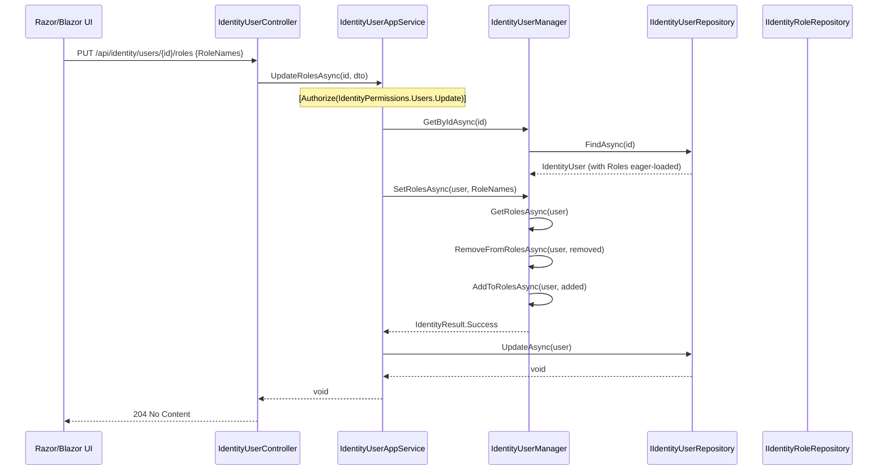

`Volo.Abp.Identity.Application` provides the *concrete* implementations of the three app-service contracts declared in [Application.Contracts](/modules/identity/application-contracts). Each implementation is a thin, `[Authorize]`-decorated coordinator that delegates to a domain-layer manager or repository, maps the result with AutoMapper, and lets ABP's per-request `IUnitOfWork` flush. There are exactly five C# files in the assembly — the application layer of ABP modules deliberately stays small.

Reference this package from a *host* (Web, API, IdentityServer, OpenIddict, BFF, Blazor Server). Library code should depend on `Application.Contracts` only.

## File inventory

| File | Role |
| --- | --- |
| `AbpIdentityApplicationModule.cs` | DependsOn(`AbpIdentityDomainModule`, `AbpIdentityApplicationContractsModule`, `AbpDddApplicationModule`, `AbpAutoMapperModule`). Registers `AbpIdentityApplicationModuleAutoMapperProfile` (validated). |
| `AbpIdentityApplicationModuleAutoMapperProfile.cs` | `IdentityUser → IdentityUserDto`, `IdentityRole → IdentityRoleDto`, both with `.MapExtraProperties()`. |
| `IdentityAppServiceBase.cs` | Shared base — sets `LocalizationResource = typeof(IdentityResource)`. |
| `IdentityUserAppService.cs` | Implements `IIdentityUserAppService`. |
| `IdentityRoleAppService.cs` | Implements `IIdentityRoleAppService`. |
| `IdentityUserLookupAppService.cs` | Implements `IIdentityUserLookupAppService`. |
| `Integration/IdentityUserIntegrationService.cs` | Implements `IIdentityUserIntegrationService`. |

## Authorize map

Every public method is gated by an `[Authorize(...)]` constant from [`IdentityPermissions`](/modules/identity/application-contracts):

| Method | Permission |
| --- | --- |
| `IdentityUserAppService.GetAsync`, `GetListAsync`, `GetRolesAsync`, `GetAssignableRolesAsync`, `FindByUsernameAsync`, `FindByEmailAsync` | `AbpIdentity.Users` |
| `IdentityUserAppService.CreateAsync` | `AbpIdentity.Users.Create` |
| `IdentityUserAppService.UpdateAsync`, `UpdateRolesAsync` | `AbpIdentity.Users.Update` |
| `IdentityUserAppService.DeleteAsync` | `AbpIdentity.Users.Delete` |
| `IdentityRoleAppService` (class-level) | `AbpIdentity.Roles` (`GetAsync`, `GetListAsync`, `GetAllListAsync`) |
| `IdentityRoleAppService.CreateAsync` | `AbpIdentity.Roles.Create` |
| `IdentityRoleAppService.UpdateAsync` | `AbpIdentity.Roles.Update` |
| `IdentityRoleAppService.DeleteAsync` | `AbpIdentity.Roles.Delete` |
| `IdentityUserLookupAppService` (class-level) | `AbpIdentity.UserLookup` (ClientPermissionValueProvider only) |
| `IdentityUserIntegrationService.GetRoleNamesAsync` | No `[Authorize]` — `[IntegrationService]` only callable on the configured integration channel. |

## `IdentityUserAppService` walkthrough

```csharp
public class IdentityUserAppService : IdentityAppServiceBase, IIdentityUserAppService
{
    protected IdentityUserManager  UserManager    { get; }
    protected IIdentityUserRepository UserRepository { get; }
    protected IIdentityRoleRepository RoleRepository { get; }
    protected IOptions<IdentityOptions> IdentityOptions { get; }

    public IdentityUserAppService(
        IdentityUserManager userManager,
        IIdentityUserRepository userRepository,
        IIdentityRoleRepository roleRepository,
        IOptions<IdentityOptions> identityOptions)
    {
        UserManager     = userManager;
        UserRepository  = userRepository;
        RoleRepository  = roleRepository;
        IdentityOptions = identityOptions;
    }

    [Authorize(IdentityPermissions.Users.Create)]
    public virtual async Task<IdentityUserDto> CreateAsync(IdentityUserCreateDto input)
    {
        await IdentityOptions.SetAsync();   // refresh from ISettingProvider

        var user = new IdentityUser(
            GuidGenerator.Create(),
            input.UserName,
            input.Email,
            CurrentTenant.Id);

        input.MapExtraPropertiesTo(user);

        (await UserManager.CreateAsync(user, input.Password)).CheckErrors();
        await UpdateUserByInput(user, input);
        (await UserManager.UpdateAsync(user)).CheckErrors();

        await CurrentUnitOfWork.SaveChangesAsync();

        return ObjectMapper.Map<IdentityUser, IdentityUserDto>(user);
    }
}
```

Four idioms repeat across every method:

1. **`await IdentityOptions.SetAsync()`** — projects the latest `Abp.Identity.*` settings into `IdentityOptions` before any validator runs (password length, lockout duration, …).
2. **`input.MapExtraPropertiesTo(target)`** — copies all object-extension properties from DTO to entity in one call.
3. **`(await UserManager.XxxAsync(...)).CheckErrors()`** — turns `IdentityResult.Failed` into an `AbpIdentityResultException` carrying localizable error codes.
4. **`await CurrentUnitOfWork.SaveChangesAsync()`** — explicit flush so the EntityVersion / ConcurrencyStamp on the returned DTO match what was persisted; otherwise the next `GetAsync` would see a stale row.

### `UpdateUserByInput` (private helper)

```csharp
protected virtual async Task UpdateUserByInput(IdentityUser user, IdentityUserCreateOrUpdateDtoBase input)
{
    if (!string.Equals(user.Email, input.Email, StringComparison.InvariantCultureIgnoreCase))
        (await UserManager.SetEmailAsync(user, input.Email)).CheckErrors();

    if (!string.Equals(user.PhoneNumber, input.PhoneNumber, StringComparison.InvariantCultureIgnoreCase))
        (await UserManager.SetPhoneNumberAsync(user, input.PhoneNumber)).CheckErrors();

    if (user.Id != CurrentUser.Id)
        (await UserManager.SetLockoutEnabledAsync(user, input.LockoutEnabled)).CheckErrors();

    user.Name    = input.Name;
    user.Surname = input.Surname;
    (await UserManager.UpdateAsync(user)).CheckErrors();
    user.SetIsActive(input.IsActive);

    if (input.RoleNames != null)
        (await UserManager.SetRolesAsync(user, input.RoleNames)).CheckErrors();
}
```

Note the `user.Id != CurrentUser.Id` guard around `SetLockoutEnabledAsync` — an admin cannot disable their own lockout because doing so would let an attacker who steals the admin cookie bypass the lockout policy permanently. The corresponding `DeleteAsync` guard:

```csharp
[Authorize(IdentityPermissions.Users.Delete)]
public virtual async Task DeleteAsync(Guid id)
{
    if (CurrentUser.Id == id)
        throw new BusinessException(code: IdentityErrorCodes.UserSelfDeletion);

    var user = await UserManager.FindByIdAsync(id.ToString());
    if (user == null) return;
    (await UserManager.DeleteAsync(user)).CheckErrors();
}
```

### `UpdateRolesAsync` is intentionally cheaper than `UpdateAsync`

```csharp
[Authorize(IdentityPermissions.Users.Update)]
public virtual async Task UpdateRolesAsync(Guid id, IdentityUserUpdateRolesDto input)
{
    var user = await UserManager.GetByIdAsync(id);
    (await UserManager.SetRolesAsync(user, input.RoleNames)).CheckErrors();
    await UserRepository.UpdateAsync(user);
}
```

Use this when an admin is reassigning roles without touching profile fields — it avoids the email/phone validators and the `IdentityOptions.SetAsync` round trip, so it scales much better for bulk role reassignment scripts.

## `IdentityRoleAppService` walkthrough

```csharp
[Authorize(IdentityPermissions.Roles.Default)]
public class IdentityRoleAppService : IdentityAppServiceBase, IIdentityRoleAppService
{
    [Authorize(IdentityPermissions.Roles.Create)]
    public virtual async Task<IdentityRoleDto> CreateAsync(IdentityRoleCreateDto input)
    {
        var role = new IdentityRole(GuidGenerator.Create(), input.Name, CurrentTenant.Id)
        {
            IsDefault = input.IsDefault,
            IsPublic  = input.IsPublic
        };

        input.MapExtraPropertiesTo(role);
        (await RoleManager.CreateAsync(role)).CheckErrors();
        await CurrentUnitOfWork.SaveChangesAsync();
        return ObjectMapper.Map<IdentityRole, IdentityRoleDto>(role);
    }

    [Authorize(IdentityPermissions.Roles.Update)]
    public virtual async Task<IdentityRoleDto> UpdateAsync(Guid id, IdentityRoleUpdateDto input)
    {
        var role = await RoleManager.GetByIdAsync(id);
        role.SetConcurrencyStampIfNotNull(input.ConcurrencyStamp);
        (await RoleManager.SetRoleNameAsync(role, input.Name)).CheckErrors();

        role.IsDefault = input.IsDefault;
        role.IsPublic  = input.IsPublic;
        input.MapExtraPropertiesTo(role);

        (await RoleManager.UpdateAsync(role)).CheckErrors();
        await CurrentUnitOfWork.SaveChangesAsync();
        return ObjectMapper.Map<IdentityRole, IdentityRoleDto>(role);
    }

    [Authorize(IdentityPermissions.Roles.Delete)]
    public virtual async Task DeleteAsync(Guid id)
    {
        var role = await RoleManager.FindByIdAsync(id.ToString());
        if (role == null) return;
        (await RoleManager.DeleteAsync(role)).CheckErrors();
    }
}
```

`IdentityRoleManager.SetRoleNameAsync` itself throws on `IsStatic == true` (`Volo.Abp.Identity:010005`) — the application service does not need to re-check.

## `IdentityUserLookupAppService` walkthrough

```csharp
[Authorize(IdentityPermissions.UserLookup.Default)]
public class IdentityUserLookupAppService : IdentityAppServiceBase, IIdentityUserLookupAppService
{
    protected IdentityUserRepositoryExternalUserLookupServiceProvider UserLookupServiceProvider { get; }

    public virtual async Task<UserData> FindByIdAsync(Guid id)
    {
        var u = await UserLookupServiceProvider.FindByIdAsync(id);
        return u == null ? null : new UserData(u);
    }

    public virtual async Task<UserData> FindByUserNameAsync(string userName)
    {
        var u = await UserLookupServiceProvider.FindByUserNameAsync(userName);
        return u == null ? null : new UserData(u);
    }

    public virtual async Task<ListResultDto<UserData>> SearchAsync(UserLookupSearchInputDto input)
    {
        var users = await UserLookupServiceProvider.SearchAsync(
            input.Sorting, input.Filter, input.MaxResultCount, input.SkipCount);
        return new ListResultDto<UserData>(users.Select(u => new UserData(u)).ToList());
    }

    public virtual async Task<long> GetCountAsync(UserLookupCountInputDto input)
        => await UserLookupServiceProvider.GetCountAsync(input.Filter);
}
```

The service is a *thin façade* over `IdentityUserRepositoryExternalUserLookupServiceProvider` (registered in the Domain layer). That class implements `IExternalUserLookupServiceProvider` against the local `IIdentityUserRepository`, so calling `IIdentityUserLookupAppService.FindByIdAsync` ends up being one SQL query in a monolith. In a microservice deployment the consuming side resolves `HttpClientExternalUserLookupServiceProvider` instead and hits the HTTP API.

## `IdentityUserIntegrationService` walkthrough

```csharp
public class IdentityUserIntegrationService : IdentityAppServiceBase, IIdentityUserIntegrationService
{
    protected IUserRoleFinder UserRoleFinder { get; }

    public virtual async Task<string[]> GetRoleNamesAsync(Guid id)
        => await UserRoleFinder.GetRoleNamesAsync(id);
}
```

No `[Authorize]` because the `[IntegrationService]` attribute (inherited from the interface) means the registered `IntegrationServicePolicy` is the only gate — the service is excluded from auto-generated REST API by default unless `AbpAspNetCoreMvcOptions.ExposeIntegrationServices` is set.

## AutoMapper profile

```csharp
public class AbpIdentityApplicationModuleAutoMapperProfile : Profile
{
    public AbpIdentityApplicationModuleAutoMapperProfile()
    {
        CreateMap<IdentityUser, IdentityUserDto>()
            .MapExtraProperties();

        CreateMap<IdentityRole, IdentityRoleDto>()
            .MapExtraProperties();
    }
}
```

That's it — no `IdentityClaimType` or `OrganizationUnit` maps because no public app service in this assembly returns them. (`IdentityServer.Pro` and `Identity.Pro` extensions add their own maps.) The `.MapExtraProperties()` extension iterates `ObjectExtensionManager.Instance.GetProperties<IdentityUser>()` and copies each into `ExtraProperties` — that's why custom object-extension properties round-trip without an explicit `.ForMember`.

## Sequence: end-to-end role assignment



## Gotchas

<Warning>
**`IOptions<IdentityOptions>.Value` is the *snapshot at module init* unless you call `SetAsync()`.** Every method in `IdentityUserAppService` that creates or updates a user starts with `await IdentityOptions.SetAsync()`. If you derive a new method that creates users without that line, password validators will use stale settings — admins who raise `Password.RequiredLength` from 6 to 12 will see new users accept 6-char passwords until the process restarts.
</Warning>

<Warning>
**`CurrentUnitOfWork.SaveChangesAsync()` is called *manually* in `CreateAsync`, `UpdateAsync` and the Role equivalents.** That is so the returned DTO has the post-insert `EntityVersion` / `ConcurrencyStamp`. If you call these app services *inside another transaction* and the outer UoW rolls back, the manual flush is harmless — it is still inside the same DB transaction. But if you call them *from* a HostedService outside of a request, you must wrap with `IUnitOfWorkManager.Begin` yourself.
</Warning>

<Warning>
**`UpdateUserByInput` writes to `Name` / `Surname` directly even though `IdentityUser` exposes them as plain public setters.** If you override `IdentityUser` and protect those setters, the assignment line in the override of `IdentityUserAppService.UpdateUserByInput` must be changed to call your `SetName`/`SetSurname` methods, *or* you must keep the public setters and protect via a custom validator.
</Warning>

<Tip>
The integration service `IdentityUserIntegrationService.GetRoleNamesAsync` returns roles *only from direct role assignments*, not from OU memberships. If your security model relies on OU-mediated roles, derive from this class and call `IIdentityUserRepository.GetRoleNamesAsync(userId)` which unions both sources (see [EF Core](/modules/identity/efcore)).
</Tip>

## Cross-links

<CardGroup cols={2}>
<Card title="Application Contracts" icon="file-contract" href="/modules/identity/application-contracts">
The interfaces and DTOs implemented here.
</Card>
<Card title="Domain" icon="diagram-project" href="/modules/identity/domain">
`IdentityUserManager`, `IdentityRoleManager`, `IUserRoleFinder`.
</Card>
<Card title="HTTP API" icon="globe" href="/modules/identity/http-api">
The controllers that forward to these app services.
</Card>
<Card title="Users.Abstractions" icon="user" href="/modules/identity/users-abstractions">
`UserData` — the return type of `IIdentityUserLookupAppService`.
</Card>
</CardGroup>
